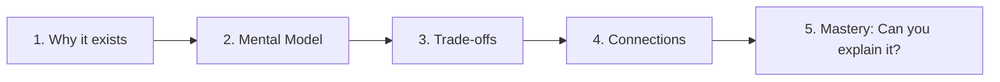

# How to Study This Vault

## The Knowledge Journey

## Recommended 22-Week Study Plan

| Week | Phase | Topic | Modules |
|------|-------|-------|---------|
| 1-2 | Foundations | Networking & DNS | M01 |
| 3-4 | Foundations | API Design & Gateway | M02 |
| 5-6 | Foundations | Storage Engines & DBs | M03, M04 |
| 7-8 | Foundations | Data Modeling & Migrations | M05 |
| 9-10 | Foundations | Caching & ID Gen | M06, M07 |
| 11-12 | Distribution | Consistency & CAP | M08 |
| 13-14 | Distribution | Consensus & Coordination | M09 |
| 15-16 | Distribution | Trans. & Replication | M10, M11 |
| 17-18 | Architecture | Patterns & Messaging | M12, M13 |
| 19-20 | Architecture | Search, Security & Rel. | M14, M15, M16 |
| 21 | Architecture | Obs., Multi-Tenancy & Cost | M17, M18 |
| 22 | Modern AI | AI Inf., RAG & Serverless | M19, M20, M21 |
| 23 | Operations | FinOps & Privacy | M22, M23 |
| 24 | Capstones | Design Drill Down | Capstones |

## Learning Heuristics

1. **Don't Memorize, Derive**: If you understand why gRPC uses Protobuf (binary serialization, HTTP/2 multiplexing), you don't need to memorize that it's faster than REST.
2. **Visualize the Data Flow**: When reading about a concept, trace a single request from the user's thumb to the database disk.
3. **Question Every 'Best Practice'**: In system design, there is no "best," only "it depends." Always ask: "Depends on what?"

## Mastery Checklist

- Describe the "First Principles" (the problem it solves) without looking at notes
- Describe the trade-offs from memory
- Identify which pattern to use in a new scenario you haven't seen before
- Explain why an alternative pattern would be worse for that specific scenario
