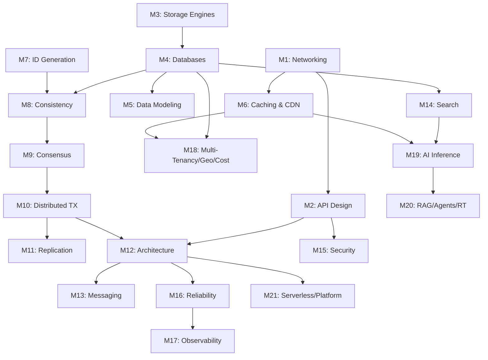

# Knowledge Graph Overview

*How everything in this vault connects. Open this in Obsidian's graph view for the full picture.*

## The Core Dependency Chain

## Cross-Cutting Themes

These concepts appear across many modules:

**Trade-offs** (the vault's beating heart): Every design decision is a trade-off. B-tree vs LSM (read vs write optimization). Consistency vs availability (CAP). Push vs pull (fan-out on write vs read). Centralized vs decentralized (coordination cost vs independence). Pre-computation vs on-demand (storage vs latency).

**The log abstraction**: Appears as WAL (M3), event log (M12), Kafka topic (M13), replication stream (M4/M11), and CRDT operation log (M11). Jay Kreps' insight — "the log" is the unifying abstraction — connects half the vault.

**Idempotency**: Appears in API design (M2), HTTP methods (M1), message consumers (M10), saga compensations (M10), database writes (M4), and cache operations (M6). The most universal reliability primitive.

**Caching**: Appears as browser cache, CDN (M6), application cache/Redis (M6), database buffer pool (M3), DNS cache (M1), connection pooling (M1), feed cache (Capstone 2), semantic cache (M19), KV cache (M19), and materialized views (M5). Every layer of every system has a cache.

## The Three Fundamental Distributed Systems Questions

Every module in Phases 2–4 answers one of these:

## Design Navigation Heuristics

- **Start with the User (M1)**: Always begin your design at the user entry point. How do they find you (DNS)? How do they talk to you (API/Paradigms)?
- **Follow the Data (M3-M5)**: Once the request hits your system, follow the data path. Where is it stored? How is it modeled? How does it scale?
- **Assume Failure (M16)**: For every link in your graph, ask: "What if this part is slow or dead?" This leads you to resilience and coordination patterns.
- **Cost is a Constraint (M18)**: A technically perfect design that costs $1M/month for a $10k/month business is a failure.

## Real-World Connection: The "Buy Now" Journey

Tracing a single action through the graph:
1. **Networking**: User hits `Anycast IP`, DNS routes to nearest PoP.
2. **Security**: `TLS 1.3` handshake establishes a secure tunnel.
3. **API Design**: `POST /orders` hit the Gateway with an `Idempotency-Key`.
4. **Resilience**: `Circuit Breaker` protects the Inventory service.
5. **Consensus**: Order ID generated via `Snowflake` or `Raft`-backed counter.
6. **Distributed TX**: A `Saga` begins: Reserve Stock -> Charge Card -> Ship.
7. **Storage**: Data hits the `WAL`, then the `B-Tree` pages in the `Buffer Pool`.
8. **Observability**: `SLI` metrics update the `Error Budget` dashboard.