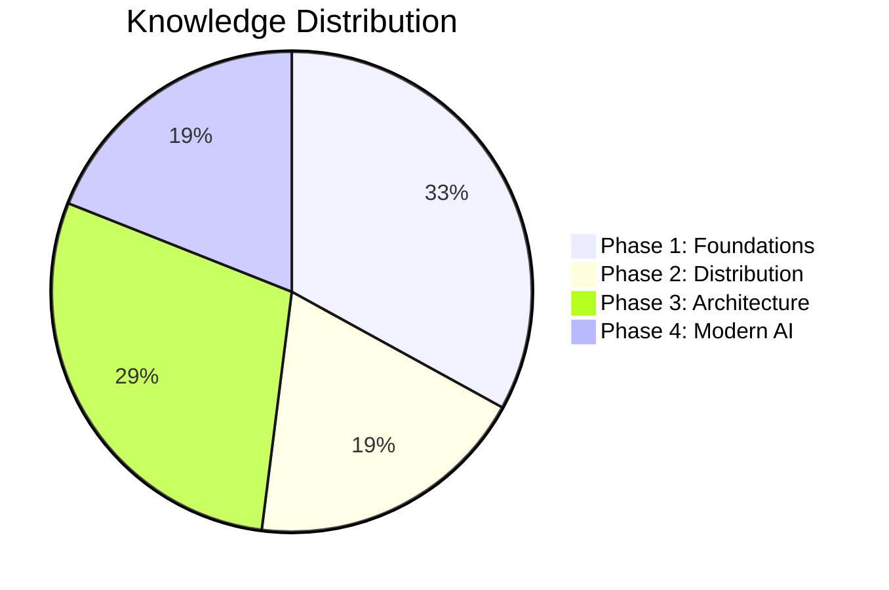

# Mastery Checklist

Check off each module when you can explain its core concepts, trade-offs, and connections from memory.

## The "Mastery" Bar (Heuristics)

You have mastered a topic when you can:
1. **Explain it to a Junior**: Define the concept without using jargon.
2. **The "Trade-off" Test**: Name at least two pros and two cons of the approach.
3. **The "At Scale" Test**: Explain exactly how the approach breaks when traffic increases by 100x.
4. **The "Alternative" Test**: Name the primary alternative and when you would choose it instead.

## Progress Overview

## Phase 1: Foundations
- [ ] M1: Networking — DNS chain, TCP congestion control, HTTP/2 vs HTTP/3, L4 vs L7 LB, gRPC vs REST vs GraphQL, **gRPC streaming patterns & deadline propagation**
- [ ] M2: API Design — REST principles, versioning strategies, rate limiting algorithms, idempotency keys, gateway patterns
- [ ] M3: Storage Engines — B-tree vs LSM trade-offs, WAL mechanics, MVCC implementations, buffer pool sizing
- [ ] M4: Databases — SQL vs NoSQL framework, index types, replication topologies, sharding strategies, NewSQL, **query optimizer mechanics, EXPLAIN analysis, anti-patterns (N+1, implicit type cast)**
- [ ] M5: Data Modeling — Normalization vs denormalization, schema evolution (Protobuf/Avro), zero-downtime migrations
- [ ] M6: Caching & CDN — Four cache patterns, invalidation strategies, stampede prevention, CDN architecture
- [ ] M7: ID Generation — UUID v7 vs Snowflake, Lamport timestamps vs vector clocks vs HLCs

## Phase 2: Distribution & Coordination
- [ ] M8: Consistency — Linearizability → eventual spectrum, CAP vs PACELC, session guarantees
- [ ] M9: Consensus — Raft mechanics (election, replication, safety), ZooKeeper/etcd/Consul, fencing tokens, FLP
- [ ] M10: Distributed TX — 2PC blocking problem, saga choreography vs orchestration, outbox + CDC, idempotent consumers
- [ ] M11: Replication — Failover/split-brain, multi-leader conflicts, quorums, CRDTs (G-Counter, OR-Set)

## Phase 3: Architecture & Operations
- [ ] M12: Architecture — Monolith-first, bounded contexts, event sourcing/CQRS, cell architecture, strangler fig
- [ ] M13: Messaging — Queues vs streams, EDA patterns, windowing/watermarks, Lambda vs Kappa, data contracts
- [ ] M14: Search — Inverted indexes, BM25, HNSW, hybrid search, RRF, re-ranking
- [ ] M15: Security — TLS 1.3, mTLS/SPIFFE, OAuth2/OIDC, RBAC/ABAC/ReBAC, SLSA/Sigstore, STRIDE, **zero-trust (BeyondCorp, SPIRE SVIDs, OPA policy engine, micro-segmentation)**
- [ ] M16: Reliability — SLOs/error budgets, circuit breakers/bulkheads, chaos engineering, blameless postmortems, **RTO/RPO tiers, backup strategies (3-2-1 rule), DR drill design**
- [ ] M17: Observability — Three pillars, burn-rate alerts, OpenTelemetry, eBPF, canary/feature flags, GitOps, **distributed tracing deep dive (tail-based sampling, span propagation, trace storage), feature flags (kill switch vs experiment vs permission)**
- [ ] M18: Multi-Tenancy — Isolation spectrum, geo-routing, data sovereignty, FinOps, TCO

## Phase 4: Modern Infrastructure & AI
- [ ] M19: AI Inference — Continuous batching, quantization, KV cache/PagedAttention, AI gateway, **semantic caching (vector similarity threshold, provider-side prompt caching, cache invalidation)**
- [ ] M20: RAG/Agents — RAG pipeline (chunk → embed → retrieve → rerank → generate), agent patterns, MCP/A2A, **agent resilience (idempotent tool calls, retry/backoff, graceful degradation)**
- [ ] M21: Serverless/Platform — Cold starts, edge compute, **WASM/WASI 0.2 (component model, startup latency, isolation density, use cases)**, K8s architecture, platform engineering/IDPs

## Capstones
- [ ] URL Shortener — Estimation, short code generation, 301 vs 302, analytics pipeline separation
- [ ] News Feed — Hybrid fan-out (push for regular users, pull for celebrities), feed cache design
- [ ] Payments — Saga orchestration, idempotency on payment calls, double-entry accounting, inventory reservation
- [ ] Collaborative Editor — CRDT vs OT decision, WebSocket scaling, presence, cell-based document isolation
- [ ] AI Search Platform — Hybrid retrieval, re-ranking, semantic caching, multi-provider LLM routing, cost breakdown
- [ ] Multi-Region E-Commerce — Data classification by consistency/sovereignty/latency, per-type strategy
- [ ] Feature Flag Platform — Flag evaluation pipeline (< 1ms p99, in-memory cache), SDK push vs pull, A/B experiment analytics (Welch's t-test, MDE calculation), stale flag cleanup

---
*Last content update: March 2026. Vault covers developments through early 2026 including Kafka 4.0/KRaft, reasoning models, EAGLE-3 speculative decoding, GraphRAG, ColBERT late interaction, MCP/A2A protocols, passkeys/FIDO2, post-quantum cryptography standards, WASI 0.2 Component Model, zero-trust architecture (SPIFFE/SPIRE, OPA), eBPF kernel observability, and agent reliability patterns.*
