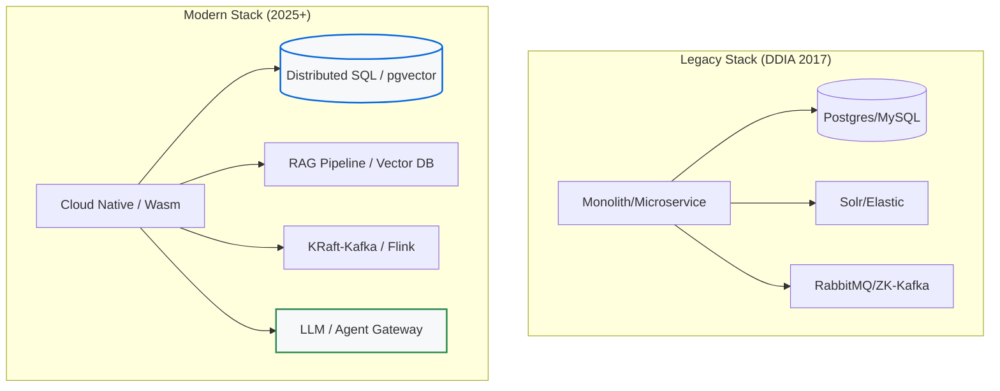

# What Changed Since DDIA

*Designing Data-Intensive Applications* was published in 2017. This living note tracks major shifts since then that update, extend, or sometimes contradict DDIA's coverage.

## Consensus & Coordination

**DDIA coverage**: ZooKeeper as the primary coordination service. Raft described but etcd not prominent.

**What changed**: etcd became the dominant coordination service (Kubernetes made it ubiquitous). Kafka removed its ZooKeeper dependency (KRaft mode, production-ready since Kafka 3.3 in late 2022). [[02-Phase-2-Distribution__Module-09-Consensus__Consensus_and_Raft|Raft]] is now the default consensus algorithm for new systems; Paxos is legacy. CockroachDB and TiDB brought Multi-Raft to production scale. See [[02-Phase-2-Distribution__Module-09-Consensus__Coordination_Services|Coordination Services]] for the ZooKeeper → etcd/KRaft shift.

## Distributed Databases

**DDIA coverage**: Spanner was new and Google-only. CockroachDB and TiDB were early.

**What changed**: CockroachDB is production-mature (used by DoorDash, Netflix). TiDB is widely adopted (ByteDance, PingCAP customers). Managed distributed SQL (CockroachDB Cloud, Spanner as a GCP service) is mainstream. The "NewSQL" category is no longer novel — it's a standard option. PlanetScale (Vitess-based) brought managed MySQL sharding to the mainstream. This expands the design space covered in [[01-Phase-1-Foundations__Module-04-Databases__NewSQL_and_Globally_Distributed_Databases|NewSQL and Globally Distributed Databases]].

## Stream Processing

**DDIA coverage**: Kafka Streams, Flink, and Spark Structured Streaming were all emerging.

**What changed**: Flink became the de facto standard for stateful stream processing. Kafka Streams gained traction for simpler use cases (embedded in applications). The Lambda architecture largely gave way to the Kappa architecture or unified batch+stream frameworks (Flink handles both). Apache Iceberg, Delta Lake, and Hudi created the "lakehouse" category — bridging data lakes and warehouses with ACID on object storage. See [[03-Phase-3-Architecture-Operations__Module-13-Messaging-Pipelines__Stream_Processing|Stream Processing]] and [[03-Phase-3-Architecture-Operations__Module-13-Messaging-Pipelines__Batch_Processing_and_Data_Pipelines|Batch Processing and Data Pipelines]].

## Consistency

**DDIA coverage**: Excellent treatment of consistency models, CAP critique.

**What changed**: S3 became strongly consistent (December 2020) — a major shift from DDIA's description of eventual consistency for overwrites. This eliminated an entire class of S3-related bugs. MongoDB added causal consistency sessions (v3.6+). DynamoDB added transactions (2018). The industry trend is toward stronger consistency defaults, not weaker. Revisit [[02-Phase-2-Distribution__Module-08-Consistency-Models__Consistency_Spectrum|Consistency Spectrum]] and [[02-Phase-2-Distribution__Module-08-Consistency-Models__Session_Guarantees|Session Guarantees]] with this stronger-default trend in mind.

## AI/ML Infrastructure (Entirely New)

**DDIA coverage**: Not covered — predates the LLM era.

**What changed**: [[04-Phase-4-Modern-AI__Module-19-AI-Inference-LLMOps__Inference_Serving_Architecture|LLM inference serving]] became a first-class distributed systems problem. PagedAttention/vLLM (2023) revolutionized GPU memory management. [[04-Phase-4-Modern-AI__Module-20-RAG-Agents-Realtime__RAG_Architecture|RAG]] became the standard pattern for grounding LLMs in domain knowledge. [[03-Phase-3-Architecture-Operations__Module-14-Search-Systems__Vector_Search_and_Hybrid_Retrieval|Vector retrieval and hybrid search]] emerged as core infrastructure. Semantic caching, model routing, and [[04-Phase-4-Modern-AI__Module-19-AI-Inference-LLMOps__AI_Gateway_and_LLM_Operations|AI gateways]] are new infrastructure patterns. Agent architectures (ReAct, MCP, A2A) are creating new distributed coordination challenges.

## Edge Computing (Mostly New)

**DDIA coverage**: CDNs covered as caching; edge compute not discussed.

**What changed**: Cloudflare Workers (V8 isolates at the edge) and similar platforms enabled computation at CDN PoPs — not just caching. [[04-Phase-4-Modern-AI__Module-21-Serverless-Edge-Platform__WebAssembly_and_WASI|WebAssembly and WASI]] matured as server-side runtime substrates. Edge-origin architecture became a standard pattern for web applications. See [[04-Phase-4-Modern-AI__Module-21-Serverless-Edge-Platform__Serverless_and_Edge_Computing|Serverless and Edge Computing]] for the placement trade-offs.

## Observability

**DDIA coverage**: Minimal.

**What changed**: OpenTelemetry became the standard for instrumentation (merged OpenTracing + OpenCensus). [[03-Phase-3-Architecture-Operations__Module-17-Observability-Deployment__eBPF_and_Kernel_Observability|eBPF-powered observability]] enables zero-instrumentation tracing at the kernel level. [[03-Phase-3-Architecture-Operations__Module-16-Reliability-Testing__SLOs_SLIs_and_Error_Budgets|SLO-based alerting]] and multi-window burn rates replaced threshold-based alerting as best practice. "Observability engineering" became a recognized discipline.

## Security

**DDIA coverage**: Minimal (encryption, access control briefly mentioned).

**What changed**: [[03-Phase-3-Architecture-Operations__Module-15-Security__Zero_Trust_Architecture|Zero-trust architecture]] moved from concept to practice (BeyondCorp implementations). [[03-Phase-3-Architecture-Operations__Module-15-Security__Software_Supply_Chain_Security|Software supply chain security]] became regulatory-mandated (US EO 14028, EU Cyber Resilience Act). SBOMs, SLSA, and Sigstore are now standard. SPIFFE/SPIRE for service identity. [[03-Phase-3-Architecture-Operations__Module-15-Security__TLS_and_Certificate_Management|mTLS]] everywhere via service meshes.

## Platform Engineering

**DDIA coverage**: Not covered.

**What changed**: "Platform engineering" emerged as a discipline. Internal Developer Platforms (IDPs) with Backstage developer portals. The "platform as a product" mindset. GitOps (ArgoCD, Flux) as the deployment standard. Cell-based architecture adopted by Amazon, Slack, DoorDash for blast radius isolation. See [[04-Phase-4-Modern-AI__Module-21-Serverless-Edge-Platform__Kubernetes_and_Platform_Engineering|Kubernetes and Platform Engineering]], [[03-Phase-3-Architecture-Operations__Module-17-Observability-Deployment__Deployment_and_Release_Engineering|Deployment and Release Engineering]], and [[03-Phase-3-Architecture-Operations__Module-12-Architectural-Patterns__Cell-Based_Architecture|Cell-Based Architecture]].

## Kafka & Coordination (2024–2025)

**DDIA coverage**: Kafka described with ZooKeeper as the metadata store. KRaft mentioned as future.

**What changed**: Apache Kafka 4.0 (released March 2025) completely removed ZooKeeper. KRaft — Kafka's internal Raft-based metadata system — is now the only way to run Kafka. Kafka 3.9 (November 2024) was the final version to support ZooKeeper and serves as the "bridge release" for migration. The removal eliminates the need to deploy and manage a separate distributed system alongside Kafka, simplifies operations, and enables faster recovery (10x faster than ZooKeeper-based clusters). The new consumer group rebalance protocol (KIP-848, GA in 4.0) eliminates stop-the-world rebalances. Kafka now supports up to ~1.9M partitions per cluster under KRaft (vs ~200K practical limit with ZooKeeper). This is the concrete Kafka update behind the broader [[03-Phase-3-Architecture-Operations__Module-13-Messaging-Pipelines__Message_Queues_vs_Event_Streams|queues vs streams]] design space.

## Reasoning Models & LLM Architecture (2024–2026)

**DDIA coverage**: Not covered — predates the LLM era.

**What changed**: OpenAI's o1 (September 2024) and o3 (early 2025) introduced "reasoning models" — LLMs that use chain-of-thought at inference time, spending more compute per query for dramatically better performance on math, coding, and logic tasks. This created a new serving dimension: reasoning models have unpredictable output length and higher per-query cost, requiring different batching and cost management strategies than standard chat models. Anthropic's Claude (Opus/Sonnet), Google's Gemini, and Meta's Llama 3 further expanded the multi-provider landscape. The Model Context Protocol (MCP, Anthropic, 2024) standardized how LLMs connect to external tools and data sources, and Google's Agent-to-Agent (A2A) protocol (2025) enables inter-agent communication. These protocols are becoming the HTTP of the agentic era. Connect this to [[04-Phase-4-Modern-AI__Module-20-RAG-Agents-Realtime__Agentic_System_Architecture|Agentic System Architecture]] and [[04-Phase-4-Modern-AI__Module-20-RAG-Agents-Realtime__Agent_Reliability_Patterns|Agent Reliability Patterns]].

## LLM Inference Serving (2024–2026)

**DDIA coverage**: Not covered.

**What changed**: vLLM matured into the dominant open-source serving framework, with PagedAttention becoming the standard for KV cache management. SGLang emerged as a high-performance alternative, now deployed on 400K+ GPUs worldwide with RadixAttention for prefix caching and a zero-overhead CPU scheduler. Speculative decoding moved from research to production standard — EAGLE-3 achieves up to 4.8x speedup, and is natively supported in vLLM, SGLang, and TensorRT-LLM. Prefill-decode disaggregation (running prompt processing and token generation on separate GPU pools) became an architectural pattern for large-scale serving. NVIDIA's B200/Blackwell GPUs brought FP4 support and significantly higher memory bandwidth. See [[04-Phase-4-Modern-AI__Module-19-AI-Inference-LLMOps__Semantic_Caching_and_Prompt_Caching|Semantic Caching and Prompt Caching]] for the cost-control side of this shift.

## RAG & Retrieval (2024–2026)

**DDIA coverage**: Not covered.

**What changed**: Microsoft's GraphRAG (open-sourced mid-2024) demonstrated that combining knowledge graphs with retrieval significantly improves summarization and multi-hop reasoning over pure vector search. ColBERT-style late interaction models (ColBERTv2, ColPali for multimodal, ColQwen) gained adoption — they represent documents as multi-vector embeddings for token-level matching, achieving higher precision than single-vector dense retrieval while remaining efficient. Jina AI's "Late Chunking" places the chunking step after embedding (embedding the full document first, then splitting), better preserving cross-chunk context. Contextual embeddings from Anthropic and others embed chunks with document-level context, reducing the "lost context at chunk boundary" problem. The RAG ecosystem consolidated around hybrid retrieval (BM25 + dense vectors) with cross-encoder re-ranking as the production standard. This extends the search material in [[03-Phase-3-Architecture-Operations__Module-14-Search-Systems__Full-Text_Search_Architecture|Full-Text Search Architecture]].

## Vector Database Consolidation

**DDIA coverage**: Not covered.

**What changed**: The "vector database wars" of 2023 settled by 2025. pgvector matured significantly — with HNSW index support (pgvector 0.5+), it became viable for production vector search within PostgreSQL, eliminating the need for a separate vector database for many use cases. Pinecone launched a serverless architecture reducing costs. Purpose-built vector databases (Weaviate, Qdrant, Milvus) differentiated on features like multi-tenancy, hybrid search, and filtering. The trend: most teams start with pgvector (it's already in their Postgres) and move to a dedicated vector DB only when scale or feature requirements demand it. This is the operational version of [[03-Phase-3-Architecture-Operations__Module-14-Search-Systems__Vector_Search_and_Hybrid_Retrieval|hybrid retrieval]].

## Post-Quantum Cryptography & Supply Chain Security

**DDIA coverage**: Minimal security coverage.

**What changed**: NIST finalized post-quantum cryptography standards in August 2024 (ML-KEM for key encapsulation, ML-DSA for digital signatures), starting the industry transition timeline. Major cloud providers began offering PQC-ready TLS endpoints. The xz Utils backdoor (March 2024) — where a sophisticated attacker spent years gaining maintainer trust to insert a backdoor into a critical Linux compression library — became the canonical example of supply chain attacks and accelerated adoption of SLSA, Sigstore, and reproducible builds. Passkeys (FIDO2/WebAuthn) reached mainstream adoption, supported by Apple, Google, and Microsoft, offering phishing-resistant authentication that eliminates passwords entirely. This belongs with [[03-Phase-3-Architecture-Operations__Module-15-Security__Authentication_and_Authorization|Authentication and Authorization]] and [[03-Phase-3-Architecture-Operations__Module-15-Security__Threat_Modeling_for_Distributed_Systems|Threat Modeling for Distributed Systems]].

## Canonical Sources by Topic

- **DDIA baseline**: Martin Kleppmann, *Designing Data-Intensive Applications* (2017) — the reference point this note updates.
- **Consensus & coordination**: Ongaro and Ousterhout, "In Search of an Understandable Consensus Algorithm" (Raft); Apache Kafka KIP-500 and Kafka 4.0 release notes; etcd documentation and design notes.
- **Distributed databases & consistency**: Google Spanner paper; CockroachDB architecture docs; TiDB architecture docs; AWS S3 strong consistency announcement; DynamoDB transactions documentation.
- **Stream processing & lakehouse**: Apache Flink documentation and stateful stream processing papers; Kafka Streams documentation; Apache Iceberg, Delta Lake, and Hudi project documentation.
- **AI/ML infrastructure**: vLLM/PagedAttention paper; SGLang papers and docs; ReAct paper; Model Context Protocol specification; A2A protocol materials.
- **RAG and vector retrieval**: GraphRAG paper/repo; ColBERTv2 paper; pgvector documentation; HNSW paper; Pinecone, Milvus, Weaviate, and Qdrant docs.
- **Edge, Wasm, and platform engineering**: Cloudflare Workers architecture docs; WebAssembly and WASI specifications; Backstage docs; Argo CD and Flux docs; CNCF platform engineering materials.
- **Observability**: OpenTelemetry specification; Google SRE workbook chapters on SLOs and burn-rate alerting; Cilium/eBPF documentation.
- **Security and supply chain**: NIST FIPS 203/204/205 post-quantum standards; SLSA specification; Sigstore documentation; SPIFFE/SPIRE specifications; CISA and OpenSSF writeups on the xz Utils backdoor.

## Architecture Diagram

## Back-of-the-Envelope Heuristics

- **Consensus**: Paxos is for academics; Raft is for engineers. If building a new distributed system, **100% of the time** use Raft or a library like `etcd`.
- **Consistency**: Default to **Strong Consistency** unless you have a proven latency bottleneck. The "eventual consistency" era of the 2010s was largely driven by hardware limits that modern distributed SQL (Spanner/Cockroach) has overcome.
- **Search**: If your vector corpus is **< 1M documents**, don't buy a new Vector DB. Use `pgvector` in your existing Postgres.
- **Security**: Assumptions of a "trusted internal network" are dead. Budget **~5-10% CPU** for mTLS and encryption-at-rest overhead—it's now non-negotiable.

## Real-World Case Studies

- **Amazon S3 (Strong Consistency)**: S3's move to strong consistency in 2020 is the most significant "re-write" of distributed systems history. They managed to switch the consistency model of the world's largest object store without downtime, proving that the industry's tolerance for stale data is rapidly shrinking.
- **Cloudflare (Edge Compute)**: Cloudflare Workers proved that the "Data Center" is no longer the smallest unit of deployment. By running V8 isolates at the edge, they moved the "Compute" to the user, effectively turning the CDN into a distributed application server.
- **Kafka (KRaft Migration)**: Kafka's multi-year effort to remove ZooKeeper (KRaft) showed that even the most successful distributed systems eventually buckle under the operational complexity of "coordination sprawl." Modern systems strive for self-contained consensus.

## Connections

- [[02-Phase-2-Distribution__Module-09-Consensus__Consensus_and_Raft]] — Raft's rise from "important alternative" to default consensus choice
- [[02-Phase-2-Distribution__Module-09-Consensus__Coordination_Services]] — ZooKeeper to etcd and KRaft is a coordination-story update
- [[03-Phase-3-Architecture-Operations__Module-13-Messaging-Pipelines__Message_Queues_vs_Event_Streams]] — Kafka's KRaft shift materially updates the original DDIA-era mental model
- [[03-Phase-3-Architecture-Operations__Module-14-Search-Systems__Vector_Search_and_Hybrid_Retrieval]] — Vector retrieval and hybrid search are major post-DDIA additions
- [[04-Phase-4-Modern-AI__Module-19-AI-Inference-LLMOps__Inference_Serving_Architecture]] — LLM serving adds a new class of distributed systems concerns not covered in DDIA
- [[04-Phase-4-Modern-AI__Module-20-RAG-Agents-Realtime__RAG_Architecture]] — RAG is one of the clearest examples of what modern systems added beyond DDIA's scope
- [[04-Phase-4-Modern-AI__Module-21-Serverless-Edge-Platform__Serverless_and_Edge_Computing]] — Edge compute meaningfully changes placement and latency assumptions
- [[03-Phase-3-Architecture-Operations__Module-17-Observability-Deployment__Observability_and_Alerting]] — Modern observability has become a first-class design axis since DDIA
- [[03-Phase-3-Architecture-Operations__Module-15-Security__Zero_Trust_Architecture]] — Zero trust and software supply chain controls are now core architecture topics
- [[00-Meta__What_Changed_Since_DDIA]] — Treat this note as a meta-index into newer notes where DDIA's assumptions no longer hold verbatim

## Why This Exists

Martin Kleppmann's DDIA is the foundational text for distributed systems, but the landscape evolves rapidly. This note bridges the gap between the book's publication (2017) and current (2026) industry practices, particularly regarding AI, Edge computing, and modern consensus shifts.

## Reflection Prompts

1. How has the transition from ZooKeeper to KRaft in Kafka simplified operations?
2. What distributed systems challenges have been introduced by the rise of Large Language Models (LLMs)?
