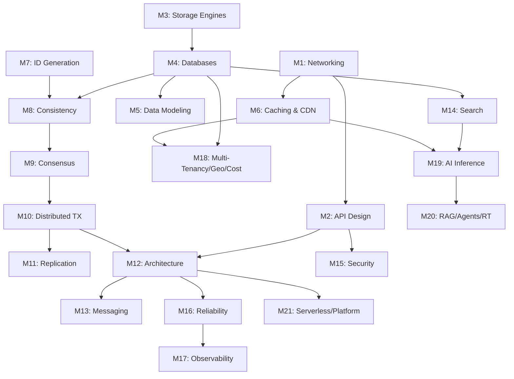

# Knowledge Graph Overview

*How everything in this vault connects. Open this in Obsidian's graph view for the full picture.*

## The Core Dependency Chain

## Cross-Cutting Themes

These concepts appear across many modules:

**Trade-offs** (the vault's beating heart): Every design decision is a trade-off. B-tree vs LSM (read vs write optimization). Consistency vs availability (CAP). Push vs pull (fan-out on write vs read). Centralized vs decentralized (coordination cost vs independence). Pre-computation vs on-demand (storage vs latency).

**The log abstraction**: Appears as WAL (M3), event log (M12), Kafka topic (M13), replication stream (M4/M11), and CRDT operation log (M11). Jay Kreps' insight — "the log" is the unifying abstraction — connects half the vault.

**Idempotency**: Appears in API design (M2), HTTP methods (M1), message consumers (M10), saga compensations (M10), database writes (M4), and cache operations (M6). The most universal reliability primitive.

**Caching**: Appears as browser cache, CDN (M6), application cache/Redis (M6), database buffer pool (M3), DNS cache (M1), connection pooling (M1), feed cache (Capstone 2), semantic cache (M19), KV cache (M19), and materialized views (M5). Every layer of every system has a cache.

## The Three Fundamental Distributed Systems Questions

Every module in Phases 2–4 answers one of these:

1. **How do you keep copies in sync?** → Replication (M4, M11), consistency models (M8), CRDTs (M11)
2. **How do you agree on things?** → Consensus (M9), distributed transactions (M10), leader election (M9)
3. **How do you handle failure?** → Resilience patterns (M16), sagas (M10), circuit breakers (M16), cell architecture (M12)