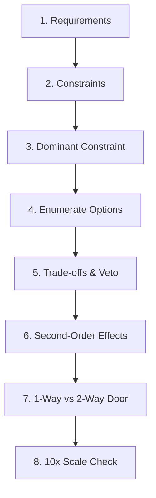

# Decision Frameworks in Practice

## Why This Exists

The preceding notes in this phase build a set of mental models and frameworks. This note is the integration point: a compact decision checklist you can use in real design discussions, applied to three worked examples that show the framework in action from start to finish.

The goal is not to hand you answers — it is to show the reasoning process so you can internalise it and apply it to scenarios you have never seen before.

---

## The Decision Checklist (1-Page Reference)



For any architectural decision, work through these 8 questions in order. You do not need to spend equal time on each — but you should have an answer to each before committing.

```
1. What are the requirements?
   - Functional: what does the system do?
   - Non-functional: what are the performance, reliability, and cost targets?

2. What are the constraints?
   - Read/write ratio, data volume + growth, latency budget,
     consistency requirement, availability SLA, cost ceiling
   - Put a number (or clear category) next to each

3. What is the dominant constraint?
   - Which constraint eliminates the most options?
   - This constraint gets veto power in the trade-off analysis

4. What are the options?
   - 2–4 credible choices
   - Remove options with obvious fatal flaws against the dominant constraint immediately

5. What are the trade-offs?
   - Score each option against each constraint (+/0/-)
   - Dominant constraint failures are vetoes

6. What are the second-order effects?
   - For each surviving option: what new problems does it introduce?
   - Operational burden, new failure modes, new coupling

7. Is this a one-way or two-way door?
   - One-way: invest heavily, seek adversarial review, prototype
   - Two-way: timebox (30 min), pick, move on

8. What breaks first at 10x scale?
   - Identify the scaling bottleneck for each surviving option
   - Design knowing the bottleneck; have a plan for when it arrives
```

---

## Worked Example 1: Should We Use a Message Queue Here?

**Context**: A user uploads a video. The system needs to transcode the video to multiple resolutions and notify the user when done.

### Step 1: Requirements

- Functional: Upload video → transcode → notify user
- Non-functional: Transcode may take 30s–5 min (variable); user should not wait synchronously; transcoding jobs must not be lost on service restart

### Step 2: Constraints

| Dimension | Value |
|-----------|-------|
| Read/write | Mostly write (new uploads); occasional reads (status checks) |
| Volume | 1,000 uploads/day → ~12 transcodes/min at peak |
| Latency budget | Response to upload request: 200ms; completion notification: minutes acceptable |
| Consistency | Job must not be lost; duplicate transcoding annoying but acceptable |
| Availability | 99.9% (transcode delay OK; job loss not OK) |
| Cost | $300/month |

### Step 3: Dominant Constraint

**Durability**: jobs must not be lost on service restart. This eliminates in-memory queues and synchronous inline processing.

### Step 4: Options

- A: Synchronous inline (call transcode service directly in upload request)
- B: In-memory queue (enqueue job in process memory)
- C: Durable queue (SQS, Redis Streams, or DB-backed job queue)

### Step 5: Trade-Offs

| Option | Latency (upload) | Durability | Cost | Operational |
|--------|-----------------|------------|------|------------|
| A: Synchronous | - (blocks for 30s–5min) | + | + | + |
| B: In-memory | + | - (lost on restart) | + | + |
| C: Durable queue | + | + | 0 | 0 |

Dominant constraint (durability) veto: Options A and B eliminated.

### Step 6: Second-Order Effects of Option C

- At-least-once delivery → idempotent transcode handler needed (check if file already transcoded)
- Need dead-letter queue for failed jobs
- Need monitoring for queue depth (backpressure signal)

### Step 7: Reversibility

Queue choice (SQS vs Redis Streams vs DB-backed) is a two-way door at this scale. Pick SQS (managed, no operational overhead). Re-evaluate if cost becomes a constraint.

### Step 8: What Breaks First at 10x?

At 120 transcodes/min: single transcode worker becomes the narrow pipe. Solution: add more workers (horizontally scalable with a queue). Bottleneck is known and the chosen architecture accommodates it.

**Decision**: Durable queue (SQS) + async transcode workers. ✓

*Connections*: [[00-Phase-0__The_Physics_of_Distributed_Systems]] (backpressure), [[00-Phase-0__Reasoning_Through_Trade-Offs]] (one-way vs two-way door)

---

## Worked Example 2: SQL or NoSQL for This Use Case?

**Context**: A product catalogue for an e-commerce site. 500,000 SKUs, each with 20–200 attributes (highly variable — a t-shirt has size/colour; a laptop has CPU/RAM/storage/display specs). Read-heavy (customers browsing), occasional writes (inventory updates, new product launches).

### Step 1: Requirements

- Functional: Store and retrieve product attributes; support filtering by attribute (e.g., "laptops with 16GB RAM")
- Non-functional: p99 read latency < 50ms; 99.9% availability; schema flexibility (new product categories add new attributes)

### Step 2: Constraints

| Dimension | Value |
|-----------|-------|
| Read/write | ~50:1 read-heavy |
| Volume | 500K products; slow growth (~1K new SKUs/month) |
| Latency budget | 50ms p99 read |
| Consistency | Eventual OK (stale product info for seconds is acceptable) |
| Availability | 99.9% |
| Cost | $400/month |

### Step 3: Dominant Constraint

**Schema flexibility**: product attributes vary drastically across categories. A fixed relational schema either forces nullable columns (sparse, wasteful) or requires EAV (Entity-Attribute-Value) tables (complex queries). This constraint discriminates strongly.

### Step 4: Options

- A: PostgreSQL with JSONB columns (relational + flexible attributes)
- B: MongoDB (document store, schema-flexible)
- C: Relational with EAV table pattern
- D: Elasticsearch (full-text + attribute filtering)

Remove Option C immediately: EAV is known to produce unmaintainable query complexity and poor performance for filtering.

### Step 5: Trade-Offs

| Option | Schema flexibility | Filter query perf | Operational burden | Cost |
|--------|-------------------|-------------------|--------------------|------|
| A: PG + JSONB | + (GIN index on JSONB) | + | + (team knows Postgres) | + |
| B: MongoDB | + | + | 0 (new operational domain) | 0 |
| D: Elasticsearch | + | + | - (additional service; not a source of truth) | - |

### Step 6: Second-Order Effects

- Option A: JSONB GIN indexes can become large; filtering on deeply nested attributes requires careful index design
- Option B: Document model is natural for product data; no joins needed; but if you later need cross-product analytics, it's awkward
- Option D: Elasticsearch is not durable enough to be primary storage; you'd need Postgres or Mongo as source of truth anyway — two systems to maintain

### Step 7: Reversibility

Primary storage choice is a one-way door (data gravity). Invest in the analysis. Option D as primary is eliminated (not durable enough). Between A and B: the team knows Postgres; JSONB handles the schema flexibility requirement; Postgres ACID guarantees are an asset for inventory consistency. This is not a close call.

### Step 8: What Breaks First at 10x?

5M products: GIN index size and write amplification on JSONB updates. Solution: partition by product category (range-partition on category_id). Known bottleneck, known solution.

**Decision**: PostgreSQL with JSONB attributes and GIN indexes. ✓

*Connections*: Data gravity [[00-Phase-0__The_Physics_of_Distributed_Systems]], one-way door analysis [[00-Phase-0__Reasoning_Through_Trade-Offs]]

---

## Worked Example 3: Monolith or Microservices for a New Product?

**Context**: A 4-person startup building a B2B SaaS project management tool. First version. No existing users yet.

### Step 1: Requirements

- Functional: Projects, tasks, comments, file attachments, user accounts, notifications
- Non-functional: Ship first version in 3 months; iterate fast; 99.9% availability target once launched

### Step 2: Constraints

| Dimension | Value |
|-----------|-------|
| Read/write | Unknown (pre-launch) |
| Volume | Unknown; 0 users today |
| Latency budget | 200ms p99 (standard web app) |
| Consistency | Strong (task state must be consistent) |
| Availability | 99.9% |
| Cost | $200/month (seed-stage) |
| **Team size** | **4 engineers** |

### Step 3: Dominant Constraint

**Team size**: 4 engineers cannot operate, deploy, debug, and maintain 8+ independent services. The coordination overhead alone would consume the team.

### Step 4: Options

- A: Monolith (single deployable, shared codebase)
- B: 2–3 services (loosely split: web app, API, background jobs)
- C: Full microservices (one service per domain: users, projects, tasks, comments, notifications, files)

### Step 5: Trade-Offs

| Option | Team size fit | Operational burden | Deploy complexity | Ship speed |
|--------|--------------|---------------------|------------------|-----------|
| A: Monolith | + | + | + | + |
| B: 2–3 services | + | 0 | 0 | 0 |
| C: Full microservices | - | - (4 people, 8+ services) | - | - |

Dominant constraint (team size) veto: Option C eliminated.

### Step 6: Second-Order Effects of Option A

- At 10x team size: deploy coordination will become overhead (Signal 2 from [[00-Phase-0__Evolving_Designs_Over_Time]])
- At 10x data volume: database contention may appear (Signal 1)
- Both are future problems with known solutions (modular monolith, then strangler fig extraction)

### Step 7: Reversibility

The monolith data model is a one-way door. Design it carefully. The service decomposition is a two-way door at this scale — decide when the signals arrive.

### Step 8: What Breaks First at 10x?

Shared database (all features write to the same Postgres instance) and shared deploy pipeline (all 4 engineers coordinate releases). Both are known; both have solutions when the time comes.

**Decision**: Start with a well-structured monolith. Re-evaluate when deploy coordination overhead or database contention becomes measurable. ✓

*Connections*: Monolith-first reasoning [[00-Phase-0__Reasoning_Through_Trade-Offs]], evolution signals [[00-Phase-0__Evolving_Designs_Over_Time]], premature optimisation pitfall [[00-Phase-0__Common_Decision_Pitfalls]]

---

## Connections

- [[00-Phase-0__Requirements_to_Constraints]] — Steps 1–3 of the checklist
- [[00-Phase-0__Reasoning_Through_Trade-Offs]] — Steps 4–8 of the checklist
- [[00-Phase-0__Common_Decision_Pitfalls]] — failure modes this process prevents
- [[00-Phase-0__Evolving_Designs_Over_Time]] — what happens after the decision
- [[Phase_0_MOC]] — phase overview

## Reflection Prompts

- Apply the 8-question checklist to a real design decision you are facing right now. Which question is hardest to answer? What does that tell you about what you need to learn?
- In Worked Example 3, the decision was "start with a monolith." At what concrete signal (be specific about numbers) would you begin the migration?
- Write your own worked example for a decision you've made in the past. Does the framework validate the decision you made, or would it have led you somewhere different?

## Canonical Sources

- The three worked examples connect to depth material in:
  - Queuing theory: [[00-Phase-0__The_Physics_of_Distributed_Systems]] (backpressure/fluid dynamics)
  - Storage choices: Modules M03, M04
  - Service decomposition: Module M12
  - Messaging patterns: Module M13
