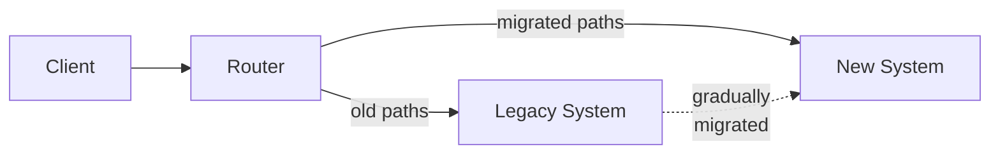

# Evolving Designs Over Time

## Why This Exists

Systems do not live in a fixed environment. User growth, feature requirements, team growth, cost pressure, and regulatory change all apply selection pressure that makes yesterday's optimal architecture suboptimal today. Understanding how to evolve a system — and when to invest in evolution — is as important as the initial design.

This note addresses the lifecycle question: when is the current architecture still fit for purpose, when is it time to evolve, and how do you make the transition without burning down what works?

## Mental Model

> **Systems evolve through selection pressure. The "fittest" architecture for 1,000 users is not the fittest for 1,000,000. Don't pre-adapt for an environment you're not in yet.**

Biological evolution is ruthlessly local. A trait that is adaptive in one environment is neutral or costly in another. Pre-adaptation — evolving a trait before the environment exists — is almost never advantageous, because the energetic cost of the trait is paid now while the benefit is contingent on a future environmental shift.

Software architecture obeys the same logic. Microservices are adaptive at 200+ engineers because they reduce coordination overhead; at 5 engineers, they are costly overhead with no benefit. Sharding is adaptive at 100TB of data; at 100GB, it is complexity with no payoff.

**The discipline**: Be aware of the environment you are in, watch for signals that the environment is shifting, and evolve in response to those signals — not in anticipation of hypothetical future environments.

---

## Start Simple, Measure, Then Optimise

The canonical order:

1. **Build the simplest thing that works** — optimise for velocity and correctness, not scale
2. **Instrument everything** — latency, error rate, queue depth, resource utilisation
3. **Wait for signals** — let the system tell you where the pressure is, rather than predicting it
4. **Optimise the specific bottleneck** — not the general architecture

This order is counterintuitive to engineers who are trained to anticipate problems. It requires accepting that you will encounter scaling problems — but that you will solve real problems rather than imagined ones, at the time you have the information to solve them correctly.

*Caveat*: Some decisions lock you in early (one-way doors — see below). For those, do the analysis upfront. For everything else, defer.

---

## The 4 Signals That It's Time to Evolve

These are empirical signals from instrumentation, not predictions. When you see them consistently, the environment has shifted and the current architecture is no longer fit.

### Signal 1: p99 Latency Consistently Above Budget

If your p99 latency is consistently above SLA and caching, indexing, and query optimisation have been exhausted, the architecture is hitting a structural limit. The bottleneck has become architectural, not a parameter to tune.

*What to look for*: Is the latency caused by a specific component (database, downstream service, serialisation)? That component is the bottleneck. Narrow-pipe analysis (Amdahl) applies.

### Signal 2: Deploy Frequency Dropping Due to Coordination Overhead

If teams are spending more time coordinating deployments than shipping features, the deployment unit is too large. This is the canonical signal that a monolith's coupling has become costly.

*What to look for*: Are teams waiting for other teams to be "ready" before deploying? Are releases batching multiple teams' changes together? Are post-deploy incidents attributable to changes from another team?

### Signal 3: Operational Burden Growing Faster Than Team Size

If on-call pages, manual interventions, and operational toil are growing faster than the team, the system is consuming engineering capacity faster than it is creating product value.

*What to look for*: Engineer-hours per incident; toil-to-feature ratio; on-call fatigue reports.

### Signal 4: Cost per User Not Decreasing with Scale

Efficient architectures exhibit economies of scale: cost per user falls as user count rises. If cost per user is flat or growing, the architecture is not benefiting from scale — likely due to linear horizontal scaling of an expensive tier, or over-provisioned infrastructure that was sized for a scale not yet reached.

---

## One-Way vs Two-Way Doors

Not all architectural decisions are equally reversible. Invest analysis effort proportional to the cost of reversal.

### One-Way Doors — Hard to Change Later

| Decision | Why it's a one-way door |
|----------|------------------------|
| **Primary data model** | Migrating data model requires dual-writes, backfills, and validation across all records |
| **API contracts (external)** | External clients depend on the contract; breaking changes require versioning and sunset periods |
| **Consistency model** | Changing from eventual to strong consistency requires redesigning the replication strategy |
| **Primary database choice** | Data gravity (see [[00-Phase-0__The_Physics_of_Distributed_Systems]]) makes migration expensive |
| **Event schema in a persistent stream** | Consumers are built against the schema; old events cannot be retroactively re-shaped |

For one-way doors: do the upfront analysis, prototype, seek adversarial review, sleep on it.

### Two-Way Doors — Easy to Change Later

| Decision | Why it's a two-way door |
|----------|------------------------|
| **Caching layer** | Swap Redis for Memcached (or remove entirely) with a config change and cache warm-up |
| **CDN provider** | DNS change + cache warm-up |
| **Internal service boundaries** | You own both sides; refactor the split at any time |
| **Deployment strategy** | Blue/green → canary → feature flags, all reversible |
| **Monitoring tooling** | Forward logs to a new destination; old tooling stays available |

For two-way doors: timebox the decision (30 minutes), pick, move on.

---

## The Strangler Fig Migration Pattern

When a one-way door decision needs to be reversed (it happens), the strangler fig pattern minimises risk.

Named after the strangler fig vine, which grows around a host tree until it can support itself, at which point the host tree dies and the vine becomes the structure:

1. Stand up the new system alongside the old
2. Route a subset of traffic to the new system
3. Migrate one capability at a time until the new system handles all traffic
4. Decommission the old system

This applies to database migrations, monolith-to-service decomposition, and infrastructure platform migrations alike. See more on migration patterns in the architectural patterns module.

---

## Version 1 Thinking: What to Get Right Early vs What to Defer

| Get right early (one-way doors) | Defer (two-way doors) |
|--------------------------------|-----------------------|
| Data model and primary database | Caching topology |
| External API contract | Internal service decomposition |
| Authentication model | Deployment pipeline tooling |
| Compliance and data residency | Monitoring dashboards |
| Core consistency model | CDN configuration |

**The V1 principle**: Get the one-way doors right. For everything else, build the simplest implementation that lets you move fast, and accept that you will refactor it.

---

## Real-World Examples

### Shopify: Modular Monolith

Shopify ran a single Ruby on Rails monolith for over a decade. When scaling pressure arrived, they did *not* decompose into microservices — instead, they modularised the monolith using strict component boundaries (Packwerk). This maintained the operational simplicity of a monolith while reducing coupling between teams.

**What drove the evolution**: Deploy coordination overhead (Signal 2), not throughput or latency.

**The lesson**: Read the signal before choosing the response. Microservices solve autonomy problems; a modular monolith may solve the same problem with less operational cost.

### Discord: MongoDB → Cassandra → ScyllaDB

Discord's message store started in MongoDB, migrated to Cassandra as data volume grew, then migrated again to ScyllaDB when Cassandra's JVM GC pauses caused latency spikes at their scale.

**What drove each evolution**:
- MongoDB → Cassandra: data gravity reached the point where a single node was insufficient (Signal 1: latency)
- Cassandra → ScyllaDB: JVM GC pauses at scale exceeded latency budget (Signal 1: p99)

**The lesson**: Database migrations are expensive (one-way door revisits), but sometimes unavoidable. Each migration was driven by a specific, measured signal — not by a prediction.

### Twitter: Ruby Monolith → JVM Services

Twitter's original Ruby on Rails monolith handled the first wave of growth but began failing under the "Fail Whale" era of rapid scaling. The migration to JVM-based services was driven by throughput and resource efficiency at scale.

**What drove the evolution**: p99 latency and infrastructure cost per user at 100M+ users (Signals 1 and 4).

**The lesson**: The Ruby monolith was the right choice at launch (fastest path to product-market fit). The JVM migration was the right choice at scale. Neither was the right choice at the other's scale.

---

## Connections

- [[00-Phase-0__Requirements_to_Constraints]] — the signals that trigger evolution map to the constraints you defined
- [[00-Phase-0__Reasoning_Through_Trade-Offs]] — one-way vs two-way door classification
- [[00-Phase-0__Common_Decision_Pitfalls]] — premature optimisation is the failure mode of pre-evolution
- [[Phase_0_MOC]] — phase overview

## Reflection Prompts

- For your current system: which of the 4 signals, if any, are present? Are you responding to them or deferring?
- What are the one-way doors in your current architecture? Do you have a documented plan for the strangler fig migration when the time comes?
- Look at your last major architectural change. Was it driven by a measured signal, or by prediction? What was the outcome?

## Canonical Sources

- Fowler, "Strangler Fig Application" (martinfowler.com) — the canonical description of the migration pattern
- Fowler, "MonolithFirst" (martinfowler.com) — the case for start-simple
- Discord Engineering Blog, "How Discord Stores Billions of Messages" — the MongoDB → Cassandra migration in detail
- Shopify Engineering Blog, "Deconstructing the Monolith" — the modular monolith approach
