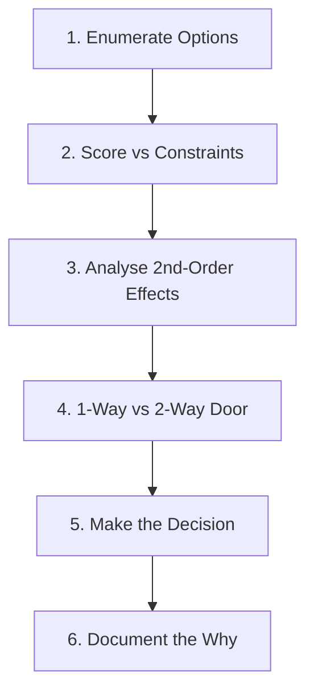

# Reasoning Through Trade-Offs

## Why This Exists

Knowing the constraints (see [[00-Phase-0__Requirements_to_Constraints]]) is necessary but not sufficient. You still need a systematic process for choosing between credible options. Without a process, decisions default to whoever speaks most confidently, whoever has the most political capital, or whoever wrote the last architecture document — none of which correlates with making the right call.

This note provides a repeatable, 6-step framework for evaluating options once you know what you are optimising for.

## Mental Model

> **Good designs find stable equilibria where forces balance. Bad designs fight against the natural direction of the forces.**

In physics, a system at equilibrium is in the lowest energy state accessible given its constraints. Good architecture has the same property: it feels natural, it does not require constant intervention to hold in place, and it degrades gracefully under stress. Bad architecture fights its constraints — it requires heroic engineering to maintain, it surprises you with failures, and the "solution" to every problem is adding more complexity.

---

## The 6-Step Decision Process

### Step 1: Enumerate Options

List 2–4 credible choices. Credible means "could plausibly work given the constraints." If an option has a clear fatal flaw against the dominant constraint, remove it immediately — do not carry obvious non-starters into the analysis.

*Anti-pattern*: Presenting only one option and arguing for it. This is not decision-making; it is advocacy. Always enumerate alternatives explicitly, even if you have a strong prior.

### Step 2: Score Each Option Against Your Constraints

Using the constraints from [[00-Phase-0__Requirements_to_Constraints]], score each option against each constraint. You do not need a formal scoring matrix — a table with +/0/- works fine.

| Option | Latency | Durability | Cost | Operational burden |
|--------|---------|------------|------|-------------------|
| Option A | + | + | - | 0 |
| Option B | 0 | 0 | + | + |
| Option C | - | + | 0 | - |

The dominant constraint gets **veto power**: if an option scores — on the dominant constraint, eliminate it regardless of how well it scores elsewhere.

### Step 3: Analyse Second-Order Effects

Ask: "If I pick X, what new problems does X introduce?"

Every architecture creates new problems while solving old ones. A queue solves backpressure but introduces at-least-once delivery semantics (requiring idempotency). Microservices solve team autonomy but introduce distributed tracing, network overhead, and operational complexity. Sharding solves write scalability but introduces cross-shard queries and rebalancing operations.

Second-order effects are often where architectures fail in production. They are not obvious from the first-order analysis.

*Useful questions*:
- What is the new operational burden this option creates?
- What class of bugs does this option introduce that did not exist before?
- What does monitoring, debugging, and incident response look like with this option?
- What coupling does this option introduce?

### Step 4: Check Reversibility — Two-Way vs One-Way Doors

Some decisions are easy to reverse (two-way doors); others are hard (one-way doors). Apply analysis effort proportional to irreversibility.

**One-way doors** (invest heavily upfront):
- Primary database choice and data model
- API contracts exposed to external clients
- Consistency model (changing from eventual to strong consistency later requires a system rewrite)
- Message format in a persistent event stream

**Two-way doors** (decide quickly, optimise later):
- CDN provider
- Caching layer (Redis vs Memcached)
- Internal service boundaries between teams you control
- Deployment strategy (blue/green vs canary)

*Anti-pattern*: Treating two-way doors as one-way doors. This leads to analysis paralysis — spending two weeks deciding which monitoring tool to use.

### Step 5: Ask "What Breaks First?" at 10x Scale

For each option, trace through what happens when traffic, data volume, or team size grows by 10x. The component that breaks first under scaling pressure is the option's **scaling bottleneck**.

Design the system knowing its bottleneck. If you know Option A's bottleneck is the primary database write path, you have a concrete, addressable problem — not a vague scalability concern.

*Example*: A monolith's bottleneck at 10x is often the database (all teams share it) and deployment (all teams deploy together). These are concrete problems with concrete solutions. Knowing this, you can decide: "At our current scale, the monolith is fine; at 10x, we'll need to shard the database and separate the deploy pipeline." This is better than "monoliths don't scale" (vague) or "we need microservices now" (premature).

### Step 6: Consider the Cost of Being Wrong

Not all wrong decisions are equally costly. Asymmetric consequences deserve asymmetric analysis.

| If wrong → easy to fix | If wrong → catastrophic |
|------------------------|------------------------|
| Spend 20% of normal analysis time | Spend 3–5x normal analysis time |
| Decide quickly, validate with data | Prototype, simulate, consult, challenge assumptions |
| Optimise for speed | Optimise for correctness |

*Example*: Choosing the wrong cache eviction policy → wrong, easy to fix (change a config). Choosing to build without an audit log for a compliance-regulated system → wrong, catastrophically hard to fix retroactively (requires backfilling history you don't have).

---

## Trade-Off Tables

Trade-off tables are useful when: there are 3+ options, the constraints are well-defined, and you need to communicate the reasoning to stakeholders.

**How to construct one**:
1. Rows: options
2. Columns: constraints (with the dominant constraint first)
3. Cells: +/0/- or a 1–3 score
4. Add a "notes" column for second-order effects

**When they mislead**:
- When cells are filled with subjective scores that aren't grounded in numbers
- When the dominant constraint is given equal weight to minor constraints
- When "pros and cons" are listed without specifying *for whom* and *at what scale*

---

## Worked Examples

### Monolith-First Reasoning

**Decision**: Should a 3-person startup build a monolith or microservices?

Constraints: team size = 3, throughput = 1,000 req/day, latency budget = 500ms, cost = $200/month.

| Option | Dominant constraint (team size) | Cost | Operational burden |
|--------|---------------------------------|------|-------------------|
| Monolith | + (one codebase, one deploy) | + | + (simple) |
| Microservices | - (3 people can't own 10 services) | - (10x infrastructure) | - (distributed tracing, service mesh) |

Dominant constraint veto: microservices scores — on team size (dominant constraint). Choose monolith.

Second-order effect: the monolith's bottleneck at 10x is deploy coordination and database contention — both addressable problems when the team is larger.

### Push vs Pull for Feeds

**Decision**: Should a social feed be push (fanout on write) or pull (fanout on read)?

Constraints: 10M users, top 1% of users have 1M+ followers (celebrity problem), read/write ratio = 100:1.

| Option | Latency (read) | Write load | Celebrity problem |
|--------|----------------|------------|-------------------|
| Push (fanout on write) | + (pre-computed) | - (1M writes per celebrity post) | - (fan-out storm) |
| Pull (fanout on read) | - (aggregate on read) | + (one write) | + (no fan-out storm) |
| Hybrid | + | 0 | + (push for non-celebrities, pull for celebrities) |

Dominant constraint: read latency (100:1 ratio) favours push, but celebrity problem makes pure push operationally dangerous. Hybrid wins.

### Sync vs Async Processing

**Decision**: Should order processing be synchronous (user waits for result) or asynchronous (user gets confirmation, result delivered later)?

Constraints: payment processing takes 200–2000ms (variable), user latency budget = 300ms p99, durability = critical (orders must not be lost).

| Option | Latency p99 | Durability | User experience |
|--------|------------|------------|----------------|
| Synchronous | - (200–2000ms exceeds budget) | + | Simple (result in response) |
| Async + polling | + (immediate ACK) | + (durable queue) | Moderate (user must poll) |
| Async + webhook | + | + | Good (push result when ready) |

Dominant constraint: latency budget makes synchronous impossible (2000ms > 300ms). Async with push result wins.

---

## Connections

- [[00-Phase-0__Requirements_to_Constraints]] — prerequisite: you need constraints before scoring options
- [[00-Phase-0__First_Principles_Thinking]] — the 5 tensions are the axes options are scored on
- [[00-Phase-0__Common_Decision_Pitfalls]] — failure modes of this process
- [[00-Phase-0__Decision_Frameworks_in_Practice]] — the full framework applied end-to-end
- [[Phase_0_MOC]] — phase overview

## Reflection Prompts

- Think of a design decision you made that turned out to be wrong. Which step in this process would have caught it?
- Have you ever suffered from treating a two-way door as a one-way door? What was the cost of that analysis time?
- For your current system: what component breaks first at 10x? Do you have a concrete plan for when that happens?

## Canonical Sources

- Bezos, Amazon "two-pizza team" memo — on two-way vs one-way doors (widely cited paraphrase)
- Hohpe & Woolf, *Enterprise Integration Patterns* — the canonical trade-off analysis for messaging patterns
- Fowler, "MonolithFirst" (2015, martinfowler.com) — the worked case for monolith-first reasoning
- Twitter engineering blog on the push/pull feed architecture — the celebrity problem in production
