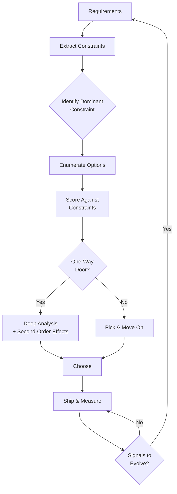

# Phase 0 — Design Thinking: Map of Contents

> **Read this before diving into specific technologies.**
> This phase teaches how to think, not what to know. The modules below build the mental operating system you need to make good decisions under uncertainty — regardless of which tools or platforms you're working with.

System design is not a catalogue of patterns to memorise. It is a discipline of reasoning: decomposing requirements, identifying constraints, evaluating trade-offs, and choosing the option that best fits your context. The notes in this phase give you a repeatable framework for that reasoning, grounded in analogies to physics and natural systems that make the forces intuitive.

---

## Decision-Making Flow

---

## Notes in This Phase

| # | Note | What you will learn |
|---|------|---------------------|
| 1 | [[00-Phase-0__First_Principles_Thinking]] | The 5 fundamental tensions; every decision is a position on a trade-off axis |
| 2 | [[00-Phase-0__The_Physics_of_Distributed_Systems]] | Thermodynamics, fluid dynamics, gravity, and wave propagation as intuition pumps |
| 3 | [[00-Phase-0__Requirements_to_Constraints]] | Turning vague requirements into concrete numbers; finding the dominant constraint |
| 4 | [[00-Phase-0__Reasoning_Through_Trade-Offs]] | A 6-step framework for evaluating options; the equilibrium isomorphism |
| 5 | [[00-Phase-0__Common_Decision_Pitfalls]] | 8 anti-patterns in design reasoning and how to catch yourself |
| 6 | [[00-Phase-0__Evolving_Designs_Over_Time]] | When and how to evolve an architecture; one-way vs two-way doors |
| 7 | [[00-Phase-0__Decision_Frameworks_in_Practice]] | Full decision checklist applied to 3 worked examples |

---

## Recommended Reading Order

Read notes 1–2 first to build the mental model. Notes 3–4 give you the process. Notes 5–6 are insurance against common mistakes. Note 7 is the reference you return to when facing a real decision.

---

## Connections

- All modules in Phases 1–6 apply the frameworks introduced here
- [[00-Meta__How_to_Study_This_Vault]] — overall study plan

## Reflection Prompts

- Before reading further: what is your current mental model for making design decisions? Where does it feel shaky?
- After reading all 7 notes: pick a real system you've worked on. Can you reconstruct the dominant constraint that should have driven its architecture?
