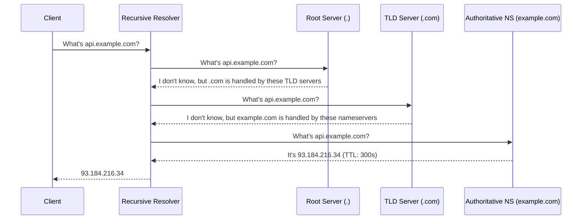

# DNS Resolution Chain

## Why This Exists

The internet runs on IP addresses — numeric labels like `142.250.80.46`. Humans are terrible at remembering these. DNS exists to translate human-readable names (`google.com`) into machine-routable addresses. But it's far more than a phone book. DNS is a globally distributed, hierarchically cached, eventually consistent database that handles roughly **30 trillion queries per day**. It is, arguably, the largest distributed system most engineers interact with without thinking about.

If DNS goes down, effectively nothing works. The 2021 Facebook outage — where a BGP misconfiguration made Facebook's DNS servers unreachable — took down Facebook, Instagram, WhatsApp, and Oculus for six hours. The services themselves were fine; nobody could find them.

## Mental Model

Think of DNS like asking for directions in a city with no GPS:

1. You ask your friend (browser cache): "Where's the restaurant?" Your friend might remember from last time.
2. If not, you call your local concierge (OS resolver cache).
3. If they don't know, they call the city information desk (recursive resolver — typically your ISP or a public resolver like 8.8.8.8).
4. The information desk doesn't know every address, but it knows who to ask. It starts at the top: "Who manages `.com`?" asks the root. "Who manages `example.com`?" asks the `.com` TLD server. "What's the IP for `api.example.com`?" asks the authoritative nameserver for `example.com`.
5. The answer flows back down the chain, and everyone along the way writes it down (caches it) for next time.

The key insight: DNS is a **hierarchical delegation system with aggressive caching**. Most queries never reach the authoritative server because someone in the chain already has the answer.

## How It Works

### The Resolution Hierarchy

A full DNS resolution (cold cache) walks four levels:



**Root servers**: 13 logical root server clusters (A through M), each replicated via [[Anycast and GeoDNS]] to hundreds of physical locations worldwide. They don't know any domain's IP — they only know which TLD servers handle `.com`, `.org`, `.io`, etc.

**TLD servers**: Operated by registries (Verisign for `.com`, for example). They know which authoritative nameservers handle each registered domain.

**Authoritative nameservers**: The final authority. They hold the actual DNS records (A, AAAA, CNAME, MX, TXT, etc.) for a domain. This is what you configure when you set up DNS in Cloudflare, Route 53, or your registrar.

### Record Types That Matter

| Record | Purpose | Example |
|--------|---------|---------|
| A | Maps name → IPv4 address | `api.example.com → 93.184.216.34` |
| AAAA | Maps name → IPv6 address | `api.example.com → 2606:2800:220:1:...` |
| CNAME | Alias one name to another | `www.example.com → example.com` |
| MX | Mail server routing | `example.com → mail.example.com (priority 10)` |
| TXT | Arbitrary text (SPF, DKIM, domain verification) | `"v=spf1 include:_spf.google.com ~all"` |
| NS | Delegates to authoritative nameservers | `example.com → ns1.cloudflare.com` |
| SRV | Service discovery (host + port) | `_grpc._tcp.example.com → grpc.example.com:443` |

**CNAME gotcha**: A CNAME adds an extra resolution step (resolve the alias, then resolve the target). At high traffic, this latency penalty adds up. Many CDN providers use "CNAME flattening" or "ALIAS records" to avoid this — they resolve the CNAME chain server-side and return the final A record directly.

### Caching and TTL

Every DNS response includes a **TTL (Time To Live)** — how many seconds the answer can be cached before it must be re-fetched.

The caching hierarchy:
1. **Browser cache**: Chrome caches DNS for up to 60 seconds regardless of TTL
2. **OS resolver cache**: `systemd-resolved`, `dnsmasq`, or Windows DNS Client
3. **Recursive resolver cache**: Your ISP or public resolver (Cloudflare 1.1.1.1, Google 8.8.8.8) — this is the big one
4. **Authoritative response**: The source of truth

**TTL trade-offs**:
- **Low TTL (30–60s)**: Faster failover — if a server goes down, clients pick up the new IP quickly. But more DNS queries hit upstream, increasing latency and load.
- **High TTL (3600s+)**: Better performance and lower DNS infrastructure load. But changes propagate slowly — a migration or failover takes much longer to reach all clients.
- **The dirty secret**: Many clients, corporate proxies, and ISP resolvers ignore low TTLs or enforce minimums. You can set TTL to 30 seconds, but some fraction of your traffic will keep hitting the old IP for hours. Plan for this during migrations.

### DNS as a Single Point of Failure

DNS is the first thing that must work for anything else to work. Failure scenarios:

- **Authoritative NS outage**: If your nameservers go down and cached TTLs expire, your domain becomes unreachable. Mitigation: use multiple NS providers (e.g., Route 53 + Cloudflare as secondary).
- **Recursive resolver outage**: If your ISP's resolver goes down, nothing resolves. Mitigation: configure fallback resolvers (1.1.1.1, 8.8.8.8).
- **DNS poisoning/hijacking**: A malicious actor returns fake records. Mitigation: DNSSEC (cryptographic signing of DNS responses), though adoption remains incomplete.
- **DDoS on DNS infrastructure**: Dyn DNS attack (2016) took down Twitter, Reddit, Spotify, and others by overwhelming a single managed DNS provider. Mitigation: multi-provider DNS, anycast distribution.

## Trade-Off Analysis

| Decision | Option A | Option B | Guidance |
|----------|----------|----------|----------|
| TTL length | Low (30–60s) | High (3600s) | Low for services that need fast failover; high for stable, rarely-changing records |
| DNS provider | Single (simpler) | Multi-provider (resilient) | Single is fine for most; multi-provider for critical production domains |
| DNSSEC | Enabled (integrity) | Disabled (simpler) | Enable for domains handling auth, payments, or sensitive data; adds complexity and potential for clock-related failures |
| Recursive resolver | ISP default | Public (1.1.1.1, 8.8.8.8) | Public resolvers are generally faster and more reliable; ISP resolvers can be laggy or inject ads |

## Failure Modes

**TTL cache poisoning**: An attacker injects a fraudulent DNS record into a resolver's cache. All clients using that resolver are directed to a malicious IP for the duration of the TTL. Solution: DNSSEC validation at the resolver, DNS-over-HTTPS (DoH) or DNS-over-TLS (DoT) to prevent in-transit tampering.

**Resolver timeout cascade**: Your application's DNS resolver becomes slow or unresponsive. Every outbound HTTP request now waits for DNS resolution timeout (often 5-30 seconds) before failing. The application's thread pool fills up, and the entire service becomes unresponsive — even to requests that don't need DNS. Solution: local DNS caching (systemd-resolved, dnsmasq), short DNS timeouts, and fallback resolvers.

**Negative caching of transient failures**: A DNS name temporarily fails to resolve (authoritative server blip). The resolver caches the NXDOMAIN response for the SOA's negative TTL (sometimes hours). Even after the authoritative server recovers, clients see the stale negative cache. Solution: set low negative TTLs on authoritative servers, implement retry logic at the application level for DNS failures.

**Split-horizon DNS mismatch**: Internal DNS returns private IPs for services. An application running outside the internal network (a developer laptop, a CI runner, a partner service) resolves the same hostname to a different IP or gets NXDOMAIN. Solution: separate DNS zones for internal and external, clear documentation of which resolver each environment uses, and health checks that verify DNS resolution.

**Stale DNS after failover**: You fail over your database to a standby in another AZ. The DNS record is updated, but clients have the old IP cached (application-level caching, JVM DNS cache, OS resolver cache). Clients keep connecting to the dead primary for minutes. Solution: use low TTLs (30-60s) for records that may change during failover, honor TTLs in HTTP clients and connection pools (Java's `networkaddress.cache.ttl`), and use IP-based failover where possible.

## Architecture Diagram

```mermaid
graph TD
    Client[Client Browser] -->|1. Cache Check| Local[OS Resolver Cache]
    Local -->|2. Miss| Recursive[Recursive Resolver 8.8.8.8]
    
    subgraph "Iterative Resolution"
        Recursive -->|3. Query .com| Root[Root Server .]
        Root -->|4. Referral| Recursive
        Recursive -->|5. Query example.com| TLD[TLD Server .com]
        TLD -->|6. Referral| Recursive
        Recursive -->|7. Query api.example.com| Auth[Authoritative NS Route53]
        Auth -->|8. A Record: 93.184.216.34| Recursive
    end
    
    Recursive -->|9. Final Answer| Client
    
    style Recursive fill:var(--surface),stroke:var(--accent),stroke-width:2px;
    style Auth fill:var(--surface),stroke:var(--accent),stroke-width:2px;
```

## Back-of-the-Envelope Heuristics

- **DNS Latency**: A cold resolution (no cache) can take **100ms - 500ms+** depending on the number of hops and network distance.
- **Cache Hit Rate**: Public resolvers (Google, Cloudflare) typically have a **>95% hit rate** for popular domains.
- **UDP vs TCP**: Standard DNS queries use UDP port 53. If the response exceeds **512 bytes** (or 4096 bytes with EDNS0), it falls back to TCP.
- **Negative Caching**: If a domain doesn't exist (NXDOMAIN), resolvers cache this "non-existence" for the duration of the SOA's minimum TTL (usually **1 hour**).

## Real-World Case Studies

- **Facebook (2021 Total Blackout)**: A routine maintenance script accidentally withdrew all BGP routes to Facebook's DNS prefix. Because the DNS servers were unreachable, Facebook's internal tools (which relied on those same DNS names) also failed, locking engineers out of the data centers. It was a "DNS-induced catch-22."
- **Dyn (2016 DDoS)**: A massive Mirai botnet attack targeted Dyn (a major DNS provider). Because so many giants (Twitter, Spotify, GitHub) used only Dyn for their authoritative DNS, a large portion of the internet "disappeared" despite the services' actual servers being perfectly healthy.

## Connections

- [[Anycast and GeoDNS]] — How DNS itself gets load-balanced globally
- [[Load Balancing Fundamentals]] — DNS-based load balancing (multiple A records) is the simplest form of load balancing, but the coarsest
- [[CDN Architecture]] — CDNs rely heavily on DNS to route users to the nearest edge node
- [[Geo-Distribution and Data Sovereignty]] — DNS failover (Route 53 health checks, for example) is a common multi-region routing strategy
- [[TCP Deep Dive]] — DNS traditionally uses UDP, but falls back to TCP for large responses (and DNS over HTTPS/TLS is TCP-based)

## Reflection Prompts

1. You're migrating a high-traffic API from one cloud provider to another. The current DNS TTL is 3600 seconds. What's your migration plan, and when do you start lowering TTLs?

2. A junior engineer proposes using DNS round-robin (multiple A records) as the primary load balancing strategy for a latency-sensitive service. What are the problems with this approach, and what would you suggest instead?

## Canonical Sources

- *Designing Data-Intensive Applications* by Martin Kleppmann — not a DNS-focused book, but Chapter 1's discussion of reliability and "what can go wrong" sets the frame for why DNS resilience matters
- Cloudflare Learning Center, "What is DNS?" — excellent visual walkthrough of the resolution chain
- The 2021 Facebook outage post-mortem (Facebook Engineering blog) — a real-world case study in DNS as a single point of failure