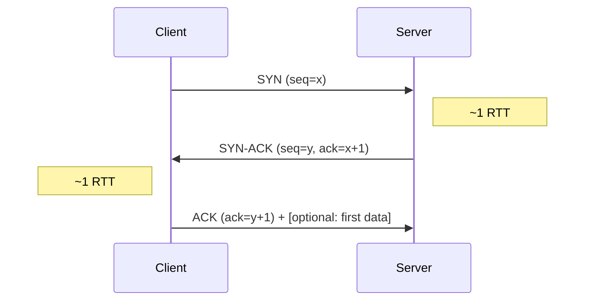
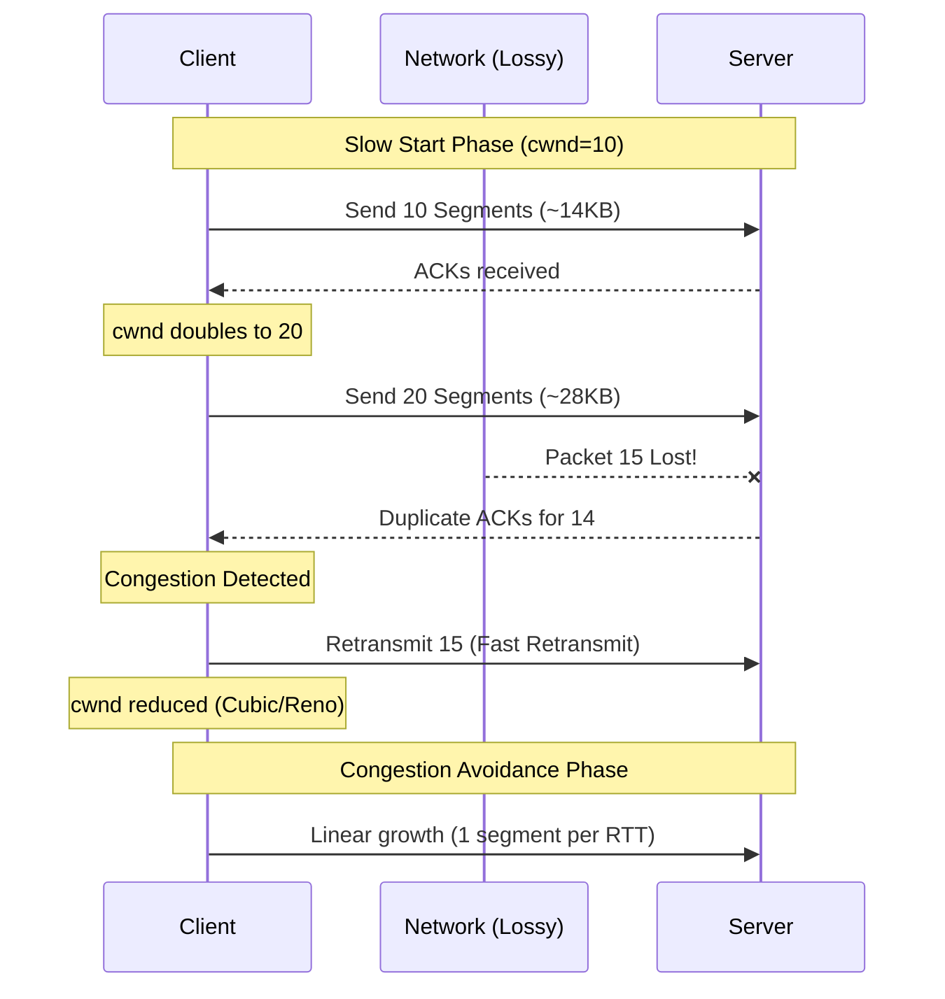

# TCP Deep Dive

## Why This Exists

TCP is the workhorse of the internet. Every HTTP request, database query, gRPC call, and SSH session runs over TCP (until HTTP/3 came along — more in [[HTTP Evolution — 1.1 to 2 to 3]]). TCP provides **reliable, ordered, byte-stream delivery** over an unreliable network. It does this through a remarkable set of mechanisms: connection handshakes, sequence numbers, acknowledgments, flow control, and congestion control.

The problem is that these guarantees aren't free. TCP's reliability mechanisms introduce latency, head-of-line blocking, and connection setup overhead that become real bottlenecks at scale. Understanding *how* TCP provides its guarantees helps you understand *when* those guarantees are worth the cost — and when they're not.

## Mental Model

TCP is like a phone call. Before you can talk, you dial and wait for the other person to pick up (three-way handshake). During the conversation, you speak in turns — if you say something and the other person doesn't acknowledge it ("uh huh"), you repeat yourself (retransmission). If you're talking too fast and they can't keep up, they say "slow down" (flow control). And if you notice the phone line is getting scratchy and dropping words (network congestion), you naturally start speaking more slowly and carefully (congestion control).

UDP, by contrast, is like shouting into a crowd. You say it once, you don't wait for acknowledgment, and if nobody heard you — tough.

## How It Works

### Connection Establishment: The Three-Way Handshake

Every TCP connection starts with three packets:

This costs **one full round-trip** before any data flows. On a cross-continent link (~150ms RTT), that's 150ms of pure overhead per new connection. This is why [[Connection Pooling and Keep-Alive]] matters so much for high-throughput services.

**TLS adds more round-trips**: TLS 1.2 adds two more round-trips (four total before data). TLS 1.3 reduces this to one additional round-trip (two total), and supports 0-RTT resumption for repeat connections — though 0-RTT is vulnerable to replay attacks.

**TCP Fast Open (TFO)**: Allows data in the SYN packet on repeat connections using a cached cookie. Saves one RTT on the handshake. Adoption is patchy — middleboxes (firewalls, NATs) sometimes strip TFO options.

### Congestion Control

TCP doesn't just send as fast as it can. It probes the network's capacity and backs off when it detects congestion. This is TCP's most complex and consequential mechanism.

**The core concept — congestion window (cwnd)**: The sender maintains a window of how many bytes it can have "in flight" (sent but not yet acknowledged). This window grows and shrinks based on network feedback.

**Slow start**: A new connection starts with a small cwnd (typically 10 segments = ~14KB). For every acknowledged segment, cwnd doubles — exponential growth. This sounds fast, but on a high-bandwidth link, it means TCP takes several round-trips to fully utilize available bandwidth. A fresh connection on a 1Gbps link with 50ms RTT takes ~500ms to reach full throughput.

**Congestion avoidance**: Once cwnd exceeds a threshold (ssthresh), growth slows to linear — one segment per RTT. This phase probes for available bandwidth more cautiously.

**Loss detection and response**: When TCP detects packet loss (via duplicate ACKs or timeout), it interprets this as congestion:
- **Fast retransmit / fast recovery (Reno, NewReno)**: On three duplicate ACKs, halve cwnd and retransmit. Timeout → reset cwnd to 1.
- **CUBIC** (Linux default): After a loss event, cwnd follows a cubic function that aggressively probes back toward the pre-loss window. Better than Reno for high-bandwidth, high-latency links (long fat pipes).
- **BBR** (Bottleneck Bandwidth and RTT — developed by Google): Instead of treating loss as the congestion signal, BBR builds a model of the path's bandwidth and RTT, and paces packets to match. Significantly better throughput on lossy links (like mobile networks). Used by Google's infrastructure and YouTube.

**Why this matters for system design**: If your services communicate across high-latency links (cross-region, over the internet), TCP's congestion control directly limits throughput. A fresh connection between US-East and EU-West (~80ms RTT) starts at ~14KB and takes 4–5 round-trips (320–400ms) to reach full speed. This is one reason persistent connections, connection pooling, and gRPC's multiplexed streams are architecturally important — they avoid repeatedly paying the slow-start tax.

### Head-of-Line Blocking

TCP delivers bytes **in order**. If packet 3 of 10 is lost, the receiver has packets 4–10 buffered but cannot deliver them to the application until packet 3 is retransmitted and received. The entire stream stalls waiting for one lost packet.

This is TCP's most fundamental trade-off: **ordered delivery guarantees create blocking**. For a single request-response, this is fine. But when you multiplex many independent streams over one TCP connection (as HTTP/2 does), a single lost packet blocks *all* streams — even ones whose data arrived fine.

This is the exact problem that motivated HTTP/3's switch to QUIC (UDP-based), which provides per-stream ordering without cross-stream head-of-line blocking. See [[HTTP Evolution — 1.1 to 2 to 3]].

### Flow Control vs Congestion Control

These are often confused. They're different mechanisms solving different problems:

| Mechanism | What it controls | Signal |
|-----------|-----------------|--------|
| **Flow control** | Don't overwhelm the *receiver* | Receiver advertises its buffer size (rwnd) in every ACK |
| **Congestion control** | Don't overwhelm the *network* | Sender infers congestion from loss, delay, or ECN marks |

The actual send rate is limited by `min(cwnd, rwnd)` — the smaller of the two windows.

### TCP Tuning for Server Applications

Key kernel parameters that matter in production:

**`tcp_max_syn_backlog` / `somaxconn`**: The queue for incoming connections waiting to complete the handshake. Under heavy load (thousands of new connections/second), the default is too small and connections get dropped. Symptom: clients see "connection refused" or timeouts.

**`tcp_tw_reuse`**: After a TCP connection closes, its port enters TIME_WAIT for 2× the maximum segment lifetime (~60 seconds). On a busy proxy or load balancer cycling thousands of short connections per second, you run out of ephemeral ports. `tcp_tw_reuse` allows reusing TIME_WAIT sockets for new outbound connections.

**`tcp_keepalive_time`**: How long an idle connection waits before sending a keepalive probe. The default (7200 seconds = 2 hours) is way too long for most services. Many load balancers and proxies have shorter idle timeouts — if your keepalive is longer than their timeout, connections get silently dropped, leading to "connection reset" errors after periods of inactivity.

**Buffer sizes** (`tcp_rmem`, `tcp_wmem`): The receiver and sender buffer sizes. For high-bandwidth, high-latency links, the bandwidth-delay product (BDP = bandwidth × RTT) determines how much data can be in flight. If buffers are smaller than BDP, you can't fully utilize the link.

## Trade-Off Analysis

| Congestion Algorithm | Throughput | Latency | Fairness | Best For |
|---------------------|-----------|---------|----------|----------|
| Cubic (Linux default) | Good on low-loss links | Moderate — loss-based detection | Fair between Cubic flows | General-purpose, data center east-west |
| BBR (Google) | Excellent on lossy/long links | Low — model-based, avoids bufferbloat | Can starve loss-based flows | High-BDP links, WAN, CDN origins |
| Reno/NewReno | Conservative | Higher — slow recovery from loss | Very fair | Legacy, interop-sensitive environments |
| DCTCP | Near line-rate in data center | Very low — ECN-based, reacts before loss | Fair among DCTCP flows | Data center only (requires ECN support) |
| QUIC (UDP-based) | Good — avoids head-of-line blocking | Low — 0-RTT resumption | Independent per stream | Web, mobile, connections crossing NATs |

**When TCP vs UDP matters**: TCP's ordered, reliable delivery is overhead you pay whether you need it or not. Real-time voice/video, DNS queries, and game state updates are often better on UDP (or QUIC) because a retransmitted stale packet is worse than a skipped one. But for anything requiring completeness — file transfer, API calls, database queries — TCP's guarantees are non-negotiable.

## Failure Modes

- **Connection storms after restart**: A service restarts and thousands of clients simultaneously reconnect. Each connection requires a handshake + slow start. With 10,000 clients reconnecting simultaneously at 150ms RTT, the SYN queue backlog can add **500ms–2s** of additional latency per connection, and many connections will be dropped entirely (SYN queue overflow). The service is overwhelmed before it reaches steady state. Mitigation: client-side jittered reconnection backoff (spread reconnections over 30–60 seconds), connection draining before shutdown.
- **Bufferbloat**: Oversized network buffers absorb packets instead of dropping them, masking congestion from TCP's detection algorithms. Latency spikes to **1–5 seconds** while throughput stays stable — the classic "high bandwidth but terrible latency" symptom. BBR is more resistant to this than loss-based algorithms because it measures RTT directly rather than waiting for packet loss.
- **Idle connection death**: A connection sits idle, a middlebox (NAT, firewall, cloud load balancer) silently drops the connection state after its timeout (typically **60–350 seconds** depending on the middlebox), and the next request on that "dead" connection fails with "connection reset by peer." Mitigation: application-level keepalives at **30-second intervals** (not just TCP keepalives, which many middleboxes ignore).

## Architecture Diagram

## Back-of-the-Envelope Heuristics

- **Handshake RTT**: **1 RTT** for TCP, **+1-2 RTTs** for TLS.
- **Initial Congestion Window (initcwnd)**: Modern Linux kernels use **10 segments** (~14.6 KB). Older kernels used 2-4.
- **BDP (Bandwidth-Delay Product)**: The maximum "data in flight" = `Bandwidth * RTT`. For a 1Gbps link with 100ms RTT, BDP is **~12.5 MB**. If your TCP buffer is smaller than this, you cannot saturate the link.
- **TIME_WAIT Duration**: Typically **60 seconds** (2 * MSL). A server can only have ~65k concurrent connections per unique client IP/port due to port exhaustion in TIME_WAIT.

## Real-World Case Studies

- **Google (BBR Implementation)**: Google developed BBR (Bottleneck Bandwidth and RTT) to move away from loss-based congestion control. By deploying BBR on YouTube, they saw a **33% reduction** in mean RTT and a **14% increase** in throughput on high-loss networks, significantly improving video quality for mobile users.
- **Microsoft (Windows TCP Stack)**: Microsoft famously "fixed" the initial congestion window in Windows by increasing it to 10 (matching Google/Linux), which resulted in a measurable speedup for the entire web, as most initial HTTP responses (CSS, JS) finally fit into the first "burst" of packets.

## Connections

- [[TCP vs UDP]] — When TCP's guarantees cost more than they're worth
- [[HTTP Evolution — 1.1 to 2 to 3]] — How HTTP/2 multiplexing exposed TCP's head-of-line blocking, leading to HTTP/3's move to QUIC
- [[Connection Pooling and Keep-Alive]] — Strategies to avoid paying TCP's handshake and slow-start costs repeatedly
- [[Load Balancing Fundamentals]] — L4 load balancers operate at the TCP level; L7 balancers terminate TCP and inspect application data
- [[Circuit Breakers and Bulkheads]] — TCP timeout tuning interacts with circuit breaker configuration

## Reflection Prompts

1. A service in US-East makes synchronous calls to a dependency in EU-West (80ms RTT). Each call is a new TCP connection. What's the minimum latency for a 100KB response? How does this change with persistent connections?

2. Your microservice runs behind an AWS ALB with a 60-second idle timeout. Your TCP keepalive is set to 7200 seconds. Intermittently, requests fail with "connection reset by peer." What's happening, and how do you fix it?

## Canonical Sources

- *Designing Data-Intensive Applications* by Martin Kleppmann — Chapter 8: "The Trouble with Distributed Systems" discusses network unreliability and TCP's role
- Cardwell et al., "BBR: Congestion-Based Congestion Control" (ACM Queue, 2016) — the BBR paper from Google
- Cloudflare Blog, "A Primer on TCP Congestion Control" — accessible walkthrough of slow start, CUBIC, and BBR
- Stevens, *TCP/IP Illustrated, Volume 1* — the definitive deep reference (dense, but authoritative)