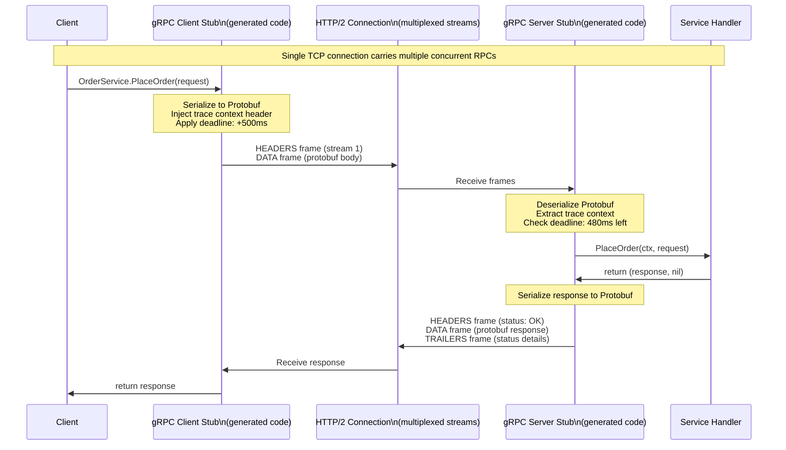

# gRPC Deep Dive

## Why This Exists

REST over HTTP/JSON is excellent for external APIs where human readability, broad compatibility, and browser access matter. For internal microservice-to-microservice communication — where you control both sides, latency matters, and you're generating millions of calls per second — REST's overhead becomes a liability. JSON parsing is CPU-intensive, HTTP/1.1's text headers are bloated, and there's no built-in streaming or bidirectional communication.

gRPC addresses all of these: it uses Protocol Buffers (a compact binary format 3–10× smaller than JSON), runs over HTTP/2 (multiplexed streams on a single TCP connection), and provides first-class streaming patterns. The trade-off is tighter coupling (both sides must share the `.proto` schema), more complex debugging (binary wire format), and limited browser support. For high-throughput internal services, that's an easy trade-off.

## Mental Model

Think of gRPC as **RPC with a published contract**. Traditional REST is like calling someone on the phone and improvising — you describe what you want in natural language and hope the other person understands. gRPC is like filling out a structured form that both sides have a copy of — the schema is the contract, and both the caller and the callee are code-generated from it.

Protocol Buffers are the language of that contract: a strongly-typed, version-safe, compact binary encoding. The generated client and server stubs handle serialization/deserialization, letting you call remote methods as if they were local function calls — with full type safety checked at compile time, not at runtime.

## Protocol Buffers (Protobuf)

### Encoding Efficiency

Protobuf encodes each field as a **(field_number, wire_type, value)** triplet:
- Field names are **not transmitted** — only field numbers. This is why field numbers are permanent: renaming a field in the `.proto` is safe; reusing a field number is not.
- Integers use **varint encoding**: small integers (0–127) take 1 byte regardless of the declared type (int32, int64). Large integers still fit in 10 bytes max.
- Strings and bytes use **length-delimited encoding**: a varint length prefix followed by the raw bytes.

**Size comparison** (a typical User object with 5 fields):
| Format | Encoded Size | Notes |
|--------|-------------|-------|
| JSON | ~120 bytes | Includes field names as strings |
| XML | ~280 bytes | Tags and attributes |
| Protobuf | ~35 bytes | Field numbers, varint ints, no whitespace |

**CPU comparison**: Protobuf deserialization is 5–10× faster than JSON parsing in benchmarks (because it skips string parsing, avoids type coercion, and is cache-friendly).

### Schema Evolution Rules

Field numbers are **forever**. Safe changes:
- Add a new field with a new field number (old clients ignore it, new clients can read it)
- Remove a field — mark it `reserved` to prevent field number reuse

Unsafe changes (break wire compatibility):
- Change a field's type (e.g., `int32` → `string`)
- Change a field number
- Reuse a reserved field number

This makes Protobuf inherently backward and forward compatible — old clients and new servers (and vice versa) can coexist safely.

## The Four Streaming Patterns

gRPC's core innovation over REST is first-class streaming support. HTTP/2's multiplexing enables multiple concurrent streams on one connection.

### 1. Unary RPC (Request-Response)
```protobuf
rpc GetUser(GetUserRequest) returns (User);
```
Standard request-response. Client sends one message, server sends one message. Semantically equivalent to a REST call. Use for: individual resource fetches, mutations, queries returning a single result.

### 2. Server Streaming
```protobuf
rpc ListOrders(ListOrdersRequest) returns (stream Order);
```
Client sends one request; server sends a stream of responses. The stream ends when the server closes it (or an error occurs). Use for: large result sets (avoids buffering all results in memory), real-time feeds (push updates to a subscribed client), file downloads.

**Advantage over REST pagination**: No N round trips for N pages. One connection streams all results continuously.

### 3. Client Streaming
```protobuf
rpc UploadChunks(stream Chunk) returns (UploadResult);
```
Client sends a stream of messages; server replies once at the end. Use for: bulk uploads, aggregation services (client streams data points, server returns aggregated stats), sensor data ingestion.

### 4. Bidirectional Streaming
```protobuf
rpc Chat(stream ChatMessage) returns (stream ChatMessage);
```
Both client and server send streams independently. The two streams operate asynchronously — neither has to wait for the other. Use for: real-time collaboration, game servers, multiplexed data pipelines, chat applications.

**Key property**: Either side can close their send stream independently. Full-duplex communication in a single connection.

## Deadlines and Cancellation

### Deadlines (Preferred over Timeouts)

gRPC uses **deadlines** (absolute timestamps) rather than **timeouts** (relative durations). A deadline propagates through the entire call chain:

1. Client sets deadline: `call.withDeadline(Instant.now().plusMillis(500))` — this request must complete within 500ms total.
2. Service A calls Service B with the same deadline (minus elapsed time).
3. Service B calls Service C with the remaining deadline.
4. If Service C knows the deadline has passed, it **abandons the work** before even starting — saving CPU and avoiding wasted work.

**Why deadlines are better than per-hop timeouts**: With per-hop timeouts, a 500ms timeout at each of 3 service hops allows a total latency of 1.5 seconds — far more than the user's patience. With deadline propagation, the total end-to-end budget is bounded regardless of chain depth.

**Deadline exceeded is not an error, it's a signal**: Service C checking `if (context.isCancelled())` before starting expensive work is a feature — it prevents CPU waste on requests nobody will consume.

### Cancellation

gRPC propagates cancellation upstream: if a client disconnects (user closes the browser), the context is cancelled in Service A, which cancels its call to Service B, which cancels its call to Service C. The entire call chain unwinds immediately. This is not automatic in REST — a disconnected HTTP client leaves the server working until completion.

## Interceptors (Middleware)

Interceptors are the gRPC equivalent of HTTP middleware — they wrap every call and can add cross-cutting concerns:

**Server-side interceptors** (applied to incoming calls):
```
Request → AuthInterceptor → RateLimitInterceptor → LoggingInterceptor → Handler
```
Common uses: JWT validation, rate limiting, audit logging, request ID injection, timeout enforcement.

**Client-side interceptors** (applied to outgoing calls):
```
Handler → RetryInterceptor → TracingInterceptor → AuthInterceptor → Network
```
Common uses: retry with backoff, distributed trace context injection, mTLS certificate attachment, deadline injection.

**Interceptor chain ordering matters**: Place the retry interceptor before the tracing interceptor so retried calls appear as child spans of the original span, not separate traces.

## Trade-Off Analysis

| Concern | gRPC | REST/JSON | When gRPC Wins |
|---------|------|-----------|----------------|
| Payload size | 3–10× smaller | Larger | High-frequency, small messages |
| CPU (ser/deser) | 5–10× faster | Slower | CPU-bound serialization at scale |
| Streaming | First-class | Workarounds (SSE, WebSocket) | Real-time, large result sets |
| Browser support | Limited (gRPC-Web) | Native | Any client-to-server API |
| Debugging | Binary (need tooling) | Human-readable | REST easier for exploration |
| Schema evolution | Strongly typed, safe | Manual versioning | Large, multi-team systems |
| Learning curve | Higher | Lower | Team familiarity matters |

## Failure Modes & Production Lessons

**1. Not propagating deadlines downstream**
A service adds its own 5s timeout instead of using the client's deadline. The client times out at 2s, but the service continues working for 3 more seconds, wasting CPU and holding DB connections. Mitigation: always extract and propagate the deadline from the incoming context; never hardcode a timeout that could outlast the caller's deadline.

**2. Missing retry interceptor for idempotent calls**
A transient network blip fails an idempotent `GetUser` call. Without a retry interceptor, the error propagates to the user. Mitigation: use a retry interceptor for UNAVAILABLE and RESOURCE_EXHAUSTED status codes for read-only and idempotent RPCs; never retry non-idempotent writes without idempotency keys.

**3. gRPC-Web gateway becoming a bottleneck**
Browsers can't speak native gRPC (it requires HTTP/2 trailers, which browsers don't expose). A gRPC-Web proxy (Envoy, grpc-gateway) translates HTTP/1.1+JSON to HTTP/2+Protobuf. At scale, this proxy becomes a chokepoint and adds 1–3ms per request. Mitigation: size the proxy tier for peak traffic; consider REST for browser-facing APIs and gRPC only for internal service-to-service calls.

**4. Field number reuse after deprecation**
An engineer removes `int32 legacy_id = 3` from the proto, then adds `string tenant_id = 3` to a different message. Due to a copy-paste error, they accidentally reused field number 3 in the same message. Old clients sending the old field get corrupted data on the new server. Mitigation: always use `reserved 3;` when removing fields; treat field number reuse as a zero-tolerance bug.

**5. Unbounded server streaming without flow control**
A `ListAllRecords` server streaming RPC streams 10 million records. The client is slow (mobile on 3G). The server buffers millions of records waiting for the client to consume them — OOM crash. Mitigation: gRPC has flow control built into HTTP/2; configure server-side stream buffer limits; implement server-side pagination within streams (stream records in pages, wait for ACK before sending next page).

## Architecture Diagram



## Back-of-the-Envelope Heuristics

- **Protobuf vs JSON size ratio**: 3–10× smaller for typical API payloads; less for payloads dominated by opaque strings (UUIDs, free text).
- **Serialization throughput**: Protobuf ~500–2,000 MB/s; JSON ~50–200 MB/s (language and library dependent). At 100,000 RPS with 1 KB payloads, Protobuf saves 1–4 CPU cores vs JSON on the deserialization path alone.
- **HTTP/2 multiplexing**: One TCP connection can carry 100+ concurrent gRPC streams (vs 6 concurrent HTTP/1.1 requests per connection). At 10,000 RPS, gRPC needs ~100 connections to the same host; HTTP/1.1 needs ~1,600.
- **Deadline overhead**: Adding a deadline to a call costs ~50 nanoseconds of clock work per hop — effectively free.
- **gRPC-Web translation overhead**: 1–3ms per request at the Envoy proxy layer. Worth it for internal vs. external separation.
- **Protobuf schema compile time**: At 500 `.proto` files, `protoc` compilation takes 10–30 seconds. Cache generated stubs in your build system; don't regenerate on every build.

## Real-World Case Studies

- **Google (everywhere)**: gRPC was designed by Google to replace their internal Stubby RPC framework, which handled 10+ billion RPCs per second across their infrastructure. Protobuf v3 and gRPC were built from lessons learned running Stubby at global scale — particularly deadline propagation (learned the hard way when cascading timeouts caused datacenter-wide brownouts) and the streaming patterns needed for live search indexing pipelines.

- **Cloudflare (gRPC for Edge Workers)**: Cloudflare uses gRPC internally for communication between their edge workers and origin infrastructure. The binary protocol's efficiency matters significantly at their scale (millions of requests per second globally): Protobuf reduces bandwidth by ~4× vs JSON, which at CDN scale translates to meaningful infrastructure cost savings.

- **Lyft (Envoy + gRPC)**: Lyft open-sourced Envoy partly because they needed a proxy that understood gRPC natively (including HTTP/2 trailers, which most L7 proxies didn't support in 2015). Their microservices platform standardized on gRPC for all internal communication, with Envoy handling mTLS termination, deadline propagation across service boundaries, and automatic retries with the gRPC retry policy.

## Connections

- [[gRPC vs REST vs GraphQL]] — Comparison of communication paradigms; when to choose gRPC
- [[HTTP Evolution — 1.1 to 2 to 3]] — gRPC runs over HTTP/2; HTTP/2's multiplexing is fundamental to gRPC's streaming model
- [[API Gateway Patterns]] — gRPC-Web proxies translate browser-accessible HTTP/1.1 to gRPC; gateways enforce deadlines
- [[Distributed Tracing Deep Dive]] — gRPC metadata headers carry trace context (W3C traceparent); interceptors inject it
- [[Zero-Trust Architecture]] — mTLS enforcement in gRPC uses interceptors; SPIFFE SVIDs authenticate service identity

## Reflection Prompts

1. You have a REST API that returns a paginated list of 10,000 events: 100 pages × 100 events each = 100 HTTP round trips. Redesign this as a gRPC server streaming endpoint. What are the benefits (round trips, buffering, backpressure)? What new problems does streaming introduce (client processing speed, partial failure handling)?

2. Service A calls Service B with a 200ms deadline. Service B calls Service C and sets a fresh 500ms timeout instead of propagating the remaining deadline. Service A times out at 200ms and returns an error to the user. Service C is still processing. Walk through the resource waste this creates and explain exactly how deadline propagation would have prevented it.

3. Your team is migrating a payment service from REST/JSON to gRPC. The REST API has 15 endpoints and serves both the frontend (browser) and 20 internal microservices. What's your migration strategy — do you run gRPC and REST in parallel, use a gRPC-Web gateway, or something else? What determines whether the migration is worth the cost?

## Canonical Sources

- gRPC documentation (grpc.io) — the authoritative reference for all gRPC concepts
- Protocol Buffers Language Guide v3 (protobuf.dev)
- Jean de Klerk & Tim Burks, "gRPC in Production" (Google Cloud Next talk, 2019)
- Lyft Engineering Blog, "Envoy and gRPC" — production deployment learnings
- *gRPC: Up and Running* by Kasun Indrasiri & Danesh Kuruppu (O'Reilly, 2020)
