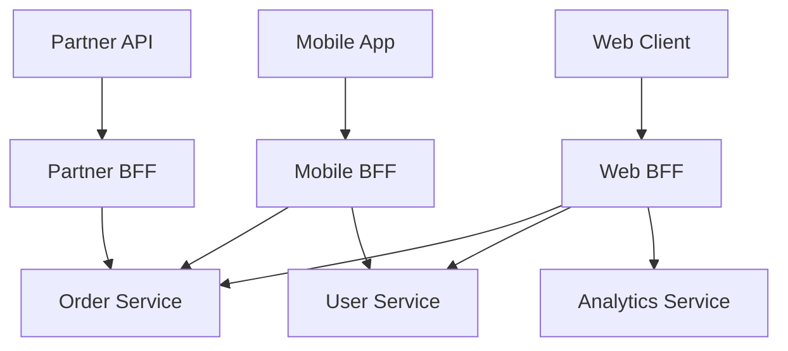

# API Gateway Patterns

## Why This Exists

In a monolith, the API is one application — routing, authentication, rate limiting, and business logic all live together. When you decompose into microservices, clients suddenly need to know about 10, 50, or 200 services: their addresses, their protocols, their authentication schemes, their rate limits. A mobile app making 15 API calls at startup shouldn't need to manage 15 different hostnames and auth flows.

An API gateway is the single entry point that sits between clients and your backend services. It handles cross-cutting concerns — routing, auth, rate limiting, protocol translation, monitoring — in one place, so individual services don't each have to implement them, and clients don't have to know about your internal architecture.

But gateways can also become a bottleneck, a single point of failure, and an organizational chokepoint. The decision isn't just "should we have a gateway?" but "what should the gateway do, and what should it leave to services?"

## Mental Model

A hotel concierge desk. Guests (clients) don't wander the building looking for housekeeping, room service, and the spa. They go to the concierge, who knows where everything is, checks that they're legitimate guests, and routes their requests to the right department. The concierge handles common concerns (guest verification, directions, language translation) so each department doesn't have to.

The danger: if you put the concierge in charge of *too much* — menu design, room pricing, event planning — they become a bottleneck that slows everything down.

## How It Works

### Core Gateway Responsibilities

**Request routing**: The gateway maps external URLs to internal services. `api.example.com/orders/*` → order-service, `api.example.com/users/*` → user-service. This decouples the external API shape from internal service boundaries — you can restructure services without changing client URLs.

**Authentication and authorization offload**: The gateway validates tokens (JWT verification, OAuth2 token introspection), extracts user identity, and passes it to downstream services as a trusted header. Services don't need to implement auth logic; they trust the gateway's attestation. See [[Authentication and Authorization]].

This is one of the gateway's highest-value functions. Without it, every service reimplements token validation, and a security fix (rotating signing keys, patching a JWT library vulnerability) requires updating 50 services instead of one.

**Rate limiting**: Global and per-consumer rate limiting at the edge, before requests reach backend services. See [[Rate Limiting and Throttling]].

**Request/response transformation**: Protocol translation (REST externally, gRPC internally), header manipulation, response filtering (strip internal fields before returning to external clients), request enrichment (add correlation IDs, geolocation headers).

**TLS termination**: Centralized certificate management. Clients connect to the gateway over TLS; the gateway communicates with internal services over mTLS or plaintext within the VPC.

**Observability**: Centralized access logging, request tracing injection (add trace IDs for distributed tracing), latency metrics per route. The gateway is the ideal point to capture north-south traffic metrics.

### The Backend for Frontend Pattern (BFF)

A single generic gateway serving web, mobile, and third-party clients often becomes a mess. Different clients need different response shapes, different fields, different aggregation logic. The web dashboard needs a rich user profile with activity history; the mobile app needs a minimal profile with just name and avatar.

The BFF pattern creates a dedicated gateway (or gateway layer) per client type:



Each BFF is owned by the team that owns the client. The web team's BFF aggregates and shapes data for the web dashboard. The mobile team's BFF returns minimal payloads optimized for mobile bandwidth and latency.

**BFF trade-offs**:
- Pro: Each client gets exactly the API it needs. Client teams can move independently.
- Pro: Aggregation logic (calling 3 services and stitching the response) lives in the BFF, not in the client.
- Con: Multiple BFFs may duplicate logic. If all three BFFs need to call the order service and transform the response, that's three implementations of the same transform.
- Con: More services to deploy, monitor, and maintain.

**BFF vs GraphQL Federation**: GraphQL Federation ([[gRPC vs REST vs GraphQL]]) solves a similar problem differently — instead of per-client gateways, you have a single graph that clients query selectively. The two approaches can coexist: BFF per client type, with each BFF using GraphQL to query backend subgraphs.

### Gateway vs Service Mesh

This distinction confuses many teams:

**API gateway**: Handles **north-south** traffic (external clients → internal services). Focuses on external concerns: public auth, rate limiting, API versioning, protocol translation.

**Service mesh** (Envoy, Istio, Linkerd): Handles **east-west** traffic (service → service). Focuses on internal concerns: mTLS, retries, circuit breaking, observability between services. See [[Kubernetes and Platform Engineering]].

They're complementary, not competing. A request hits the API gateway first (north-south), then traverses the service mesh (east-west). Some tools blur the line — Envoy can function as both a gateway and a service mesh data plane.

### Thin vs Thick Gateways

The most consequential design decision is how much logic the gateway owns:

**Thin gateway**: Routes requests, terminates TLS, validates tokens, rate limits. No business logic. A thin gateway is operationally simple and rarely blocks development teams.

**Thick gateway**: Adds response aggregation, request orchestration (call service A, then use the result to call service B), transformation logic, caching. A thick gateway starts to look like a BFF or even a monolith.

**The gravitational pull toward thick gateways**: It's tempting to add "just one more feature" to the gateway. Response caching, request validation, A/B test routing, user segmentation. Before long, every change requires a gateway deploy, and the gateway team becomes a bottleneck for every other team. This is the **gateway anti-pattern**: the gateway becomes a monolith reborn.

**Guidance**: Keep the gateway thin. If you need client-specific aggregation, use BFFs. If you need request orchestration, put it in a dedicated orchestration service. The gateway should handle infrastructure concerns (auth, rate limiting, routing, TLS, observability), not business logic.

## Trade-Off Analysis

| Approach | Complexity | Team Coupling | Best For |
|----------|-----------|---------------|----------|
| No gateway (direct client-to-service) | Low initially | None | Small systems with few services |
| Single thin gateway | Low-medium | Low (infra team owns) | Most systems; handles cross-cutting concerns |
| Single thick gateway | Medium-high | High (gateway team bottleneck) | Avoid this pattern |
| BFF per client type | Medium | Low (each team owns their BFF) | Multiple distinct client types |
| GraphQL Federation gateway | High | Medium | Large organizations with many services and diverse clients |

### Popular Gateway Implementations

| Gateway | Type | Strengths | Considerations |
|---------|------|-----------|----------------|
| AWS API Gateway | Managed | Zero ops, native AWS integration, built-in auth/throttling | Latency overhead, cost at high volume, limited customization |
| Kong | Self-hosted / cloud | Plugin ecosystem, Lua extensibility, declarative config | Operational overhead, plugin quality varies |
| Envoy | Self-hosted | High performance, gRPC-native, service mesh + gateway | Complex configuration (xDS), steep learning curve |
| Nginx | Self-hosted | Proven, fast, extensive community | Limited dynamic config without Nginx Plus, less API-native |
| Traefik | Self-hosted | Auto-discovery (Docker, K8s), Let's Encrypt integration | Less mature plugin ecosystem |
| GraphQL Gateway (Apollo Router) | Self-hosted / cloud | Federation-native, query planning, subgraph composition | GraphQL-specific, Rust-based (fast but harder to extend) |

## Failure Modes

- **Gateway as SPOF**: The gateway handles 100% of external traffic. If it goes down, everything goes down. Mitigation: redundant instances behind a load balancer (or use a managed gateway), health checks, auto-scaling, graceful degradation (serve cached responses if backends are down).

- **Gateway latency tax**: Every request pays the gateway's processing overhead (TLS termination, auth check, rate limit check, routing). At p50 this is 1–5ms; at p99 under load it can spike to 50–100ms. Mitigation: keep the gateway thin, avoid synchronous external calls in the gateway path, pre-warm auth caches.

- **Gateway team bottleneck**: Every team needs a new route, a new rate limit, a new auth rule. If all gateway config changes require the gateway team, development velocity tanks. Mitigation: self-service route registration (declarative config in each service's repo, GitOps-driven), API-driven gateway configuration.

- **Configuration drift**: The gateway's routing table says `/orders` → order-service-v2, but order-service-v2 was decommissioned last week. Requests fail. Mitigation: service discovery integration (the gateway automatically discovers backends from Consul, Kubernetes, etc.), health check → automatic removal, GitOps with drift detection.

## Architecture Diagram

```mermaid
graph TD
    subgraph "External Traffic"
        Client[Mobile / Web] -->|HTTPS| Gateway[API Gateway / Envoy]
    end

    subgraph "Gateway Cross-Cutting Concerns"
        Gateway --> Auth[JWT Auth Service]
        Gateway --> RL[Redis Rate Limiter]
        Gateway --> Logger[ELK / Datadog]
    end

    subgraph "Internal Microservices (Mesh)"
        Gateway -->|gRPC| Users[User Service]
        Gateway -->|gRPC| Orders[Order Service]
        Gateway -->|gRPC| Payments[Payment Service]
    end

    style Gateway fill:var(--surface),stroke:var(--accent),stroke-width:2px;
    style Users fill:var(--surface),stroke:var(--border),stroke-width:1px;
```

## Back-of-the-Envelope Heuristics

- **Gateway Latency Overhead**: A thin gateway (Envoy/Nginx) adds **1ms - 5ms**. A thick gateway (aggregating 3+ services) adds **20ms - 100ms+**.
- **Auth Cache TTL**: Cache validated JWTs for **~60 seconds** to avoid hitting the Auth Service on every single request.
- **Fan-out Limit**: Avoid more than **3-5 parallel service calls** from a single gateway request to prevent thread pool exhaustion and high tail latency.
- **Payload Transformation**: Converting JSON to Protobuf at the gateway consumes **~5-10% CPU overhead** per request.

## Real-World Case Studies

- **Netflix (Zuul to Envoy)**: Netflix famously built Zuul as their edge gateway to handle billions of requests per day. They later transitioned to Zuul 2 (asynchronous/non-blocking) and eventually integrated Envoy to handle the complex routing and resiliency needs of their global streaming infrastructure.
- **Amazon (AWS API Gateway)**: AWS uses its own managed API Gateway to power thousands of public APIs. It provides a "zero-ops" experience but is often criticized for its higher latency compared to a self-hosted Envoy/Nginx setup, demonstrating the classic "ease-of-use vs performance" trade-off.
- **SoundCloud (BFF Pattern)**: SoundCloud was an early pioneer of the "Backend for Frontend" (BFF) pattern. They moved away from a single monolithic gateway to dedicated gateways for iOS, Android, and Web, allowing each team to optimize their specific API responses independently.

## Connections

- [[Load Balancing Fundamentals]] — The gateway is effectively an L7 load balancer with extra capabilities
- [[Rate Limiting and Throttling]] — Rate limiting is a core gateway responsibility
- [[gRPC vs REST vs GraphQL]] — The gateway often translates between external (REST/GraphQL) and internal (gRPC) protocols
- [[API Versioning and Compatibility]] — The gateway can handle version routing (route /v1/* to old service, /v2/* to new)
- [[RESTful Design Principles]] — The gateway shapes the external API surface
- [[Authentication and Authorization]] — Auth offloading is one of the gateway's highest-value functions
- [[Service Decomposition and Bounded Contexts]] — Gateway structure should reflect domain boundaries, not mirror every internal service
- [[Kubernetes and Platform Engineering]] — Gateway handles north-south; service mesh handles east-west

## Reflection Prompts

1. Your company has 30 microservices and a single API gateway. Three product teams have asked for custom response aggregation logic in the gateway for their respective mobile features. The gateway team is becoming a bottleneck. How do you restructure?

2. You're migrating from a monolith to microservices using the strangler fig pattern. The gateway plays a key role — routing some paths to the new services and others to the legacy monolith. What are the risks of this approach, and how do you manage the routing table as the migration progresses?

## Canonical Sources

- *Building Microservices* by Sam Newman (2nd ed) — Chapter 5: "Interprocess Communication" and Chapter 15 on API gateways and BFF pattern
- *Microservices Patterns* by Chris Richardson — Chapter 8: "API Gateway Pattern" with detailed implementation guidance
- Netflix Tech Blog, "Zuul 2: The Netflix Journey to Asynchronous, Non-Blocking Systems" — evolution of Netflix's API gateway at scale
- Envoy proxy documentation — the most comprehensive reference for modern L7 proxy/gateway architecture