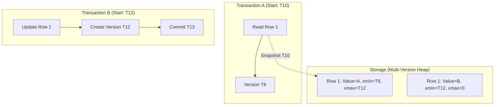

# MVCC Deep Dive

## Why This Exists

Databases serve many clients simultaneously. Without concurrency control, two transactions modifying the same row can corrupt data, and a transaction reading while another writes can see half-finished changes. The simplest solution — lock every row you touch — works, but serializes access: readers block writers and writers block readers. Throughput collapses under load.

MVCC (Multi-Version Concurrency Control) solves this by keeping **multiple versions** of each row. Readers see a consistent snapshot of the data as it existed at a point in time, without blocking writers. Writers create new versions rather than modifying existing ones in place. Each transaction operates on its own "view" of the database, isolated from concurrent changes.

The result: **readers never block writers, and writers never block readers.** This is the concurrency model that makes modern OLTP databases practical. But the way each database implements MVCC varies significantly, with real consequences for performance, storage, and behavior.

## Mental Model

A Google Doc with version history. Multiple people edit the document simultaneously, but each person sees a consistent version. When you open the doc, you get a snapshot — other people's edits don't appear mid-sentence. Their changes become visible when they're committed and you refresh your view. The document keeps old versions around so that readers can see a consistent point-in-time view.

The difference from a real Google Doc: in MVCC, each transaction sees the database as it was when the transaction started (or when its statement started, depending on isolation level). Other transactions' committed changes are invisible until your transaction starts a new snapshot.

## How It Works: Three Implementations Compared

### PostgreSQL MVCC

Postgres stores multiple versions of every row directly in the main heap table. Each row version (tuple) has:

- **xmin**: The transaction ID that created this version
- **xmax**: The transaction ID that deleted/updated this version (0 if still active)
- **Visibility flags**: Track whether xmin/xmax transactions have committed

**How a read works**: The query executor checks each tuple's xmin and xmax against the current snapshot (a list of transaction IDs that were active when the snapshot was taken). A tuple is visible if:
- xmin is committed AND xmin is not in the snapshot's "active transactions" list
- AND xmax is either 0, not committed, or in the active transactions list

**How a write works**: An UPDATE doesn't modify the existing row. Instead, it creates a *new tuple* with the updated values (new xmin = current transaction), and sets xmax on the old tuple to the current transaction. Both versions coexist in the heap. DELETE just sets xmax.

**The consequence — bloat and VACUUM**: Old row versions accumulate in the heap. A row updated 100 times has 100 dead tuples consuming space. Postgres requires a background process called **VACUUM** to reclaim this space. If VACUUM falls behind (common under heavy write loads), table size grows unboundedly — this is "table bloat," one of the most common Postgres production issues.

**VACUUM also prevents transaction ID wraparound**: Postgres uses 32-bit transaction IDs (~4 billion). When the counter wraps around, the database must have vacuumed all old transactions to prevent "is this transaction in the past or the future?" ambiguity. Failure to vacuum before wraparound causes the database to shut down entirely to prevent data corruption. This is a well-known Postgres hazard.

### MySQL/InnoDB MVCC

InnoDB stores the current version of each row in the primary index (clustered B-tree, ordered by primary key). Old versions are kept in a separate **undo log** (also called the rollback segment).

**How it works**: Each row has a hidden 6-byte transaction ID and a 7-byte roll pointer. The roll pointer chains to the previous version in the undo log. To read an old version, InnoDB follows the chain until it finds a version visible to the current transaction's snapshot.

**Advantages over Postgres**: The main table always contains only the current version — no bloat from dead tuples. Old versions in the undo log are naturally cleaned up (the purge thread removes undo records that no active transaction needs).

**Disadvantages**: Reading old versions requires following the undo chain, which can be slow for long-running transactions (the chain gets long). Also, since the clustered index contains only the current version, secondary indexes can point to a row version that's invisible to the current transaction — InnoDB must follow the primary key lookup and then walk the undo chain to find the right version.

### Google Spanner MVCC

Spanner uses MVCC with **true timestamps** from TrueTime (GPS + atomic clock-synchronized timestamps with bounded uncertainty). Each data version is tagged with a commit timestamp, not a transaction ID.

**How it works**: A read at timestamp T sees all data versions with commit timestamps ≤ T. Spanner can serve reads at any historical timestamp (within a retention window), making it trivial to implement consistent point-in-time reads across a globally distributed database.

**External consistency**: Spanner provides a guarantee stronger than serializable: if transaction T1 commits before T2 starts (in real wall-clock time), T2 is guaranteed to see T1's effects. This is possible because TrueTime's bounded uncertainty allows Spanner to order transactions by real time, not just logical time.

**The cost**: TrueTime requires specialized hardware (GPS receivers, atomic clocks). Commit latency includes a wait period equal to the clock uncertainty interval (typically ~7ms). CockroachDB approximates this with hybrid logical clocks (HLCs) — no special hardware, but weaker guarantees (no external consistency, only serializable isolation).

### Comparison Table

| Dimension | PostgreSQL | MySQL/InnoDB | Spanner |
|-----------|-----------|--------------|---------|
| Version storage | In heap table (inline) | Undo log (separate) | Versioned storage with timestamps |
| Bloat / cleanup | VACUUM required | Purge thread (automatic) | Automatic (version retention window) |
| Old version read cost | Direct (versions are in the heap) | Chain walk (undo log traversal) | Efficient (timestamped versions) |
| Transaction ID size | 32-bit (wraparound risk) | 64-bit | Timestamps (no wraparound) |
| Max isolation level | Serializable (SSI) | Repeatable Read (default), Serializable (via locking) | External consistency (linearizable) |
| Distribution | Single-node (logical replication for multi-node) | Single-node (Group Replication for multi-node) | Globally distributed (native) |

## Isolation Levels and MVCC

MVCC enables multiple isolation levels by controlling *which snapshot* a transaction sees:

**Read Committed** (Postgres default): Each *statement* within a transaction gets a fresh snapshot. You see other transactions' commits between your statements. Two identical SELECT queries in the same transaction can return different results if someone committed between them.

**Repeatable Read / Snapshot Isolation** (InnoDB default): The transaction gets one snapshot at start. All reads within the transaction see the same consistent state. Other transactions' commits are invisible for the transaction's lifetime.

**Serializable**: Transactions appear to execute one at a time. Postgres achieves this via **Serializable Snapshot Isolation (SSI)** — it runs under snapshot isolation but detects serialization conflicts (read-write dependencies that could lead to anomalies) and aborts one of the conflicting transactions. InnoDB's serializable mode uses locking (SELECT becomes SELECT ... FOR SHARE), which is simpler but blocks readers.

**The write skew anomaly**: Snapshot isolation prevents most anomalies but allows **write skew**: two transactions read overlapping data, each make a decision based on what they read, and both write — but the combination violates an invariant. Classic example: two doctors check the on-call schedule, both see two doctors on call, both decide it's safe to remove themselves — now zero doctors are on call. SSI (Postgres serializable) detects and prevents this. Standard snapshot isolation does not.

## Trade-Off Analysis

| Implementation | Write Amplification | Read Performance | GC Overhead | Best For |
|---------------|--------------------|--------------------|-------------|----------|
| PostgreSQL (heap + VACUUM) | High — full row copy on UPDATE | Fast reads, but heap bloat degrades over time | Significant — autovacuum must keep up | OLTP with read-heavy workloads, complex queries |
| MySQL/InnoDB (undo log + in-place) | Lower — only changed fields in undo log | Reconstructs old versions on read (undo traversal) | Moderate — purge thread cleans undo | Write-heavy OLTP, mixed read/write workloads |
| Oracle (undo tablespace) | Similar to InnoDB | Snapshot too old errors under extreme load | Moderate | Enterprise OLTP, long-running reporting |
| CockroachDB/Spanner (intent + MVCC) | Low — intent keys + versioned KV | Good — timestamp-based reads | Distributed GC, more complex | Globally distributed OLTP |
| Append-only (Datomic, LMDB) | None — never overwrites | Excellent — no reconstruction needed | Storage grows forever without compaction | Audit logs, event sourcing, immutable data |

**The GC problem is universal**: Every MVCC implementation accumulates old versions. The question is where the garbage lives (heap tuples, undo logs, version chains) and how it's cleaned up. Long-running transactions are the enemy of every approach — they pin old versions, preventing cleanup, which eventually degrades performance for everyone.

## Quantifying MVCC Costs

The trade-off table above labels PostgreSQL as "High write amplification" and MySQL as "Moderate GC overhead," but those labels are too vague to act on. Here are the numbers a developer needs to reason about when to intervene.

**PostgreSQL dead tuple accumulation.** Every UPDATE in Postgres creates a new tuple of approximately 23 bytes of header plus the full row copy. For a 200-byte row updated 10 times per second, dead tuples accumulate at `10 × 223 bytes = 2.23 KB/sec` per hot row. A table with 1,000 hot rows at this rate accumulates roughly 2.23 MB/sec of dead tuples — 8 GB/hour. Default autovacuum (with `autovacuum_vacuum_cost_delay = 2ms`) processes approximately 20 MB/sec of dead pages before throttling. At steady state, autovacuum barely keeps up. A 3× traffic spike — a marketing event, a batch job — causes autovacuum to fall behind, and the backlog may take hours to process after the spike ends. Monitor `pg_stat_user_tables.n_dead_tup` and alert when it exceeds 20% of `n_live_tup` for any table receiving heavy writes.

**InnoDB undo log chain length.** In MySQL/InnoDB, the undo log grows proportionally to the number of uncommitted or recently-committed transactions and the age of the oldest active transaction. The key metric is `Innodb_history_list_length` (visible in `SHOW ENGINE INNODB STATUS`). A healthy value is under 1,000. At 10,000, read performance begins to degrade: InnoDB must traverse the undo chain to find each row's visible version, and a chain of 10,000 entries adds ~100μs per row read. At 100,000+, the database is in distress — a query returning 100,000 rows that requires undo chain traversal can slow from 100ms to over 100 seconds. Long-running transactions (analytics queries, slow migrations, forgotten idle connections) are the primary culprit — they hold the undo log open, preventing the purge thread from cleaning entries that every subsequent transaction must skip over.

**Autovacuum tuning for bloated tables.** When a specific table has accumulated significant bloat, the standard approach is to run aggressive vacuum on that table without disrupting the rest of the database: `ALTER TABLE bloated_table SET (autovacuum_vacuum_cost_delay = 0)`. This runs vacuum at full I/O speed for that table only, clearing the backlog. Revert with `ALTER TABLE bloated_table RESET (autovacuum_vacuum_cost_delay)` once clean. The global autovacuum settings should remain conservative to avoid starving other I/O. Do not disable autovacuum globally to reclaim I/O headroom — the resulting transaction ID wraparound risk (described in Failure Modes) is a database-shutdown-level incident.

## Failure Modes

**PostgreSQL table bloat from long transactions**: A long-running analytics query holds a snapshot, preventing VACUUM from cleaning dead tuples created by concurrent updates. The table grows unbounded — a 10GB table can bloat to 50GB+. Index scans slow down as they traverse dead tuples. Solution: set `idle_in_transaction_session_timeout`, run analytics queries on read replicas, use `pg_repack` for emergency de-bloat.

**Snapshot too old (Oracle/CockroachDB)**: A long-running transaction tries to read a version that's already been garbage-collected. The transaction fails with "snapshot too old" or must restart. Solution: increase undo retention (Oracle) or GC threshold (CockroachDB), or break long-running queries into smaller time windows.

**Write skew under snapshot isolation**: Two transactions read the same data, make decisions based on that data, then write non-conflicting rows. Neither sees the other's write. Example: two doctors both read "1 doctor on call," both decide to go off call, leaving zero. Snapshot isolation doesn't prevent this. Solution: use serializable isolation, or add explicit locking (`SELECT FOR UPDATE`) on the rows that must be checked.

**MVCC read amplification with many versions**: A hot row updated thousands of times per second accumulates version chains. Reading that row requires traversing the chain (InnoDB) or scanning dead tuples (PostgreSQL) to find the visible version. Latency spikes for reads of frequently updated rows. Solution: reduce update frequency (batch updates), or in InnoDB, ensure purge threads keep up with version chain growth.

**Transaction ID wraparound (PostgreSQL)**: PostgreSQL uses 32-bit transaction IDs that wrap around after ~4 billion transactions. If VACUUM doesn't freeze old tuples before wraparound, the database shuts down to prevent data corruption. Solution: monitor `age(datfrozenxid)`, ensure autovacuum runs aggressively on high-transaction databases, and set up alerting well before the wraparound threshold.

## Architecture Diagram

## Back-of-the-Envelope Heuristics

- **Row Overhead**: In Postgres, each row version (tuple) adds **~23 bytes** of metadata (`xmin`, `xmax`, etc.). In InnoDB, it's **~13 bytes**.
- **VACUUM Frequency**: On a write-heavy Postgres DB, `autovacuum` should be triggered when dead tuples reach **~10-20%** of the table.
- **Undo Log Size**: In MySQL, the undo log can grow to **2x-5x** the size of the actual data during a long-running transaction with heavy concurrent updates.
- **Transaction ID Limit**: 32-bit IDs (Postgres) wrap around at **~4 billion**. At 10k TPS, you'll wrap in **~4.6 days**.

## Real-World Case Studies

- **PostgreSQL (The VACUUM Problem)**: Postgres stores versions "inline" in the main table. This leads to **bloat**. In 2016, Uber famously switched from Postgres to MySQL, citing Postgres's MVCC implementation (and the resulting write amplification and VACUUM issues) as a primary reason for their scaling difficulties with high-update workloads.
- **MySQL/InnoDB (Undo Logs)**: InnoDB keeps only the current version in the B-tree and moves old versions to an **Undo Log**. This prevents table bloat but makes long-running reads slower, as they must "reconstruct" the old version by following a chain of undo pointers.
- **Google Spanner (TrueTime)**: Spanner uses atomic clocks and GPS to provide **TrueTime**, allowing it to assign globally synchronized timestamps to every version. This enables "External Consistency" (the strongest possible isolation) across continents, which is impossible with standard logical clocks or transaction IDs.

## Connections

- [[B-Tree vs LSM-Tree]] — MVCC interacts with the storage engine: B-trees update pages in place (with undo for old versions); LSM-trees naturally store multiple versions (different SSTables at different levels)
- [[Write-Ahead Log]] — WAL records include transaction IDs that MVCC uses for visibility decisions
- [[Buffer Pool and Page Cache]] — MVCC version lookups happen in the buffer pool; undo log traversal requires buffer pool pages
- [[Consistency Spectrum]] — MVCC isolation levels correspond to consistency models (snapshot isolation ≈ causal consistency for a single node)
- [[Two-Phase Commit]] — Spanner's MVCC extends to distributed transactions via TrueTime; CockroachDB uses HLCs
- [[NewSQL and Globally Distributed Databases]] — Spanner and CockroachDB's MVCC designs are central to their distributed consistency guarantees

## Reflection Prompts

1. Your Postgres database has a table with 10 million rows. A reporting query runs for 30 minutes. During those 30 minutes, an ETL job updates 2 million rows. What happens to the table's physical size? What MVCC behavior is responsible, and what Postgres maintenance operation addresses it?

2. Two transactions concurrently check available inventory for the same product (both see 1 unit). Both place an order. Under Snapshot Isolation (Repeatable Read in InnoDB), both succeed — but you've oversold. Under Postgres Serializable (SSI), one is aborted. Why does SSI catch this and Snapshot Isolation doesn't? What's the application-level workaround if you're stuck on Snapshot Isolation?

## Canonical Sources

- *Database Internals* by Alex Petrov — Chapter 13: "Transaction Processing" covers MVCC implementations across engines
- *Designing Data-Intensive Applications* by Martin Kleppmann — Chapter 7: "Transactions" covers snapshot isolation, write skew, and SSI
- Postgres documentation, "Chapter 13: Concurrency Control" — the authoritative reference for Postgres MVCC
- Corbett et al., "Spanner: Google's Globally-Distributed Database" (2012) — Spanner's TrueTime-based MVCC
- Cahill, Röhm, & Fekete, "Serializable Isolation for Snapshot Databases" (2008) — the SSI paper that Postgres implements