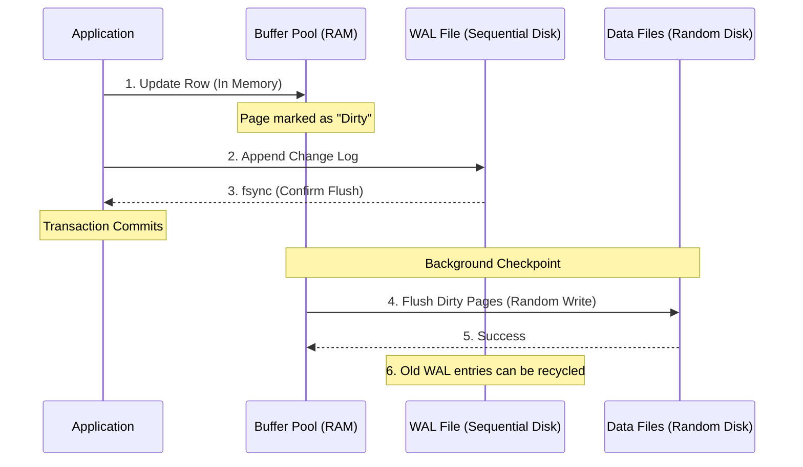

# Write-Ahead Log

## Why This Exists

Databases promise durability — once a transaction commits, the data survives crashes, power failures, and reboots. But writing data directly to its final location on disk (the B-tree pages or SSTable files) for every transaction would be impossibly slow. A single row update might require modifying an index page, the heap page, and a secondary index — three random I/O operations.

The WAL solves this with a deceptively simple rule: **before modifying any data page on disk, first write a description of the change to a sequential log.** Sequential writes are fast (append-only, no seeking). If the system crashes before the data pages are updated, the WAL contains enough information to redo the changes on recovery.

This is the fundamental durability mechanism in virtually every database. Postgres calls it the WAL. MySQL/InnoDB calls it the redo log. SQL Server calls it the transaction log. The principle is identical.

## Mental Model

You're an accountant using a paper ledger. The ledger (data pages) is thick and organized by account. Writing directly in the ledger for every transaction is slow — you have to find the right page, erase the old balance, and write the new one.

Instead, you keep a journal (the WAL). Every transaction is first recorded in the journal: "Account 123: debit $50, credit Account 456: $50." The journal is append-only — you just write the next entry at the bottom. Fast. Later, at your leisure, you update the actual ledger pages to reflect the journal entries (this is the checkpoint).

If your office burns down (crash), you can reconstruct the ledger from the journal. You can't reconstruct the journal from the ledger — which is why the journal must be written *first*.

## How It Works

### The WAL Protocol

The core invariant: **a data page modification is never written to disk until the corresponding WAL record has been flushed to stable storage.** This is called the WAL protocol or write-ahead logging rule.

Transaction lifecycle:
1. Transaction begins
2. For each modification: write a WAL record describing the change (old value, new value, page ID, offset)
3. Modify the data page **in the buffer pool** (in memory — not on disk yet)
4. On COMMIT: flush all WAL records for this transaction to disk (`fsync` the WAL file). Return success to the client.
5. The modified data pages remain in the buffer pool as "dirty pages." They'll be written to disk later, during a checkpoint.

**The key insight**: At step 4, the data pages on disk are stale (they don't reflect the committed transaction). But the WAL on disk contains the full record of what changed. If the system crashes between step 4 and the next checkpoint, recovery replays the WAL to bring data pages up to date.

### Checkpoint Strategies

Dirty pages can't stay in the buffer pool forever — memory is finite, and recovery time grows with the amount of WAL to replay. **Checkpoints** periodically flush dirty pages to disk and record a WAL position (the checkpoint LSN — Log Sequence Number) indicating that all changes before this point are safely on disk.

**Full checkpoint** (simple, disruptive): Flush all dirty pages, then write a checkpoint record to the WAL. During the flush, all new writes are blocked or severely throttled. This causes a latency spike. Postgres historically used this approach.

**Fuzzy checkpoint** (incremental, production-friendly): Continuously flush dirty pages in the background. The checkpoint record notes which pages have been flushed up to which LSN. Recovery may need to replay a small window of WAL, but the checkpoint doesn't block normal operations. This is what modern systems use (Postgres now uses a background writer + checkpointer, InnoDB uses its adaptive flushing algorithm).

**The checkpoint frequency trade-off**:
- Frequent checkpoints: Shorter recovery time (less WAL to replay), less WAL storage needed, but more background I/O (flushing pages constantly).
- Infrequent checkpoints: Less background I/O, but longer recovery time and more WAL storage.

InnoDB's approach is adaptive: it monitors the redo log usage and the dirty page ratio, and increases flush rate as either approaches a threshold.

### WAL Record Structure

A WAL record typically contains:

- **LSN** (Log Sequence Number): Monotonically increasing identifier for the record's position in the log. Used for ordering and checkpoint tracking.
- **Transaction ID**: Which transaction produced this change.
- **Page ID**: Which data page was modified.
- **Before image** (optional): The page's state before the change. Needed for UNDO operations (rolling back aborted transactions).
- **After image** or **delta**: The change itself. Needed for REDO operations (replaying committed transactions during recovery).
- **Record type**: INSERT, UPDATE, DELETE, COMMIT, ABORT, CHECKPOINT, etc.

**Physical vs logical WAL records**: Physical records describe exact byte changes on specific pages ("set bytes 120–128 of page 42 to X"). Logical records describe higher-level operations ("insert row with key=123 and value=..."). Physical records are simpler to replay but larger and less portable. Postgres uses a mix (physical for data, logical for certain operations). Logical WAL records are the basis for logical replication (see [[Database Replication]]).

### WAL-Based Recovery (ARIES Algorithm)

When a database restarts after a crash, it runs a recovery protocol. The industry-standard approach is ARIES (Algorithm for Recovery and Isolation Exploiting Semantics), developed by IBM. Simplified:

**Phase 1 — Analysis**: Scan the WAL from the last checkpoint. Determine which transactions were in-flight at crash time and which data pages are dirty.

**Phase 2 — Redo**: Replay all WAL records from the checkpoint forward, bringing all data pages to the state they were in at the moment of crash. This restores both committed *and* uncommitted changes (because we need the pages to be in a consistent state before we can undo anything).

**Phase 3 — Undo**: For transactions that were active (not committed) at crash time, replay their changes in reverse using the before-images from the WAL. This rolls back uncommitted work.

After recovery, the database is in a consistent state: all committed transactions are reflected, all uncommitted transactions are rolled back.

### WAL Beyond Durability

The WAL has become a versatile building block:

**Replication**: Streaming the WAL to a replica is the simplest form of replication. The replica applies WAL records to maintain a copy of the primary. Postgres streaming replication works exactly this way. See [[Database Replication]].

**Point-in-time recovery (PITR)**: By archiving WAL segments, you can restore a database to any point in time — restore a base backup, then replay WAL up to the desired timestamp. Essential for recovering from "oops, someone dropped the production table."

**Change Data Capture (CDC)**: The WAL is a real-time log of every change. CDC systems (Debezium, for example) read the WAL and publish changes as events to Kafka or other streaming platforms. This enables event-driven architectures without modifying application code. See [[Change Data Capture]].

**Event sourcing parallel**: The WAL is conceptually similar to an [[Event Sourcing and CQRS]] event log — an append-only record of all state changes. The key difference: WAL records are physical (page-level) while event sourcing events are domain-level. But the principle — "the log is the source of truth, the current state is a derived view" — is the same. Jay Kreps' "The Log" essay makes this connection explicitly.

## Trade-Off Analysis

| Decision | Option A | Option B | Guidance |
|----------|----------|----------|----------|
| fsync on every commit | Yes (durable) | No (batch sync, e.g., every 200ms) | Yes for data you can't lose (financial). Batch sync for throughput when you can tolerate small data loss windows. Postgres: `synchronous_commit = off` gives ~3× throughput. |
| Checkpoint frequency | Every 5 min | Every 30 min | Frequent for fast recovery and bounded WAL size; infrequent for less I/O impact. Most systems auto-tune. |
| WAL compression | Enabled | Disabled | Compression reduces WAL size (good for replication bandwidth and archive storage) but adds CPU overhead. Usually worth it. |
| Full-page writes | Enabled (safe) | Disabled (faster) | Enabled prevents torn page corruption (partial page writes during crash). Postgres default is on; disabling is risky. |

## Failure Modes

- **WAL disk full**: If the WAL partition fills up, the database cannot write new WAL records and must stop accepting writes. This is a production emergency. Mitigation: monitor WAL partition usage, configure automatic WAL archival and cleanup, size the partition for your write volume.

- **Torn writes**: A crash during a page write can leave a page partially written (first 4KB is new, second 4KB is old). The WAL's before/after images can detect and repair this, but only if full-page writes are enabled (Postgres writes the entire page to WAL on the first modification after a checkpoint). Without this protection, you get silent data corruption.

- **Replication lag from WAL shipping**: Replicas that can't keep up with WAL production fall behind. If WAL segments are archived and recycled before the replica reads them, the replica becomes unrecoverable and must be rebuilt from scratch. Mitigation: WAL archival, replication slot management (Postgres replication slots prevent WAL recycling before a replica consumes it).

- **Recovery time explosion**: After a crash, the database replays all WAL since the last checkpoint. If checkpoints are infrequent and write volume is high, recovery can take tens of minutes. During this time, the database is unavailable. Mitigation: frequent checkpoints, monitor `recovery_target_timeline`, consider maxing out `checkpoint_completion_target`.

## Architecture Diagram

## Back-of-the-Envelope Heuristics

- **Write Speed**: Sequential WAL writes are **10x-50x faster** than random data page writes on HDDs, and **2x-5x faster** on SSDs.
- **Commit Latency**: With `fsync` on every commit, latency is bounded by **disk rotation/flash sync speed** (usually 1ms-10ms).
- **WAL Size**: A busy database can generate **10GB - 100GB of WAL per hour**. Plan your disk space accordingly.
- **Recovery Time**: Replaying WAL typically takes **~1 second per 100MB** of log data (highly dependent on the complexity of changes).

## Real-World Case Studies

- **PostgreSQL (WAL Shipping)**: Postgres uses the WAL as the primary mechanism for **Streaming Replication**. The primary node streams the WAL bytes directly to the replica, which "replays" them in real-time. This ensures the replica stays within milliseconds of the primary without any additional application logic.
- **MySQL (Redo vs Binlog)**: InnoDB has its own "Redo Log" (WAL) for internal crash recovery. MySQL also has a "Binary Log" (Binlog) for replication. This means every write is actually recorded **twice** (once in Redo, once in Binlog), a phenomenon known as "Double-Write Buffering" that ensures data integrity at the cost of some performance.
- **Apache Kafka (The WAL as a Service)**: Kafka is essentially a distributed WAL turned into a product. It takes the "append-only log" concept of a database and makes it the primary interface, allowing multiple consumers to "replay" the log independently at their own pace.

## Connections

- [[B-Tree vs LSM-Tree]] — Both use WAL for durability; LSM-trees' memtable is backed by WAL
- [[Buffer Pool and Page Cache]] — WAL enables the buffer pool to hold dirty pages in memory safely
- [[MVCC Deep Dive]] — Transaction isolation is tracked via WAL transaction IDs
- [[Database Replication]] — WAL shipping is the foundation of physical replication
- [[Event Sourcing and CQRS]] — Conceptual parallel: append-only log as the source of truth
- [[Change Data Capture]] — CDC reads the WAL to emit change events without application changes
- [[Resilience Patterns]] — WAL archival enables point-in-time recovery

## Reflection Prompts

1. A database with `synchronous_commit = on` achieves 5,000 TPS. Switching to `synchronous_commit = off` (WAL flushed every 200ms instead of every commit) increases throughput to 15,000 TPS. What data can you safely run with async commit, and what data absolutely requires synchronous commit? Where's the boundary?

2. Your Postgres primary generates 2GB of WAL per hour. Your replica is in a different region with 80ms latency. How does WAL shipping work in this scenario, and what's the expected replication lag? What happens to replication lag during a traffic spike that doubles WAL generation?

## Canonical Sources

- *Database Internals* by Alex Petrov — Chapter 3: "B-Tree Basics" and Chapter 8: "Log-Structured Storage" both cover WAL mechanics
- *Designing Data-Intensive Applications* by Martin Kleppmann — Chapter 3: "Storage and Retrieval" introduces WAL, and Chapter 7: "Transactions" covers crash recovery
- Mohan et al., "ARIES: A Transaction Recovery Method Supporting Fine-Granularity Locking and Partial Rollbacks Using Write-Ahead Logging" (1992) — the foundational ARIES paper
- Jay Kreps, "The Log: What every software engineer should know about real-time data's unifying abstraction" (2013) — the essay connecting WAL to event streaming and replication