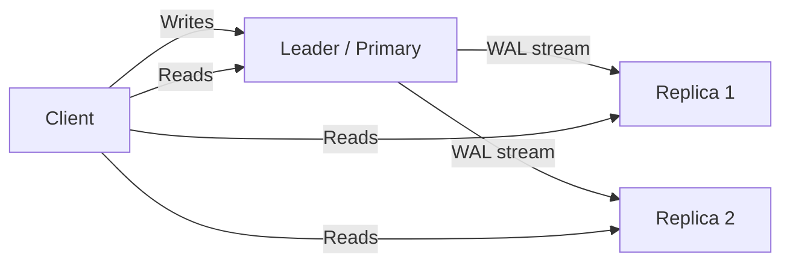

# Database Replication

## Why This Exists

A single database server is a single point of failure. The disk fails, the data is gone. The server crashes, the application is down. Even if nothing fails, a single server has finite read throughput — eventually, reads overwhelm it.

Replication copies data across multiple machines. It serves three purposes: **fault tolerance** (if one replica dies, others have the data), **read scalability** (spread read traffic across replicas), and **latency reduction** (place replicas close to users geographically). But replication introduces the hardest problem in distributed systems: keeping copies in sync while maintaining acceptable performance. The trade-offs here are where distributed systems theory meets engineering reality.

## Mental Model

A chain of newspapers. The **leader** (primary) is the main newsroom where articles are written. **Followers** (replicas) are regional printing presses that receive articles and reproduce them. There are three possible arrangements:

- **Single-leader**: One newsroom, many presses. All articles originate at the newsroom. Presses can only print, not write.
- **Multi-leader**: Multiple newsrooms in different cities. Each can write articles. They exchange articles to stay in sync — but what if two newsrooms write conflicting articles about the same story?
- **Leaderless**: No designated newsroom. Any press can write and read. Readers check multiple presses and take the most recent version.

## How It Works

### Single-Leader Replication

The most common topology. One node (the leader/primary) accepts all writes. It streams changes to followers (replicas/secondaries) via the [[Write-Ahead Log]] or a logical replication stream.



**Synchronous vs asynchronous replication**:

| Mode | How it works | Durability | Latency |
|------|-------------|------------|---------|
| Synchronous | Leader waits for replica ACK before confirming commit to client | Strong — committed data exists on 2+ nodes | Higher — every write pays replica latency |
| Asynchronous | Leader confirms immediately; replica catches up in background | Weaker — committed data may exist only on leader at crash time | Lower — writes don't wait for replica |
| Semi-synchronous | Wait for 1 of N replicas (Postgres: `synchronous_standby_names`) | Middle ground | Middle ground |

Asynchronous is the default for most deployments. Synchronous replication adds latency to every write (leader → replica round-trip), and if the synchronous replica goes down, the leader can't accept writes until it recovers (or you failover). Semi-synchronous is the practical compromise: wait for at least one replica, tolerate the rest being async.

**Replication lag**: With async replication, replicas are always behind the leader by some time (milliseconds to seconds, sometimes minutes under load). This means a write to the leader may not be immediately visible on replicas. This is eventual consistency at the database level — and it creates real application problems:

- **Read-after-write inconsistency**: User updates their profile (write goes to leader), then reloads the page (read goes to a stale replica). They see the old profile. Jarring.
- **Monotonic read violations**: Two consecutive reads go to different replicas at different lag points. The second read shows *older* data than the first. Time appears to go backward.
- **Stale reads in replicated transactions**: A service writes to the leader, then calls another service that reads from a replica. The second service sees stale data.

**Mitigations**: Read from the leader for recently-written data (route by session), use `pg_last_xact_replay_timestamp()` to check replica freshness, or accept the lag and design the application around eventual consistency. These are covered in depth in [[Consistency Spectrum]].

**Failover**: When the leader fails, a replica must be promoted. This involves detecting the failure (heartbeat timeout), choosing the most up-to-date replica, reconfiguring clients to write to the new leader, and catching up other replicas. Automated failover (Patroni for Postgres, MySQL Group Replication, RDS Multi-AZ) handles this but is notoriously tricky:

- **Split-brain**: Both old and new leaders accept writes simultaneously. Data diverges. Prevention: fencing (STONITH — "Shoot The Other Node In The Head"), or consensus-based leader election (Patroni uses etcd/ZooKeeper).
- **Data loss during async failover**: The promoted replica may be missing recent writes that the failed leader had accepted but not yet replicated. Those writes are lost. This is the price of async replication.

### Multi-Leader Replication

Multiple nodes accept writes. Each leader replicates to the others. Used for multi-datacenter setups (one leader per datacenter) and collaborative editing.

**When it makes sense**: Multi-region deployments where writes must be low-latency in every region. If your users are in US-East and EU-West, a single leader in US-East means EU writes pay ~150ms cross-Atlantic latency. A leader in each region eliminates this.

**The hard problem — write conflicts**: Two leaders modify the same row simultaneously. When changes are replicated, they conflict. Resolution strategies:

- **Last-write-wins (LWW)**: Use timestamps; the later write wins. Simple, but loses data (the earlier write is silently discarded). Timestamps can also be unreliable across data centers.
- **Merge/converge**: Application-specific logic merges the two values. Complex but lossless.
- **Conflict-free replicated data types (CRDTs)**: Data structures designed to merge without conflicts. See [[CRDTs]].
- **Custom resolution**: Flag the conflict and let the application (or user) resolve it. Google Docs shows both edits and lets users sort it out.

Multi-leader replication is covered in depth in [[Replication Deep Dive]].

### Leaderless Replication (Dynamo-Style)

No designated leader. Any node accepts reads and writes. The client sends writes to multiple nodes and reads from multiple nodes, using quorums to determine the "correct" value.

**Quorum model**: With N replicas, write to W nodes, read from R nodes. If `W + R > N`, read and write quorums overlap — at least one node in the read set has the latest write. Common configuration: N=3, W=2, R=2.

**Sloppy quorums and hinted handoff**: If a node in the quorum is unreachable, the write goes to a different node with a "hint" that it should be forwarded later. This improves availability at the cost of consistency — the hinted write might not be in the normal quorum.

**Anti-entropy and read repair**: To keep replicas converged, the system periodically compares data across replicas (anti-entropy process using Merkle trees). Additionally, on every read, if replicas return different versions, the client repairs the stale replicas by writing the latest version back.

**Used by**: Amazon DynamoDB, Apache Cassandra, ScyllaDB, Riak.

**Trade-offs**: Leaderless replication provides high availability and write scalability (any node accepts writes), but consistency is weaker (stale reads are possible even within a quorum, especially with sloppy quorums). There's no single source of truth — conflicts can occur and must be resolved.

## Trade-Off Analysis

| Dimension | Single-Leader | Multi-Leader | Leaderless |
|-----------|--------------|-------------|------------|
| Write endpoint | One node | One per datacenter | Any node |
| Conflict handling | No conflicts (single writer) | Conflict detection + resolution | Version vectors + resolution |
| Consistency | Strong (sync) or eventual (async) | Eventually consistent between leaders | Eventually consistent (tunable quorum) |
| Write latency | Low (local) to high (cross-region) | Low (local leader) | Low (local node) |
| Availability on leader failure | Downtime during failover | Other leaders continue | No single point of failure |
| Complexity | Low | High (conflict resolution) | Medium-high (quorum tuning, anti-entropy) |
| Typical use case | Most applications | Multi-region active-active | High-availability, write-heavy |

## Failure Modes

**Replication lag divergence**: Under sustained write pressure, async replicas fall behind. Applications reading from replicas see stale data — a user updates their profile but the next page load (from a replica) shows the old profile. Solution: route reads that need freshness to the primary, use causal consistency tokens, or implement read-your-writes at the proxy level (ProxySQL, PgBouncer with session pinning).

**Split-brain after network partition**: Both the primary and a replica believe they are the primary, accepting writes independently. When the partition heals, the two datasets have diverged irreconcilably. Solution: fencing (STONITH — "Shoot The Other Node In The Head"), quorum-based leader election (Raft), and write rejection if the primary can't reach a majority of replicas.

**Replication slot bloat (PostgreSQL)**: A logical replication slot that falls behind (consumer is down or slow) prevents WAL segments from being recycled. The WAL directory grows until it fills the disk, crashing the primary. Solution: set `max_slot_wal_keep_size` to cap WAL retention, alert on replication slot lag, and drop unused slots.

**Failover data loss with async replication**: The primary crashes with transactions committed locally but not yet replicated. The new primary (promoted replica) is missing these transactions. After failover, those writes are permanently lost. Solution: semi-synchronous replication (wait for at least one replica), or accept the data loss window and design the application to tolerate it (idempotent retry from clients).

**Circular replication conflicts (multi-leader)**: In multi-leader setups, an update replicates from A to B, then B's replication sends it back to A. Without origin tracking, the update loops forever. Or worse, two leaders apply conflicting updates and replicate them to each other. Solution: origin-based filtering (skip events from your own server ID), conflict resolution strategy (LWW, custom merge), and monitoring for replication loops.

## Architecture Diagram

```mermaid
graph TD
    subgraph "Primary Region (Leader)"
        App[App Instance] -->|Writes| Primary[(Primary DB)]
        Primary -->|1. WAL Stream| SyncReplica[(Sync Replica)]
        Primary -->|2. WAL Stream| AsyncReplica[(Async Replica)]
    end

    subgraph "Secondary Region (Follower)"
        AsyncReplica -->|3. Cross-Region Log| RemoteReplica[(Remote Replica)]
    end

    User[User] -->|Read| AsyncReplica
    User -->|Read| RemoteReplica
    
    style Primary fill:var(--surface),stroke:var(--accent),stroke-width:2px;
    style SyncReplica fill:var(--surface),stroke:var(--accent2),stroke-width:1px;
```

## Back-of-the-Envelope Heuristics

- **Replication Lag**: In-region async replication is typically **< 10ms**. Cross-region replication is limited by light speed, typically **50ms - 200ms**.
- **Sync Replication Penalty**: Every write pays the **RTT (Round Trip Time)** to the replica. For a cross-region sync replica, this can turn a 1ms local write into a **100ms+** write.
- **Failover Time**: Automatic failover (e.g., Patroni/RDS) typically takes **30s - 60s** to detect a failure and promote a new leader.
- **Read Scalability**: A single primary can often support **5-10 read replicas** before the overhead of shipping logs becomes a bottleneck on the primary's CPU/Network.

## Real-World Case Studies

- **GitHub (MySQL Orchstrator)**: GitHub uses **Orchestrator** to manage its massive MySQL fleet. It handles automated failover by detecting leader failure and re-routing replication topologies in seconds, ensuring that a single DB crash doesn't take down the entire site.
- **Uber (Postgres to MySQL Migration)**: Uber famously moved from Postgres to MySQL, partly because of how MySQL handles replication. MySQL's **Logical Replication** (Binlog) allowed them to replicate across different versions and perform zero-downtime upgrades more easily than Postgres's physical replication at the time.
- **Amazon (DynamoDB Leaderless)**: Amazon's DynamoDB uses leaderless, quorum-based replication across three Availability Zones. This allows it to survive the total loss of an entire data center with **zero downtime** and **zero data loss**, a level of availability that is extremely difficult to achieve with traditional leader-based databases.

## Connections

- [[Write-Ahead Log]] — WAL shipping is the mechanism behind physical replication
- [[Consistency Spectrum]] — Replication topology determines what consistency guarantees are achievable
- [[Partitioning and Sharding]] — Replication and partitioning are orthogonal: you can replicate each partition independently
- [[NewSQL and Globally Distributed Databases]] — Spanner and CockroachDB use consensus-based replication (Raft per partition) for strong consistency
- [[Replication Deep Dive]] — Deep dive into multi-leader conflict resolution, CRDTs, and version vectors
- [[MVCC Deep Dive]] — Replicas run MVCC independently; snapshot isolation on a replica is against the replica's current state, not the leader's

## Reflection Prompts

1. Your Postgres primary is in US-East. You add a read replica in EU-West for European users. Replication lag is typically 200ms. A European user updates their email (write goes to US-East leader), then immediately views their profile (read goes to EU-West replica). They see the old email. How do you solve this without routing all their reads to the leader?

2. You're evaluating Cassandra (leaderless, quorum-based) vs Postgres with streaming replication (single-leader, async) for a write-heavy IoT ingestion pipeline. Both can handle the write throughput. What are the differences in failure behavior? What happens when a node goes down in each architecture?

## Canonical Sources

- *Designing Data-Intensive Applications* by Martin Kleppmann — Chapter 5: "Replication" is the definitive treatment of replication topologies, consistency, and failover
- *Database Internals* by Alex Petrov — Chapters 11–12 cover replication protocols and consistency
- DeCandia et al., "Dynamo: Amazon's Highly Available Key-Value Store" (2007) — the paper that defined leaderless replication patterns
- Postgres documentation, "Chapter 27: High Availability, Load Balancing, and Replication"