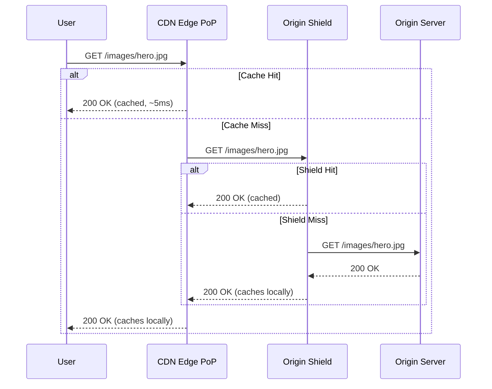

# CDN Architecture

## Why This Exists

Physics limits speed: light in fiber travels at ~200,000 km/s. A round-trip from New York to Singapore (~15,000 km) takes at least ~150ms. For a website loading 50 resources, each requiring a round-trip, that's 7.5 seconds of pure latency — before any server processing. For users in Singapore accessing a server in New York, your application feels slow no matter how fast your backend is.

CDNs solve this by caching content at **edge locations** worldwide — hundreds of points of presence (PoPs) distributed across major cities. When a user in Singapore requests an image, the CDN serves it from a Singapore PoP (5ms round-trip) instead of New York (150ms). The origin server is only contacted when the edge doesn't have the content.

CDNs also absorb traffic: a viral page that gets 10 million requests might generate only 1 request to your origin (the initial cache fill). The other 9,999,999 are served from edge cache. This is both a performance optimization and a cost optimization (reduced origin infrastructure and object storage egress).


## Mental Model

Imagine a chain of pizza restaurants. The original kitchen is in New York (origin server). If someone in Tokyo orders a pizza, shipping it from New York takes hours (high latency). So you open franchise kitchens in Tokyo, London, and São Paulo (edge servers). Each franchise keeps a stock of the most popular pizzas (cached content). When someone in Tokyo orders a pepperoni pizza, the local franchise serves it instantly. If they order something unusual that isn't in stock, the franchise calls New York, gets it, serves the customer, and keeps one in stock for the next person (cache fill). The franchises don't make the recipes — they just store and serve copies of what New York created.

## How It Works

### Request Flow



### Edge Caching

Each edge PoP maintains a local cache. Cache behavior is controlled by HTTP headers from the origin:

**`Cache-Control`**: The primary directive.
- `Cache-Control: public, max-age=86400` — Cache for 24 hours. Any cache (CDN, browser) can store it.
- `Cache-Control: private, max-age=3600` — Only the user's browser should cache this (not the CDN). Used for user-specific content.
- `Cache-Control: no-cache` — Cache it, but revalidate with the origin before serving (conditional request with `If-None-Match` or `If-Modified-Since`).
- `Cache-Control: no-store` — Don't cache at all. Used for sensitive data.
- `Cache-Control: s-maxage=3600` — Override for shared caches (CDNs). Different from `max-age` which applies to both browser and CDN.
- `Cache-Control: stale-while-revalidate=60` — Serve stale content while revalidating in the background. The user gets an instant response (possibly stale by up to 60 seconds), and the cache refreshes asynchronously.

**`ETag` / `If-None-Match`**: The CDN stores the ETag (a content hash). On revalidation, it sends `If-None-Match: "abc123"` to the origin. If the content hasn't changed, the origin returns `304 Not Modified` (no body) — the CDN serves its cached version. This saves bandwidth when content rarely changes but TTL has expired.

**`Vary`**: Tells the CDN to cache different versions based on request headers. `Vary: Accept-Encoding` means cache separate versions for gzip, br (Brotli), and uncompressed. `Vary: Accept-Language` caches per language. Be careful — `Vary: Cookie` effectively makes content uncacheable (every user has different cookies).

### Origin Shield

A middle layer between edge PoPs and the origin. When an edge PoP misses, instead of going directly to the origin, it goes to a shield PoP. If the shield has the content, it serves it — preventing the origin from being hit by multiple edges simultaneously.

**Why it matters**: Without a shield, a cache miss at 50 edge PoPs means 50 requests to the origin for the same object. With a shield, it's 1 request to the origin + 50 requests to the shield. This dramatically reduces origin load during cache fills and TTL expirations.

**Trade-off**: Adds an extra hop for shield misses (edge → shield → origin instead of edge → origin). The latency increase is small compared to the origin protection benefit.

### Purge Strategies

When content changes, you need to remove the old version from the CDN. This is cache purge (or invalidation).

**Purge by URL**: Invalidate a specific URL across all edge PoPs. Fast, precise. Most CDNs propagate purges globally within 1–5 seconds.

**Purge by tag/surrogate key**: Tag cached objects (e.g., `product:123`). Purge all objects with that tag. Useful when a product update should invalidate the product page, the category page, and the search results page — all tagged with `product:123`. Fastly and Cloudflare support this.

**Purge all**: Nuclear option. Invalidate everything. Causes a thundering herd at the origin as all edges refill simultaneously. Use sparingly.

**Cache busting via URL versioning**: Instead of purging, change the URL. `style.css?v=2` or `style.a1b2c3.css` (content hash in filename). The browser and CDN treat this as a new resource and fetch it fresh. The old version naturally expires. This is the most reliable invalidation method for static assets because it's atomic — the moment the HTML references the new URL, all users get the new version.

## What to Cache (and What Not To)

| Content Type | Cacheable? | TTL Guidance |
|-------------|-----------|-------------|
| Static assets (JS, CSS, images, fonts) | Always | Long (1 year with cache-busted URLs) |
| Public API responses (product catalog) | Usually | Medium (5 min – 1 hour, with purge on change) |
| Personalized content (user dashboard) | No (or at the edge with ESI/edge compute) | N/A |
| HTML pages | Depends (static pages yes, dynamic no) | Short (60s) with `stale-while-revalidate` |
| Authentication tokens / cookies | Never | `no-store` |
| GraphQL responses | Difficult (POST body varies) | Use persisted queries with GET, or skip CDN |

## Modern CDN Capabilities

CDNs have evolved beyond static caching:

**Edge compute** (Cloudflare Workers, Fastly Compute@Edge, AWS CloudFront Functions): Run JavaScript/Wasm at the edge. A/B testing, request routing, authentication, header manipulation, response transformation — all at the edge, before reaching the origin. See [[04-Phase-4-Modern-AI__Module-21-Serverless-Edge-Platform__Serverless_and_Edge_Computing]].

**Image optimization**: Resize, compress, and format-convert images at the edge. Serve WebP to browsers that support it, AVIF to those that support that, and JPEG as fallback. Cloudflare Images, Imgix, CloudFront Image Optimization.

**WAF (Web Application Firewall)**: Rate limiting, bot detection, DDoS protection, OWASP rule enforcement — all at the edge. Blocks malicious traffic before it reaches your infrastructure.

**Video streaming**: HLS/DASH segment caching, adaptive bitrate delivery, live stream edge caching.

## Trade-Off Analysis

| CDN Provider | Strengths | Considerations |
|-------------|-----------|----------------|
| Cloudflare | Huge PoP network, Workers edge compute, free tier, zero egress fees (R2) | Custom cache rules can be complex, less granular geo controls |
| Fastly | Instant purge (<150ms global), Compute@Edge (Wasm), VCL flexibility | Smaller PoP network, higher cost, steeper learning curve |
| AWS CloudFront | Tight AWS integration, Lambda@Edge/CloudFront Functions, global reach | Purge latency slightly higher, complex pricing |
| Akamai | Largest PoP network, enterprise features, edge compute | Expensive, complex configuration, legacy UI |

## Failure Modes

- **Cache poisoning**: An attacker manipulates a cacheable response (e.g., via a `Host` header injection) and the CDN caches the malicious version, serving it to all users. Mitigation: validate `Host` headers at the origin, configure `Vary` headers carefully, use cache key normalization.

- **Stale content after deploy**: You deploy a new version of your frontend. The CDN still serves the old JavaScript. Users get a broken experience (new HTML referencing functions that don't exist in the old JS). Mitigation: content-hash filenames for static assets (`main.a1b2c3.js`), purge cache on deploy, or `stale-while-revalidate` with short TTL.

- **Origin overload on cache miss storm**: CDN cache expires globally at the same time (all edges set the same TTL from the first request). All edges simultaneously request from origin. Mitigation: origin shield (absorbs the storm), `stale-while-revalidate`, jittered TTLs (add random seconds to TTL to desynchronize expiry across edges).

- **CORS and CDN caching conflict**: The CDN caches a response without CORS headers (from a same-origin request). A cross-origin request then gets the cached response without CORS headers and is blocked by the browser. Mitigation: include `Vary: Origin` so the CDN caches separate versions per requesting origin. Or set CORS headers on all responses regardless of the request origin.

## Architecture Diagram

```mermaid
graph TD
    User[Global Users] -->|DNS Anycast| Edge[CDN Edge PoP]
    
    subgraph "CDN Infrastructure"
        Edge -->|Cache Miss| Shield[Origin Shield / Mid-Tier Cache]
        Shield -->|Cache Miss| Origin[Origin Server / S3]
    end

    subgraph "Edge Features"
        Edge --> WAF[Web App Firewall]
        Edge --> Optimize[Image Optimization]
        Edge --> Serverless[Edge Workers / Logic]
    end

    style Edge fill:var(--surface),stroke:var(--accent),stroke-width:2px;
    style Shield fill:var(--surface),stroke:var(--accent2),stroke-dasharray: 5 5;
```

## Back-of-the-Envelope Heuristics

- **Latency Reduction**: Moving from a central origin (e.g., US-East) to a local Edge PoP typically reduces RTT from **150ms+** to **< 20ms**.
- **Cache Hit Ratio (CHR)**: For static assets, aim for **> 95%**. For dynamic API responses, **50-70%** is often acceptable.
- **Egress Savings**: CDNs typically charge **~50-70% less** for bandwidth than major cloud providers (AWS/GCP) charge for direct object storage egress.
- **Purge Propagation**: Modern CDNs (Fastly/Cloudflare) propagate cache purges globally in **< 300ms**.

## Real-World Case Studies

- **Netflix (Open Connect)**: Netflix doesn't use standard third-party CDNs for its video traffic. They built their own called **Open Connect**. They ship physical hardware appliances (filled with popular movies) directly to ISP data centers. This allows Netflix to serve **95% of its traffic** directly from within the user's own ISP network, bypassing the public internet entirely.
- **Cloudflare (1.1.1.1 Anycast)**: Cloudflare uses its massive CDN network to provide the world's fastest recursive DNS resolver (1.1.1.1). By using Anycast, they ensure that your DNS query always hits the nearest Cloudflare PoP, often resulting in sub-2ms response times.
- **The Super Bowl (Varnish/Fastly)**: Major live streaming events like the Super Bowl use "Origin Shielding" and massive CDN fan-outs to handle 100M+ concurrent viewers. By layering caches, they ensure that even if millions of users' video players request the same "chunk" at once, only a handful of requests actually reach the origin video encoder.

## Connections

- [[01-Phase-1-Foundations__Module-06-Caching-Storage-CDN__Cache_Patterns_and_Strategies]] — CDN is the edge layer in the multi-layer caching stack
- [[01-Phase-1-Foundations__Module-06-Caching-Storage-CDN__Object_Storage_Fundamentals]] — CDNs sit in front of object storage to reduce egress costs
- [[01-Phase-1-Foundations__Module-01-Networking__Anycast_and_GeoDNS]] — CDNs use anycast to route users to the nearest edge PoP
- [[01-Phase-1-Foundations__Module-01-Networking__DNS_Resolution_Chain]] — CDN DNS configuration (CNAME to CDN, or anycast) is the first routing step
- [[01-Phase-1-Foundations__Module-01-Networking__HTTP_Evolution_—_1.1_to_2_to_3]] — CDNs are leading adopters of HTTP/3 and edge-to-origin HTTP/2
- [[04-Phase-4-Modern-AI__Module-21-Serverless-Edge-Platform__Serverless_and_Edge_Computing]] — Edge compute (Cloudflare Workers, etc.) runs at CDN PoPs
- [[03-Phase-3-Architecture-Operations__Module-18-Multitenancy-Geo-Cost__Cost_Engineering_and_FinOps]] — CDN costs (bandwidth pricing, request pricing) and CDN as egress cost saver

## Reflection Prompts

1. You serve 1TB/day of static assets from S3. Direct S3 egress costs ~$90/day. You add CloudFront with a 24-hour TTL. Assume 95% cache hit ratio. What's the new daily cost (CloudFront transfer pricing ~$0.085/GB)? What changes at 99% hit ratio? When does the CDN save money vs cost more?

2. Your API returns personalized product recommendations (`GET /api/recommendations?user_id=123`). A product manager asks you to "put it behind the CDN for performance." Why is this difficult? What approaches exist for caching personalized content at the edge?

## Canonical Sources

- Cloudflare Learning Center, "What is a CDN?" — accessible introduction to CDN concepts
- Fastly documentation, "Cache Freshness" — detailed coverage of cache control headers and purge mechanisms
- *High Performance Browser Networking* by Ilya Grigorik (hpbn.co) — Chapter on HTTP caching and CDN architecture
- Cloudflare Blog on edge compute architecture — how Workers, KV, and Durable Objects enable computation at the edge