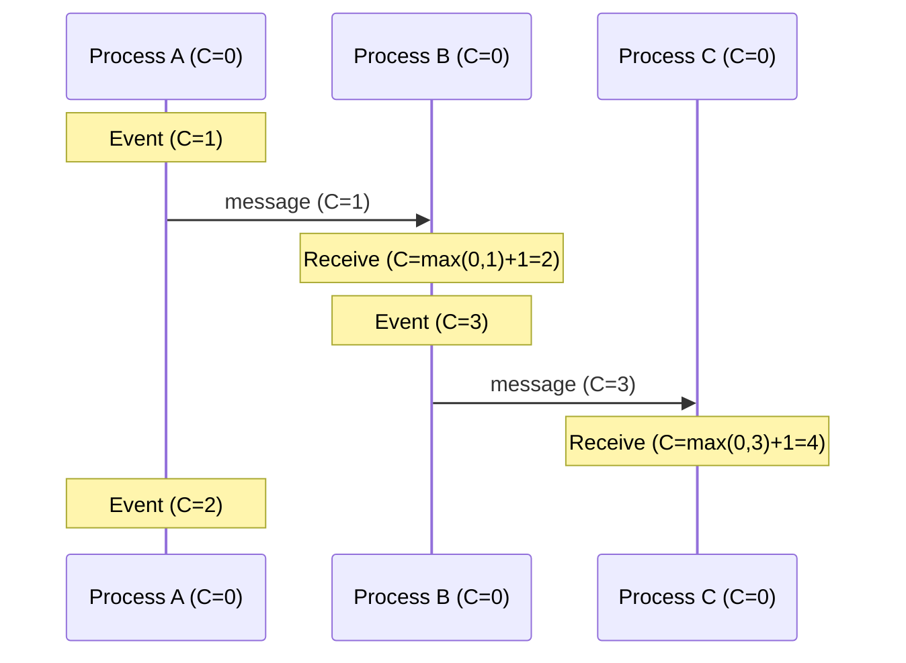

# Logical Clocks and Ordering

## Why This Exists

In a distributed system, you need to answer questions like: "Did event A happen before event B?" "Which write came first?" "Are these two events concurrent?" On a single machine, the system clock answers these questions. In a distributed system, you can't trust wall clocks — they drift, they skew, NTP adjustments can make them jump backward, and two machines' clocks are never perfectly synchronized.

Lamport's 1978 insight was that you don't need to know the actual time to order events. You just need to track **causality**: if A could have influenced B, then A happened before B. If neither could have influenced the other, they're concurrent. Logical clocks formalize this without relying on physical time.

This is foundational theory. If you understand Lamport timestamps and vector clocks, the consistency models in Module 8 and the conflict resolution mechanisms in Module 11 will feel like natural extensions.

## Mental Model

Imagine three people writing a collaborative story by passing notes. There are no clocks in the room.

**Physical clocks (unreliable)**: Each person has a wristwatch, but the watches disagree. Alice's says 2:00, Bob's says 2:03, Charlie's says 1:58. If Alice writes a line at "2:00" and Bob writes at "2:03," did Bob write after Alice? Maybe — or maybe Bob's watch is fast and they wrote simultaneously.

**Lamport timestamps**: Each person keeps a counter. Every time they write a line, they increment their counter. When they pass a note, they include their current counter. The recipient sets their counter to `max(own counter, received counter) + 1`. This guarantees: if Alice's note influenced Bob's response, Bob's counter is higher. But it doesn't guarantee the reverse — two unrelated events might have the same counter value.

**Vector clocks**: Each person keeps a vector of counters — one per person. Alice's vector `[Alice:5, Bob:3, Charlie:2]` means: Alice has done 5 actions, and the last thing she saw from Bob was his 3rd action, and from Charlie his 2nd. By comparing vectors, you can determine exactly which events are causally related and which are concurrent.

## How They Work

### Lamport Timestamps

Each process maintains a counter `C`. Two rules:

1. **On local event**: Increment `C = C + 1`. Assign the event timestamp = `C`.
2. **On message send**: Include `C` in the message.
3. **On message receive**: `C = max(C, received_C) + 1`. Assign the receive event timestamp = `C`.



**The key guarantee**: If event A causally precedes event B (A "happens-before" B), then `timestamp(A) < timestamp(B)`. Formally: `A → B implies C(A) < C(B)`.

**The limitation**: The converse is NOT guaranteed. `C(A) < C(B)` does NOT imply `A → B`. Two events can have different timestamps but be completely concurrent (neither caused the other). Lamport timestamps give you a **total order** (every pair of events is ordered), but that order may be arbitrary for concurrent events.

**When this matters**: If you're using Lamport timestamps for conflict resolution (e.g., "last write wins"), you might arbitrarily pick one of two concurrent writes as the "winner" — even though neither causally preceded the other. This is sometimes acceptable (the order doesn't matter as long as all replicas agree on the same order), sometimes not.

### Vector Clocks

Each process maintains a vector of counters — one counter per process in the system. For N processes, each vector has N entries.

Process `i`'s rules:
1. **On local event**: Increment `V[i] = V[i] + 1`.
2. **On message send**: Include vector `V` in the message.
3. **On message receive with vector `V_msg`**: For each entry `j`, `V[j] = max(V[j], V_msg[j])`. Then increment `V[i] = V[i] + 1`.

**Comparing vectors**:
- `V1 < V2` (V1 happened before V2) if every entry in V1 ≤ corresponding entry in V2, and at least one is strictly less.
- `V1 || V2` (concurrent) if neither `V1 < V2` nor `V2 < V1` — they disagree on which process is "ahead."

**Example**:

```
Process A: [3, 1, 0]   — A has done 3 events, last saw B at event 1, hasn't seen C
Process B: [2, 4, 1]   — B has done 4 events, last saw A at event 2, last saw C at event 1

Compare: A[0]=3 > B[0]=2, but A[1]=1 < B[1]=4
Neither is strictly ≤ the other → CONCURRENT
```

**The key advantage over Lamport**: Vector clocks can detect concurrency. If two writes to the same key have concurrent vector clocks, you know they're conflicting — and you need conflict resolution (merge, LWW, user intervention). See [[Replication Deep Dive]].

**The key disadvantage**: Vector size is O(N) where N is the number of processes. In a system with 1,000 nodes, each vector clock is 1,000 integers — transmitted with every message. This doesn't scale.

**Practical mitigation**: Use vector clocks only for conflict-relevant entities. DynamoDB uses vector clocks per key (not per node globally). Riak used dotted version vectors — an optimization that reduces vector size by tracking only writers per key.

### Hybrid Logical Clocks (HLC)

HLCs combine physical time (wall clock) with a logical counter. Proposed by Kulkarni et al. (2014).

Each HLC has two components: `(physical_time, logical_counter)`.

**Rules**:
1. **On local/send event**: `physical = max(own_physical, wall_clock)`. If physical didn't change, increment logical counter. If physical advanced, reset logical to 0.
2. **On receive with HLC `(pt_msg, lc_msg)`**: `physical = max(own_physical, pt_msg, wall_clock)`. If physical matches, `logical = max(own_logical, lc_msg) + 1`. If physical advanced, reset logical to 0.

**Why this matters**: HLCs give you the causal ordering guarantee of Lamport timestamps PLUS timestamps that are close to wall-clock time (within the clock uncertainty bound). This means HLC timestamps are usable for time-based queries ("give me all events in the last hour") while still providing causal ordering.

**Used by**: CockroachDB (for transaction timestamps — see [[NewSQL and Globally Distributed Databases]]). MongoDB (for replica set oplog ordering).

### Comparison

| Property | Lamport | Vector Clocks | HLC |
|----------|---------|--------------|-----|
| Size | O(1) — single integer | O(N) — N integers | O(1) — timestamp + counter |
| Detects causality | Partial (A→B implies C(A)<C(B), but not reverse) | Full (can detect concurrent events) | Partial (like Lamport, but with physical time) |
| Detects concurrency | No | Yes | No |
| Close to wall time | No | No | Yes |
| Scalability | Excellent | Poor (O(N) per message) | Excellent |
| Use case | Total ordering, database sequences | Conflict detection in replicated systems | Distributed databases needing time-based ordering |

## The Happens-Before Relation

Lamport defined the **happens-before** relation (→):

- If A and B are events in the same process, and A comes before B, then A → B.
- If A is a message send and B is the corresponding receive, then A → B.
- Transitivity: if A → B and B → C, then A → C.

If neither A → B nor B → A, then A and B are **concurrent** (A || B).

This is the formal foundation. Every consistency model, every conflict resolution strategy, and every distributed transaction protocol builds on this relation. When someone says "causally consistent," they mean: if A → B, then everyone who sees B also sees A.

## Trade-Off Analysis

| Clock Type | What It Captures | Space Complexity | Comparison | Best For |
|-----------|-----------------|-----------------|------------|----------|
| Lamport timestamp | Causal ordering (partial) | O(1) — single integer | Total order (arbitrary for concurrent events) | Simple event ordering, Raft log entries |
| Vector clock | Exact causality + concurrency detection | O(N) — one entry per node | Partial order — detects concurrent events | Conflict detection, optimistic replication (Dynamo) |
| Dotted version vector | Same as vector clock, less bloat | O(N) but compacted | Partial order | Riak-style per-key versioning |
| Hybrid Logical Clock (HLC) | Causality + real-time approximation | O(1) — physical + logical | Total order (close to wall-clock) | CockroachDB, Spanner-like systems |
| TrueTime (hardware) | Real-time with bounded uncertainty | O(1) | Total order with confidence interval | Google Spanner — requires specialized hardware |
| Interval Tree Clock | Dynamic node sets, no pre-assigned IDs | Compact tree structure | Partial order | Peer-to-peer, dynamic membership |

**The vector clock scaling problem**: Vector clocks grow with the number of nodes that have touched a key. In a 1,000-node cluster, every key's version vector could have 1,000 entries. Dotted version vectors and server-side vector clocks (where only servers, not clients, get entries) mitigate this. Riak moved to dotted version vectors specifically because client-side vector clocks were unmanageable at scale.

## Failure Modes

**Vector clock bloat in large clusters**: Each node that touches a key adds an entry to the vector clock. In a 500-node cluster, a frequently accessed key's vector clock has 500 entries, adding significant metadata overhead per key. Solution: use server-side vector clocks (only server nodes, not clients, get entries), dotted version vectors, or interval tree clocks that compact automatically.

**Lamport timestamp false ordering**: Lamport timestamps impose a total order, but concurrent events get an arbitrary ordering. Two truly concurrent events appear ordered, misleading applications that assume the earlier timestamp happened first. Solution: use vector clocks if you need to detect concurrency, or accept that Lamport timestamps provide causal ordering only (if a→b then L(a) < L(b), but L(a) < L(b) does not imply a→b).

**HLC clock drift beyond bounds**: Hybrid Logical Clocks track a physical time component. If a node's clock is misconfigured (hours ahead), the HLC value propagates to other nodes via messages, inflating all HLCs in the cluster. This may cause incorrect visibility decisions or waste the logical clock's counter space. Solution: NTP enforcement with maximum allowable drift, reject messages with physical timestamps too far from local time.

**Last-writer-wins data loss from clock skew**: LWW conflict resolution uses timestamps. If server A's clock is 5 seconds ahead of server B's, A's writes always win over B's concurrent writes — even if B's write was "later" in real time. Data silently disappears. Solution: use NTP with tight bounds, use logical clocks instead of wall-clock for LWW, or avoid LWW entirely for important data.

**Causal delivery violation in event systems**: An event broker delivers events out of causal order — a reply appears before the original message, or a delete arrives before the create. Consumers that assume causal ordering produce incorrect state. Solution: vector clock-based causal delivery (buffer out-of-order events until dependencies arrive), or per-entity total ordering (all events for entity X go to the same partition).

## Architecture Diagram

```mermaid
graph TD
    subgraph "Logical Time (Causality)"
        Lamport[Lamport Timestamps] -->|Total Order| Raft[Raft Log Indices]
        Vector[Vector Clocks] -->|Partial Order| Conflicts[Conflict Detection]
    end

    subgraph "Physical Time (Wall Clock)"
        NTP[NTP Sync] -->|Approximate| Snowflake[Snowflake IDs]
        GPS[Atomic Clocks] -->|Bounded Uncertainty| TrueTime[Google Spanner]
    end

    subgraph "Hybrid Models"
        HLC[Hybrid Logical Clocks] -->|Wall Time + Logical| Cockroach[CockroachDB]
    end

    style Lamport fill:var(--surface),stroke:var(--accent),stroke-width:2px;
    style Vector fill:var(--surface),stroke:var(--accent2),stroke-width:2px;
    style HLC fill:var(--surface),stroke:var(--border),stroke-width:2px;
```

## Back-of-the-Envelope Heuristics

- **Clock Drift**: Standard NTP keeps servers within **~10ms - 50ms** of each other on the public internet, and **< 1ms** within a well-tuned data center.
- **Lamport Cost**: O(1) space. It only adds **4 - 8 bytes** to each message.
- **Vector Clock Cost**: O(N) space. For a 100-node cluster, adding a vector clock to every message adds **~400 - 800 bytes**.
- **HLC Precision**: HLCs typically maintain "physical" time accuracy within **1ms - 5ms** of the real wall clock while providing strict causal ordering.

## Real-World Case Studies

- **Google Spanner (TrueTime)**: Google solved the "clock drift" problem by throwing hardware at it. Every Spanner data center has atomic clocks and GPS receivers. Their **TrueTime API** returns a time *interval* `[earliest, latest]`. Spanner ensures consistency by "waiting out the uncertainty"—a transaction won't commit until the system is 100% sure that the current real-time is past the transaction's commit time.
- **Amazon (Dynamo Vector Clocks)**: The original Dynamo database used vector clocks per key to handle concurrent writes. If two people updated the same shopping cart while the network was partitioned, Dynamo would store *both* versions. When the partition resolved, the next read would return both versions, and the application (the cart service) would merge them, ensuring no items were ever lost.
- **CockroachDB (Hybrid Logical Clocks)**: CockroachDB uses **HLCs** to provide serializable transactions without requiring specialized hardware like Spanner. They rely on standard NTP for approximate synchronization but use the logical counter to ensure that if Event A caused Event B, Event B always has a higher HLC, even if the physical clocks were slightly off.

## Connections

- [[ID Generation Strategies]] — Time-sorted IDs (Snowflake, UUIDv7) use wall clocks for approximate ordering; logical clocks provide causal ordering
- [[Consistency Spectrum]] — Causal consistency is defined in terms of the happens-before relation
- [[Replication Deep Dive]] — Vector clocks detect concurrent writes; conflict resolution handles them
- [[NewSQL and Globally Distributed Databases]] — CockroachDB uses HLCs; Spanner uses TrueTime (bounded physical time)
- [[MVCC Deep Dive]] — Spanner's MVCC uses real timestamps for version ordering; CockroachDB uses HLC timestamps
- [[Two-Phase Commit]] — Transaction ordering in distributed databases depends on clock mechanisms
- [[Consensus and Raft]] — Consensus protocols establish ordering for replicated logs, complementing logical clocks

## Reflection Prompts

1. Two replicas of a database process writes concurrently. Replica A processes "set X = 1" and Replica B processes "set X = 2" at the same Lamport timestamp. Using "last write wins" with Lamport timestamps, which write wins? Is this the "correct" outcome? How would vector clocks change the situation?

2. CockroachDB uses HLCs with a configurable maximum clock offset (default 500ms). What happens if a node's NTP sync fails and its clock drifts by 600ms? What are the consequences for reads and writes? Why is this a cluster health emergency?

## Canonical Sources

- Lamport, "Time, Clocks, and the Ordering of Events in a Distributed System" (1978) — the foundational paper. Short, readable, and essential. If you read one distributed systems paper, make it this one.
- *Designing Data-Intensive Applications* by Martin Kleppmann — Chapter 8: "The Trouble with Distributed Systems" covers clock unreliability, and Chapter 9 covers logical clocks
- Kulkarni, Demirbas, et al., "Logical Physical Clocks and Consistent Snapshots in Globally Distributed Databases" (2014) — the HLC paper
- Fidge, "Timestamps in Message-Passing Systems That Preserve the Partial Ordering" (1988) — the vector clocks paper (independently discovered by Mattern the same year)
- Kleppmann, "Distributed Systems" lecture series (University of Cambridge) — freely available lectures that cover Lamport clocks, vector clocks, and causal ordering with excellent visualizations