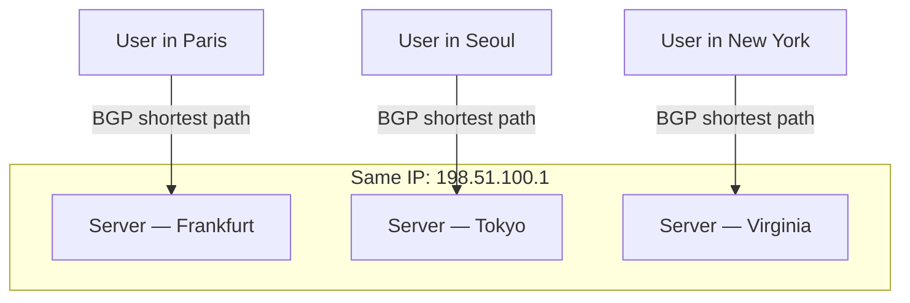
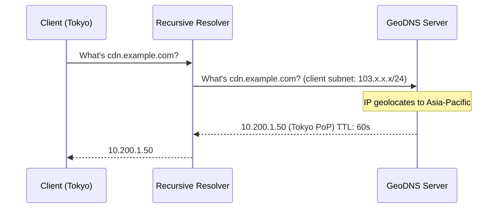

# Anycast and GeoDNS

## Why This Exists

You've built a globally distributed service. Users in Tokyo, São Paulo, and Frankfurt all hit the same domain name. But physics is unforgiving — a packet crossing the Atlantic takes ~70ms minimum (speed of light in fiber). You need a way to route each user to the *nearest* server without them knowing or caring. Two complementary techniques solve this: **anycast** (a network-layer trick) and **GeoDNS** (an application-layer DNS trick).

## Mental Model

**Anycast**: Imagine ten post offices in different cities all sharing the exact same street address. When you mail a letter to that address, the postal system delivers it to whichever post office is closest to you. That's anycast — multiple servers advertise the same IP address via BGP, and the internet's routing infrastructure naturally sends packets to the nearest one.

**GeoDNS**: Imagine a phone directory operator who checks your area code before giving you a phone number. "You're calling from Japan? Here's the Tokyo office number. From Brazil? Here's the São Paulo number." GeoDNS resolves the same domain name to different IP addresses based on the client's geographic location.

## How It Works

### Anycast

In normal (unicast) routing, one IP address maps to one server. In anycast, the same IP address is announced by multiple servers in different locations via BGP (Border Gateway Protocol). Internet routers pick the "shortest" BGP path, which usually correlates with geographic proximity.

**What anycast is great for**:
- **DNS**: All 13 root server clusters use anycast. Cloudflare's 1.1.1.1 resolver uses anycast across 300+ cities. DNS queries are small, stateless UDP packets — perfect for anycast.
- **CDN edge nodes**: Cloudflare, Akamai, and Fastly use anycast to route HTTP requests to the nearest edge PoP.
- **DDoS absorption**: Because traffic naturally spreads across all anycast locations, a volumetric DDoS attack gets distributed too — no single site absorbs the full blast.

**What anycast is tricky for**:
- **Stateful TCP connections**: If BGP routes shift mid-connection (due to a link failure or route update), packets for an existing TCP session can suddenly go to a different server. That server doesn't have the connection state, so the connection resets. This is manageable for short-lived connections (DNS, HTTP requests) but dangerous for long-lived ones (WebSockets, streaming).
- **"Nearest" isn't always nearest**: BGP shortest path is based on AS hop count, not geographic distance or latency. A user in one city might get routed to a farther server because of peering agreements. This is usually close enough, but not guaranteed.

### GeoDNS

GeoDNS uses the client's IP address (specifically, the recursive resolver's IP, or the EDNS Client Subnet if supported) to determine their approximate location, then returns the IP of the nearest regional server.

**EDNS Client Subnet (ECS)**: Traditionally, the GeoDNS server only sees the recursive resolver's IP, not the end user's. If a user in Tokyo uses Google's 8.8.8.8 (which might resolve from a US location), they could get routed to the wrong region. ECS solves this by including a truncated version of the client's IP in the DNS query, allowing the authoritative server to geolocate more accurately. Trade-off: it leaks some client location information to the authoritative DNS server.

**GeoDNS providers**: AWS Route 53 (geolocation routing, latency-based routing), Cloudflare (load balancing with geo-steering), NS1, PowerDNS with GeoIP module.

## Trade-Off Analysis

| Dimension | Anycast | GeoDNS |
|-----------|---------|--------|
| Layer | Network (BGP) | Application (DNS) |
| Granularity | Coarse (BGP hop count) | Fine (IP geolocation database) |
| Statefulness | Tricky for long-lived connections | No issue (routing decided at DNS time) |
| Failover speed | Automatic via BGP withdrawal (seconds to minutes) | Requires health checks + TTL expiry |
| Setup complexity | Requires BGP peering, own ASN, IP space | DNS configuration only |
| DDoS resilience | Excellent (traffic distributed inherently) | Moderate (depends on DNS infra) |

**In practice, they're often used together.** Cloudflare uses anycast to route DNS queries to the nearest resolver, then uses GeoDNS-like logic within their network to pick the optimal origin. AWS Route 53 uses anycast for its DNS infrastructure, then supports geolocation/latency-based routing policies for your records.

## Failure Modes

- **Anycast route flap**: A BGP route oscillates between two paths, causing packets to bounce between servers. Clients see intermittent connection resets. Mitigation: BGP dampening, route stability monitoring.
- **GeoDNS misroute**: The IP geolocation database is wrong (this happens — VPN users, mobile carriers with centralized NAT, corporate proxies). A user in London gets sent to a Singapore server. Mitigation: offer latency-based routing as a supplement to geo routing; let the client measure and report actual latency.
- **Cache inconsistency during failover**: You withdraw a region via GeoDNS, but cached DNS responses with the old TTL keep sending traffic to the downed region for minutes. Mitigation: keep TTLs low for records that participate in failover, and combine with health-check-driven DNS updates.

## Connections

- [[DNS Resolution Chain]] — Anycast and GeoDNS are strategies built on top of the DNS resolution process
- [[Load Balancing Fundamentals]] — DNS-based routing is the coarsest form of load balancing; L4/L7 balancers handle finer-grained distribution
- [[CDN Architecture]] — CDNs are the largest users of both anycast and GeoDNS
- [[Geo-Distribution and Data Sovereignty]] — GeoDNS is the first routing layer for active-active multi-region systems

## Reflection Prompts

1. You're designing a global API gateway. Users connect via HTTPS and maintain connections for 30+ seconds. Would you use anycast, GeoDNS, or both? What are the risks of each for long-lived connections?

2. A user in Vietnam reports consistently high latency to your service despite having an edge PoP in Singapore. Your GeoDNS is configured correctly. What could be going wrong?

## Canonical Sources

- Cloudflare Blog, "A Brief Primer on Anycast" — clear explanation of how Cloudflare uses anycast across 300+ cities
- AWS Route 53 documentation on geolocation routing and latency-based routing — the practical implementation reference
- *Designing Data-Intensive Applications* by Martin Kleppmann — Chapter 1 touches on geographic distribution and latency constraints