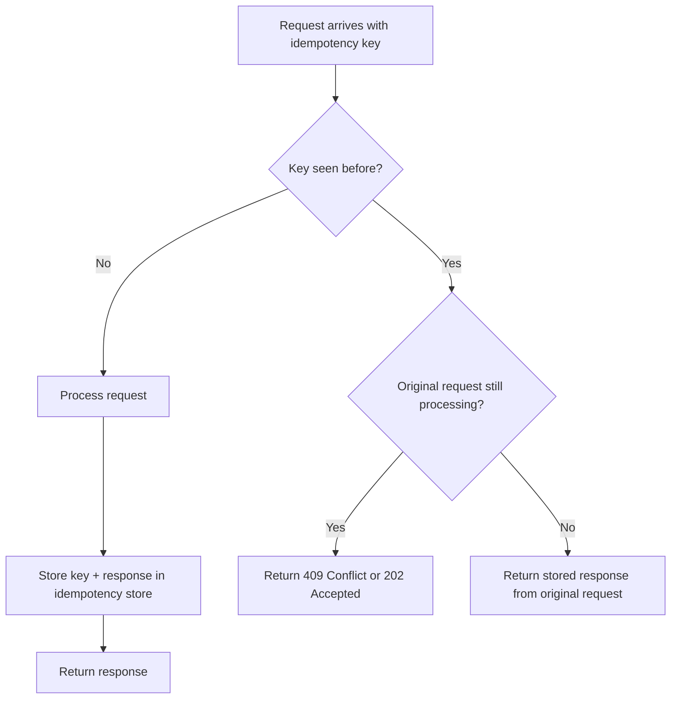

# Idempotency

## Why This Exists

Networks fail. Requests time out. Clients retry. Load balancers re-route. Message queues redeliver. In any distributed system, the same operation will be attempted more than once. If "charge the customer $50" runs twice because of a network timeout, you've just double-charged them. If "create order" runs twice, you have duplicate orders.

Idempotency is the property that ensures **performing an operation multiple times has the same effect as performing it once**. It's the foundation of reliable distributed systems, because it makes retries safe. Without idempotency, every retry is a gamble.

## Mental Model

An elevator button is idempotent. Press "3" once — the elevator goes to floor 3. Press "3" ten more times — still goes to floor 3. The system doesn't go to floor 3 eleven times.

A vending machine is *not* idempotent. Insert a coin once — you get one snack. Insert a coin again — you get another snack. Each operation produces an additional effect.

The goal of idempotency design is to make dangerous operations (payments, order creation, state changes) behave like the elevator button, not the vending machine.

## How It Works

### Naturally Idempotent Operations

Some operations are idempotent by nature:

- **GET** (read): Reading a resource doesn't change it. Safe to repeat.
- **PUT** (replace): "Set user name to Alice" — doing it once or ten times yields the same result.
- **DELETE** (remove): Deleting a resource that's already deleted is a no-op (idempotent, though the second call might return 404 instead of 200).
- **Absolute state changes**: "Set balance to $100" is idempotent. "Add $50 to balance" is not.

### Naturally Non-Idempotent Operations

These require explicit idempotency design:

- **POST** (create): "Create an order" — each call creates a new order.
- **Relative state changes**: "Debit $50" — each call deducts $50.
- **Side-effect-producing operations**: "Send an email," "charge a card," "publish an event."

### The Idempotency Key Pattern

The standard solution for making non-idempotent operations safe: the client generates a unique **idempotency key** (typically a UUID) and sends it with the request. The server uses this key to detect and deduplicate retries.

```
Client → Server:
POST /payments
Idempotency-Key: 550e8400-e29b-41d4-a716-446655440000
{ "amount": 50.00, "currency": "USD" }
```

**Server-side flow**:



**Critical implementation details**:

1. **Atomicity of check-and-process**: The "is this key new?" check and the "start processing" step must be atomic. If two retries arrive simultaneously and both pass the check, you get a duplicate. Use a database unique constraint or an atomic Redis `SETNX` on the idempotency key.

2. **Store the full response**: When returning a cached result for a duplicate key, return the *exact same response* (status code, body, headers) as the original. The client should be unable to distinguish a fresh response from a replayed one.

3. **Key expiration**: Idempotency keys shouldn't live forever. Stripe expires them after 24 hours. The window should be long enough to cover retry scenarios (network timeouts, client restarts) but short enough to not accumulate unbounded state.

4. **Request fingerprinting**: If the same idempotency key is resubmitted with *different* request parameters (amount changed from $50 to $100), this is a misuse — not a retry. Stripe returns a 422 error in this case. Store and compare a hash of the request body alongside the key.

5. **Scope**: Idempotency keys are usually scoped per API key / per user. The same UUID from different users represents different operations.

### At-Least-Once vs Exactly-Once vs At-Most-Once

These delivery guarantees interact directly with idempotency:

**At-most-once**: Send once, never retry. If it fails, it's lost. Simple, but unacceptable for critical operations (payments, orders).

**At-least-once**: Retry until acknowledged. The message/request is guaranteed to arrive, but might arrive multiple times. This is the most common guarantee in distributed systems (HTTP retries, message queue redelivery, database replication).

**Exactly-once**: The holy grail — every operation executes precisely once. True exactly-once is impossible in the general case (you can't distinguish "the server processed it and the ack was lost" from "the server didn't process it"). But you can *simulate* exactly-once through **at-least-once delivery + idempotent processing**. The consumer deduplicates, so from the application's perspective, the effect happens exactly once.

This is the key insight: **exactly-once semantics = at-least-once delivery + idempotent handling**. Every system that claims "exactly-once" (Kafka's exactly-once semantics, for example) is actually doing this under the hood.

### Idempotency in Practice: Beyond API Keys

**Database writes**: Use `INSERT ... ON CONFLICT DO NOTHING` (Postgres) or `INSERT IGNORE` (MySQL) with a unique constraint on a natural key or idempotency key. The database enforces deduplication atomically.

**Message consumers**: When processing messages from a queue (Kafka, SQS, RabbitMQ), consumers must handle redelivery. Strategies:
- **Idempotency table**: Store processed message IDs in a database table. Before processing, check if the ID exists. Process + insert atomically in a transaction.
- **Natural idempotency**: If the operation is "set status to SHIPPED," it's naturally idempotent — running it twice doesn't change the outcome.
- **Transactional outbox**: Process the message and record the message ID in the same database transaction. See [[Outbox Pattern]].

**Saga orchestrators**: Each saga step must be idempotent because the orchestrator retries failed steps. Compensating transactions must also be idempotent — you don't want to refund a payment twice. See [[Saga Pattern]].

**Event sourcing**: Events are appended with sequence numbers. Consumers track the last processed sequence number and skip duplicates. The event log itself is the idempotency mechanism. See [[Event Sourcing and CQRS]].

## Trade-Off Analysis

| Approach | Complexity | Storage Cost | Reliability | Best For |
|----------|-----------|--------------|-------------|----------|
| Idempotency key in dedicated store (Redis) | Medium | Low (keys + TTL) | High | API-level deduplication, short-lived operations |
| Idempotency key in database (unique constraint) | Low | Medium | Very high | Critical operations where atomicity with business logic matters |
| Natural idempotency (absolute state changes) | Low | None | High | Operations that can be expressed as "set X to Y" |
| Message ID tracking | Medium | Medium | High | Message queue consumers |

## Failure Modes

- **Idempotency store failure**: If Redis (your idempotency store) goes down, you can't check for duplicates. Options: fail the request (safe but disruptive), or process without dedup (risk duplicates). For payments, fail the request. For non-critical operations, process and accept the small duplicate risk.

- **Partial completion**: A request creates an order (step 1) but fails before charging the card (step 2). The idempotency key is stored after step 1. On retry, the server sees the key, returns the stored response — but the card was never charged. Prevention: store the idempotency key and response only after *all* steps complete, or use a state machine that tracks progress and can resume from the last completed step.

- **Client generates non-unique keys**: If the client uses a predictable or reused idempotency key (like the current timestamp at second granularity), different operations collide. Prevention: use UUIDv4 or UUIDv7 (time-sorted with random component). Document clearly that keys must be globally unique.

- **Clock-based expiration races**: An idempotency key expires after 24 hours. A client retries at the 24-hour boundary — the original key has expired, and the retry creates a duplicate. Prevention: make the expiration window generous, and ensure clients generate a new key if their session has been idle longer than the expiration window.

## Connections

- [[RESTful Design Principles]] — HTTP method semantics (idempotent methods vs non-idempotent POST)
- [[Two-Phase Commit]] — Idempotency is essential when retrying distributed transaction steps
- [[Saga Pattern]] — Each saga step and its compensating transaction must be idempotent
- [[Outbox Pattern]] — Reliable event publishing with deduplication
- [[Event Sourcing and CQRS]] — The event log's sequence numbers provide a natural idempotency mechanism
- [[Rate Limiting and Throttling]] — Rate-limited clients retry; idempotency makes those retries safe
- [[Consistency Spectrum]] — Exactly-once semantics relate to consistency guarantees

## Reflection Prompts

1. You're building a payment API. A client submits a $100 charge, gets a timeout (no response), and retries with the same idempotency key. On the server, the first request *did* succeed — the charge went through. How does your system handle the retry? What if the first request failed midway through (charge succeeded but order creation failed)?

2. Your event-processing service consumes from Kafka. The consumer commits offsets after processing. During a rebalance, it reprocesses 100 messages. 95 of them are naturally idempotent (status updates). 5 of them trigger external API calls (send email, charge card). How do you handle each category?

## Canonical Sources

- Stripe Engineering Blog, "Idempotency" — the definitive practical guide to idempotency keys in payment APIs; study their implementation in detail
- *Designing Data-Intensive Applications* by Martin Kleppmann — Chapter 11: "Stream Processing," section on exactly-once semantics and idempotency
- *Microservices Patterns* by Chris Richardson — Chapter 3 covers idempotent consumers in the context of messaging
- Brandur Leach (Stripe), "Implementing Stripe-like Idempotency Keys in Postgres" — implementation walkthrough with SQL