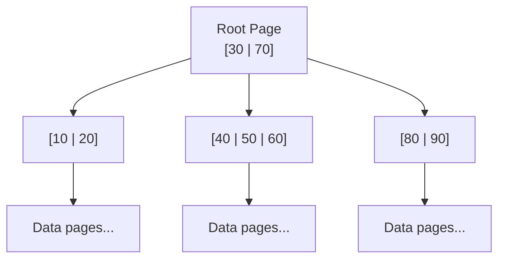
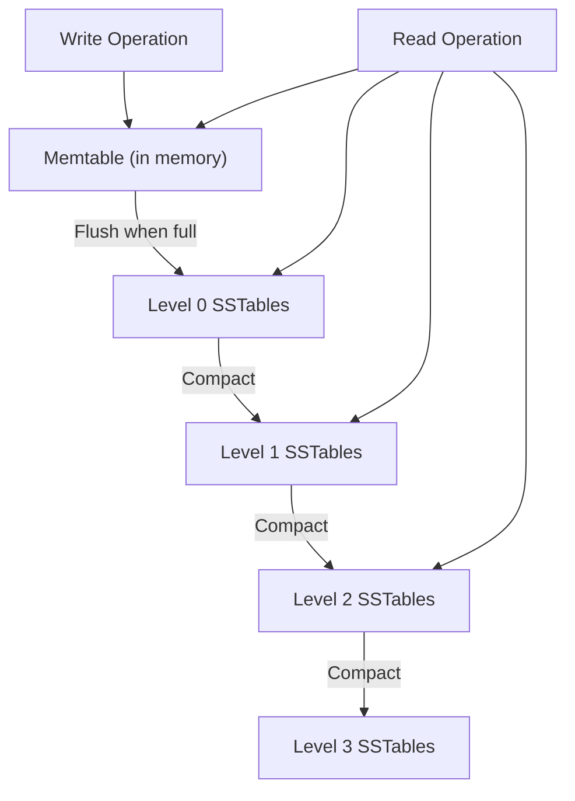

# B-Tree vs LSM-Tree

## Why This Exists

Every database must answer one question: *how do you organize data on disk so that reads and writes are fast?* There are fundamentally two answers that dominate production systems, and they make opposite trade-offs.

**B-trees** (used by Postgres, MySQL/InnoDB, SQL Server, Oracle) optimize for reads. They maintain a sorted, balanced tree structure on disk. Reads are fast — you walk the tree in O(log n) page reads. Writes are slower because you must find and update the correct page in place, potentially splitting pages and triggering random I/O.

**LSM-trees** (used by RocksDB, LevelDB, Cassandra, HBase, CockroachDB, TiDB) optimize for writes. They buffer writes in memory, then flush them sequentially to disk in sorted batches. Writes are fast because they're always sequential. Reads are slower because data may be spread across multiple files (levels) that must be checked and merged.

This is the single most important trade-off in database engine design. Everything else follows from it.

## Mental Model

**B-tree**: A library with books on shelves, sorted alphabetically. Finding a book is fast — go to the right shelf, scan to the right position. But putting a new book away requires finding the exact slot, and if the shelf is full, you need to rearrange the whole section.

**LSM-tree**: A desk with an inbox. New documents go straight into the inbox (fast, just drop them on top). Periodically, you sort the inbox and file everything into the cabinet. Finding a specific document means checking the inbox first, then the filing cabinet — slower because you're looking in multiple places.

## How They Work

### B-Tree

A B-tree is a balanced tree where each node is a fixed-size **page** (typically 4KB–16KB, matching the OS page size). Internal nodes contain keys and pointers to child nodes. Leaf nodes contain the actual key-value data (or pointers to it).



**Read path**: Start at the root. At each level, do a binary search to find which child pointer to follow. For a tree with N keys and branching factor B, this takes O(log_B N) page reads. With a branching factor of 500 (typical for 8KB pages with smallish keys), a tree with 250 billion keys is only 4 levels deep. Four page reads — if the upper levels are cached in the [[Buffer Pool and Page Cache]], it's often 1–2 disk reads.

**Write path**: Find the leaf page, update it in place. If the page is full, split it into two pages and update the parent pointer. Splits cascade upward in rare cases. Before any page modification, the change is recorded in the [[Write-Ahead Log]] for crash recovery.

**The cost of in-place updates**: Modifying a page on disk means random I/O — seeking to the page's location and rewriting it. On HDDs, this is catastrophically slow (each seek is ~10ms). On SSDs, it's faster but still involves write amplification at the flash translation layer (SSDs can't update in place; they erase whole blocks and rewrite).

### LSM-Tree

An LSM-tree never modifies data in place. All writes go through a layered structure:

**Step 1 — Memtable**: Writes go to an in-memory sorted structure (typically a red-black tree or skip list). This is blazingly fast — no disk I/O at all. The [[Write-Ahead Log]] ensures durability in case of crash.

**Step 2 — Flush to SSTable**: When the memtable reaches a size threshold (e.g., 64MB), it's written to disk as a **Sorted String Table (SSTable)** — an immutable, sorted file. This write is sequential (one contiguous write), which is fast on both HDDs and SSDs.

**Step 3 — Compaction**: Over time, multiple SSTables accumulate. To prevent reads from checking too many files, the engine periodically **compacts** — merges multiple SSTables into a single, larger, sorted SSTable, discarding obsolete (overwritten or deleted) entries.



**Read path**: Check the memtable first (most recent data). If not found, check Level 0 SSTables, then Level 1, and so on. Each level is checked via binary search or a **Bloom filter** (a probabilistic data structure that can definitively say "this key is NOT here" — avoiding unnecessary disk reads for most levels).

### Compaction Strategies

Two dominant approaches:

**Size-tiered compaction** (Cassandra default, HBase): SSTables at the same size tier are merged when enough accumulate. Simple, write-optimized. Downside: during compaction, you temporarily need space for both the old and new SSTables — space amplification can reach 2×. Also, a single key may exist in multiple SSTables until they're compacted together, making reads slower.

**Leveled compaction** (RocksDB/LevelDB default, Cassandra option): SSTables are organized into levels with strict size ratios (each level is ~10× the previous). SSTables within a level have non-overlapping key ranges. This bounds space amplification and guarantees a key exists in at most one SSTable per level — better read performance. Downside: compaction does more work (higher write amplification) because merging a Level-N SSTable requires rewriting overlapping Level-N+1 SSTables.

## The Three Amplification Factors

This is the framework that makes B-tree vs LSM-tree reasoning precise. Every storage engine makes trade-offs among three forms of amplification:

**Write amplification**: The ratio of bytes written to disk vs bytes of actual data written by the application. A B-tree write amplification is modest (write the WAL + write the page, ~2×), but page splits and fragmentation increase it. LSM-tree write amplification depends on compaction — leveled compaction in RocksDB can reach 10–30× because data is rewritten at each level.

**Read amplification**: The number of disk reads needed to satisfy a query. B-trees are typically 1–4 page reads (tree depth). LSM-trees may check multiple levels — without Bloom filters, this can be 5–10+ reads. Bloom filters reduce this dramatically (to ~1 disk read for non-existent keys), but point reads are still slightly more expensive than B-trees.

**Space amplification**: How much disk space the engine uses vs the logical data size. B-trees have ~50% average page fill (due to splits and internal fragmentation) — space amplification ~2×. LSM-trees with leveled compaction have low space amplification (~1.1×), but size-tiered compaction can reach 2× during compaction bursts.

**The fundamental constraint**: You can't minimize all three simultaneously. Every engine picks two to optimize and accepts the third as a cost.

| Engine Type | Write Amp | Read Amp | Space Amp |
|-------------|-----------|----------|-----------|
| B-tree | Moderate (2–5×) | Low (1–4 reads) | Moderate (~2×) |
| LSM (leveled) | High (10–30×) | Low-moderate (1–3 reads with Bloom) | Low (~1.1×) |
| LSM (size-tiered) | Low-moderate (2–5×) | High (5–10+ reads) | High (up to 2×) |

## Trade-Off Analysis

| Dimension | B-Tree | LSM-Tree |
|-----------|--------|----------|
| Read latency (point lookup) | Excellent — predictable, low | Good — Bloom filters help, but slightly more I/O |
| Read latency (range scan) | Excellent — data is sorted in place | Good to moderate — may merge across levels |
| Write throughput | Moderate — random I/O for page updates | Excellent — sequential writes, batched |
| Write latency | Predictable | Usually low, but compaction can cause latency spikes |
| Space efficiency | Moderate (~50% page fill) | Good (leveled) to moderate (size-tiered) |
| Predictability | High — consistent performance | Variable — compaction storms can spike latency and I/O |
| Compression | Moderate (per-page) | Excellent (sorted data compresses well, per-block) |
| SSD friendliness | Good | Better (sequential writes align with SSD write patterns) |

## Failure Modes & Production Lessons

- **LSM compaction storms**: Under heavy write load, compaction falls behind. Uncompacted SSTables accumulate, reads slow down (more files to check), and disk space grows. When compaction catches up, it consumes massive I/O, spiking latency for concurrent reads. This is the most common production issue with LSM-based systems. Mitigation: rate-limit compaction I/O, monitor compaction backlog, provision sufficient I/O headroom.

- **B-tree page splits under write load**: Sequential inserts (auto-incrementing IDs) cause all writes to hit the rightmost leaf page, splitting it repeatedly. This is actually well-handled by most B-tree implementations (they pre-allocate). But random inserts spread across the tree cause widespread splits and fragmentation. Mitigation: use time-sorted keys (UUIDv7, ULID) instead of random UUIDs (UUIDv4) for insert-heavy workloads — this keeps writes concentrated and cache-friendly.

- **Bloom filter memory pressure**: LSM-tree read performance depends on Bloom filters being in memory. With thousands of SSTables and limited RAM, Bloom filters get evicted, and read performance collapses. Mitigation: size SSTable count relative to available memory, pin Bloom filters in memory, or use partitioned Bloom filters.

- **Write stalls in RocksDB**: When Level 0 has too many SSTables (compaction can't keep up), RocksDB throttles or stalls writes to prevent read degradation. This manifests as sudden write latency spikes. Tuning: increase Level 0 file count limits, increase compaction parallelism, use faster storage.

## Architecture Diagram

```mermaid
graph TD
    subgraph "B-Tree (In-Place Updates)"
        B_Root[Root Page] --> B_Internal[Internal Pages]
        B_Internal --> B_Leaf[Leaf Pages - Data]
        Note over B_Leaf: Writes: Find page -> Update in place
    end

    subgraph "LSM-Tree (Append-Only)"
        L_Write[Write Op] --> L_Mem[Memtable - RAM]
        L_Mem -->|Flush| L0[SSTables Level 0]
        L0 -->|Compact| L1[SSTables Level 1]
        Note over L1: Writes: Sequential append to L0
    end

    style B_Root fill:var(--surface),stroke:var(--accent),stroke-width:2px;
    style L_Mem fill:var(--surface),stroke:var(--accent2),stroke-width:2px;
```

## Back-of-the-Envelope Heuristics

- **Write Throughput**: LSM-trees can handle **5-10x higher** write throughput than B-trees on the same hardware due to sequential I/O.
- **Read Latency**: B-trees provide **O(log N)** predictable read latency (usually 3-4 disk seeks). LSM-trees are **O(L * log N)** where L is the number of levels (reduced to ~1 with Bloom filters).
- **Write Amplification**: B-trees are typically **2x - 4x**. LSM-trees (leveled) can be **10x - 30x** due to repeated compaction.
- **Storage Efficiency**: B-trees often have **30-50% fragmentation** (empty space in pages). LSM-trees have **<10% fragmentation** because SSTables are packed tight.

## Real-World Case Studies

- **PostgreSQL / MySQL (B-Tree)**: These classic relational databases use B-trees (specifically B+ trees) because they prioritize read performance and predictable latency for OLTP workloads. The B-tree's in-place updates are manageable because most web apps are read-heavy (90% reads, 10% writes).
- **Cassandra / RocksDB (LSM-Tree)**: Built for write-heavy workloads. Cassandra uses LSM-trees to handle massive ingestion rates (millions of writes/sec) across distributed clusters. Facebook created RocksDB (based on LevelDB) specifically to be an embeddable, high-performance LSM-tree engine for its internal services.
- **CockroachDB (RocksDB to Pebble)**: CockroachDB originally used RocksDB as its storage engine. They later wrote "Pebble" (a Go-based LSM engine) to avoid the overhead of CGO calls and to better tune compaction for their specific distributed SQL needs.

## Connections

- [[Write-Ahead Log]] — Both B-trees and LSM-trees use WAL for durability; the WAL is the sequential write that makes crash recovery possible
- [[Buffer Pool and Page Cache]] — B-trees rely heavily on the buffer pool to cache pages in memory; LSM-trees rely on OS page cache for SSTable reads
- [[Storage Engine Selection]] — Decision framework for choosing between B-tree and LSM-tree engines
- [[MVCC Deep Dive]] — Concurrency control layered on top of the storage engine
- [[Indexing Deep Dive]] — Indexes are typically B-trees or LSM-trees themselves
- [[ID Generation Strategies]] — Key design (sequential vs random) directly impacts B-tree and LSM-tree performance

## Reflection Prompts

1. You're choosing a storage engine for a time-series database that ingests 500,000 data points per second and serves dashboard queries that scan recent time ranges. Would you choose a B-tree or LSM-tree engine? What specific amplification trade-offs justify your choice?

2. A team running CockroachDB (which uses RocksDB/Pebble, an LSM-tree engine) reports that read latency spikes to 100ms every 30 minutes, then returns to 5ms. What's the most likely cause, and how would you investigate?

## Canonical Sources

- *Database Internals* by Alex Petrov — Chapters 2–7 cover B-trees and LSM-trees in detail; this is the authoritative reference
- *Designing Data-Intensive Applications* by Martin Kleppmann — Chapter 3: "Storage and Retrieval" is the best accessible introduction to B-trees vs LSM-trees
- O'Neil et al., "The Log-Structured Merge-Tree (LSM-Tree)" (1996) — the original LSM-tree paper
- RocksDB wiki, "Leveled Compaction" and "Universal Compaction" — practical tuning guides for the most widely-used LSM engine