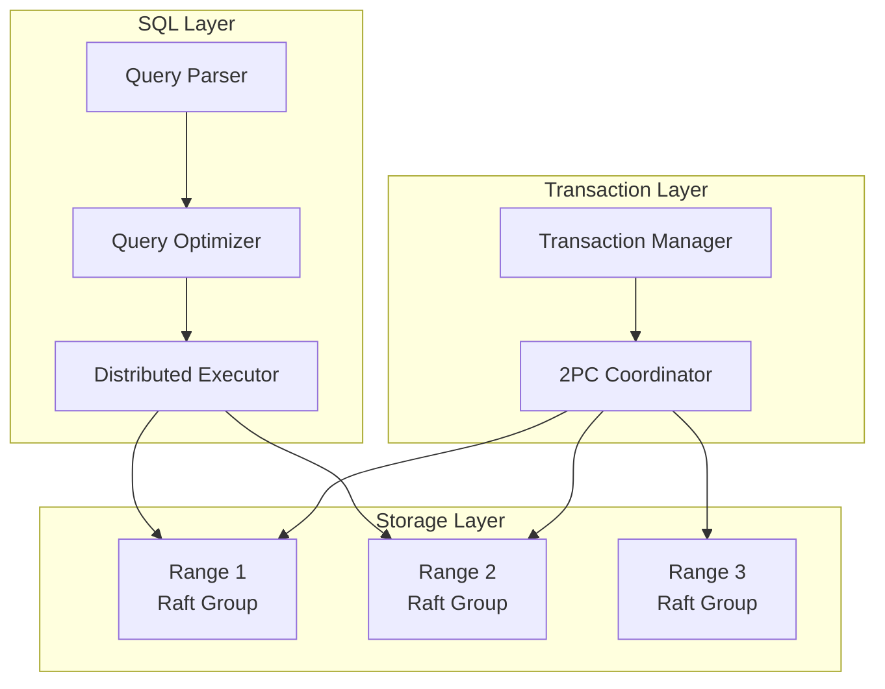

# NewSQL and Globally Distributed Databases

## Why This Exists

For a decade, the database world presented a false dichotomy: choose SQL (strong consistency, ACID transactions, but limited horizontal scaling) or NoSQL (horizontal scaling, but weak consistency, no joins, no transactions). Engineers who needed both were told to pick one and work around the other.

NewSQL databases reject this trade-off. They provide SQL semantics, ACID transactions, and strong consistency *while* scaling horizontally across many nodes and even across continents. Google Spanner was the first to prove this was possible at global scale (2012). CockroachDB and TiDB brought the approach to the open-source world.

This isn't magic — it's engineering. The cost is latency (consensus per transaction), complexity (understanding how distributed SQL differs from single-node SQL), and operational overhead. But for applications that genuinely need strong consistency at global scale — financial systems, inventory management, multi-region SaaS — NewSQL databases offer something that didn't exist a decade ago.

## Mental Model

Traditional databases are like a single library branch — one building, all the books, very organized (strong consistency), but if the building burns down, everything is gone. NoSQL databases are like a peer-to-peer book lending network — books are everywhere, very resilient, but it's hard to guarantee everyone has the latest edition (eventual consistency). NewSQL databases are like a chain of library branches connected by an express courier service with perfectly synchronized clocks. Each branch has a full catalog, any branch can serve any request, and the courier service (consensus protocol + TrueTime/HLCs) ensures every branch always agrees on which edition is current. The magic trick: they made the coordination fast enough that it feels like a single library.

## How They Work: The Core Architecture

All three major NewSQL databases (Spanner, CockroachDB, TiDB) share a common architectural pattern:

**1. Data is automatically range-partitioned across nodes.** A large table is split into ranges (CockroachDB calls them "ranges," Spanner calls them "splits," TiDB calls them "regions"). Each range holds a contiguous slice of the key space. Ranges split automatically when they grow too large.

**2. Each range is replicated using Raft consensus.** Each range has a Raft group — typically 3 or 5 replicas. One is the Raft leader; it handles reads and writes for that range. If the leader fails, Raft elects a new one. This gives you strong consistency per range without a single point of failure.

**3. Transactions that span ranges use distributed commit protocols.** A transaction touching ranges on different nodes uses a variant of two-phase commit (2PC), coordinated by a transaction manager. The consensus protocol (Raft) within each range handles the "each participant agrees" phase, making it more robust than naive 2PC.

**4. SQL query execution is distributed.** The SQL layer sits above the storage layer. Queries are parsed, planned, and then distributed — sub-queries are pushed down to the nodes that hold the relevant ranges, and results are aggregated. This is a distributed query engine, not just a distributed storage engine.

## The Three Systems Compared

### Google Spanner

The pioneer. A globally distributed database running on Google's private infrastructure since 2012. Available externally as Cloud Spanner.

**TrueTime**: Spanner's secret weapon. A globally synchronized clock API that returns a time interval `[earliest, latest]` with a guaranteed bound on clock uncertainty (typically ≤7ms). Spanner uses TrueTime to assign globally consistent timestamps to transactions. When a transaction commits, the coordinator waits out the uncertainty interval ("commit wait") to ensure no other transaction could receive an earlier timestamp. This enables **external consistency** — if T1 commits before T2 starts in wall-clock time, T2 is guaranteed to see T1's writes.

**Why it matters**: TrueTime eliminates the need for centralized timestamp oracles or coordination between transactions that don't conflict. Reads at a specific timestamp are consistent across the entire database globally, enabling lock-free snapshot reads at past timestamps.

**The cost**: Commit wait adds latency (≤7ms typically). Requires Google's GPS + atomic clock infrastructure. Not available outside Google Cloud.

### CockroachDB

An open-source, Spanner-inspired database that runs on commodity hardware (no specialized clocks).

**Hybrid Logical Clocks (HLCs)**: Since commodity servers don't have TrueTime, CockroachDB uses HLCs — a combination of NTP-synchronized wall clock time and a logical counter. HLCs provide causal ordering (if event A causes event B, A's timestamp < B's timestamp) but not the bounded uncertainty that TrueTime provides.

**The consequence**: CockroachDB can't guarantee external consistency the way Spanner can. It provides **serializable isolation** (transactions appear to execute in some serial order), but that order might not match wall-clock order. In practice, this difference rarely matters for application correctness — serializable isolation is already the strongest standard isolation level.

**Clock skew handling**: CockroachDB requires NTP-synced clocks with a configurable maximum offset (default: 500ms). If a node's clock drifts beyond this, it self-quarantines. Reads may occasionally need to retry if they encounter uncertainty intervals (a read can't tell whether a value was written before or after its snapshot time). This manifests as occasional read restarts — usually invisible to the application but visible in metrics.

**Architecture**: Built on Pebble (a Go LSM-tree engine). Range-partitioned, Raft-replicated. SQL-compatible (PostgreSQL wire protocol). Supports multi-region configurations with zone configs and locality-aware lease placement (route Raft leaders to the region that reads/writes most frequently).

### TiDB

An open-source, MySQL-compatible distributed database from PingCAP.

**Architecture**: Separates compute (TiDB, the SQL layer) from storage (TiKV, the distributed key-value layer). TiKV is range-partitioned and Raft-replicated, similar to CockroachDB. This separation allows independent scaling of compute and storage.

**Timestamp Oracle (TSO)**: TiDB uses a centralized timestamp oracle (part of the Placement Driver, or PD) to assign globally ordered timestamps. Every transaction requests a timestamp from the TSO. This is simpler than TrueTime or HLCs but introduces a central dependency — the TSO is a potential bottleneck and SPOF (though it's highly available with Raft replication).

**Strengths**: MySQL wire protocol compatibility (easier migration from MySQL). TiFlash columnar engine for HTAP (hybrid transactional + analytical processing) — run analytics on live transactional data without ETL. Active open-source community.

**Trade-offs**: The centralized TSO adds ~1ms to every transaction start. Cross-region transactions are expensive because the TSO must be reachable. Less mature than CockroachDB for multi-region active-active deployments.

### Comparison Table

| Dimension | Spanner | CockroachDB | TiDB |
|-----------|---------|-------------|------|
| Clock mechanism | TrueTime (GPS + atomic) | Hybrid Logical Clocks | Centralized TSO |
| Strongest isolation | External consistency | Serializable (SSI) | Snapshot Isolation (default) |
| SQL compatibility | Custom (Spanner SQL) | PostgreSQL wire protocol | MySQL wire protocol |
| Storage engine | Custom (Colossus-based) | Pebble (LSM-tree) | TiKV (RocksDB-based LSM) |
| Multi-region | Native (Google infrastructure) | Zone configs, locality-aware leases | TiFlash for analytics; multi-region improving |
| Deployment | Cloud Spanner only | Self-hosted or CockroachDB Cloud | Self-hosted or TiDB Cloud |
| HTAP support | Limited | Limited | Strong (TiFlash columnar engine) |
| Operational maturity | Very high (Google scale) | High (used by DoorDash, Netflix) | Growing (used by ByteDance, PingCAP customers) |

## When to Use NewSQL

**Good fit**:
- Multi-region applications needing strong consistency (global inventory, financial transactions)
- Applications outgrowing a single Postgres node that need horizontal write scaling *with* SQL and transactions
- Systems requiring automatic resharding without application changes
- Regulatory requirements for data placement (GDPR) with consistent cross-region reads

**Not a good fit**:
- Applications that fit on a single Postgres instance (most applications — don't over-engineer)
- Write-heavy workloads where eventual consistency is acceptable (use Cassandra or DynamoDB)
- Latency-critical workloads where consensus overhead is unacceptable (single-node Postgres is faster for single-region)
- Teams without the expertise to operate distributed databases (managed options mitigate this, but debugging distributed query performance is still harder than single-node)

## Trade-Off Analysis

| System | Consistency | Latency (cross-region write) | Operational Complexity | Best For |
|--------|------------|-------------------------------|----------------------|----------|
| CockroachDB | Serializable by default | 100-300ms (quorum across regions) | Low — self-managing, no manual sharding | Global OLTP, regulatory compliance, PostgreSQL compatibility |
| Google Spanner | External consistency (strongest) | Similar — TrueTime-based | Managed only (GCP) | Google-scale global transactions, financial systems |
| YugabyteDB | Serializable or snapshot | 100-300ms | Medium — more tuning knobs | Multi-cloud global OLTP, PostgreSQL + Cassandra API |
| TiDB | Snapshot isolation | Lower — async replication option | Medium — TiKV + PD components | MySQL-compatible global reads, HTAP |
| Aurora Global Database | Read-after-write in primary region | <1s replication lag to secondaries | Low — managed AWS | AWS-native, single-region write with global reads |

**The latency floor**: No system escapes physics. A serializable cross-region write requires at least one round-trip between regions for consensus — that's 50-150ms for US coasts, 200ms+ for intercontinental. The architectural choice isn't whether to pay this cost, but which operations pay it. Strategies: write locally and replicate async (accept stale reads), use global consensus only for cross-region transactions, or design the data model so most transactions are region-local.

## Failure Modes & Production Lessons

- **Cross-region transaction latency**: A transaction touching ranges in US-East and EU-West pays at least 2× cross-Atlantic round-trip (~300ms). This is physics, not software. Mitigation: design data locality so most transactions are intra-region (CockroachDB's locality-aware partitioning, Spanner's placement policies).

- **Hot range leader**: One range receives disproportionate traffic. The Raft leader for that range is overwhelmed. Mitigation: automatic range splitting (all three systems do this), but split detection can lag traffic spikes.

- **Raft leader lease transfer latency**: When a Raft leader transfers leadership (during rebalancing or node drain), there's a brief window where the range is unavailable for writes. In high-throughput systems, this causes latency spikes. Mitigation: proactive lease transfer before node shutdown, connection draining.

- **Clock skew incidents (CockroachDB)**: If NTP misconfiguration causes a node's clock to drift beyond the max offset, the node is ejected from the cluster. Mitigation: monitor NTP sync, use multiple NTP sources, configure `chrony` rather than `ntpd` (more robust).

## Connections

- [[Database Replication]] — NewSQL databases use Raft-based replication instead of traditional leader-follower replication
- [[Partitioning and Sharding]] — Automatic range partitioning eliminates manual sharding
- [[Consistency Spectrum]] — Spanner provides external consistency; CockroachDB provides serializability; both are stronger than most NoSQL databases
- [[MVCC Deep Dive]] — All three use MVCC; Spanner's timestamp-based MVCC is unique
- [[Two-Phase Commit]] — NewSQL databases' main selling point: distributed transactions that actually work
- [[SQL vs NoSQL Decision Framework]] — NewSQL is the "third option" when SQL's scaling limitations hit but NoSQL's consistency trade-offs are unacceptable
- [[Geo-Distribution and Data Sovereignty]] — NewSQL databases' locality-aware partitioning addresses data sovereignty requirements

## Reflection Prompts

1. Your company runs a global e-commerce platform on Postgres. European customers experience high latency on writes (single Postgres leader in US-East). A team proposes migrating to CockroachDB with multi-region deployment. What are the expected latency improvements? What are the new operational challenges? What migration risks should you plan for?

2. CockroachDB provides serializable isolation, not external consistency (which Spanner provides). Construct a concrete scenario where this difference would matter — where two transactions are serialized in an order that doesn't match wall-clock order, and it causes a user-visible problem. How realistic is this scenario in practice?

## Canonical Sources

- Corbett et al., "Spanner: Google's Globally-Distributed Database" (2012) — the paper that started the NewSQL era
- *Designing Data-Intensive Applications* by Martin Kleppmann — Chapter 9: "Consistency and Consensus" covers the theoretical foundations Spanner builds on
- CockroachDB architecture documentation (cockroachlabs.com/docs) — excellent technical depth on HLCs, Raft, and distributed SQL
- Huang et al., "TiDB: A Raft-based HTAP Database" (VLDB 2020) — TiDB's architecture paper