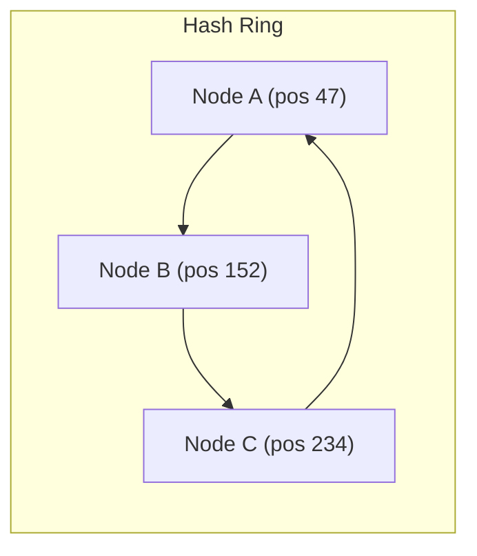

# Consistent Hashing

## Why This Exists

When you distribute data across N servers using simple modular hashing (`hash(key) % N`), adding or removing a single server remaps almost every key. If you have 100 servers and add a 101st, roughly 99% of keys move to a different server. In a cache cluster, that means 99% of cached data becomes unreachable — a thundering herd of cache misses hits your database simultaneously.

Consistent hashing solves this: when a node is added or removed, only `K/N` keys need to move (K = total keys, N = total nodes). That's roughly 1% for 100 servers — a 99x improvement in stability.

This algorithm is foundational. It appears in distributed caches (Redis Cluster, Memcached), databases (DynamoDB, Cassandra), load balancers, CDNs, and content-addressable storage. Amazon's Dynamo paper (2007) made it famous; virtually every distributed system designed since uses some variant.

## Mental Model

Imagine a circular clock face numbered 0 to 360. Each server gets a position on the clock by hashing its name (e.g., `hash("server-A") = 47°`). Each data key also gets a position by hashing it (e.g., `hash("user:123") = 112°`). To find which server owns a key, walk clockwise from the key's position until you hit a server. That's the owner.

When a server dies, its keys just "fall through" to the next server clockwise — only those keys move. When a new server joins, it only takes keys from its immediate clockwise neighbor. The rest of the ring is unaffected.

## How It Works

### The Hash Ring

Both nodes and keys are hashed onto a fixed circular space (typically 0 to 2^32 - 1). A key is assigned to the first node encountered when walking clockwise from the key's hash position.



A key at position 100 maps to Node B (the first node clockwise after 100). A key at position 200 maps to Node C.

### Virtual Nodes (Vnodes)

With only a few physical nodes, the ring can become unbalanced — one node might own 60% of the key space. Virtual nodes fix this: each physical node gets multiple positions on the ring (typically 100-200 vnodes per physical node).

**How it works**: Instead of hashing `"server-A"` once, hash `"server-A-vnode-0"`, `"server-A-vnode-1"`, ..., `"server-A-vnode-149"`. Each produces a different ring position, all mapping back to the same physical server. This spreads each server's ownership across many small arcs, producing a much more uniform distribution.

**Vnode count trade-offs**: More vnodes = better balance but more memory for the ring lookup table and slower ring recalculations. 150-200 vnodes per node is a common production default (DynamoDB, Cassandra).

### Node Addition

When Node D joins at position 300:
1. D takes ownership of keys in the arc (234, 300] — previously owned by Node A.
2. Nodes B and C are completely unaffected.
3. Data migration: only the keys in that arc need to move from A to D.

### Node Removal

When Node B fails (position 152):
1. All keys in the arc (47, 152] — previously owned by B — now fall through to Node C.
2. Nodes A and D are completely unaffected.
3. If using replication, the replica set already has copies of B's data.

### Bounded Load Balancing

Google's 2017 paper introduced consistent hashing with bounded loads: if a node is above a load threshold (e.g., 1.25× average), new keys skip it and go to the next node. This prevents hotspots while preserving the consistent hashing property for most keys.

## Trade-Off Analysis

| Approach | Keys Remapped on Node Change | Balance | Complexity |
|----------|------------------------------|---------|------------|
| Modular hash (`hash % N`) | ~100% of keys | Perfect | Trivial |
| Consistent hashing (basic) | ~K/N keys | Poor with few nodes | Low |
| Consistent hashing + vnodes | ~K/N keys | Good | Medium |
| Jump consistent hash | ~K/N keys | Perfect | Low (but no node removal) |
| Rendezvous (HRW) hashing | ~K/N keys | Good | O(N) per lookup |

**When consistent hashing is overkill**: If your node count is fixed and never changes, modular hashing is simpler and faster. Consistent hashing pays for itself only when nodes join and leave.

## Failure Modes

**Hotspot from popular keys**: Consistent hashing distributes keys, not load. If one key gets 50% of all requests, it hammers a single node regardless of ring balance. Solution: application-level caching or key splitting.

**Cascading failure on node removal**: When a node dies, its load shifts to the next clockwise node. If that node can't handle the extra load, it may also fail, cascading around the ring. Solution: replication factor ≥ 3 so load is spread across multiple successors.

**Vnode rebalancing storms**: Adding a node with 150 vnodes triggers 150 small data migrations simultaneously. Solution: staggered vnode activation, or pre-splitting as Cassandra does.

**Hash function collisions**: Two nodes hashing to nearby positions creates an unbalanced arc. Vnodes make this statistically unlikely but not impossible.

## Architecture Diagram

```mermaid
graph LR
    subgraph "The Hash Ring (0 to 2^32-1)"
        NodeA["Node A (10°)"] --- Key1["Key: 'user:1' (45°)"]
        Key1 --- NodeB["Node B (120°)"]
        NodeB --- Key2["Key: 'user:2' (150°)"]
        Key2 --- NodeC["Node C (240°)"]
        NodeC --- NodeA
    end

    subgraph "Ownership Logic"
        Key1 -.->|Clockwise| NodeB
        Key2 -.->|Clockwise| NodeC
    end

    subgraph "Node Addition (Node D @ 200°)"
        NodeD["Node D (200°)"]
        NodeB --- NodeD
        NodeD --- Key2
        Note over NodeD: Takes 'Key 2' from Node C
    end

    style NodeA fill:var(--surface),stroke:var(--accent),stroke-width:2px;
    style NodeB fill:var(--surface),stroke:var(--accent),stroke-width:2px;
```

## Back-of-the-Envelope Heuristics

- **Re-hash Penalty**: With modular hashing (`hash % N`), adding a node remaps **~99%** of keys. With consistent hashing, it remaps only **1/N** keys (e.g., **~10%** for a 10-node cluster).
- **Vnode Default**: Most production systems (Cassandra, DynamoDB) use **128 - 256 virtual nodes** per physical node to ensure uniform data distribution.
- **Memory Overhead**: Storing the hash ring (sorted list of vnode positions) is trivial—typically **< 1MB** for clusters with thousands of nodes.
- **Lookup Complexity**: Finding the owning node for a key takes **O(log(N * V))** time using binary search on the ring, where N is nodes and V is vnodes.

## Real-World Case Studies

- **Amazon (Dynamo)**: Amazon's Dynamo paper made consistent hashing famous. They used it to partition data across a decentralized cluster, ensuring that adding or removing storage nodes (common in their massive data centers) didn't cause a global data reshuffle or downtime.
- **Discord (Consistent Hash for Routing)**: Discord uses consistent hashing to route users to specific "gateway" servers. When you connect, your user ID is hashed onto a ring of available servers. This ensures that if a server restarts, only its users are disconnected, while the rest of the millions of connected users are unaffected.
- **Vimeo (Maglev Hashing)**: Vimeo implemented Google's "Maglev" hashing variant for their load balancers. Maglev is a specialized consistent hashing algorithm that provides even better balance and faster lookup times for extremely high-throughput network traffic (millions of packets per second).

## Connections

**Prerequisites:**
- [[Load Balancing Fundamentals]] — Consistent hashing is a load balancing algorithm for stateful services
- [[Partitioning and Sharding]] — Consistent hashing is one strategy for partition assignment

**Used by:**
- [[Distributed Caching]] — Redis Cluster and Memcached client libraries use consistent hashing for key distribution
- [[CDN Architecture]] — CDN nodes use consistent hashing to determine which edge server caches which content
- [[Leaderless Replication]] — Dynamo-style systems use consistent hashing for partition ownership

## Reflection Prompts

1. You have a Redis cluster with 10 nodes. One node fails during peak traffic. Walk through exactly what happens with consistent hashing + vnodes vs modular hashing. How does each affect your cache hit rate?
2. Why does DynamoDB use vnodes instead of basic consistent hashing? What would happen to data distribution with 3 physical nodes and no vnodes?
3. A key is extremely hot (millions of reads/sec). Consistent hashing assigns it to one node. What strategies can you use to spread this load without breaking the hashing scheme?

## Canonical Sources

- DeCandia et al., "Dynamo: Amazon's Highly Available Key-value Store" (2007) — Section 4.2
- Karger et al., "Consistent Hashing and Random Trees" (1997) — The original paper
- Mirrokni et al., "Consistent Hashing with Bounded Loads" (2017) — Google's bounded-load extension
- Stoica et al., "Chord: A Scalable Peer-to-peer Lookup Service" (2001) — Ring-based distributed hash table
