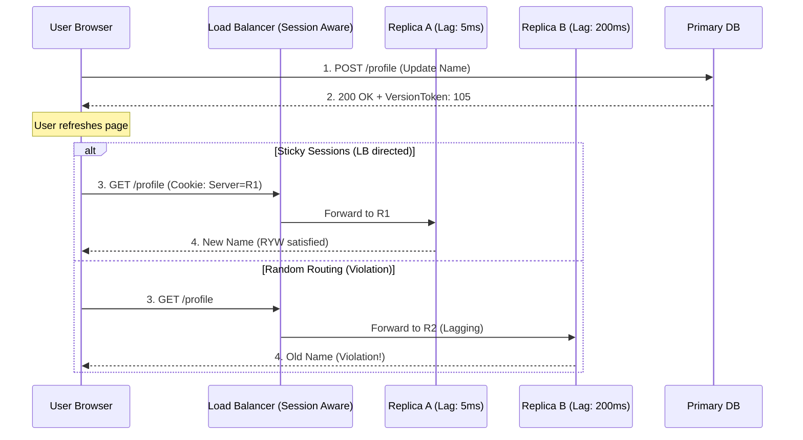

# Session Guarantees

## Why This Exists

"Eventually consistent" is technically correct but practically useless as a design specification. A user who updates their profile photo and immediately sees the old photo is experiencing "correct" eventual consistency — but they think the system is broken. Session guarantees bridge the gap between the theoretical model (eventual consistency) and user expectations by providing specific, implementable promises about what a client sees within its session.

These guarantees were formalized by Terry et al. (1994) at Xerox PARC. They're weaker than linearizability (cheaper to implement) but strong enough to make eventually consistent systems feel correct to users. Most production systems that claim "eventual consistency" actually implement one or more session guarantees on top.

## Mental Model

You're chatting with a support agent across multiple messages. You expect: (1) if you update your address, your next message reflects the new address (read-your-writes); (2) if you read message #5, you'll never see message #4 appear as "new" later (monotonic reads); (3) if you send message A before B, they arrive in that order (monotonic writes); (4) if you reply to message #3, you've definitely seen messages #1 and #2 (writes-follow-reads). These feel obvious in a single-server world, but when your messages might bounce between different servers (replicas), each guarantee requires explicit engineering. Session guarantees sit between "anything goes" (eventual consistency) and "everything is perfectly ordered" (linearizability) — they give you just enough consistency for a sane user experience.

## The Four Session Guarantees

### Read-Your-Writes (RYW)

**Guarantee**: After a client writes a value, any subsequent read by the same client will see that write (or a later one). The client never sees its own writes disappear.

**The problem it solves**: User updates their email. The page reloads. The read goes to a replica that hasn't received the write yet. The user sees the old email and thinks the update failed.

**Implementation approaches**:

**Route reads to the leader after a write**: The simplest approach. After a write, the client reads from the leader (or the same node that accepted the write) for a brief window (e.g., 5 seconds). After the window, reads can go to any replica.

**Track write timestamps**: The client (or the session middleware) remembers the timestamp of the last write. On read, the replica checks if it's caught up to that timestamp. If not, it either waits, forwards to a more up-to-date replica, or reads from the leader.

**Sticky sessions**: Route all of a client's reads to the same replica that accepted their writes. This guarantees RYW trivially (the replica has the write in its local store). But if that replica fails, the session breaks and the client might see older data from a different replica.

**DynamoDB's approach**: DynamoDB allows per-read `ConsistentRead=true` which reads from the leader partition. The application can selectively use this for reads that follow writes.

### Monotonic Reads

**Guarantee**: If a client reads a value at time T, any subsequent read by the same client will return a value at least as new as what was seen at T. Time doesn't appear to go backward.

**The problem it solves**: A user loads a page and sees 10 comments on a post (read from Replica A, which is up to date). They refresh, and the read goes to Replica B (which is behind). They see only 8 comments. Comments appear to have been deleted. They refresh again — back to 10 comments. Confusing and trust-eroding.

**Implementation**: Sticky sessions (always read from the same replica — if it had data at time T, it has it at T+1). Or track the read position: the client remembers the version/timestamp of the last read, and subsequent reads must come from a replica at least that current.

### Monotonic Writes

**Guarantee**: If a client performs write W1 before write W2, all replicas apply W1 before W2. The client's writes are applied in order.

**The problem it solves**: A user updates a row (W1: set status = "processing") and then updates it again (W2: set status = "complete"). If W2 is applied before W1 on some replica, the status ends up as "processing" instead of "complete."

**Implementation**: Typically handled by the replication protocol itself — single-leader replication naturally preserves write order from a single client. Multi-leader or leaderless systems need to track causal dependencies between a client's writes.

### Consistent Prefix (Writes Follow Reads)

**Guarantee**: If a sequence of writes occurs in a causal order, any reader observing those writes will see them in that order. You never see an effect without its cause.

**The problem it solves**: A conversation in a chat app:
- Alice: "What's for dinner?" (write W1)
- Bob: "Pizza!" (write W2, causally after W1)

A reader on a stale replica sees W2 but not W1. They see "Pizza!" with no context. This is confusing and violates causal ordering.

**Implementation**: This is essentially causal consistency at the observation level. It requires tracking causal dependencies between writes and ensuring replicas apply them in order. Single-leader replication with ordered log shipping provides this naturally. Multi-leader systems need vector clocks or similar mechanisms.

**Where it's tricky**: In partitioned databases, writes to different partitions might arrive at a reader in different orders. If W1 and W2 go to different partitions, there's no built-in mechanism to ensure they're observed in order. This is one reason cross-partition consistency is hard.

## Combining Guarantees

In practice, you typically need multiple guarantees together:

**Read-your-writes + monotonic reads** covers most user-facing scenarios: the user always sees their own writes, and the view never regresses. This combination makes an eventually consistent system feel strongly consistent for the most common user interaction pattern (write, then read).

**All four together** approximate causal consistency without the full complexity of a causal consistency protocol. They provide per-session causal ordering, which is sufficient for most applications.

## Implementation Patterns

### Session Token Approach

The most general implementation:

1. On every write, the server returns a **session token** (encoding the write's position in the replication log — e.g., a WAL LSN, a vector clock, or a hybrid logical clock timestamp).
2. The client stores the session token (in a cookie, local storage, or request context).
3. On every read, the client sends the session token. The server ensures the responding replica is at least as current as the token's position. If not, it routes to a more current replica or waits.

**This decouples session guarantees from sticky sessions.** The client can be routed to any replica, as long as that replica has caught up to the session token. This is more resilient than sticky sessions (survives replica failure, compatible with load balancing).

**Facebook's approach**: Facebook uses a "last write timestamp" forwarded from the web tier to the cache/storage tier. The storage tier checks if the serving replica has caught up to that timestamp before returning a response.

### Cost of Session Guarantees

| Guarantee | Added Latency | Infrastructure Cost | Implementation Complexity |
|-----------|---------------|--------------------|-----------------------|
| Read-your-writes | Low (route to leader or wait for replica) | Low | Low-medium |
| Monotonic reads | Low (sticky sessions or version tracking) | Low | Low |
| Monotonic writes | None (usually provided by replication protocol) | None | None (usually free) |
| Consistent prefix | Medium (causal tracking across partitions) | Medium | Medium-high |

## Trade-Off Analysis

| Guarantee | What It Prevents | Implementation Cost | Infrastructure Needed | Best For |
|-----------|-----------------|--------------------|-----------------------|----------|
| Read-your-writes | Reading stale data after your own write | Low — session affinity or version tracking | Sticky sessions or causal tokens | Form submissions, profile updates |
| Monotonic reads | Going "back in time" across reads | Low — track last-read version per session | Session-scoped replica pinning | Paginated lists, dashboards |
| Monotonic writes | Writes applied out of causal order | Medium — serialize per-session writes | Session-scoped write ordering | Counter increments, sequential state transitions |
| Writes-follow-reads | Write not reflecting previously read state | Medium — carry dependency vector | Causal metadata propagation | Comment replies, bid updates |
| All four combined (causal consistency) | All session anomalies | Moderate-High | Full causal tracking infrastructure | Collaborative apps, multi-device sync |

**The sticky session shortcut**: The cheapest way to get read-your-writes and monotonic reads is to pin a user's session to a single replica. No distributed protocol needed — just route by session ID. The downside: failover breaks the guarantee, and you lose load balancing flexibility. For most user-facing apps, this trade-off is acceptable. For multi-device scenarios, you need real causal tracking.

## Failure Modes

- **Sticky session + node failure**: Client is pinned to Replica A for monotonic reads. Replica A fails. Client is rerouted to Replica B, which is behind Replica A. The client sees data regress (violating monotonic reads). Mitigation: session token approach (Replica B can check if it's caught up before responding).

- **Session token with stale replica pool**: All replicas are behind the session token. The client's request can't be served by any replica without waiting. If lag is severe, the wait exceeds the timeout. Mitigation: fall back to the leader for reads when no replica is current enough, or return a slightly stale response with a staleness indicator.

- **Cross-device sessions**: User writes on their phone, then reads on their laptop. Different devices, different sessions, different session tokens. The laptop doesn't have the phone's session token, so RYW isn't guaranteed. Mitigation: store session tokens server-side (per user, not per device) or sync tokens across devices.

## Architecture Diagram

## Back-of-the-Envelope Heuristics

- **Staleness Tolerance**: Most web users won't notice staleness of **< 1 second**. However, for "Action-Feedback" loops (e.g., clicking 'Like'), anything **> 200ms** feels broken.
- **Session Token Size**: A simple Version Token (e.g., a 64-bit LSN) is only **8 bytes**. Even a complex Vector Clock for 10 nodes is only **~80 bytes**, easily fitting in a cookie.
- **Cache TTL vs. Lag**: If your average replication lag is 500ms, set your local session cache TTL to **1 second** to mask the lag during transitions.
- **Leader Read Penalty**: Falling back to the leader for "Read-Your-Writes" typically increases read latency by **5x-10x** if the leader is in a different region.

## Real-World Case Studies

- **YouTube (View Counts)**: YouTube is famously eventually consistent with view counts. You might see 1,000 views, refresh, and see 950. This is a violation of **Monotonic Reads**, but YouTube allows it because the cost of linearizable view counts across billions of videos is too high.
- **Facebook (Web-to-Cache Consistency)**: When you post a comment on Facebook, your browser receives a "Last Write Timestamp." All your subsequent reads include this timestamp. If you hit a cache node that hasn't seen that timestamp yet, the cache node will proxy the request to a more up-to-date node or the primary database to ensure **Read-Your-Writes**.
- **Stripe (API Idempotency)**: Stripe uses session-like keys (Idempotency Keys) to ensure that if a client retries a payment request, they always get the same result. This is a specialized form of **Read-Your-Writes** where the "write" is the payment and the "read" is the retry response.

## Connections

- [[Consistency Spectrum]] — Session guarantees sit between eventual consistency and linearizability on the spectrum
- [[CAP Theorem and PACELC]] — Session guarantees make the EL side of PACELC (eventual consistency + low latency) practically usable
- [[Database Replication]] — Replication lag is the root cause of all session guarantee violations
- [[Cache Patterns and Strategies]] — Cache staleness creates the same problems; similar solutions apply (versioned cache entries, TTL-based freshness)
- [[Logical Clocks and Ordering]] — Session tokens often use logical timestamps to track the "read position"
- [[Load Balancing Fundamentals]] — Sticky sessions for session guarantees interact with load balancing strategies

## Reflection Prompts

1. Your mobile app has 50 million users. You implement RYW using sticky sessions (each user pinned to a specific read replica). What happens to load distribution as users are added? What happens when a replica goes down? Design an alternative using session tokens that works with round-robin load balancing.

2. A user creates a post (write to primary, US-East). Their friend, 5ms later, opens the app (read from replica, EU-West, 200ms replication lag). The friend doesn't see the post. Is this a violation of any session guarantee? Should you solve it? If so, how — and at what cost?

## Canonical Sources

- Terry et al., "Session Guarantees for Weakly Consistent Replicated Data" (1994) — the original paper defining these four guarantees
- *Designing Data-Intensive Applications* by Martin Kleppmann — Chapter 5: "Replication" covers these guarantees in the context of replication lag
- Vogels, "Eventually Consistent" (ACM Queue, 2008) — discusses client-centric consistency models and session guarantees
- Facebook Engineering, "TAO: Facebook's Distributed Data Store for the Social Graph" — describes how Facebook implements session-level consistency for their social graph