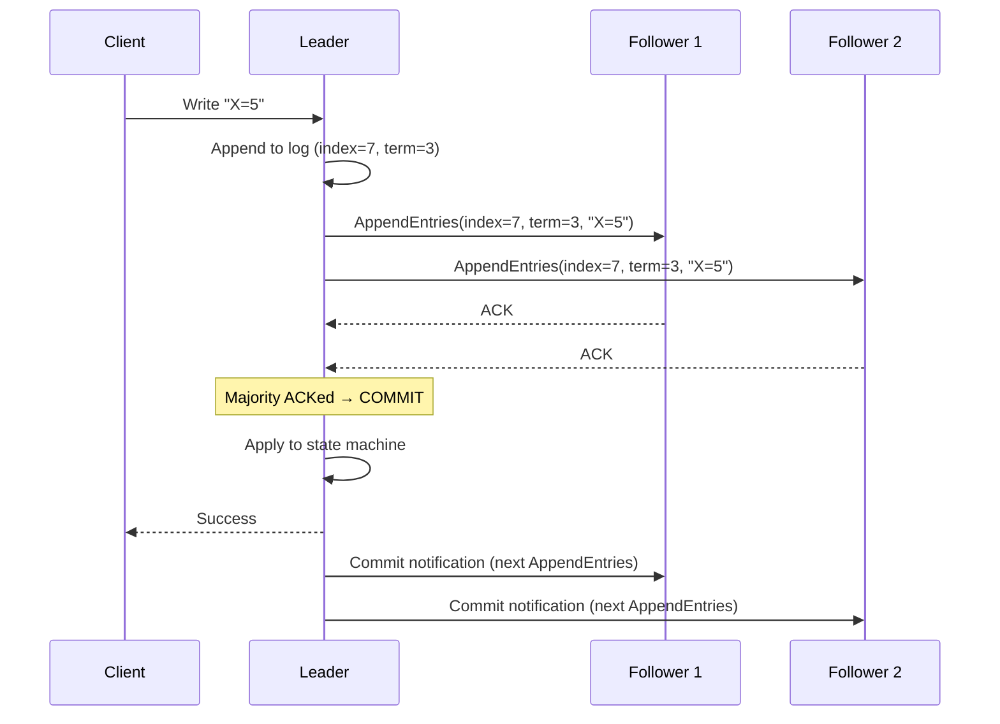
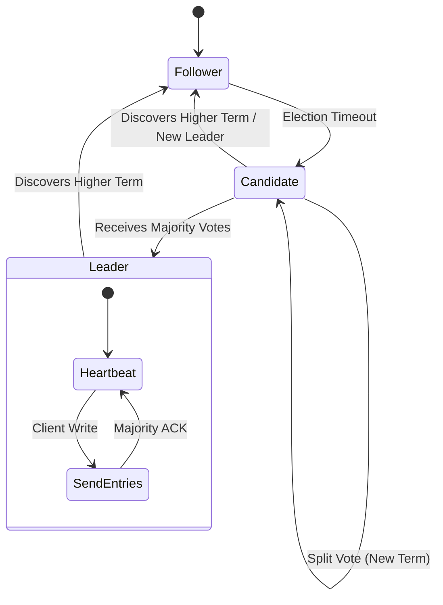

# Consensus and Raft

## Why This Exists

Consensus is the problem of getting multiple nodes to agree on a single value (or a sequence of values) despite failures. It's the foundation of every strongly consistent distributed system: replicated databases, distributed locks, configuration stores, and leader election all depend on consensus.

Raft was designed by Diego Ongaro and John Ousterhout in 2013 with one explicit goal: **understandability**. Paxos, the prior state of the art, was notoriously difficult to understand and even harder to implement correctly. Raft provides equivalent safety guarantees with a design that can be explained, reasoned about, and implemented by working engineers — not just PhD students.

Today, Raft is the consensus algorithm behind etcd (Kubernetes's brain), CockroachDB, TiKV (TiDB's storage), Consul, and many others. Understanding Raft is understanding how modern distributed infrastructure works.

## Mental Model

A replicated notebook. Five people each have a notebook. One person is the **leader** — they decide what gets written and in what order. The others are **followers** — they copy what the leader writes. If the leader leaves the room (crashes), the remaining people hold an **election** to choose a new leader from among themselves. The new leader continues from where the old one left off.

The key invariant: every notebook contains the same entries in the same order. If the notebooks diverge, the system is broken.

## How Raft Works

Raft divides consensus into three sub-problems, each handled independently:

### 1. Leader Election

At any time, each node is in one of three states: **leader**, **follower**, or **candidate**.

Time is divided into **terms** (monotonically increasing integers). Each term has at most one leader. A term begins with an election and continues until the leader fails or the term expires.

**Election process**:
1. A follower's **election timeout** fires (it hasn't heard from the leader in a randomized interval, typically 150–300ms).
2. The follower becomes a **candidate**, increments its term, votes for itself, and sends `RequestVote` RPCs to all other nodes.
3. Each node votes for at most one candidate per term (first-come-first-served). A node only votes for a candidate whose log is at least as up-to-date as its own.
4. If the candidate receives votes from a **majority** (>N/2), it becomes the leader for that term.
5. If no candidate gets a majority (split vote), the term expires and a new election begins with a new term.

**Randomized election timeouts** prevent perpetual split votes. If all nodes had the same timeout, they'd all become candidates simultaneously and keep splitting the vote. Randomization ensures one node times out first and wins the election before others start.

**The majority requirement** ensures at most one leader per term. In a 5-node cluster, a leader needs 3 votes. Two candidates can't both get 3 votes out of 5.

### 2. Log Replication

The leader accepts client requests and appends them to its log as **entries**. Each entry has a term number and an index. The leader sends `AppendEntries` RPCs to followers to replicate the entry.

An entry is **committed** when the leader has replicated it to a majority of nodes. Once committed, the entry is durable — it will survive any subsequent leader failure (because any new leader must have the entry in its log, since it got votes from a majority that includes at least one node with the committed entry).

**Log matching property**: If two nodes have an entry at the same index with the same term, then all entries up to that index are identical. The leader enforces this by including the previous entry's index and term in each `AppendEntries` — followers reject the request if their log doesn't match, and the leader backs up until it finds the point of agreement, then replays from there.

### 3. Safety

Raft's safety guarantee: **if a log entry has been committed, it will be present in the logs of all future leaders.** This is enforced by the election restriction — a candidate can only win an election if its log is at least as up-to-date as the logs of a majority. Since committed entries exist on a majority, any candidate that wins must have all committed entries.

**No entry is ever deleted from the committed log.** Uncommitted entries on a deposed leader may be overwritten by a new leader's log — this is safe because those entries were never committed (never acknowledged to clients).

## Raft in Practice

### Cluster Sizing

- **3 nodes**: Tolerates 1 failure. Minimum for production.
- **5 nodes**: Tolerates 2 failures. Standard for critical infrastructure (etcd, ZooKeeper).
- **7 nodes**: Tolerates 3 failures. Rarely needed — the marginal availability gain is small, and consensus latency increases (more nodes to wait for majority).

**Why odd numbers**: A 4-node cluster tolerates 1 failure (needs 3 for majority) — same as a 3-node cluster but with more overhead. Even-numbered clusters waste a node without improving fault tolerance.

### Performance Characteristics

**Write latency**: One round-trip from leader to majority of followers + fsync on each (WAL flush). In a local cluster, this is 1–5ms. Across regions, it's dominated by network latency (e.g., US-East to EU-West = ~80ms).

**Read latency**: Reads through the leader are linearizable (the leader knows the committed state). Reads from followers may be stale. **Lease-based reads**: The leader holds a lease (a time-bounded promise that no election will occur). During the lease, it can serve reads locally without consulting followers — lower latency, still linearizable as long as clocks are reasonably synchronized.

**Throughput**: Raft's throughput is bounded by the leader — all writes go through one node. This is the fundamental bottleneck. For higher throughput, partition the data and run a separate Raft group per partition (this is what CockroachDB and TiKV do — see [[NewSQL and Globally Distributed Databases]]).

### Common Misconceptions

**"Raft is slow"**: Raft's latency is one round-trip to a majority — the theoretical minimum for consensus. It's not slower than Paxos in practice. The latency you feel is network latency, not algorithmic overhead.

**"Raft doesn't scale"**: Single Raft group throughput is limited by the leader. But Multi-Raft (one group per partition) scales horizontally. CockroachDB runs thousands of Raft groups.

**"Leader election causes downtime"**: Election typically completes in 150–500ms (one election timeout + one vote round). In a well-configured cluster, this is sub-second — perceptible but brief.

### When Consensus Is Overkill

Raft's guarantees — linearizability and fault tolerance across N/2 failures — are powerful, and it's tempting to apply them everywhere. But consensus has a real cost: every write requires a majority round-trip. Before reaching for Raft, ask whether a simpler mechanism provides sufficient guarantees.

**For leader election only (not replicated state)**: A heartbeat + TTL lease via Redis `SETNX` is sufficient. If the leader fails to renew its lease, another node acquires it. You don't need Raft unless you also need to replicate state across the leader's transitions. This is the pattern used by many job schedulers (only one instance should run a job at a time).

**For read-heavy config with tolerable brief staleness**: A replicated key-value store with async replication (Redis Sentinel, a Postgres read replica) serves reads at low latency with no consensus overhead. If serving slightly stale config for a few seconds during a leader failover is acceptable, async replication is dramatically simpler and faster.

**For a single-region, single-node (or single-primary) database**: Postgres `SERIALIZABLE` isolation provides the same linearizability guarantee as a Raft-based system — but for a single-database workload, without any of the distributed consensus machinery. If your workload fits on one primary, you don't need Raft; the DBMS already provides it.

**The litmus test**: "If I ran this on a single machine, would `SERIALIZABLE` transactions be sufficient, and do I not need the fault tolerance of N-1 simultaneous failures?" If yes to both — use a simpler mechanism. If you need to survive the loss of 2 out of 5 nodes and still make progress — use Raft.

## Trade-Off Analysis

| Protocol | Understandability | Performance | Leader Dependency | Best For |
|----------|------------------|-------------|-------------------|----------|
| Raft | High — designed for clarity | Good — single leader, pipelined | Strong — leader bottleneck | etcd, Consul, CockroachDB — most production uses |
| Multi-Paxos | Low — complex, many variants | Good — similar to Raft in practice | Strong — distinguished proposer | Chubby, Spanner internals |
| EPaxos (Egalitarian Paxos) | Very low — complex commit paths | Excellent for geo-distributed (no leader) | None — leaderless | Research, geo-distributed strong consistency |
| Viewstamped Replication | Medium | Good | Strong | Academic, foundational understanding |
| Zab (ZooKeeper Atomic Broadcast) | Medium | Good for ZK's workload (reads >> writes) | Strong | ZooKeeper specifically |

**Raft won the ecosystem**: Despite theoretical alternatives with better properties, Raft dominates production systems because engineers can understand, debug, and operate it. EPaxos removes the leader bottleneck but is so hard to implement correctly that almost nobody uses it. The practical lesson: choose the protocol your team can operate and debug at 3 AM, not the one with the best theoretical throughput.

## Failure Modes

- **Network partition splits the cluster**: If the leader is on the minority side, it can't commit new entries (can't reach a majority). The majority side elects a new leader and continues. The old leader eventually steps down when it discovers a higher term. This is correct behavior — CP in CAP terms.

- **Slow follower**: One follower is slow (disk I/O, network congestion). The leader doesn't wait for it — it only needs a majority. The slow follower catches up asynchronously. It can't become leader until its log is up-to-date (election restriction protects against this).

- **Split brain prevented by term numbers**: A deposed leader (from a previous term) might not know it's been replaced. If it tries to commit entries, followers reject `AppendEntries` with a lower term than their current term. The old leader discovers the higher term and steps down.

- **Disk corruption on leader**: The leader's WAL is corrupted. On restart, it can't recover its log. It must either be rebuilt from peers or replaced. Raft doesn't natively handle Byzantine faults (arbitrary corruption) — it assumes crash-stop failures (nodes either work correctly or stop).

## Architecture Diagram

## Back-of-the-Envelope Heuristics

- **Cluster Size**: Use **3 nodes** to tolerate 1 failure, or **5 nodes** to tolerate 2. Avoid even numbers (4 nodes still only tolerate 1 failure but have higher consensus overhead).
- **Election Timeout**: Typically **150ms - 300ms**. Shorter timeouts lead to faster recovery but increase the risk of false-positive elections during network blips.
- **Heartbeat Interval**: Usually **1/10th of the election timeout** (~20ms).
- **Consensus Latency**: A write requires **1 RTT** to a majority of followers. In a single region, this is **~1-5ms**. Across regions, it's **100ms+**.

## Real-World Case Studies

- **Kubernetes (etcd)**: The "brain" of Kubernetes, **etcd**, uses Raft to store all cluster state (Pods, ConfigMaps, Secrets). Because Raft ensures strong consistency, Kubernetes can guarantee that two controllers never try to manage the same resource simultaneously, preventing race conditions in cluster orchestration.
- **CockroachDB (Multi-Raft)**: CockroachDB doesn't just run one Raft group; it runs **thousands**. Every 64MB "Range" of data is its own independent Raft group. This allows CockroachDB to scale horizontally—adding more nodes just means more Raft groups can be distributed across the cluster.
- **HashiCorp Consul**: Consul uses Raft for its highly-available key-value store and service discovery metadata. They famously documented how they use **Leases** on the Raft leader to allow high-performance, linearizable reads without needing a full consensus round-trip for every `GET` request.

## Connections

- [[Paxos and Its Legacy]] — Raft and Paxos solve the same problem; Raft was designed as an understandable alternative
- [[Coordination Services]] — etcd, ZooKeeper, and Consul are built on Raft (etcd, Consul) or ZAB (ZooKeeper, a Paxos variant)
- [[Distributed Locks and Fencing]] — Consensus enables safe distributed locks
- [[FLP Impossibility]] — Why Raft uses timeouts (it needs partial synchrony assumptions to make progress)
- [[NewSQL and Globally Distributed Databases]] — CockroachDB, TiKV use Multi-Raft (one Raft group per range)
- [[Database Replication]] — Raft-based replication is strongly consistent, unlike async leader-follower replication
- [[Consistency Spectrum]] — Raft provides linearizability for the replicated log

## Reflection Prompts

1. In a 5-node Raft cluster, two nodes (including the leader) crash simultaneously. What happens? Can the cluster make progress? What if three nodes crash?

2. Your Raft cluster spans three data centers: 2 nodes in DC-A, 2 in DC-B, 1 in DC-C. DC-A loses network connectivity to both DC-B and DC-C. What happens to reads and writes in each DC? Is there a better node placement strategy?

## Canonical Sources

- Ongaro & Ousterhout, "In Search of an Understandable Consensus Algorithm" (2014) — the Raft paper. Clear, well-written, and includes the TLA+ specification. Essential reading.
- The Raft visualization at raft.github.io — interactive visualization of leader election and log replication
- Ongaro, "Consensus: Bridging Theory and Practice" (PhD thesis, 2014) — the extended treatment with cluster membership changes, log compaction, and more
- *Designing Data-Intensive Applications* by Martin Kleppmann — Chapter 9: "Consistency and Consensus" covers Raft's place in the consistency hierarchy