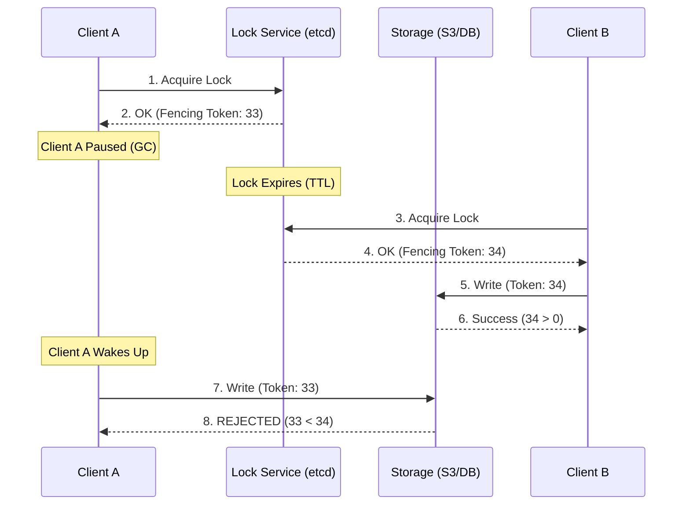

# Distributed Locks and Fencing

## Why This Exists

Sometimes you need mutual exclusion in a distributed system: only one process should write to a file, only one worker should process a job, only one node should be the leader. On a single machine, you use a mutex. Across machines, you need a distributed lock.

But distributed locks are fundamentally more dangerous than local locks. A local mutex is released when the process crashes (the OS cleans up). A distributed lock might *not* be released — the lock holder crashes, and the lock persists in ZooKeeper/etcd/Redis, blocking everyone else. Or worse: the lock holder is alive but paused (GC pause, network delay), and a second process acquires the lock, believing the first has failed. Now two processes think they hold the lock.

This note covers how to implement distributed locks correctly — and why naive implementations are dangerous.

## Mental Model

A key to a hotel room. Only one guest has the key at a time. But what if the guest doesn't return the key (crashes)? The hotel needs a policy: after some time, they issue a new key to the next guest (lease expiry). But what if the original guest returns after their key was reissued? Now two guests have keys to the same room. The fencing token solves this: each key has a unique number, and the room's lock only opens for the highest-numbered key.

## How Distributed Locks Work

### Lock with TTL (Simple but Dangerous)

The simplest distributed lock: write a key with an expiry.

```
LOCK:   SET lock_key my_id NX EX 30     # Set if not exists, expires in 30s
UNLOCK: if GET lock_key == my_id:
            DEL lock_key                  # Release only if I hold it
```

**Why `NX` (set-if-not-exists)**: Ensures only one client acquires the lock. If the key already exists, the SET fails.

**Why TTL**: If the lock holder crashes, the lock auto-expires after 30 seconds. Without TTL, the lock persists forever.

**Why check `my_id` before delete**: Prevents releasing someone else's lock. If my lock expired (TTL) and another client acquired it, I shouldn't delete their lock.

**The fundamental problem — the process pause**:

1. Client A acquires the lock (TTL=30s)
2. Client A enters a GC pause (or network delay) lasting 35 seconds
3. The lock expires (30s TTL)
4. Client B acquires the lock
5. Client A wakes up, still thinking it holds the lock
6. Both A and B proceed — mutual exclusion is violated

No amount of TTL tuning fixes this. The lock holder can't distinguish "I still hold the lock" from "my lock expired while I was paused." This is the core unsafety of TTL-based distributed locks without fencing.

### Fencing Tokens

The solution: every lock acquisition returns a **monotonically increasing fencing token**. The resource being protected (database, file, API) checks the token and rejects requests with a stale (lower) token.

```
1. Client A acquires lock → fencing token = 33
2. Client A pauses (GC)
3. Lock expires, Client B acquires lock → fencing token = 34
4. Client A wakes up, sends request with token 33
5. Resource sees token 33 < 34 (stale), REJECTS the request
6. Client B's requests with token 34 proceed normally
```

**Implementation**: etcd and ZooKeeper provide monotonically increasing revision/sequence numbers naturally. Redis does not — you must implement fencing token generation separately.

**The catch**: The protected resource must support fencing token checking. This means passing the token through to every downstream write and having the downstream reject stale tokens. This is non-trivial — it requires cooperation from the resource, not just the lock service.

### Lease-Based Coordination

A lease is a time-bounded lock with automatic renewal. The lock holder periodically renews the lease; if it fails to renew (crash, network partition), the lease expires and another node can acquire it.

**etcd leases**: Create a lease with a TTL. Attach keys to the lease. A background goroutine sends keepalive RPCs. If the client fails to keepalive before the TTL expires, etcd deletes all keys attached to the lease.

**ZooKeeper ephemeral znodes**: The znode exists as long as the client session is alive. ZooKeeper's session mechanism (heartbeats) handles the "keepalive" automatically. When the session expires, the ephemeral znode is deleted.

**Leader election via leases**: A node creates an ephemeral znode (or an etcd key with a lease) at a well-known path like `/election/leader`. The creation is atomic — only one node succeeds. Other nodes watch the path. When the leader's session expires (crash), the path is deleted, and watchers are notified. A new election round begins.

### Redlock (and Its Controversy)

Redlock is an algorithm proposed by Redis's creator (Salvatore Sanfilippo) for distributed locks across multiple Redis instances:

1. Acquire the lock on N independent Redis instances (e.g., 5)
2. If the lock is acquired on a majority (≥3 of 5) within a time limit, the lock is held
3. The effective TTL is reduced by the time spent acquiring

**The Kleppmann critique**: Martin Kleppmann argued (in "How to do distributed locking," 2016) that Redlock is unsafe because:
- It depends on clock synchronization (TTL timers must be accurate across nodes). Clock skew can cause the lock to expire early on some nodes.
- Process pauses can still violate mutual exclusion (same GC pause problem).
- Without fencing tokens, Redlock doesn't prevent the unsafe scenario.

**Sanfilippo's response**: Argued that Redlock is safe under reasonable system assumptions (bounded clock drift, bounded process pauses).

**Practical guidance**: If you need a lock for **correctness** (financial operations, data integrity), use a consensus-based system (etcd, ZooKeeper) with fencing tokens. If you need a lock for **efficiency** (preventing duplicate work, reducing thundering herd), Redis `SET NX EX` is fine — the worst case is occasional duplicate work, not data corruption.

## When to Use (and Not Use) Distributed Locks

**Use for efficiency (loose lock)**: Preventing duplicate expensive work. If the lock fails, the consequence is wasted computation, not data corruption. Redis `SET NX EX` is appropriate.

**Use for correctness (strict lock)**: Mutual exclusion for data integrity. Use consensus-based locks (etcd, ZooKeeper) with fencing tokens. Accept the latency cost.

**Don't use at all if possible**: Distributed locks add complexity and failure modes. Consider alternatives: idempotent operations ([[01-Phase-1-Foundations__Module-02-API-Design__Idempotency]]) that are safe to execute multiple times, optimistic concurrency control (version numbers, CAS operations), or partitioning the work so no coordination is needed.

## Trade-Off Analysis

| Approach | Safety | Liveness | Complexity | Best For |
|----------|--------|----------|------------|----------|
| Database advisory lock (PostgreSQL) | Strong — single leader DB | Good — auto-release on disconnect | Low | Single-database systems, simple leader election |
| Redis SETNX + TTL | Weak — no fencing, clock-dependent | Good — TTL prevents deadlock | Low | Best-effort mutual exclusion, non-critical dedup |
| Redlock (Redis multi-node) | Disputed — depends on timing assumptions | Good | Medium | When you want Redis-based "stronger" locking (with caveats) |
| ZooKeeper ephemeral nodes | Strong — sequential consistency + ephemeral semantics | Strong — session timeout handles failures | Medium | Production distributed locks, leader election |
| etcd lease-based locks | Strong — linearizable, lease-based | Strong — lease TTL prevents deadlock | Medium | Kubernetes ecosystem, coordination tasks |
| Fencing token approach | Strongest — survives process pauses | Depends on underlying lock | Medium — resource must check tokens | Any lock protecting external state (databases, object stores) |

**The Martin Kleppmann argument**: A lock without a fencing token is fundamentally unsafe. If process A acquires a lock, then pauses for GC, the lock expires, process B acquires it and writes to storage, then A wakes up and also writes — you have data corruption. Fencing tokens (monotonically increasing values checked by the storage layer) are the only way to make distributed locks truly safe. If your storage doesn't support fencing, your lock is advisory, not exclusive.

## Failure Modes

**Lock holder GC pause**: Process A acquires a lock with a 10-second TTL. A GC pause stops A for 15 seconds. The lock expires, process B acquires it and starts working. A wakes up, doesn't know the lock expired, and proceeds — now both A and B hold the "exclusive" lock. Solution: fencing tokens — the lock service issues a monotonically increasing token with each lock acquisition. The protected resource rejects operations with stale tokens.

**Redlock timing assumption violation**: Redlock assumes bounded clock drift and bounded process pauses. If a Redis node's clock jumps forward (NTP step correction), it may expire a lock prematurely. If a process pauses longer than the lock TTL, it operates without the lock. Martin Kleppmann's analysis shows these are realistic scenarios. Solution: use a consensus-based lock (ZooKeeper, etcd) with fencing tokens for safety-critical operations.

**Lock contention causing cascading delays**: Many processes compete for a single lock, each waiting for the current holder to release. If the holder is slow (due to its own dependency being slow), all waiters queue up. Thread pools fill, timeouts cascade, and the entire system degrades. Solution: make critical sections as short as possible, use optimistic concurrency (CAS operations) instead of locks where possible, implement queuing with backpressure.

**Zombie lock from crashed holder**: A process acquires a lock and crashes without releasing it. Without TTL, the lock is held forever — no other process can proceed. With TTL, the lock eventually expires, but there's a window where the system is blocked. Solution: always use TTLs on distributed locks, keep TTLs short (seconds, not minutes), and implement lock renewal (heartbeat) for operations that legitimately take longer.

**Herd effect on lock release**: A lock is released and all waiting processes simultaneously try to acquire it. One wins, the rest retry, creating a thundering herd of lock acquisition attempts. Solution: implement a queue or use sequential/fair locks (ZooKeeper's sequential ephemeral nodes provide FIFO ordering for lock waiters).

## Architecture Diagram



## Back-of-the-Envelope Heuristics

- **Lock TTL Default**: Typically **10s - 30s**. Short enough to recover quickly from crashes, long enough to cover typical GC pauses (< 1s).
- **Renewal (Heartbeat)**: Renew the lock at **1/3rd of the TTL** (e.g., every 10s for a 30s TTL) to ensure the lock doesn't expire during normal operation.
- **Clock Drift Tolerance**: Assume **~10ms - 100ms** of clock drift between servers unless using specialized hardware (PTP).
- **Safety Level**: Redis `SET NX` is for **Efficiency** (avoiding double work). etcd/ZooKeeper is for **Correctness** (avoiding data corruption).

## Real-World Case Studies

- **Google (Chubby)**: Google's **Chubby** lock service is the grandparent of all modern distributed lock systems. They famously documented that the vast majority of their internal outages were caused by developers misunderstanding the semantics of distributed locks, leading to the creation of the "Fencing Token" concept.
- **Hadoop (HDFS Failover)**: Hadoop uses ZooKeeper for leader election of its NameNode. To prevent "Split-Brain" (where two NameNodes both think they are active), the standby node uses a **Fencing** mechanism to power down the old node's network interface or revoke its access to the storage disks before taking over.
- **Netflix (Fenzo)**: Netflix built Fenzo, a cluster autoscaling scheduler. It uses distributed locks to ensure that multiple scheduler instances don't try to place the same task on the same EC2 instance simultaneously, avoiding resource over-subscription.

## Connections

- [[02-Phase-2-Distribution__Module-09-Consensus__Consensus_and_Raft]] — Consensus-based lock services (etcd, ZooKeeper) derive their safety from consensus
- [[02-Phase-2-Distribution__Module-09-Consensus__Coordination_Services]] — The practical systems that provide distributed lock primitives
- [[01-Phase-1-Foundations__Module-02-API-Design__Idempotency]] — If operations are idempotent, you may not need locks at all
- [[02-Phase-2-Distribution__Module-08-Consistency-Models__Consistency_Spectrum]] — Distributed locks require linearizability of the lock state
- [[01-Phase-1-Foundations__Module-03-Storage-Engines__MVCC_Deep_Dive]] — Optimistic concurrency control (compare-and-swap) is an alternative to locks

## Reflection Prompts

1. Your system uses a Redis-based distributed lock to ensure only one worker processes a payment. A GC pause causes the lock to expire while the worker is mid-processing. A second worker acquires the lock and processes the same payment. You've double-charged the customer. How would you redesign this? Consider: fencing tokens, idempotency keys, or eliminating the lock entirely.

2. An engineer proposes using Redlock for leader election in a critical service. What are the specific risks? What would you recommend instead, and what's the latency trade-off?

## Canonical Sources

- Kleppmann, "How to do distributed locking" (blog post, 2016) — the definitive analysis of why naive distributed locks are unsafe and why fencing tokens are necessary
- Sanfilippo, "Is Redlock safe?" (antirez.com, 2016) — the response to Kleppmann's critique
- *Designing Data-Intensive Applications* by Martin Kleppmann — Chapter 8: "The Trouble with Distributed Systems" covers process pauses, clock unreliability, and their impact on locks
- etcd documentation, "Distributed locks" — practical implementation guide using etcd leases