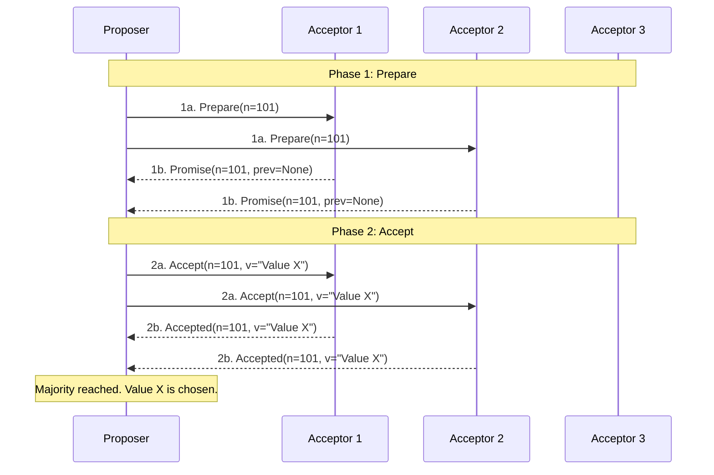

# Paxos and Its Legacy

## Why This Exists

Paxos is the original consensus algorithm, proposed by Leslie Lamport in 1989 (published 1998). For over two decades, it was the only proven approach to distributed consensus. Google's Chubby lock service, Apache ZooKeeper (via the ZAB protocol, a Paxos variant), and many internal Google systems are built on Paxos or Paxos-derived protocols.

But Paxos is famously difficult to understand and implement. Lamport's original paper used an allegory about a fictional Greek parliament that obscured the algorithm. Even "Paxos Made Simple" (2001) — Lamport's plain-language restatement — is considered challenging. This difficulty directly motivated the creation of Raft.

Understanding Paxos matters not because you'll implement it (you almost certainly won't), but because its concepts permeate every consensus system, and understanding why it's hard illuminates what Raft simplifies.

## Mental Model

Paxos is like passing a law in a parliament where members can fall asleep mid-vote. A member proposes a law (proposer), others vote on it (acceptors), and the result is announced (learner). The catch: members can only vote for one law per session, and a law passes only with a majority. If two members propose competing laws simultaneously, one might not get enough votes and has to try again in a new session with a higher priority number. The process guarantees that only one law passes per session, but the back-and-forth can take many rounds. Raft is the modern successor that made this process understandable by adding a clear leader — turning a chaotic parliament into an orderly one with a speaker.

## How Basic Paxos Works

Basic (single-decree) Paxos achieves agreement on a single value among a group of nodes. Three roles: **proposers** (suggest values), **acceptors** (vote on proposals), and **learners** (learn the decided value). A single node can play all roles.

**Phase 1 — Prepare**:
1. A proposer chooses a unique, monotonically increasing proposal number `n`.
2. It sends `Prepare(n)` to a majority of acceptors.
3. Each acceptor responds with a promise: "I will not accept any proposal with number < n." If the acceptor has already accepted a previous proposal, it includes that proposal's number and value in its response.

**Phase 2 — Accept**:
1. If the proposer receives promises from a majority, it sends `Accept(n, v)` where `v` is either the value from the highest-numbered previously accepted proposal (if any), or the proposer's own value (if no acceptor had accepted anything).
2. Each acceptor accepts the proposal unless it has already promised to a higher-numbered proposal.
3. Once a majority of acceptors accept the same proposal, the value is **chosen** (decided).

**The key insight**: Phase 1 discovers any previously accepted value. If a value has already been chosen (accepted by a majority), the proposer must adopt it. This prevents conflicting values from being chosen — at most one value can ever be decided.

## Why Paxos Is Hard

**Single-decree is insufficient**: Basic Paxos decides one value. Real systems need to decide a sequence of values (a replicated log). Multi-Paxos runs many Paxos instances (one per log slot) with an optimization: a stable leader skips Phase 1 for subsequent proposals, reducing each decision to one round-trip. But the Multi-Paxos specification is underspecified — the original paper doesn't describe leader election, log compaction, membership changes, or recovery in detail. Every implementation fills these gaps differently.

**No stable leader in basic Paxos**: Any node can propose at any time, leading to **dueling proposers** — two proposers alternately preempting each other's Phase 1, making no progress (livelock). Multi-Paxos adds a leader to avoid this, but leader election is itself underspecified.

**Gaps in the log**: In Multi-Paxos, different proposers can fill different log slots. Slot 5 might be decided before slot 4, leaving a gap. The system must handle gap-filling, which adds complexity.

**Implementation freedom**: Paxos describes safety properties (what must be true) but not implementation details (how to achieve it efficiently). Two correct Paxos implementations can look vastly different in their leader election, log management, and recovery mechanisms. This implementation freedom is both Paxos's strength (flexibility) and its curse (no reference implementation, endless subtle bugs).

Lamport himself acknowledged: "The Paxos algorithm, when presented in plain English, is very simple." The difficulty is in everything Paxos *doesn't* specify that a real system needs.

## Paxos Variants and Descendants

**Multi-Paxos**: The practical extension for replicated logs. Stable leader optimization. Used (in various interpretations) by Chubby, Spanner's original implementation, and many internal Google systems.

**ZAB (ZooKeeper Atomic Broadcast)**: ZooKeeper's consensus protocol. Essentially Multi-Paxos with a specific leader election mechanism and a focus on ordered broadcast (all messages delivered in the same order to all nodes). ZAB is Paxos-derived but has enough differences that it's considered a distinct protocol.

**Viewstamped Replication (VR)**: Predates Paxos (1988, by Oki and Liskov) and is conceptually simpler. Raft's design was influenced by VR more than Paxos. VR explicitly defines leader election, log replication, and view changes — the things Paxos leaves underspecified.

**EPaxos (Egalitarian Paxos)**: A leaderless variant where any node can propose and, for non-conflicting operations, achieve consensus in one round-trip (instead of two). Better throughput and lower latency for non-conflicting workloads. More complex, less widely adopted.

**Flexible Paxos**: Shows that the Phase 1 quorum and Phase 2 quorum don't need to be identical — they just need to overlap. This enables configurations with smaller Phase 2 quorums (faster commits) at the cost of larger Phase 1 quorums (slower leader election). Useful for systems where leader changes are rare but commits happen constantly.

## Raft vs Paxos

| Dimension | Raft | Paxos (Multi-Paxos) |
|-----------|------|---------------------|
| Design goal | Understandability | Correctness proof |
| Leader | Mandatory, explicitly defined | Optimization, often underspecified |
| Log | No gaps (entries committed in order) | Gaps possible (out-of-order slot decisions) |
| Specification completeness | Complete (election, replication, membership changes, compaction) | Incomplete (safety proved, implementation left to engineer) |
| Implementation consistency | Implementations look similar | Implementations vary wildly |
| Proven equivalence | Safety equivalent to Multi-Paxos | — |
| Adoption (2020s) | etcd, CockroachDB, TiKV, Consul, many others | ZooKeeper (ZAB), Spanner (internally), Chubby |

**The practical verdict**: For new systems, use Raft. It's easier to implement, easier to verify, easier to debug, and has the same safety guarantees. Paxos survives in systems built before Raft existed (ZooKeeper, older Google infrastructure) and in research on advanced variants (EPaxos, Flexible Paxos).

## Trade-Off Analysis

| Paxos Variant | Rounds per Decision | Throughput | Complexity | Best For |
|--------------|--------------------|-----------|-----------|---------| 
| Basic Paxos (single-decree) | 2 (prepare + accept) | Low — 2 rounds per value | High | Teaching, understanding the foundations |
| Multi-Paxos | 1 (accept only, with stable leader) | Good — leader bypasses prepare phase | High — leader election, log management | Chubby, Spanner — production Google systems |
| Fast Paxos | 1 in fast path, 2 on collision | Higher in low-contention | Very high — collision recovery | Low-contention geo-distributed writes |
| Flexible Paxos | Varies — asymmetric quorums | Tunable — smaller write quorums | High | Geo-distributed systems with asymmetric read/write loads |
| Raft (Paxos-equivalent) | 1 (leader appends, replicates) | Good — same as Multi-Paxos | Low — designed for understandability | Everything that would have used Multi-Paxos |

**Why Raft replaced Paxos in practice**: Lamport's original Paxos paper is famously hard to understand. Multi-Paxos (the practical version) was never fully specified — every implementation filled in different gaps. Raft specifies everything: leader election, log replication, membership changes, snapshotting. The result: Raft implementations are more consistent and easier to verify. There's no performance reason to choose Paxos over Raft for new systems.

## Failure Modes

**Paxos prepare-phase storm**: In basic Paxos without a stable leader, every node can try to propose a value by sending PREPARE with a higher ballot number. Under contention, proposers keep bumping ballot numbers, and no ACCEPT ever reaches a quorum. Progress stalls. Solution: use Multi-Paxos with a stable distinguished proposer (leader) — skip the PREPARE phase entirely when the leader is stable. This is what all production implementations do.

**Log gaps in Multi-Paxos**: A leader proposes values for log positions 1, 2, 3, but the ACCEPT for position 2 fails (network issue). Positions 1 and 3 are committed, but 2 is a gap. The state machine can't apply position 3 until 2 is filled. Solution: the new leader must run a full round of Paxos for each gap before resuming normal operation. Raft avoids this entirely by requiring contiguous log entries.

**Membership change unsafety**: Changing the set of participants (adding or removing a node) in Paxos requires care. Two overlapping quorums from the old and new configurations could both commit conflicting values. Solution: Raft's joint consensus protocol handles membership changes safely. For Paxos, use a separate consensus instance to agree on configuration changes before applying them.

**Implementation divergence**: Because Lamport's Paxos paper doesn't specify many practical details (log management, snapshotting, membership changes), every implementation fills in the gaps differently. This makes implementations hard to verify and prone to subtle bugs that only manifest under specific failure sequences. Google's Chubby paper noted that the Paxos implementation was the hardest distributed systems code they ever wrote. Solution: use Raft, which specifies all these details, or use a well-tested Paxos library rather than implementing from scratch.

## Architecture Diagram

## Back-of-the-Envelope Heuristics

- **Decision Latency**: Basic Paxos requires **2 RTTs** per value. Multi-Paxos (with a stable leader) reduces this to **1 RTT**.
- **Message Complexity**: In a cluster of N nodes, each decision requires **O(N)** messages. For 5 nodes, that's roughly 10-15 messages per value.
- **Quorum Requirement**: A majority of **(N/2)+1** nodes is required for any progress. A 3-node cluster can handle 1 failure; 5 nodes can handle 2.
- **Stable Storage**: Every Paxos acceptor **MUST** fsync its promise/acceptance to a persistent WAL (Write-Ahead Log) before responding, adding **~1-10ms** disk latency to every round.

## Real-World Case Studies

- **Google (Chubby)**: Chubby is a distributed lock service that powers almost everything at Google (BigTable, Spanner, etc.). It was one of the first major systems to use Paxos for its core consensus engine. Google engineers famously wrote that implementing Paxos for Chubby was the most difficult engineering task they ever faced, leading them to warn others against implementing it from scratch.
- **Apache ZooKeeper (ZAB)**: ZooKeeper uses **ZAB (ZooKeeper Atomic Broadcast)**, which is a Paxos-derived protocol optimized for primary-backup replication. While not "pure" Paxos, it shares the same safety foundations. It powers massive clusters at LinkedIn, Twitter, and Pinterest, handling the configuration and coordination of thousands of servers.
- **Microsoft (Azure Storage)**: Azure's core storage system (XStore) uses a Paxos variant to manage the "Extent Nodes" that store actual data. They use Paxos to maintain consistent metadata about where data is stored, ensuring that even under massive hardware failure, no data is lost and the system remains consistent.

## Connections

- [[Consensus and Raft]] — Raft was explicitly designed as a more understandable alternative to Paxos
- [[Coordination Services]] — ZooKeeper uses ZAB (Paxos-derived); etcd and Consul use Raft
- [[FLP Impossibility]] — Both Paxos and Raft work around FLP by using timeouts (partial synchrony)
- [[NewSQL and Globally Distributed Databases]] — Spanner originally used Multi-Paxos; CockroachDB and TiKV use Raft

## Reflection Prompts

1. A senior engineer argues that your team should use Paxos instead of Raft for a new coordination service because "Paxos is more flexible and has been proven for longer." How do you respond? What concrete advantages does Raft have for a team implementing consensus for the first time?

2. Why does Paxos require two phases (Prepare + Accept) instead of just one (propose a value, accept if majority agrees)? Construct a scenario where a single-phase protocol would lead to two different values being chosen.

## Canonical Sources

- Lamport, "Paxos Made Simple" (2001) — the most accessible description of Paxos; still challenging but essential
- Lamport, "The Part-Time Parliament" (1998) — the original Paxos paper with the Greek parliament allegory
- Ongaro & Ousterhout, "In Search of an Understandable Consensus Algorithm" (2014) — Section 2 explains why Paxos is hard, motivating Raft
- Van Renesse & Altinbuken, "Paxos Made Moderately Complex" (2015) — a more complete specification of Multi-Paxos with implementation details
- Moraru, Andersen, Kaminsky, "There Is More Consensus in Egalitarian Parliaments" (2013) — the EPaxos paper