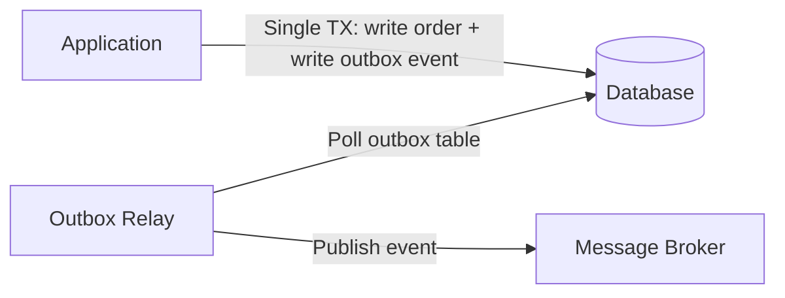

# Outbox Pattern

## Why This Exists

A service updates its database and publishes an event to a message broker. These are two operations on two different systems. If the database write succeeds but the event publish fails (broker is down, network error), the database reflects the change but downstream consumers never hear about it. If the event publishes but the database write fails, consumers react to an event that didn't actually happen.

You could use 2PC across the database and the broker — but that's exactly what we're trying to avoid ([[Two-Phase Commit]]). The outbox pattern solves this without distributed transactions: **write the event to the database in the same local transaction as the business data, then asynchronously relay the event to the message broker.**


## Mental Model

The dual-write problem is like trying to mail a letter AND update your address book at the same time. If you mail the letter first and crash before updating the book, the book is wrong. If you update the book first and crash before mailing, the letter never sends. The outbox pattern: instead of mailing the letter directly, you write it and place it in your outbox tray — in the same motion as updating the book (same database transaction). A postal worker (CDC/poller) comes by periodically, picks up everything in the outbox tray, and mails it. If you crash after updating the book but before the postal worker arrives, no problem — the letter is safely in the outbox tray, and the worker will find it later.

## How It Works

### The Pattern

1. The service performs its business logic and writes to its domain tables.
2. In the **same database transaction**, it also writes an event record to an `outbox` table.
3. A separate process (the **relay**) reads events from the outbox table and publishes them to the message broker (Kafka, RabbitMQ, etc.).
4. After successful publication, the relay marks the event as published (or deletes it from the outbox).



**Why this works**: Because the business data and the outbox event are written in the same local transaction, they're atomic — both succeed or both fail. The relay is a separate process that can retry publishing indefinitely. If the relay crashes, it restarts and picks up where it left off (unpublished events are still in the outbox table).

**The trade-off**: Events are published **at-least-once**, not exactly-once. If the relay publishes an event but crashes before marking it as published, it'll publish the event again on restart. Consumers must be idempotent ([[Idempotent Consumers]]).

### The Outbox Table

```sql
CREATE TABLE outbox (
    id UUID PRIMARY KEY DEFAULT gen_random_uuid(),
    aggregate_type VARCHAR(255) NOT NULL,    -- e.g., 'Order'
    aggregate_id VARCHAR(255) NOT NULL,      -- e.g., '12345'
    event_type VARCHAR(255) NOT NULL,        -- e.g., 'OrderCreated'
    payload JSONB NOT NULL,                  -- event data
    created_at TIMESTAMPTZ NOT NULL DEFAULT NOW(),
    published_at TIMESTAMPTZ                 -- NULL until published
);
```

### Relay Implementations

**Polling**: The relay periodically queries the outbox table for unpublished events (`WHERE published_at IS NULL ORDER BY created_at`). Simple, but adds latency (polling interval) and database load (frequent queries).

**CDC-based (Change Data Capture)**: Instead of polling, use the database's WAL to detect new outbox rows. Debezium (the standard CDC tool) watches the Postgres WAL or MySQL binlog, detects inserts to the outbox table, and publishes them to Kafka. This is near-real-time, lower database load, and the most common production approach.

**The CDC advantage**: The relay doesn't need to query the database at all — it reads the WAL stream. This eliminates polling overhead and reduces latency to milliseconds. Debezium's outbox event router is purpose-built for this pattern.

**Listen/Notify** (Postgres): Use `LISTEN/NOTIFY` to trigger the relay when a new outbox row is inserted. Lower latency than polling, simpler than CDC, but less reliable (notifications can be lost if the relay is disconnected).

## Outbox vs Direct Publishing

| Approach | Atomicity | Reliability | Latency | Complexity |
|----------|-----------|-------------|---------|------------|
| Direct publish (write DB, then publish) | No — DB and broker can diverge | Low — publish can fail silently | Lowest | Lowest |
| 2PC (XA transaction across DB + broker) | Yes — atomic commit | High but fragile (blocking) | High | High |
| Outbox + polling relay | Yes (local TX) | High (at-least-once) | Medium (polling interval) | Medium |
| Outbox + CDC relay | Yes (local TX) | High (at-least-once) | Low (near-real-time) | Medium-high |

## Trade-Off Analysis

| Approach | Atomicity | Latency | Operational Complexity | Best For |
|----------|----------|---------|----------------------|----------|
| Direct publish (write DB + send message) | None — dual write, can lose messages | Low | Low | Non-critical notifications, best-effort events |
| Transactional outbox (poll) | Full — same DB transaction | Higher — polling interval delay | Medium — poller process, dedup | Most systems needing reliable event publishing |
| Transactional outbox (CDC) | Full — same DB transaction | Low — near real-time from WAL | Higher — CDC infrastructure (Debezium) | High-throughput, low-latency event publishing |
| Listen/Notify (PostgreSQL) | Full — triggered by DB commit | Very low | Medium — must handle reconnects | PostgreSQL-native, moderate throughput |
| Event table + application relay | Full — same transaction | Variable — depends on relay frequency | Medium | When CDC isn't available |

**CDC-based outbox is the gold standard**: Polling the outbox table works but adds latency and DB load proportional to poll frequency. CDC (Change Data Capture) reads the database's WAL directly — near real-time delivery with zero additional DB queries. Debezium + Kafka Connect is the most common implementation. The cost is operational complexity: you now run and monitor a CDC pipeline.

## Failure Modes

- **Relay lag**: The relay falls behind (slow broker, high event volume). Events are delayed. The outbox table grows. Mitigation: monitor relay lag, scale relay consumers, alert on outbox table size.

- **Duplicate publishing**: Relay publishes event, crashes before marking it published, and republishes on restart. Mitigation: consumers must be idempotent. Include a unique event ID in the outbox row and use it for deduplication downstream.

- **Outbox table bloat**: If published events aren't cleaned up, the outbox table grows indefinitely. Mitigation: delete or archive published events periodically. A simple approach: `DELETE FROM outbox WHERE published_at < NOW() - INTERVAL '7 days'`.

- **Ordering guarantees**: If the relay publishes events from multiple transactions, the publishing order may not match the transaction commit order (especially with parallel relay workers). Mitigation: use a single-threaded relay per aggregate, or include a sequence number per aggregate to allow consumers to reorder.

## Architecture Diagram

```mermaid
graph LR
    subgraph "Service A (Trust Boundary)"
        App[Application Logic] -->|1. Atomic TX| DB[(Primary DB)]
        subgraph "Database Transaction"
            DB --- Biz[Biz Data: orders]
            DB --- Out[Outbox Table: events]
        end
    end

    subgraph "Reliable Relay"
        DB -.->|2. Tail WAL| CDC[CDC: Debezium]
        CDC -->|3. Publish| Kafka[(Message Broker)]
    end

    subgraph "Service B (Consumer)"
        Kafka -->|4. Deliver| SvcB[Consumer Logic]
        SvcB -->|5. Check Dedup| SvcB_DB[(Consumer DB)]
    end

    style App fill:var(--surface),stroke:var(--accent),stroke-width:2px;
    style CDC fill:var(--surface),stroke:var(--accent2),stroke-width:2px;
```

## Back-of-the-Envelope Heuristics

- **Relay Latency**: Polling adds **~1s - 5s** latency. CDC (Debezium) adds **~50ms - 200ms**.
- **Table Size**: Keep only **~24-48 hours** of history in the outbox table. Delete published rows aggressively to keep indexes small and fast.
- **CDC Overhead**: Tailing the WAL for CDC typically adds **< 3% CPU** load to the source database.
- **Availability**: The outbox pattern decouples your database's availability from the message broker's availability. Your app can still accept orders even if Kafka is down.

## Real-World Case Studies

- **LinkedIn (Databus)**: LinkedIn pioneered the CDC-based outbox pattern with **Databus**. They found that dual-writes were the leading cause of data inconsistency between their primary databases and their search indexes (Lucene). By moving to a WAL-tailing approach, they ensured that search results always eventually matched the source of truth without slowing down the write path.
- **Salesforce (The Event Bus)**: Salesforce uses a specialized outbox pattern to power their "Change Data Capture" product. Every time a user modifies a record in the UI, Salesforce writes the change to an internal system table. A background fleet of relays then streams these changes to a global event bus, allowing customers to build reactive integrations without triggers or polling.
- **Wix (Managing 2000+ Services)**: Wix uses the outbox pattern as the foundation for their entire microservices ecosystem. They developed an internal library called **Greyhound** that abstracts the outbox table and relay, ensuring that every one of their thousands of services can publish reliable events to Kafka without developers having to write boilerplate transaction code.

## Connections

- [[Saga Pattern]] — The outbox pattern is the mechanism for reliable event publishing in choreography-based sagas
- [[Idempotent Consumers]] — Outbox publishes at-least-once; consumers must handle duplicates
- [[Two-Phase Commit]] — The outbox pattern avoids 2PC between the database and the message broker
- [[Write-Ahead Log]] — CDC-based outbox relays read the WAL, connecting database durability to event publishing
- [[Change Data Capture]] — CDC is the preferred relay mechanism for production outbox implementations

## Reflection Prompts

1. Your service writes to Postgres and publishes events to Kafka. Currently, it writes to the database, then publishes to Kafka in the same request handler. If Kafka is down, the event is lost. How do you migrate to the outbox pattern with minimal disruption? What changes in the application code, and what new infrastructure do you need?

2. Your outbox relay uses Debezium CDC. The Debezium connector crashes and is down for 2 hours. During that time, 50,000 events accumulate in the outbox. When Debezium restarts, it replays from its last checkpoint — potentially republishing some events that were already published before the crash. How do you handle this on the consumer side?

## Canonical Sources

- *Microservices Patterns* by Chris Richardson — Chapter 3: "Interprocess Communication" covers the outbox pattern in detail
- Debezium documentation, "Outbox Event Router" — the standard implementation for CDC-based outbox
- Kleppmann, "Using Logs to Build a Solid Data Infrastructure" (talk, 2016) — connects CDC, event sourcing, and the outbox pattern