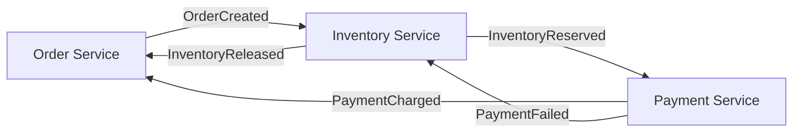
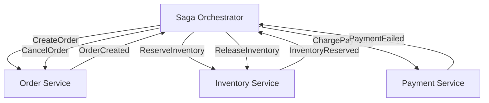

# Saga Pattern

## Why This Exists

2PC gives you atomicity across services but at a steep cost: blocking locks, coordinator SPOF, tight coupling. Sagas provide an alternative: instead of one distributed transaction, break the operation into a sequence of local transactions. Each step commits independently. If a later step fails, execute **compensating transactions** to undo the earlier steps.

Sagas trade atomicity for availability. At any point during a saga, the system is in an intermediate state (some steps committed, others not yet). This is eventual consistency at the business logic level — and it requires careful design of compensating transactions and idempotent steps.

## Mental Model

Booking a vacation: you book the flight (step 1), then the hotel (step 2), then the car rental (step 3). If the car rental fails, you cancel the hotel (compensate step 2), then cancel the flight (compensate step 1). Each booking/cancellation is a separate transaction with its own system. There's no "atomic vacation booking" — you manage the sequence and handle failures.

## How It Works

A saga is a sequence of local transactions T1, T2, ..., Tn, each with a compensating transaction C1, C2, ..., Cn. If Ti fails, execute Ci-1, Ci-2, ..., C1 in reverse order to undo the completed steps.

**Example — Order Processing Saga**:

| Step | Forward Transaction | Compensating Transaction |
|------|-------------------|------------------------|
| 1 | Create order (status: PENDING) | Cancel order |
| 2 | Reserve inventory | Release inventory |
| 3 | Charge payment | Refund payment |
| 4 | Confirm order (status: CONFIRMED) | — (final step, no compensation needed) |

If step 3 (charge payment) fails:
- Execute C2: Release inventory
- Execute C1: Cancel order
- The system returns to a consistent state

### Choreography vs Orchestration

Two ways to coordinate the saga steps:

**Choreography**: Each service listens for events and reacts. No central coordinator. Service A completes its step and publishes an event. Service B listens for that event, executes its step, and publishes its own event.



**Pros**: Decoupled — each service only knows about events, not other services. No SPOF coordinator. Scales well for simple, linear sagas.

**Cons**: Hard to understand the full saga flow (logic is distributed across services). Difficult to manage complex sagas with branches, parallel steps, or conditional logic. Debugging requires tracing events across services. Adding a step means modifying multiple services' event handlers.

**Orchestration**: A central **saga orchestrator** directs each step. It sends commands to services and waits for responses. It knows the full saga definition and manages the sequence, including compensations on failure.



**Pros**: The saga logic is in one place — easy to understand, test, and modify. Handles complex flows (branching, parallel steps, timeouts). Easier to add monitoring and alerting for saga state.

**Cons**: The orchestrator is a central component (potential bottleneck, must be highly available). Services are coupled to the orchestrator's command protocol. Can evolve into a "god service" if not carefully scoped.

**Practical guidance**: Choreography for simple sagas (2–3 steps, linear). Orchestration for anything complex (4+ steps, branching, compensation logic, timeouts). Most production systems use orchestration because saga complexity grows faster than expected.

**Temporal and Cadence**: Workflow orchestration engines (originally Cadence from Uber, now Temporal) provide durable execution for saga orchestration. The orchestrator's state is persisted — if it crashes mid-saga, it resumes from the last checkpoint. This eliminates the "orchestrator crash" failure mode.

## Designing Compensating Transactions

Compensation is the hardest part of saga design. Not every action is easily reversible:

**Reversible actions**: Reserve inventory → release inventory. Hold funds → release hold. Create draft order → delete draft order.

**Non-reversible actions**: Send an email (can't unsend). Charge a credit card (must issue a refund, which is a different operation). Ship a physical product (must initiate a return process). Post to a public feed (must post a retraction).

**Principles**:
- Compensating transactions must be **idempotent** ([[Idempotency]]). The compensation might be retried if the first attempt fails or its acknowledgment is lost.
- Compensating transactions are **not** rollbacks. A rollback undoes a transaction as if it never happened. A compensation is a new transaction that semantically reverses the effect — the original and the compensation are both visible in the history.
- Some steps are **non-compensatable**. For these, place them last in the saga (after all compensatable steps succeed), or use a "pivot transaction" — the point of no return after which the saga must complete forward, never backward.

## Saga State and Isolation

Sagas do NOT provide isolation. Between steps, other transactions can see intermediate state:

- After step 1 (order created) but before step 3 (payment charged), the order exists but is unpaid. Another service querying orders would see a PENDING order.
- This is by design — but the application must handle it. Common approaches: status fields (PENDING, CONFIRMED, FAILED), reserved states that other operations respect, and "dirty read" awareness in downstream services.

**Semantic locks**: A service can "lock" an entity by setting its status to a reserved state (e.g., inventory status = RESERVED) that other operations check before proceeding. This isn't a database lock — it's an application-level convention. It prevents conflicting operations but doesn't provide true isolation.

## Trade-Off Analysis

| Coordination Style | Coupling | Visibility | Complexity | Best For |
|-------------------|---------|------------|------------|----------|
| Orchestration (central coordinator) | Higher — orchestrator knows all steps | Excellent — single place to see saga state | Medium — orchestrator is a single service | Complex business workflows, order processing |
| Choreography (event-driven) | Lower — each service reacts to events | Poor — saga state spread across services | Medium — hard to debug, emergent behavior | Simple sagas (2-3 steps), highly decoupled teams |
| Hybrid (orchestrator + events) | Moderate | Good | Higher | Long-running workflows with async steps |

| Saga vs Alternative | Consistency | Isolation | Complexity | Best For |
|--------------------|------------|-----------|------------|----------|
| Distributed transaction (2PC) | Strong — atomic commit | Serializable | Medium — coordinator + locks | Short-lived, same-trust-domain transactions |
| Saga with compensations | Eventual — compensations may fail | None — dirty reads possible (no isolation) | High — must design every compensation | Cross-service business processes |
| Reservation pattern (try/confirm/cancel) | Eventual — but resources reserved | Soft isolation via reservations | Medium | Inventory, seat booking, resource allocation |

**Sagas lack isolation**: This is the part most teams underestimate. While a saga is in progress, intermediate states are visible to other transactions. If step 2 of 5 has completed, another request might see that partial state. Mitigation: semantic locks (mark records as "pending"), or design so intermediate states are acceptable.

## Failure Modes

- **Compensation failure**: Step 3 fails, so you try to compensate step 2 (release inventory). The compensation itself fails (inventory service is down). Now you're stuck — the saga is partially committed and partially compensated. Mitigation: retry compensations with exponential backoff, use a dead letter queue for compensation failures, alert for manual intervention.

- **Saga timeout**: Step 2 is taking too long. Is the service slow or has it crashed? The orchestrator must decide: wait longer (risking stuck sagas) or compensate preemptively (risking compensating a step that will eventually succeed). Mitigation: explicit timeouts per step, with compensation triggered on timeout. Steps must be idempotent to handle the "compensation + late success" race.

- **Concurrent sagas on the same entity**: Two sagas both try to reserve the same inventory item. Without isolation, both might succeed, over-reserving. Mitigation: use optimistic concurrency control (version numbers) or application-level semantic locks on the shared resource.

## Architecture Diagram

```mermaid
graph TD
    subgraph "Orchestration Saga"
        Orch[Saga Manager] -->|1. Create| Order[Order Service]
        Orch -->|2. Reserve| Stock[Inventory Service]
        Orch -->|3. Charge| Pay[Payment Service]
        
        Pay -- "FAIL" --> Orch
        Orch -.->|Compensate: Release| Stock
        Orch -.->|Compensate: Cancel| Order
    end

    subgraph "Choreography Saga"
        C_Order[Order Created] --> C_Stock[Reserve Stock]
        C_Stock --> C_Pay[Charge Payment]
        C_Pay -- "Failed Event" --> C_Stock_Comp[Release Stock]
    end

    style Orch fill:var(--surface),stroke:var(--accent),stroke-width:2px;
    style Pay fill:var(--surface),stroke:var(--accent2),stroke-width:1px;
```

## Back-of-the-Envelope Heuristics

- **Complexity Threshold**: Use **Choreography** (event-based) for sagas with **< 3 steps**. Use **Orchestration** for **4+ steps** or complex branching logic.
- **Saga Duration**: Sagas can last from **milliseconds to weeks** (e.g., a "Customer Onboarding" saga).
- **Storage for Orchestrator**: The orchestrator must persist its state. A 5-step saga might generate **1KB - 5KB** of state data.
- **Retry Strategy**: Compensating transactions must be **retried until success**. They cannot fail permanently, or the system remains in an inconsistent state.

## Real-World Case Studies

- **Uber (Cadence/Temporal)**: Uber built **Cadence** (and later the community created **Temporal**) specifically to handle massive sagas like "Trip Lifecycle." A single trip involves dozens of services (pricing, matching, routing, payments, safety). They found that choreography was impossible to debug at their scale, so they moved to a centralized orchestrator that persists the state of every trip saga.
- **Booking.com (Hotel Reservations)**: Booking a hotel is a classic saga. You "reserve" a room (Step 1), then "pay" (Step 2). If the payment fails, the system must "release" the room. Because hotel systems are often slow or offline, these sagas can stay in a "Pending" state for minutes, requiring a robust orchestrator to handle timeouts and retries.
- **Amazon (Order Fulfillment)**: When you click "Buy Now," Amazon kicks off a massive saga. If a warehouse discovers an item is damaged while packing (Step 3), the system must compensate by either finding another warehouse (Retry Step 3) or refunding the customer (Compensate Step 2).

## Connections

- [[Two-Phase Commit]] — Sagas are the alternative to 2PC; they trade atomicity for availability and decoupling
- [[Outbox Pattern]] — Reliable event publishing for saga choreography
- [[Idempotent Consumers]] — Every saga step and compensation must be idempotent
- [[Idempotency]] — Foundation for safe retries in saga execution
- [[Event Sourcing and CQRS]] — Event sourcing provides a natural saga audit trail

## Reflection Prompts

1. Design a saga for an e-commerce checkout: create order → reserve inventory → charge payment → send confirmation email → update analytics. Which steps are compensatable? Which is the pivot transaction? What happens if the email service is down after payment succeeds?

2. Your choreography-based saga has grown to 7 steps across 5 services. A developer reports they can't figure out why some orders end up in an inconsistent state. What's the likely root cause, and how would migrating to orchestration help (or not)?

## Canonical Sources

- *Microservices Patterns* by Chris Richardson — Chapters 4–5 cover the saga pattern in depth, including choreography vs orchestration, compensating transactions, and semantic locks
- *Designing Data-Intensive Applications* by Martin Kleppmann — Chapter 9 discusses the limitations of 2PC that motivate sagas
- Garcia-Molina & Salem, "Sagas" (1987) — the original saga paper from the database community
- Temporal documentation (temporal.io) — the leading workflow orchestration platform for implementing sagas