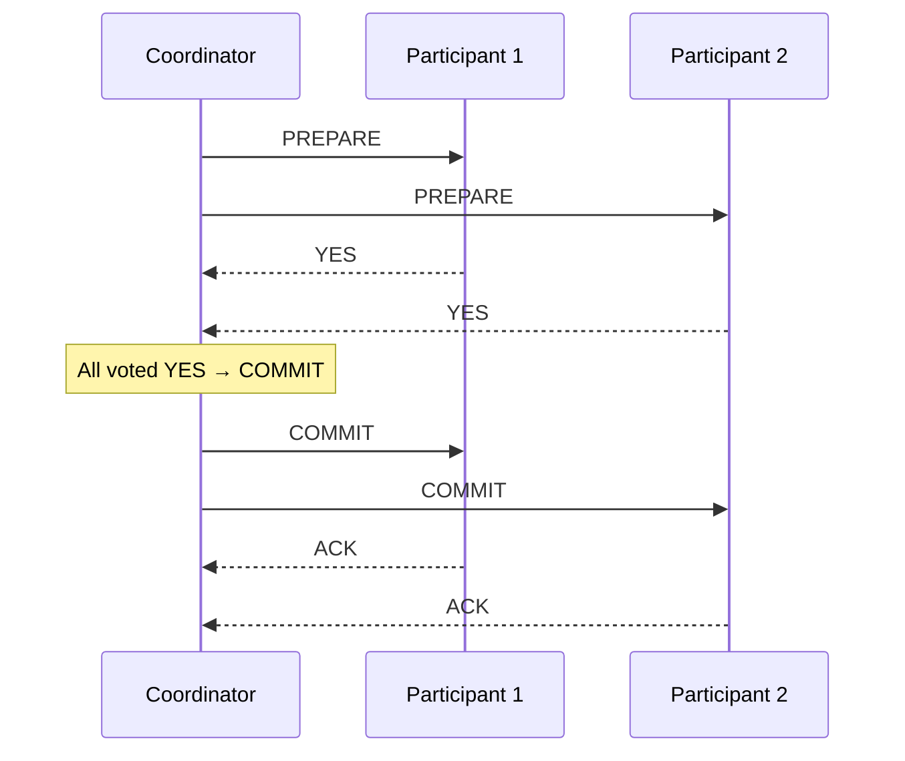
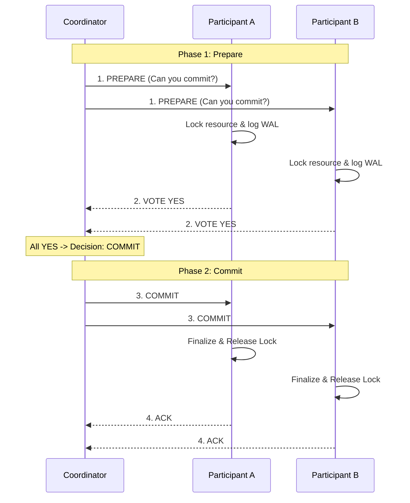

# Two-Phase Commit

## Why This Exists

You need an operation to either succeed on all participants or fail on all — atomicity across multiple nodes. "Transfer $100 from Bank A to Bank B" must either debit A and credit B, or do neither. If only one side completes, money is created or destroyed.

Two-phase commit (2PC) is the classic protocol for achieving this. It uses a coordinator to drive all participants to the same decision (commit or abort). It works — but its failure modes are so problematic that modern microservice architectures almost universally avoid it in favor of sagas.

## Mental Model

A wedding ceremony. The officiant (coordinator) asks each partner (participants): "Do you take this person?" In Phase 1 (prepare/vote), each partner says "I do" or "I don't." If both say "I do," the officiant proceeds to Phase 2 (commit): "I now pronounce you married." If either says "I don't," the officiant says "wedding's off" (abort). The problem: what if the officiant has a heart attack after both partners said "I do" but before pronouncing them married? Both partners are stuck — they've promised (locked their resources) but can't proceed or back out until the officiant recovers. This is the blocking problem of 2PC, and it's why microservices avoid it.

## How 2PC Works

**Phase 1 — Prepare (Voting)**:
1. The coordinator sends a `PREPARE` message to all participants.
2. Each participant executes the transaction locally (acquires locks, writes to WAL) but does NOT commit.
3. Each participant responds with `YES` (ready to commit) or `NO` (cannot commit).

**Phase 2 — Commit/Abort (Decision)**:
1. If ALL participants voted YES, the coordinator sends `COMMIT` to all.
2. If ANY participant voted NO (or didn't respond), the coordinator sends `ABORT` to all.
3. Participants execute the decision (commit or rollback) and release locks.

## Why 2PC Is Problematic

### Why Participants Cannot Self-Resolve

The blocking problem is not a design oversight — it follows from a fundamental impossibility. When participant P1 has voted YES and is waiting for the coordinator's decision, it cannot unilaterally decide either way without risking split-brain.

If P1 unilaterally aborts, it might contradict a `COMMIT` that the coordinator already delivered to P2 before crashing. P2 has committed; P1 has aborted. The transaction is half-done — exactly the corruption that 2PC was designed to prevent. If P1 unilaterally commits, it might contradict an `ABORT` that the coordinator sent to P2 because a *different* participant voted NO before the crash. Now P1 committed and P2 aborted. Same result, different direction.

A naive fix seems obvious: let participants communicate with each other and reach consensus. The problem is information asymmetry. Only the coordinator collected all votes. P1 knows it voted YES and that the protocol was initiated, but it does not know how many participants there are, which ones voted YES, or which ones voted NO. If P1 contacts P2 and P3 and they are all in PREPARED state (all voted YES), they can safely agree to commit. But if P3 is in ABORTED state (it voted NO before the coordinator failed), the participants now have conflicting information with no way to determine the ground truth. This is why 2PC is provably blocking under coordinator failure in an asynchronous network — it requires a coordinator who has the full vote record, and that coordinator's loss is unrecoverable until it restarts.

### The Blocking Problem

Between Phase 1 (participant votes YES) and Phase 2 (coordinator sends COMMIT/ABORT), the participant is in a **prepared** state. It has voted YES — promising to commit if told to. It holds locks on the affected data. It cannot unilaterally commit or abort — it must wait for the coordinator's decision.

**If the coordinator crashes after receiving all YES votes but before sending the decision**, all participants are stuck. They're holding locks, blocking other transactions, and can't proceed. They must wait for the coordinator to recover and replay its decision from its log. This is the **blocking failure mode** — the defining weakness of 2PC.

In the worst case, the coordinator's disk fails and the decision is lost. Now participants are stuck indefinitely. Manual intervention is required — an operator must decide whether to commit or abort, hoping the guess is consistent with the coordinator's intended decision.

### Network Partition Mid-Commit

A coordinator crash is the canonical failure, but a network partition during Phase 2 is equally damaging and more common. Suppose the coordinator has received all YES votes and begins sending `COMMIT`. It successfully delivers `COMMIT` to P1 and P2. A network partition then isolates the coordinator from P3 and P4. From P3 and P4's perspective, they are in PREPARED state with no decision received. From P1 and P2's perspective, they committed and released their locks. The system is inconsistent: two participants have applied the transaction and two have not, and the latter two are holding locks.

Unlike a coordinator crash (where the coordinator restarts and replays the decision), a partition involves a *live* coordinator that can retry. When the partition heals, the coordinator retries `COMMIT` to P3 and P4, and consistency is restored. But the recovery window is bounded by the partition duration — a 30-second partition means 30 seconds of lock contention on P3 and P4's rows, cascading into request timeouts across anything that needs those rows.

This probability scales poorly in microservice deployments. With 5 services each at 99.9% availability, the chance that at least one is unreachable during a 2PC round is approximately `1 - (0.999)^5 ≈ 0.5%`. At 100 transactions per second, that is roughly one blocked transaction every 20 seconds — each holding locks in multiple services simultaneously.

### Availability Impact

During 2PC, all participants hold locks on their data. Any other transaction attempting to access that data is blocked until 2PC completes. If the protocol stalls (coordinator slow, network delay), lock contention cascades through the system. A single slow 2PC transaction can degrade the performance of an entire database.

### The Coordinator Is a SPOF

The coordinator's crash blocks the entire transaction. This means the coordinator must be highly available — which typically means the coordinator itself uses consensus (Raft, Paxos). Now you're layering consensus on top of 2PC, adding complexity and latency.

### 3PC: The Non-Solution

Three-phase commit (3PC) was designed to address the blocking problem by adding a pre-commit phase. In theory, 3PC is non-blocking — participants can make a unilateral decision if the coordinator fails. In practice, 3PC is not used because:
- It requires a synchronous network model (bounded message delay) which doesn't hold in real systems.
- It's more complex than 2PC with marginal practical benefit.
- Network partitions still break it — a partition during the pre-commit phase can lead to inconsistent decisions on different sides.

## When 2PC Is Still Used

Despite its problems, 2PC is appropriate in specific contexts:

**Within a single database** (e.g., across partitions): Spanner and CockroachDB use 2PC for cross-range transactions. The coordinator is co-located, latency is low, and Raft-based replication makes the coordinator fault-tolerant. The blocking problem is mitigated because the coordinator itself is replicated.

**XA transactions** (cross-database): The XA standard defines 2PC across heterogeneous databases (e.g., Oracle + MySQL in one transaction). Used in some enterprise environments, but becoming less common as microservices replace monolithic architectures.

**Short-lived, latency-tolerant operations**: If the transaction completes in milliseconds and all participants are in the same data center, the blocking window is small and the risk is manageable.

## Why Microservices Avoid 2PC

In a microservice architecture, participants are independent services with their own databases, deployed independently, owned by different teams. 2PC in this context means:

- Every service must implement the 2PC participant protocol.
- The coordinator becomes a centralized dependency.
- Lock contention crosses service boundaries (one slow service blocks transactions in all other services).
- Service independence is lost — you can't deploy, scale, or fail a service without considering its impact on in-flight 2PC transactions.

This violates the core principle of microservice architecture: independent deployability. Instead, microservices use the [[Saga Pattern]], which achieves eventual consistency through compensating transactions without cross-service locks.

## Trade-Off Analysis

| Protocol | Blocking on Coordinator Failure | Latency | Message Complexity | Best For |
|----------|---------------------------------|---------|-------------------|----------|
| 2PC (Two-Phase Commit) | Yes — participants hold locks until coordinator recovers | High — 2 round-trips + lock duration | O(N) messages per phase | Same-datacenter transactions, database XA |
| 3PC (Three-Phase Commit) | No — adds pre-commit phase | Higher — 3 round-trips | O(N) per phase | Theoretical — rarely used in practice |
| Saga (compensating transactions) | No — no global locks | Lower per step — but total saga is longer | Varies — one message per step | Cross-service, long-running business processes |
| Calvin / deterministic ordering | No — pre-ordered execution | Low — single round-trip for ordering | O(N) for ordering, then local execution | Deterministic databases (FaunaDB) |

**2PC's real problem isn't performance — it's operational risk**: When the coordinator crashes after sending PREPARE but before sending COMMIT, all participants hold their locks and wait. They can't unilaterally abort (another participant might have committed) or commit (the coordinator might have decided to abort). This "doubt" state can last until the coordinator recovers — potentially hours. This is why 2PC is used within a single database or datacenter, but sagas are preferred across service boundaries.

## Failure Modes

**Coordinator failure during PREPARED state**: The coordinator crashes after sending PREPARE and receiving all YES votes, but before sending COMMIT. All participants are in the PREPARED state — they've promised to commit but don't know the final decision. They hold locks and wait for the coordinator to recover. This "doubt" state can last minutes to hours. Solution: write the decision to a durable log before sending COMMIT, use a recovery protocol that queries participants, or set a bound on doubt duration with heuristic resolution.

**Participant timeout during PREPARED**: A participant is PREPARED and waiting for COMMIT. The coordinator is alive but slow (network congestion, high load). The participant can't unilaterally abort (the coordinator might have committed other participants) or commit (the coordinator might have aborted). It's stuck holding locks. Solution: 3PC adds a PRE-COMMIT phase that allows participants to time out safely, but 3PC is rarely used due to higher latency. In practice, use aggressive coordinator health monitoring.

**Orphaned transaction locks**: After a 2PC coordinator failure, participants hold row-level locks for the prepared transaction. Other transactions trying to access these rows are blocked. If the coordinator doesn't recover quickly, business-critical operations are stalled. Solution: most databases allow manual heuristic resolution (`COMMIT FORCE` or `ROLLBACK FORCE` in Oracle), but this risks inconsistency. Monitor for long-running prepared transactions and alert immediately.

**Network partition splitting participants**: During the COMMIT phase, the coordinator sends COMMIT to 3 of 5 participants, then a partition isolates it from the remaining 2. The 2 unreached participants stay in PREPARED state. They can't know whether to commit or abort. Solution: the coordinator retries COMMIT to unreached participants after the partition heals. Participants must store the PREPARED state durably and wait. There's no timeout-based resolution that's safe.

## Architecture Diagram

## Back-of-the-Envelope Heuristics

- **Write Latency**: Minimum **2 RTTs** (Round Trip Times) between the coordinator and the furthest participant.
- **Lock Duration**: Locks are held for the entire duration of the 2PC process. If a participant is 100ms away, resources are locked for at least **200ms**, dramatically reducing concurrency.
- **Throughput Penalty**: 2PC can reduce a database's transaction throughput by **50% - 90%** compared to local transactions due to coordination overhead and lock contention.
- **Failure Probability**: The risk of a transaction being "blocked" (stuck in prepared state) increases linearly with the number of participants. `P(blocked) = 1 - (1 - p)^n`, where `p` is the probability of a single node/link failure.

## Real-World Case Studies

- **Google Spanner (Optimized 2PC)**: Spanner uses 2PC for transactions that span multiple "Directory" ranges. However, each participant in the 2PC is not a single server, but a **Raft Group**. This means even if a server fails, the Raft Group stays alive and can continue the 2PC, effectively solving the "blocking participant" problem.
- **Java EE (JTA/XA)**: In the early 2000s, Java Enterprise Edition relied heavily on **XA Transactions** (distributed 2PC) to coordinate between an App Server, a Message Queue (JMS), and a Database. This was notoriously brittle; a single network blip would leave "in-doubt" transactions in the database that had to be manually cleared by DBAs.
- **CockroachDB (Parallel Commits)**: CockroachDB implements an optimization called **Parallel Commits**. By cleverly structuring the transaction record, they can return "Success" to the client as soon as the participants have finished Phase 1 (Prepare), while the actual Commit (Phase 2) happens asynchronously in the background, reducing user-visible latency to 1 RTT.

## Connections

- [[Saga Pattern]] — The alternative to 2PC for multi-service transactions
- [[Outbox Pattern]] — Reliable event publishing without 2PC between the database and message broker
- [[Consensus and Raft]] — Raft-replicated coordinators mitigate 2PC's SPOF problem
- [[NewSQL and Globally Distributed Databases]] — Spanner uses 2PC within its infrastructure, with Raft-replicated participants
- [[Distributed Locks and Fencing]] — 2PC's prepare phase is essentially a distributed lock across participants

## Reflection Prompts

1. A team proposes using XA transactions across their payments database (Postgres) and their ledger database (MySQL) to ensure atomicity. What are the specific failure scenarios they should worry about? What happens if the coordinator crashes after both databases vote YES?

2. Spanner uses 2PC for cross-shard transactions but claims to avoid 2PC's blocking problem. How? What makes Spanner's 2PC different from traditional 2PC between independent databases?

## Canonical Sources

- *Designing Data-Intensive Applications* by Martin Kleppmann — Chapter 9: "Consistency and Consensus" covers 2PC, its failure modes, and the blocking problem
- *Database Internals* by Alex Petrov — Chapter 13 covers distributed transactions including 2PC mechanics
- Gray & Lamport, "Consensus on Transaction Commit" (2006) — formalizes the relationship between 2PC and consensus