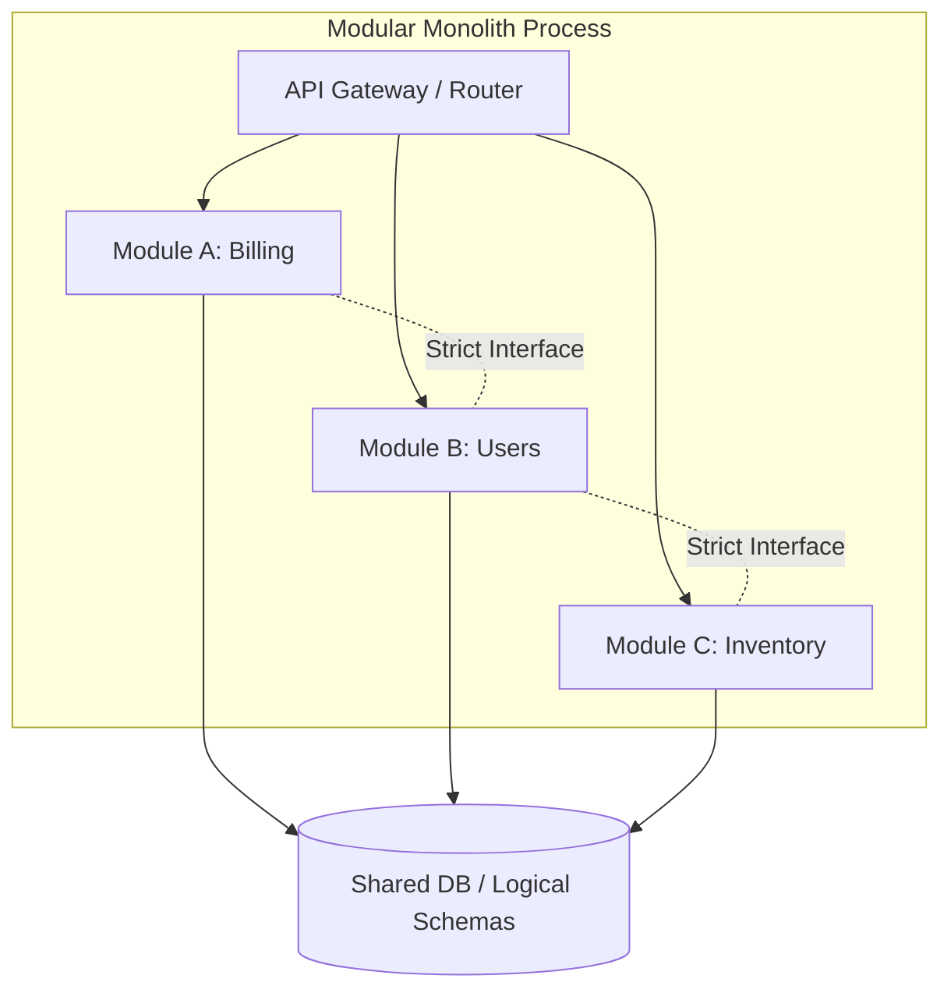

# Modular Monoliths

## What is a Modular Monolith?

A modular monolith is an architectural pattern where a system is deployed as a single application, but the codebase is strictly organized into independent, interchangeable modules. Unlike a "big ball of mud" monolith where everything is tightly coupled, a modular monolith enforces strict boundaries, often using Domain-Driven Design (DDD) principles.

## The Return to Monoliths

By 2026, the industry has seen a massive shift back to modular monoliths from microservices. Microservices introduced significant operational drag: distributed tracing, complex deployments, latency overhead, and the difficulty of consistent cross-service transactions. Modular monoliths solve the developer velocity problem (the main driver for microservices) by separating code logically without separating it physically.

## Why This Exists

This note exists to highlight the pivot from strict microservices to pragmatic, socio-technical architectures. Conway's Law dictates that systems mirror communication structures; modular monoliths allow teams to work independently on bounded contexts without the tax of managing a fleet of distributed systems.

## Reflection Prompts

1. What specific signal would indicate that a module in a modular monolith should be extracted into its own microservice?
2. How do you enforce strict module boundaries in your language of choice to prevent it from degrading into a tightly coupled monolith?
