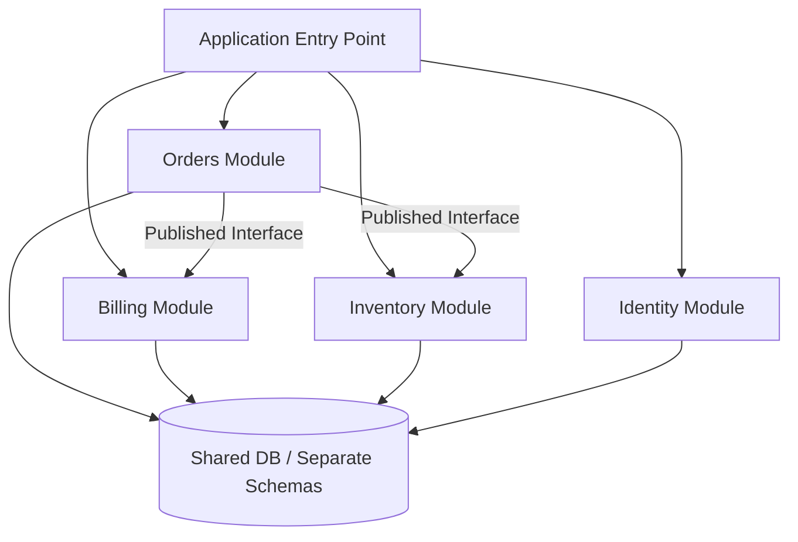

# Modular Monoliths

## Why This Exists

For years, "good architecture" was often equated with microservices. But many teams discovered that they had imported the operational complexity of distributed systems long before they had earned the organizational benefit. Network boundaries, separate deployments, cross-service transactions, schema drift, tracing overhead, and platform burden all arrived before the team actually needed them.

A modular monolith exists to recover a neglected middle ground: **keep the system physically together while making it logically separate**. You get strong module boundaries, clearer ownership, and easier evolution without paying the network tax of distribution on day one.

This note matters because many teams do not actually have a microservices problem. They have a boundary problem, and a modular monolith solves that more cheaply.

## Mental Model

Think of a modular monolith like an office building with separate locked departments. Finance, HR, and legal are all in the same building, which makes shared services cheap and communication fast. But each department still has controlled access, clear responsibilities, and defined interfaces.

A bad monolith is one giant open-plan office where everyone interrupts everyone else and files are scattered everywhere. A microservices architecture is many buildings across the city: stronger separation, but now every conversation needs transport, contracts, and coordination.

The modular monolith aims for "one building, many disciplined departments."

## What Is a Modular Monolith?

A modular monolith is a single deployable application whose internals are divided into strongly bounded modules. Each module owns:

- its domain logic
- its interfaces
- its internal data access rules
- its dependency boundaries

The application is deployed as one process or one coordinated unit, but developers are prevented from reaching across module boundaries arbitrarily.

This is very different from:

- a **big ball of mud**, where every package imports everything else
- a **microservice fleet**, where every boundary is also a network boundary

## Architecture Pattern

The important phrase is **published interface**. Modules may collaborate, but only through explicit contracts, not by reaching into each other's internals.

## Why Teams Return to It

### The microservice tax arrived too early

Microservices are valuable when independent deployment and scaling genuinely matter. But many teams adopted them before:

- having enough engineers to sustain service ownership
- having platform tooling for observability and CI/CD
- having domain boundaries stable enough to justify the split

The result was distributed complexity without distributed benefit.

### Team coordination often matters more than topology

Conway's Law still applies in a modular monolith. Teams can own bounded contexts and review changes independently even when the runtime is shared. The code boundary provides most of the value long before a network boundary becomes necessary.

### Refactoring inside one process is cheaper

Moving code between modules inside one repository is usually far easier than untangling APIs, data contracts, and deployment flows across live services.

## How It Works

### Module boundaries first

A real modular monolith starts with domain boundaries, not package names. Typical modules might be:

- orders
- payments
- identity
- inventory
- search
- notifications

Each module should expose a narrow public API and hide its internal implementation.

### Shared database, controlled ownership

The tricky part is persistence. Many modular monoliths use one physical database, but still isolate ownership through:

- per-module schemas
- repository boundaries
- database access rules enforced by code review and tests
- no direct table access across modules without an explicit contract

This keeps data-local operations cheap while still preserving domain ownership.

### Enforced dependency direction

The architecture should define:

- which modules may call which
- which utilities are truly shared
- which dependencies are forbidden

Without enforcement, the modular monolith degrades into an ordinary monolith.

Common enforcement mechanisms:

- package visibility rules
- static architecture tests
- build-time dependency checks
- repository conventions with strict review discipline

## When It Is the Right Choice

A modular monolith is often the best default when:

- one team or a small number of teams own the product
- deployment simplicity matters
- domain boundaries exist but are still evolving
- cross-module workflows are common
- transaction consistency inside one process is valuable
- the organization does not want a large platform tax yet

It is especially effective in the "we know we need boundaries, but we are not yet sure which ones deserve a network hop" phase.

## When It Is the Wrong Choice

### Independent scaling is the main requirement

If one domain needs radically different scaling behavior, compute shape, or runtime isolation, the single deployment unit becomes a bottleneck.

### Organizational ownership is already deeply separated

If dozens of teams need fully independent release cycles, on-call boundaries, and runtime control, a single deployable can become a coordination choke point even if the code is well structured.

### Regulatory or blast-radius isolation is mandatory

Some domains need hard runtime isolation, not just logical separation. In those cases a module boundary is not strong enough.

## Trade-Off Analysis

| Dimension | Modular Monolith | Microservices |
|----------|-------------------|---------------|
| **Operational complexity** | Lower | Higher |
| **Deployment independence** | Lower | Higher |
| **Local refactoring speed** | Higher | Lower |
| **Runtime isolation** | Lower | Higher |
| **Distributed failure modes** | Minimal | Significant |
| **Transaction simplicity** | Higher | Lower |

The real question is not which architecture is more modern. It is which one matches the current organizational and operational shape of the system.

## Failure Modes

### Fake modules

Teams create folders named `orders`, `billing`, and `inventory`, but the internals are still fully coupled. Modules reach into each other's repositories, tables, and private classes.

Mitigation: enforce boundaries mechanically. If the build cannot fail on a boundary violation, the architecture will drift.

### Shared database turns into shared ownership

A single database is not the problem by itself. The problem is when every module starts reading and writing every table directly because "it's all in the same DB anyway."

Mitigation: define table ownership clearly and treat cross-module data access as an architectural event, not a convenience shortcut.

### Single deployable becomes release bottleneck

As the codebase grows, one deployment pipeline can become crowded. A minor change in one module forces retesting and redeploying everything.

Mitigation: this is the signal to invest in stronger build partitioning, contract tests, or eventually extract the specific hot module that truly needs independence.

### Gradual erosion into a big ball of mud

This is the default fate of a monolith without active discipline. Architectural quality decays because the easiest fix is always "just import the thing."

Mitigation: architecture tests, mandatory module ownership, and periodic dependency reviews.

## The Extraction Question

The modular monolith is often the best precursor to microservices because it makes extraction cleaner. A module should usually be extracted only when:

- it has a stable boundary
- its workload profile is distinct
- it needs independent deployment cadence
- the team structure already maps to it
- the operational benefit exceeds the distributed-systems cost

Extraction should be a response to pressure, not a rite of passage.

## Back-of-the-Envelope Heuristics

- **Default posture**: if a system can remain in one process without violating team or scaling constraints, start there.
- **Extraction signal**: do not extract a module because it is "important." Extract it when it needs a different scaling, deployment, or isolation model.
- **Boundary quality test**: if two modules cannot be explained with separate responsibilities in one sentence each, the split is probably not mature.
- **Review burden test**: when unrelated changes in one area repeatedly require deep knowledge of another, the module boundary is too weak.
- **Platform tax rule**: if your team is still building basic observability and deployment hygiene, adding more runtime boundaries usually makes the situation worse before it makes it better.

## Real-World Case Studies

- **Shopify and Rails monolith traditions**: large product organizations have repeatedly shown that strong internal modularity can scale much further than teams assume, provided boundaries and ownership stay disciplined.
- **Early-stage SaaS products**: many successful startups begin with a monolith because they need to discover the domain before freezing it into service boundaries. The winning move is disciplined modularity, not premature distribution.
- **Platform migrations**: teams that successfully move from monolith to services usually do so from a modular monolith, because the extraction targets already exist in code and concept.

## Connections

- [[03-Phase-3-Architecture-Operations__Module-12-Architectural-Patterns__Event_Sourcing_and_CQRS]] — Strong internal boundaries matter even before runtime distribution
- [[03-Phase-3-Architecture-Operations__Module-12-Architectural-Patterns__Cell-Based_Architecture]] — Cell architectures are what you adopt when one deployable is no longer enough for blast-radius or scaling reasons
- [[02-Phase-2-Distribution__Module-10-Distributed-Transactions__Saga_Pattern]] — A monolith can often avoid distributed transaction complexity that appears immediately in a service split
- [[00-Phase-0__Evolving_Designs_Over_Time]] — Modular monoliths are often a deliberate phase, not a dead end
- [[00-Phase-0__Reasoning_Through_Trade-Offs]] — This choice is a trade-off between local simplicity and future independence

## Reflection Prompts

1. What specific pressure in your current system would justify moving from a modular monolith to microservices: team autonomy, scaling asymmetry, blast radius, or compliance?
2. How would you enforce module boundaries in your primary language and build system?
3. If your system already has microservices, which of those services would have been better as modules inside a monolith?

## Canonical Sources

- Simon Brown, talks and writing on modular monoliths and architectural fitness functions
- Martin Fowler, "Monolith First" and related writing on evolutionary architecture
- Domain-Driven Design literature on bounded contexts and organizational boundaries
