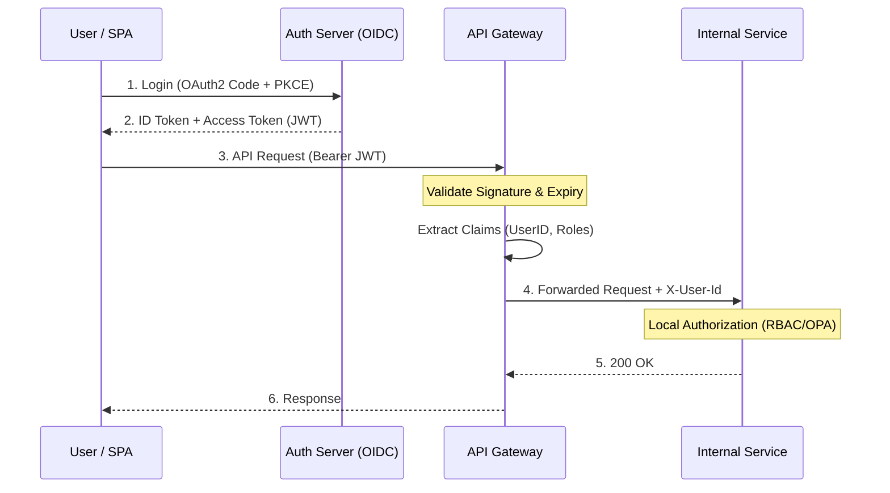

# Authentication and Authorization

## Why This Exists

Authentication answers "who are you?" Authorization answers "what are you allowed to do?" In a monolith, these are often intertwined — a middleware checks the session cookie, looks up the user, and checks their role in the same function. In a microservice architecture, they must be explicitly designed: the API gateway authenticates, extracts identity, and passes it downstream. Each service then independently authorizes the request. Getting this wrong means either security holes (unauthorized access) or usability disasters (legitimate users blocked by broken auth logic).

## Mental Model

Authentication is checking someone's passport at the border — "Are you who you claim to be?" Authorization is checking their visa — "Now that I know who you are, are you allowed into this area?" They're often confused because they happen close together, but they're fundamentally different questions. You can authenticate perfectly (confirm someone's identity) and still deny authorization (they don't have the right permissions). OAuth2 is the standard protocol for the passport check. OIDC adds a standardized ID card. RBAC/ABAC are the rules that decide what the visa allows.

## Authentication: OAuth2 and OIDC

### OAuth2 Core Concepts

OAuth2 is an **authorization framework** — it defines how a third-party application can access a user's resources without the user sharing their password. The key insight: instead of giving the application your Google password, Google gives the application a limited-scope **access token** that expires.

**Roles**: Resource Owner (the user), Client (the application), Authorization Server (Google, Auth0, Keycloak), Resource Server (the API being accessed).

### The Two Flows That Matter

**Authorization Code + PKCE** (for user-facing apps — web, mobile, SPA):

1. User clicks "Login with Google." The app redirects to Google's authorization endpoint with a `code_challenge` (PKCE — Proof Key for Code Exchange).
2. User authenticates with Google, consents to the requested scopes.
3. Google redirects back to the app with an **authorization code** (a one-time-use token).
4. The app exchanges the code for tokens (access token + refresh token) at Google's token endpoint, proving possession of the `code_verifier` (PKCE).
5. The app uses the access token to call APIs on behalf of the user.

**Why PKCE is mandatory**: Without PKCE, an attacker who intercepts the authorization code (via a malicious redirect, XSS, or browser extension) can exchange it for tokens. PKCE ties the code to the original requester — the attacker has the code but not the code_verifier, so the exchange fails. PKCE is required for all public clients (SPAs, mobile apps) and recommended for confidential clients.

**Client Credentials** (for service-to-service):

No user involved. The service authenticates directly with the authorization server using its client_id and client_secret, receives an access token. Used for machine-to-machine communication (batch jobs, internal services, background workers).

### OIDC (OpenID Connect)

OAuth2 tells you "this token grants access to these resources." OIDC adds: "and here's who the user is." OIDC is a layer on top of OAuth2 that provides an **ID token** — a JWT containing identity claims (user ID, name, email, roles).

**Token lifecycle**: Access tokens are short-lived (15 minutes – 1 hour). They're passed in the `Authorization: Bearer <token>` header. Refresh tokens are long-lived (days – weeks) and used to get new access tokens without re-authenticating. Store refresh tokens securely (server-side or encrypted local storage — never in cookies accessible to JavaScript).

**JWT validation at the gateway**: The [[01-Phase-1-Foundations__Module-02-API-Design__API_Gateway_Patterns|API gateway]] validates the JWT signature (using the IdP's public key), checks expiry, extracts claims (user_id, roles), and passes them to downstream services as trusted headers (`X-User-Id`, `X-User-Roles`). Downstream services trust these headers because the gateway is the trust boundary. **Critical**: downstream services must reject requests that arrive without going through the gateway (network policies enforce this).

## Authorization Models

### RBAC (Role-Based Access Control)

Users are assigned roles ("admin", "editor", "viewer"). Each role has a set of permissions ("admin can create, read, update, delete; viewer can only read"). Simple, intuitive, works well for small to medium systems.

**The scaling problem**: As the system grows, roles proliferate. "Admin" becomes "billing-admin", "billing-viewer", "product-admin", "product-editor-us-only"... The role matrix explodes. Managing hundreds of roles becomes a maintenance burden. This is the **role explosion** problem.

### ABAC (Attribute-Based Access Control)

Policies evaluate attributes of the user, resource, action, and environment: "Allow if user.department == resource.department AND action == 'read' AND env.time.is_business_hours."

**Strengths**: Fine-grained, context-dependent decisions without role explosion. One policy replaces dozens of roles.

**Weaknesses**: Policies are harder to audit ("who can access this resource?" requires evaluating all policies). Performance depends on attribute lookup speed.

### ReBAC (Relationship-Based Access Control)

Authorization based on relationships between entities: "Allow if user is a member of the document's parent folder's organization." This is how Google Drive permissions work — you don't assign roles per-document, you share a folder and permissions propagate through the hierarchy.

**Google Zanzibar**: The foundational paper (2019) describes Google's global authorization system that handles permission checks for YouTube, Drive, Cloud, and other products. It supports relationship-based policies at millions of checks per second with low latency.

**Open-source implementations**: SpiceDB (by Authzed) and OpenFGA (by Auth0/Okta) implement Zanzibar-style authorization. Define a relationship schema (user → member → organization → owns → document), store relationship tuples, query "can user X do action Y on resource Z?"

### Comparison

| Dimension | RBAC | ABAC | ReBAC |
|-----------|------|------|-------|
| Granularity | Coarse (role-level) | Fine (attribute-level) | Fine (relationship-level) |
| Scalability of policy management | Poor (role explosion) | Good (policy-based) | Good (relationship-based) |
| Audit ("who can access X?") | Easy (list users with the role) | Hard (evaluate all policies) | Medium (traverse relationship graph) |
| Implementation complexity | Low | Medium-high | Medium-high |
| Best for | Small systems, clear hierarchies | Context-dependent rules | Hierarchical sharing, social graphs |

### Policy Engines

**OPA (Open Policy Agent)**: A general-purpose policy engine. Policies written in Rego (a declarative language). Evaluates policies as a sidecar or library call. Used for Kubernetes admission control, API authorization, and data filtering.

**Cedar** (AWS): A purpose-built authorization policy language with formal verification (you can mathematically prove properties of your policies). Used by Amazon Verified Permissions.

## Service-to-Service Authentication

Beyond user auth, services must authenticate to each other:

**mTLS** ([[03-Phase-3-Architecture-Operations__Module-15-Security__TLS_and_Certificate_Management]]): Cryptographic identity at the transport layer. Strongest, but requires certificate management infrastructure (SPIFFE/SPIRE).

**Service tokens**: Each service has a JWT signed by a trusted authority, passed in request headers. Simpler than mTLS but requires token issuance and rotation.

**Network-level trust**: "If the request comes from a pod in the `payments` namespace, it's the payment service." Relies on Kubernetes network policies. Weakest — vulnerable to compromised pods.

## Passkeys and FIDO2 (2024–2026)

Passwords are the #1 attack vector (phishing, credential stuffing, reuse). Passkeys (based on the FIDO2/WebAuthn standard) eliminate passwords entirely using public-key cryptography tied to the user's device.

**How it works**: The user's device generates a key pair. The private key stays on the device (secured by biometrics or PIN). The public key is registered with the service. Authentication is a cryptographic challenge-response — no secret is transmitted, nothing to phish, nothing to steal from a server breach.

**Adoption by 2025**: Apple, Google, and Microsoft all support passkeys natively across their operating systems. Passkeys sync across devices via iCloud Keychain, Google Password Manager, and Windows Hello. Major services (Google, GitHub, Amazon, PayPal) support passkey login. The industry is moving from "passwords + MFA" toward "passkeys as primary authentication."

**System design implications**: Passkeys shift the authentication model from "validate a shared secret" to "verify a cryptographic proof." This simplifies the server side (no password hashing, no credential storage to protect) but requires supporting the WebAuthn API and managing device-bound credential lifecycle. For new systems, passkeys should be the default authentication method with password as a fallback during transition.

## Trade-Off Analysis

| Auth Pattern | Scalability | Latency | Revocation Speed | Complexity | Best For |
|-------------|------------|---------|-----------------|------------|----------|
| Session tokens (server-side) | Limited — session store is centralized | Low — simple lookup | Instant — delete session | Low | Traditional web apps, monoliths |
| JWT (stateless) | Excellent — no central store needed | Very low — local verification | Slow — wait for token expiry (or maintain blocklist) | Medium | Microservices, APIs, mobile apps |
| JWT + refresh token | Excellent | Very low for access, moderate for refresh | Moderate — revoke refresh token | Medium | Standard pattern for most APIs |
| OAuth 2.0 + OIDC | Excellent — delegated auth | Moderate — redirect flow | Moderate — revoke at IdP | High — multiple grant types | Third-party API access, SSO |
| mTLS (mutual TLS) | Excellent | Moderate — certificate validation | Slow — CRL/OCSP propagation | High — certificate management | Service-to-service in zero-trust networks |

**Short-lived JWTs + refresh tokens is the industry standard**: Access tokens with 5-15 minute expiry give you stateless verification at scale. When you need to revoke access (user changes password, account compromised), the access token expires shortly. The refresh token (stored server-side or in a secure cookie) handles renewal and can be revoked instantly. This balances scalability with revocation speed.

## Failure Modes

- **JWT validation bypass**: A service trusts JWTs without verifying the signature (e.g., using a JWT library in "none algorithm" mode). An attacker crafts a JWT with any claims. Mitigation: always validate the signature, reject the "none" algorithm, pin to expected signing algorithms.

- **Token scope creep**: An access token originally scoped to "read:user-profile" is used to call an endpoint that should require "write:user-profile." The endpoint doesn't check scopes. Mitigation: enforce scope checking at every endpoint, not just at the gateway.

- **Refresh token theft**: An attacker steals a refresh token and generates new access tokens indefinitely. Mitigation: rotate refresh tokens on every use (each use invalidates the old token and issues a new one), detect anomalous refresh patterns (same token used from two IPs).

## Architecture Diagram

## Back-of-the-Envelope Heuristics

- **JWT Expiry**: Set Access Token TTL to **5 - 15 minutes**. Long enough to avoid constant refreshing, short enough to limit the window of a stolen token.
- **Refresh Token TTL**: Typically **7 - 30 days**. Use "Refresh Token Rotation" to invalidate old ones on every use.
- **Token Size**: A typical JWT with 5-10 claims is **~500 bytes - 1KB**. Be careful with large claim sets (e.g., hundreds of groups) as they can hit header size limits (usually 8KB or 16KB).
- **Validation Latency**: Cryptographic validation of a JWT signature takes **< 1ms**. This is why stateless auth scales so well.

## Real-World Case Studies

- **Google (Zanzibar)**: Google built a global, consistent authorization system called **Zanzibar**. It handles trillions of relationship-based permissions (e.g., "Can User A view Document B?") across all Google services. It uses a specialized graph-based storage and a consistency protocol called "Zookies" to ensure sub-10ms authorization checks globally.
- **GitHub (Token Scanning)**: GitHub implemented a massive security feature that scans every public commit for accidental leaks of authentication tokens. They partner with dozens of service providers (AWS, Slack, Stripe) to automatically revoke leaked tokens within seconds of them being committed to a public repo.
- **Netflix (Passport Pattern)**: Netflix uses a concept called **MSL (Message Security Layer)** and "Passports." The edge gateway authenticates the user and creates a "Passport" (a secure, internal-only identity object). This passport is passed through the entire microservice call chain, ensuring that every service down the line knows exactly who the original user was without re-authenticating.

## Connections

- [[03-Phase-3-Architecture-Operations__Module-15-Security__TLS_and_Certificate_Management]] — mTLS for service identity
- [[01-Phase-1-Foundations__Module-02-API-Design__API_Gateway_Patterns]] — Auth offloading is a primary gateway responsibility
- [[03-Phase-3-Architecture-Operations__Module-18-Multitenancy-Geo-Cost__Multi-Tenancy_and_Isolation]] — Tenant-scoped authorization prevents cross-tenant access
- [[03-Phase-3-Architecture-Operations__Module-15-Security__Threat_Modeling_for_Distributed_Systems]] — Auth failures are the most common attack vector
- [[03-Phase-3-Architecture-Operations__Module-15-Security__Zero_Trust_Architecture]] — How SPIFFE/SPIRE service identity and OPA policy engines extend auth to every service-to-service call

## Reflection Prompts

1. Your API gateway validates JWTs and extracts user claims. A developer deploys a new internal service that's accidentally exposed to the public internet (misconfigured Kubernetes Service). The service trusts `X-User-Id` headers without JWT validation. What's the attack, and how do you prevent this class of vulnerability?

2. You're adding sharing to a document management system. Users can share documents with specific users, with everyone in their organization, or with "anyone with the link." Design the authorization model. Would you use RBAC, ABAC, or ReBAC? What are the trade-offs?

## Canonical Sources

- OAuth2 RFC 6749 and OIDC specification — the standards
- Google, "Zanzibar: Google's Consistent, Global Authorization System" (2019) — the ReBAC paper
- OPA documentation (openpolicyagent.org) — the standard policy engine
- *Building Microservices* by Sam Newman (2nd ed) — Chapter 10: security patterns
- SpiceDB documentation (authzed.com) — open-source Zanzibar implementation