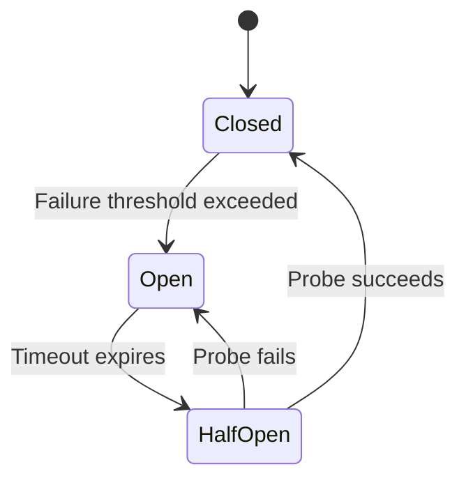

# Circuit Breakers and Bulkheads

## Why This Exists

In a distributed system, a failing dependency doesn't just affect the requests that need it — it can take down the entire system. When Service A calls Service B and B is slow (not down, just slow), A's threads pile up waiting for B's responses. A's thread pool exhausts. Now A can't serve any requests — even ones that don't need B. This cascading failure pattern has caused some of the largest outages in internet history.

Circuit breakers and bulkheads are the two primary patterns for preventing cascading failures. Circuit breakers stop calling a failing dependency. Bulkheads isolate failures so they can't spread.

## Mental Model

**Circuit breaker**: Think of the electrical circuit breaker in your house. When too much current flows (a short circuit), the breaker trips and cuts the circuit — protecting the wiring from melting. You manually reset it after fixing the problem. A software circuit breaker does the same thing: when a dependency fails too many times, the breaker "trips" and all subsequent calls fail immediately (fast-fail) instead of waiting and timing out. Periodically, it lets one request through to test if the dependency has recovered.

**Bulkhead**: Named after the watertight compartments in a ship's hull. If the hull is breached in one compartment, water floods that compartment but the bulkheads prevent it from flooding the entire ship. In software, bulkheads isolate resources (thread pools, connection pools, memory) per dependency, so one failing dependency can only exhaust its own allocation — not the shared pool.

## How Circuit Breakers Work

### The Three States



**Closed** (normal operation): Requests flow through normally. The breaker counts failures within a sliding window (e.g., last 60 seconds). If the failure rate exceeds a threshold (e.g., 50% failures, or 5 consecutive failures), the breaker trips to Open.

**Open** (failing fast): All requests immediately fail without calling the dependency. This is the protection state — no threads are wasted waiting for a dead service. After a configurable timeout (e.g., 30 seconds), the breaker moves to Half-Open.

**Half-Open** (probing): The breaker allows one request through to test the dependency. If it succeeds, the breaker resets to Closed. If it fails, the breaker returns to Open and resets the timeout.

### Implementation Details

**Failure counting**: Use a sliding window, not a simple counter. A rolling window of the last N requests or last T seconds prevents a burst of old failures from keeping the breaker tripped after the issue has resolved.

**What counts as failure**: Timeouts, 5xx responses, connection refused, and certain application-level errors. Do NOT count 4xx client errors — those indicate bad input, not a broken dependency.

**Fallback strategies when open**: Return a cached response, return a default value, return a degraded response (e.g., show a product page without reviews), or return an error to the user. The right fallback depends on the business context.

**Monitoring**: Every circuit breaker state transition should emit a metric and an alert. A breaker tripping to Open is a significant operational event.

### Production Libraries

- **Resilience4j** (Java): The current standard. Lightweight, functional, composable.
- **Hystrix** (Java): Netflix's original. Now in maintenance mode — use Resilience4j instead.
- **Polly** (.NET): Full resilience library with circuit breakers, retries, bulkheads.
- **gobreaker** (Go): Simple, well-tested implementation.

## How Bulkheads Work

### Thread Pool Isolation

Each dependency gets its own thread pool. If the "payment service" pool (20 threads) exhausts because payments are slow, the "inventory service" pool (20 threads) is unaffected.

```
Service A
├── Payment thread pool (20 threads) → Payment Service [SLOW]
│   └── All 20 threads blocked — but contained
├── Inventory thread pool (20 threads) → Inventory Service [HEALTHY]
│   └── Operating normally
└── User thread pool (20 threads) → User Service [HEALTHY]
    └── Operating normally
```

**Without bulkheads**: A single shared thread pool of 60 threads. When payment service slows down, all 60 threads eventually block waiting for payment responses. Inventory and user requests can't get a thread — the entire service is down.

### Semaphore Isolation

Lighter than thread pools: a semaphore limits the number of concurrent calls to a dependency. No separate thread pool — calls run on the caller's thread. Lower overhead, but no timeout enforcement (the calling thread can still block).

**Thread pool vs semaphore**: Use thread pools when the dependency is remote and might be slow (network calls). Use semaphores when the dependency is fast and local (in-process cache, CPU computation).

### Connection Pool Isolation

Separate database connection pools per use case. If the analytics query pool exhausts (running slow reports), the transactional query pool is unaffected.

## Combining Circuit Breakers and Bulkheads

These patterns are complementary and should be layered:

1. **Bulkhead** limits the blast radius: a failing dependency can only consume its allocated resources.
2. **Circuit breaker** limits the duration: once failures exceed the threshold, stop trying entirely.
3. **Timeout** limits individual call duration: no single request blocks forever.
4. **Retry with backoff** handles transient failures: retry a few times before counting it as a failure.

The layering order matters: Retry → Circuit Breaker → Bulkhead → Timeout → Actual Call.

## Trade-Off Analysis

| Pattern | Protects Against | Cost | Limitation |
|---------|-----------------|------|------------|
| Circuit breaker | Sustained dependency failure | Slightly delayed failure detection | Doesn't help with slow responses before tripping |
| Thread pool bulkhead | Resource exhaustion, slow dependencies | Thread pool overhead, context switching | Over-provisioning wastes memory |
| Semaphore bulkhead | Concurrency explosion | Minimal overhead | No timeout enforcement |
| Combined (all three) | Cascading failure broadly | Configuration complexity | Must tune thresholds per dependency |

## Failure Modes

**Breaker too sensitive**: Trips on transient errors that would self-resolve. Solution: use a failure rate threshold (e.g., 50%) over a window, not a simple count. Require a minimum number of requests before evaluating the rate.

**Breaker too slow to trip**: By the time the breaker opens, the thread pool is already exhausted. Solution: combine with bulkheads so exhaustion is contained, and use aggressive timeouts.

**Bulkhead pool sizing**: Too small = artificial throttling under normal load. Too large = defeats the purpose of isolation. Solution: size based on expected concurrency plus headroom, monitor utilization.

**Half-open thundering herd**: Multiple threads simultaneously enter Half-Open and all send probe requests. Solution: allow only a single probe request (most implementations do this by default).

**Wrong fallback for the context**: Returning cached data when the dependency is the payment service would be dangerous. Fallbacks must be designed per dependency with business-context awareness.

## Architecture Diagram

```mermaid
graph TD
    subgraph "Service A (Caller)"
        A_Main[App Logic] --> B_BH[Bulkhead: Pool B]
        A_Main --> C_BH[Bulkhead: Pool C]
        
        subgraph "Resilience Layer"
            B_BH --> B_CB{Circuit Breaker B}
            C_BH --> C_CB{Circuit Breaker C}
        end
    end

    subgraph "External Services"
        B_CB -->|Request| SvcB[Service B - SLOW]
        C_CB -->|Request| SvcC[Service C - OK]
    end

    style B_CB fill:var(--surface),stroke:#ff4d4d,stroke-width:2px;
    style C_CB fill:var(--surface),stroke:#2d8a4e,stroke-width:2px;
```

## Back-of-the-Envelope Heuristics

- **Failure Threshold**: A common default is **50% failure rate** over a **60-second sliding window**.
- **Min Requests**: Don't trip the breaker until at least **10-20 requests** have been made in the current window to avoid noise.
- **Bulkhead Sizing**: Set thread pool size to `(Peak RPS * 99th percentile latency) + safety_margin`. For a service with 100 RPS and 100ms p99, a pool of **15-20 threads** is usually sufficient.
- **CB Open Duration**: The "Sleep Window" should be long enough for the dependency to recover (e.g., **30s - 60s**).

## Real-World Case Studies

- **Netflix (Hystrix Origins)**: Netflix created the **Hystrix** library after realizing that a single misbehaving service (like a recommendation engine) could take down their entire streaming API by exhausting the edge gateway's thread pools. They used thread-isolated bulkheads to ensure that even if "Similar Movies" was down, you could still "Watch Now."
- **Microsoft Azure (Service Bus)**: Azure Service Bus uses circuit breakers to protect their infrastructure from "poison messages" that cause consumer crashes. If a message fails processing multiple times, the breaker opens for that specific message stream, preventing a single bad message from causing an infinite loop of crashes across the fleet.
- **Amazon (Load Shedding)**: During massive traffic events like Prime Day, Amazon services use a combination of bulkheads and **Load Shedding**. If a non-critical bulkhead (like "Related Products") becomes saturated, the system "sheds" that load entirely (tripping the circuit breaker with a null fallback) to preserve capacity for the "Checkout" flow.

## Connections

**Prerequisites:**
- [[Resilience Patterns]] — Circuit breakers and bulkheads are the two most important resilience patterns
- [[Connection Pooling and Keep-Alive]] — Connection pools can be bulkheaded per dependency

**Builds on:**
- [[Rate Limiting and Throttling]] — Rate limiting protects a service from its callers; circuit breakers protect a service from its dependencies
- [[Load Balancing Fundamentals]] — Load balancers can circuit-break unhealthy backends via health checks

**Where This Leads:**
- [[Chaos Engineering and Testing]] — Chaos experiments test whether circuit breakers actually trip correctly
- [[SLOs, SLIs, and Error Budgets]] — Circuit breaker state transitions are key SLI signals

## Reflection Prompts

1. Your service calls three downstream dependencies: auth (fast, critical), recommendations (slow, non-critical), and payments (medium, critical). Design the circuit breaker and bulkhead configuration for each. What are the fallback strategies?
2. A circuit breaker tripped to Open for the inventory service. Marketing just launched a flash sale. What's the user experience? What would you do operationally?
3. Why is a circuit breaker with only a simple failure count (not a rate) dangerous? Construct a scenario where it causes more harm than good.

## Canonical Sources

- Michael Nygard, *Release It!* (2nd ed, 2018) — The definitive treatment of stability patterns
- Netflix Technology Blog, "Fault Tolerance in a High Volume, Distributed System" (2012)
- Resilience4j Documentation — https://resilience4j.readme.io/
- Martin Fowler, "CircuitBreaker" pattern page
