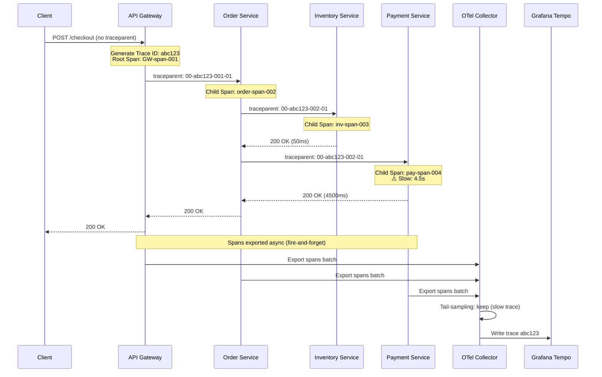

# Distributed Tracing Deep Dive

## Why This Exists

In a monolith, a slow database query shows up in the stack trace. In a system with 30 microservices, that same query might be buried inside service C, which was called by service B in response to service A — and the user just sees a 4-second response on the frontend. Distributed tracing answers the question a stack trace cannot: **"Where did the time go across all services?"**

Without tracing, debugging distributed latency means correlating log files across services by timestamp — a process that takes hours and still doesn't give you a dependency graph. With tracing, a single query reveals exactly which hop introduced the latency, which downstream call timed out, and where the bottleneck is. For systems with more than 3 services, distributed tracing transitions from "nice to have" to "production necessity."

## Mental Model

Think of a distributed trace as a **flight itinerary with connections**. Each flight leg is a **span** — it has a departure time, arrival time, flight number (service name + operation), and gate (metadata). The full itinerary — all the legs chained together — is the **trace**. If your connecting flight is delayed, you see exactly which leg caused the missed connection. Baggage transfer time between legs is the equivalent of serialization overhead or queue wait time between services.

The trace ID printed on your boarding pass is the **correlation ID** — it follows the request through every service and lets any airport (service) look up your complete journey.

## How It Works

### Core Data Model

A **trace** is a tree of **spans**. Each span represents one unit of work:

- **Span ID**: Unique to this operation
- **Trace ID**: Shared across the entire request chain
- **Parent Span ID**: Links this span to its caller (root span has no parent)
- **Operation name**: `POST /checkout`, `db.query: SELECT orders`, `redis.get`
- **Start time + duration**: Precise timestamps
- **Tags/Attributes**: Key-value metadata (HTTP status, DB name, user tier)
- **Events**: Timestamped annotations within a span ("cache miss", "retry #2")
- **Status**: OK, Error, or Unset

Spans are collected asynchronously (to avoid adding latency), batched, and sent to a trace backend for storage and visualization.

### Context Propagation

The trace ID and span ID must travel with the request through every service boundary. This is **context propagation**:

- **HTTP**: The W3C `traceparent` header (`00-{traceId}-{spanId}-{flags}`) is the standard. `tracestate` carries vendor-specific metadata.
- **gRPC**: Metadata headers carry the same context.
- **Message queues**: Trace context is embedded in message attributes/headers (Kafka record headers, SQS message attributes).
- **Async jobs**: Trace context is persisted with the job payload, allowing async work to be linked to the originating request.

**Common failure**: A service receives the `traceparent` header but forgets to forward it downstream. The trace breaks at that service — upstream spans are orphaned from downstream spans. This is silent data loss in your tracing system.

### OpenTelemetry Architecture

OpenTelemetry (OTel) is the CNCF standard that unified the fragmented instrumentation ecosystem (Jaeger client, Zipkin client, vendor SDKs). It provides:

1. **SDK** (in-process): Instruments your code to emit spans. Available in all major languages (Java, Go, Python, Node.js, .NET). Provides auto-instrumentation for popular frameworks (Express, Spring, Django, gRPC, databases) with zero code changes — just add the agent.

2. **OTel Collector** (infrastructure): A standalone binary that receives telemetry (traces, metrics, logs), processes it (sampling, attribute filtering, PII redaction), and exports to one or more backends. Decouples your services from the backend — change from Jaeger to Honeycomb without touching application code.

3. **Backends**: Jaeger (open-source, self-hosted), Grafana Tempo (open-source, object-storage-backed), Honeycomb (commercial, high-cardinality), Datadog APM (commercial, all-in-one).

The collector pipeline: **Receivers** (OTLP, Jaeger, Zipkin) → **Processors** (batch, tail-sampling, attribute) → **Exporters** (Jaeger, Tempo, Datadog, Honeycomb).

## Sampling Strategies

Storing every span at 10,000 requests/second is prohibitively expensive. The key question is which traces to keep.

### Head-Based Sampling

The sampling decision is made at the **root span**, before downstream services run. A random 5% of traces are kept; the rest are dropped immediately.

**Pros**: Simple. Zero buffering overhead. Easy to implement.

**Cons**: Blindly drops 95% of traces, including the 1% that are errors or outliers. The traces you most need (failures, slow requests) have the same chance of being dropped as fast, successful requests.

**When to use**: High-volume, low-value endpoints (health checks, metrics scrapes). Not appropriate as your primary sampling strategy.

### Tail-Based Sampling

The sampling decision is made **after the trace completes** based on trace characteristics.

1. All spans for every request are collected (into the OTel Collector or a specialized sampler).
2. Once the root span closes (request complete), the full trace is evaluated: Was there an error? Was it slow (> p99 baseline)? Was it a new error type?
3. Keep 100% of error traces, 100% of traces > 2× p99 latency, 5% of everything else.

**Pros**: Captures the traces you actually need. Error rate of 1% in traffic → error traces are 100% sampled even if overall rate is 1%.

**Cons**: Requires buffering all spans briefly (memory pressure). More complex infrastructure (stateful collector or dedicated sampler like Honeycomb Refinery or Grafana Tempo's tail sampler).

**Sampling math**: If you have 10,000 RPS with 1% errors → 100 error traces/second. At 200 spans/trace, tail sampling buffers 10,000 × 200 = 2M spans/second for ~30 seconds before deciding. At ~500 bytes/span, that's 1 GB in-memory per sampler instance — plan accordingly.

### Adaptive / Dynamic Sampling

Adjust sampling rates per endpoint based on traffic volume and significance:

- **Low-traffic critical paths** (payment, auth): 100% sample rate — every request matters
- **High-traffic commodity paths** (health check, static assets): 0.01% — statistical coverage is sufficient
- **Error-triggered burst**: When error rate spikes above threshold, temporarily bump sampling to 100% for 60 seconds

Tools: OpenTelemetry Collector's probabilistic sampler processor, Honeycomb Refinery's rule-based sampling, Grafana Tempo.

## Trace Storage Architecture

| Backend | Storage Model | Best For | Cost Profile |
|---------|--------------|----------|--------------|
| **Jaeger** | Elasticsearch / Cassandra / Badger | Self-hosted, full control | Infrastructure cost, ops overhead |
| **Grafana Tempo** | Object storage (S3/GCS) + Parquet | Cost-conscious self-hosted | Very low (S3 costs) |
| **Honeycomb** | Columnar storage, high-cardinality | High-cardinality analytics | Per-event pricing, scales linearly |
| **Datadog APM** | Proprietary | All-in-one APM + infra | Expensive at scale |
| **AWS X-Ray** | AWS-managed | AWS-native services | Per-trace pricing |

**Retention economics**: Traces are expensive to store long-term. Typical approach: 7-day hot storage for debugging, 30-day warm storage for trend analysis, delete after 90 days. Error traces worth keeping 1 year for post-mortems.

## Failure Modes & Production Lessons

**1. Trace context breaks at async boundaries**
A Kafka consumer receives a message but doesn't extract the trace context from message headers. The downstream processing appears as an orphaned trace with no parent. Mitigation: instrument all message queue consumers with context extraction; make it part of your consumer template/framework layer.

**2. Cardinality explosion in span attributes**
An engineer adds `user_id` as a span tag in the backend library. At 1M users × 10,000 RPS, the cardinality of `user_id` causes the trace index to grow 100× in size. Elasticsearch clusters OOM. Mitigation: use structured events (log-style) for high-cardinality data; reserve span attributes for low-cardinality identifiers (service, region, status code, error type).

**3. Clock skew between services**
Two services on different hosts have clocks drifted by 200ms. The child span's start time is before the parent span's start time. Trace visualization shows negative latency gaps. Mitigation: enforce NTP sync (max drift < 10ms); OTel Collector can apply clock skew correction heuristics.

**4. Head-based sampling discards the incident**
A 3-minute outage affecting 100% of users is captured in only 5% of traces (because the head-sampler ran before the incident was detectable). Post-mortem is hampered by lack of trace data. Mitigation: always use tail-based sampling for error traces, or switch to error-triggered adaptive sampling.

**5. Trace depth limit causes truncation**
A deep call chain (microservices calling 12 layers deep) exceeds the backend's default span limit (often 1,000 spans/trace). The trace is stored truncated. Mitigation: tune the span limit to your maximum real depth; add circuit-breaker monitoring for trace depth in the collector.

## Architecture Diagram

## Back-of-the-Envelope Heuristics

- **Span size**: ~500 bytes average per span (tags + timestamps + IDs). A request touching 10 services with 3 spans each = 15 spans × 500B = 7.5 KB/request.
- **At 10,000 RPS**: 75 MB/second of raw span data before compression (typical 5–10× compression → 7–15 MB/s to storage).
- **Tail-sampling buffer**: Buffer all spans for 30s before deciding. At 10,000 RPS × 15 spans/request × 500B = 2.25 GB in-memory per collector. Use 2–4 collector instances.
- **Storage sizing (Grafana Tempo on S3)**: 7-day retention at 10,000 RPS ≈ 7 × 86,400 × 75 MB / 8 (compression) ≈ **5.7 TB/week**. S3 at $0.023/GB ≈ **$131/week** — remarkably cheap.
- **Sampling rule of thumb**: 100% sample errors + 100% sample > 2× p99 + 1% sample everything else captures ~80% of useful traces at ~3% of the storage cost of 100% sampling.
- **Header overhead**: W3C `traceparent` header adds ~55 bytes per HTTP request — negligible.

## Real-World Case Studies

- **Uber (Jaeger)**: Uber open-sourced Jaeger in 2017 after building internal distributed tracing to debug their microservices mesh (1,000+ services). At peak, Jaeger ingested 100,000+ spans/second per datacenter. Key lesson: they discovered that 80% of their latency budget was consumed by a single cross-datacenter database call that was invisible until tracing revealed it across service boundaries.

- **Shopify (OTel + Honeycomb)**: Shopify transitioned from custom instrumentation to OpenTelemetry, enabling them to correlate traces with their "flash sale" load spikes. During BFCM (Black Friday/Cyber Monday), tail-based sampling on their checkout flow captured 100% of error traces while sampling routine transactions at 2% — giving full visibility during the highest-stakes 48 hours of the year at manageable storage cost.

- **Netflix (Edgar)**: Netflix built an internal trace visualization tool called Edgar specifically for streaming latency analysis. A key design decision: they store trace metadata (latency, status) separately from span payloads, allowing fast trace search (< 100ms) even when the full span detail requires a secondary fetch. Reduces cold-path query latency by 10×.

## Connections

- [[03-Phase-3-Architecture-Operations__Module-17-Observability-Deployment__Observability_and_Alerting]] — The three-pillars overview; tracing is the third pillar alongside metrics and logs
- [[03-Phase-3-Architecture-Operations__Module-16-Reliability-Testing__SLOs_SLIs_and_Error_Budgets]] — SLI latency measurement is powered by trace p99 data
- [[03-Phase-3-Architecture-Operations__Module-16-Reliability-Testing__Incident_Management]] — Traces provide the diagnostic path during incident response
- [[01-Phase-1-Foundations__Module-01-Networking__gRPC_Deep_Dive]] — gRPC metadata propagation carries trace context across service calls
- [[03-Phase-3-Architecture-Operations__Module-17-Observability-Deployment__Deployment_and_Release_Engineering]] — Canary analysis compares trace error rates between old and new versions

## Reflection Prompts

1. Your team proposes switching from head-based 10% sampling to tail-based sampling. The engineering cost is 3 weeks. The skeptic says "we capture 10% of traces, which is statistically significant enough." Walk through a concrete failure scenario where 10% head-based sampling would leave your team unable to diagnose a production incident — and explain why tail-based sampling would have captured it.

2. A new service joins your platform and its developer claims "we don't need tracing — we log every request with full context." Compare the debugging experience for a cross-service latency regression using only logs vs. using distributed traces. What does log-only debugging require that traces make trivial?

3. You're designing the sampling strategy for a payments API that processes 500 RPS in normal operation but 5,000 RPS during peak shopping events. Error rate is normally 0.1%. Design a sampling configuration that: (a) captures all errors at all times, (b) provides adequate coverage during normal load, (c) doesn't OOM the OTel Collector during peak events.

## Canonical Sources

- Yuri Shkuro, *Mastering Distributed Tracing* (2019) — the definitive reference
- OpenTelemetry specification (opentelemetry.io/docs/specs) — data model, propagation format
- W3C Trace Context specification (w3.org/TR/trace-context) — `traceparent` header format
- Jaeger documentation (jaegertracing.io) — open-source reference implementation
- Charity Majors et al., *Observability Engineering* — Chapter 6: Instrumentation and Tracing
