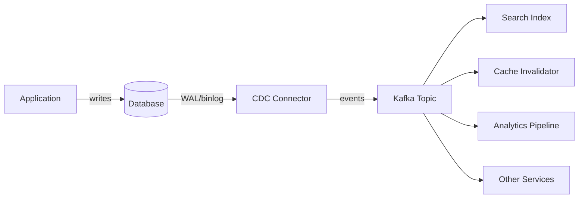

# Change Data Capture

## Why This Exists

You have a database. Other systems need to react to changes in that database: a search index needs to stay in sync, a cache needs to be invalidated, an analytics pipeline needs the latest data, a microservice needs to know when an order was placed. The naive approach — polling the database every N seconds — is wasteful, laggy, and doesn't scale.

Change Data Capture (CDC) solves this by turning database changes into a stream of events. Instead of asking "what changed?" you subscribe and receive every insert, update, and delete as it happens. CDC bridges the gap between the database (system of record) and everything else that needs to know about changes.

CDC is the backbone of the [[Outbox Pattern]], the enabler of real-time [[Event-Driven Architecture Patterns]], and the mechanism that keeps [[Full-Text Search Architecture]] indexes and [[Cache Patterns and Strategies]] in sync without dual-write bugs.

## Mental Model

A security camera for your database. Instead of checking the vault every hour to see if anything moved, the camera records every single change as it happens. Anyone who needs to know what changed can watch the recording — from the beginning, from a specific point, or live.

The "camera" is the database's own write-ahead log (WAL). Every database already records every change for crash recovery. CDC just makes that log available to external consumers.

## How It Works

### Log-Based CDC (The Standard Approach)

The database writes every change to its WAL/binlog before applying it. A CDC connector reads this log and publishes each change as an event to a message broker (typically Kafka).



**Why log-based is preferred:**
- **No application changes**: The connector reads the WAL directly. Your application code doesn't change.
- **Complete capture**: Every change is captured, including those made by direct SQL, migrations, and admin tools.
- **Ordered**: Changes arrive in the exact commit order from the database.
- **Low overhead**: Reading the WAL is how replicas already work — CDC is essentially another replica consumer.

### Database-Specific Mechanisms

| Database | CDC Mechanism | Tool |
|----------|--------------|------|
| PostgreSQL | Logical replication slots (pgoutput, wal2json) | Debezium |
| MySQL | Binary log (binlog) in row format | Debezium, Maxwell |
| MongoDB | Change streams (oplog tailing) | Debezium, MongoDB Connector |
| SQL Server | SQL Server CDC or CT feature | Debezium |
| DynamoDB | DynamoDB Streams | AWS Lambda, Kinesis |

### Debezium: The Standard CDC Platform

Debezium is the de facto open-source CDC platform. It runs as a Kafka Connect connector, reads database WALs, and publishes change events to Kafka topics (one topic per table by default).

**Event format** (simplified):
```json
{
  "op": "u",
  "before": {"id": 42, "name": "Alice", "email": "alice@old.com"},
  "after": {"id": 42, "name": "Alice", "email": "alice@new.com"},
  "source": {
    "db": "users", "table": "accounts",
    "lsn": "0/15D4AB8", "ts_ms": 1701234567890
  }
}
```

The `op` field indicates the operation: `c` (create), `u` (update), `d` (delete), `r` (read/snapshot). Both `before` and `after` states are included for updates, enabling consumers to understand exactly what changed.

### Trigger-Based CDC (Legacy)

Database triggers fire on each change and write to a "changes" table. A poller reads this table and publishes events.

**Drawbacks**: Triggers add write latency, can be brittle, miss schema changes, and don't capture direct SQL modifications cleanly. Use only when log-based CDC isn't available.

### Query-Based CDC (Polling)

Poll the database periodically using a timestamp or incrementing ID column: `SELECT * FROM orders WHERE updated_at > :last_check`.

**Drawbacks**: Can't detect deletes, requires timestamp/ID columns on every table, inherent latency from polling interval, and query load on the database. Acceptable for simple, low-volume use cases.

## Key Patterns

### The Outbox Pattern with CDC

Instead of publishing events directly from your application (dual-write problem), write events to an "outbox" table in the same database transaction as the business data. CDC reads the outbox table and publishes events to Kafka. This gives you exactly-once semantics: if the transaction commits, the event is captured; if it rolls back, nothing is published. See [[Outbox Pattern]] for details.

### Event Sourcing via CDC

Use CDC to create an event log from a traditional database. The database remains the system of record, but downstream consumers get an event stream that looks like event sourcing — enabling CQRS read models, materialized views, and temporal queries.

### Zero-Downtime Migrations

CDC enables migrating from one database to another without downtime: set up CDC from the old database, replicate all changes to the new database in real time, and cut over when they're in sync. See [[Zero-Downtime Schema Migrations]].

## Trade-Off Analysis

| Approach | Latency | Completeness | DB Overhead | Complexity |
|----------|---------|--------------|-------------|------------|
| Log-based CDC | Sub-second | Complete (all changes) | Minimal | Medium (connector setup) |
| Trigger-based | Real-time | Complete | High (trigger overhead) | High (trigger maintenance) |
| Query-based polling | Seconds to minutes | Misses deletes, needs columns | Medium (query load) | Low |
| Application-level events (dual write) | Real-time | Can miss on failures | None | Low (but unsafe) |

## Failure Modes

**Replication slot growth (PostgreSQL)**: If the CDC connector goes down, PostgreSQL retains WAL segments for the replication slot. Extended downtime can fill the disk. Solution: monitor slot lag and set `max_slot_wal_keep_size`.

**Schema evolution**: A column rename or type change in the database must be handled by downstream consumers. Debezium captures schema changes, but consumers must be designed to handle evolving schemas. Solution: use a schema registry (Confluent, Apicurio) and Avro/Protobuf serialization.

**Snapshot consistency**: When CDC starts for the first time, it takes an initial snapshot of the existing data before streaming changes. For large tables, this snapshot can take hours and consume significant resources. Solution: schedule initial snapshots during low-traffic periods.

**Ordering guarantees**: CDC guarantees ordering within a single table partition, but not across tables. If you need cross-table ordering, you must handle it at the consumer level or use a single Kafka partition.

**Consumer lag**: If a consumer falls behind, events accumulate in Kafka. This is generally fine (Kafka retains data), but the consumer must be designed to catch up without overwhelming downstream systems.

## Connections

**Prerequisites:**
- [[Write-Ahead Log]] — CDC reads the WAL; understanding WAL mechanics is essential
- [[Message Queues vs Event Streams]] — CDC typically publishes to Kafka (an event stream)

**Enables:**
- [[Outbox Pattern]] — CDC + outbox = reliable event publishing without dual writes
- [[Event-Driven Architecture Patterns]] — CDC is how you get events out of a database into an EDA
- [[Full-Text Search Architecture]] — CDC keeps search indexes in sync with the database
- [[Cache Patterns and Strategies]] — CDC-driven cache invalidation is more reliable than TTL-based

**Related:**
- [[Database Replication]] — CDC is conceptually similar to replication; it's just replicating to non-database consumers
- [[Stream Processing]] — CDC events are a natural input to stream processing pipelines

## Reflection Prompts

1. You're building a microservices system. Service A owns the "orders" database. Services B, C, and D need to react to new orders. Compare: (a) Service A publishes events directly, (b) CDC from the orders database. What are the trade-offs in reliability, coupling, and operational complexity?
2. Your CDC pipeline goes down for 2 hours. What happens when it comes back? How does Debezium handle this? What if the WAL segments have already been cleaned up?
3. Why is the dual-write problem (writing to both database and message broker) fundamentally unsafe? Draw a failure scenario. How does the outbox pattern + CDC solve it?

## Canonical Sources

- Debezium Documentation — https://debezium.io/documentation/
- Martin Kleppmann, *Designing Data-Intensive Applications*, Chapter 11 — "Change Data Capture"
- Gunnar Morling, "Reliable Microservices Data Exchange With the Outbox Pattern" (2019)
- Confluent Blog, "No More Silos: How to Integrate Your Databases with Apache Kafka" (2018)
