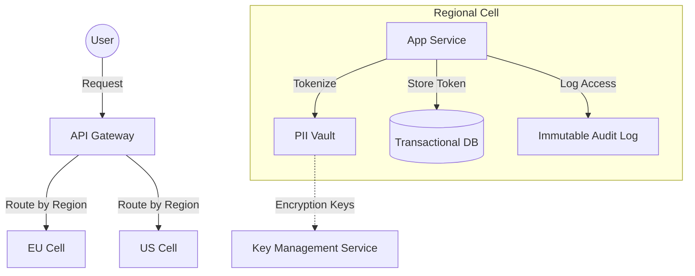

# Data Privacy and Compliance

## Why This Exists
In the early days of the web, data was the "new oil" — a resource to be extracted and hoarded. Today, data is more like nuclear waste: valuable if handled correctly, but a massive liability if it leaks or is mismanaged. Regulatory frameworks (GDPR, HIPAA, CCPA) have turned data privacy from a "nice-to-have" into a core architectural constraint. Systems that don't design for privacy from day one face massive fines (up to 4% of global turnover for GDPR), loss of customer trust, and the technical debt of retrofitting "Right to be Forgotten" into a distributed mess of databases.

## Mental Model / Analogy
Think of data privacy as **Bank Vault vs. Library**. A library is designed for discovery and access (traditional database). A bank vault is designed for custodial responsibility and auditability. In a privacy-first architecture, your primary data store isn't just a bucket for bits; it's a managed custodial service where every piece of PII (Personally Identifiable Information) is tagged, tracked, and potentially removable at the push of a button.

## How It Works

### 1. Data Classification and Tagging
You cannot protect what you cannot identify. Modern compliance starts with a **Data Catalog**.
- **PII (Personally Identifiable Information)**: Names, emails, phone numbers, SSNs.
- **Sensitive PII**: Health data (HIPAA), biometrics, political affiliations.
- **Metadata**: IP addresses, location data, device IDs.
Every column in your schema should have a privacy tag (e.g., `@pii`, `@internal-only`, `@public`).

### 2. PII Masking and Tokenization
Instead of storing raw PII everywhere, use a **PII Vault**.
- **Tokenization**: Replace sensitive data (like a credit card number) with a non-sensitive "token." The raw data lives in a highly secure, isolated vault. Downstream services only see the token.
- **Dynamic Masking**: Anonymize data at the query layer. A support agent sees `john.***@gmail.com`, but the billing service sees the full email.

### 3. Data Residency and Sovereignty
Laws like the GDPR and China's PIPL often require that data about a country's citizens stays within that country's borders.
- **Cell-Based Architecture**: Deploy independent "cells" of your stack in different regions (e.g., EU-West-1, US-East-1).
- **Request Routing**: The API Gateway inspects the user's origin or account metadata and routes the request to the correct regional cell.
- **Cross-Border Transfer**: If data *must* leave a region, it must be encrypted with keys held in the source region.

### 4. Designing for the "Right to be Forgotten" (RTBF)
Deleting a user's data in a distributed system is hard due to backups, logs, and caches.
- **Crypto-Shredding**: Instead of searching every DB for `user_id=123`, you encrypt all of User 123's PII with a unique `UserKey`. To "delete" the user, you simply destroy the `UserKey`. All their data becomes unreadable garbage instantly.
- **Tombstones and Soft Deletes**: Use tombstones to mark data as deleted in LSM-trees or event streams. Background compaction eventually physically removes it.

### 5. Immutable Audit Logs
For compliance (SOX, HIPAA), you must prove *who* accessed *what* and *when*.
- **Audit Sidecars**: Every service has a sidecar that logs access to PII-tagged fields to an immutable, append-only ledger (like Amazon QLDB or a signed S3 bucket).
- **Non-Repudiation**: Logs should be cryptographically signed to prevent tampering.

## Trade-Off Analysis

| Approach | Strengths | Weaknesses | Best For |
|----------|-----------|------------|----------|
| **Crypto-Shredding** | Instant "deletion" across backups/logs | Key management complexity; CPU overhead | High-scale systems with strict RTBF needs |
| **PII Vault / Tokenization** | Centralized security policy; reduced PCI/HIPAA scope | Single point of failure; latency on "de-tokenization" | Financial systems, handling SSNs/CCs |
| **Cell-Based Residency** | Strong compliance; low regional latency | Operational overhead (N regions); hard to aggregate global data | Global B2C apps (e.g., TikTok, Meta) |
| **On-the-fly Masking** | Transparent to developers; flexible | Can be bypassed if query layer is bypassed | Internal dashboards, BI tools |

## Failure Modes & Production Lessons
- **The "Backups are Forever" Trap**: You delete a user from the DB, but they persist in S3 backups for years. **Lesson**: Use crypto-shredding or short-lived backup retention policies.
- **Log Leakage**: A developer logs `user_object` for debugging, accidentally putting the user's password and SSN into Splunk/ELK. **Lesson**: Use automated PII scanners (like Amazon Macie or Google Cloud DLP) on your log streams.
- **Cache Poisoning**: PII is cached in Redis/CDN and stays there after a deletion request. **Lesson**: Deletion events must trigger a global cache invalidation.

## Architecture Diagram

## Back-of-the-Envelope Heuristics
- **GDPR Deletion SLA**: Typically 30 days. Your "garbage collection" processes must run at least weekly.
- **Tokenization Latency**: A call to a PII vault adds **10–50ms**. Batch de-tokenization is essential for reporting.
- **Audit Log Volume**: Audit logs can be **2x-5x larger** than your actual data if every read is tracked. Use sampling for non-sensitive data.

## Real-World Case Studies
- **Uber**: Developed **"Queryguard"**, an internal tool that intercepts SQL queries and automatically masks PII based on the user's role and the data's classification.
- **Netflix**: Uses a dedicated PII service and crypto-shredding to handle global privacy requests at scale across thousands of microservices.

## Connections
- [[_Module 15 MOC]] — Security and identity are the foundation of privacy.
- [[_Module 18 MOC]] — Geo-distribution is often driven by data residency laws.
- [[Write-Ahead Log]] — Understanding how data persists in logs is key to deleting it.

## Reflection Prompts
1. If your database is encrypted at rest (e.g., using AWS RDS encryption), does that satisfy GDPR requirements for data protection? Why or why not?
2. You have a data warehouse (BigQuery/Snowflake) for analytics. How do you handle a "Right to be Forgotten" request without re-writing terabytes of historical parquet files?

## Canonical Sources
- GDPR Article 17 — The "Right to Erasure."
- HIPAA Security Rule — Standards for protecting ePHI.
- "Crypto-shredding: the efficient way to delete data" (Various engineering blogs).
- NIST SP 800-122 — Guide to Protecting the Confidentiality of PII.
