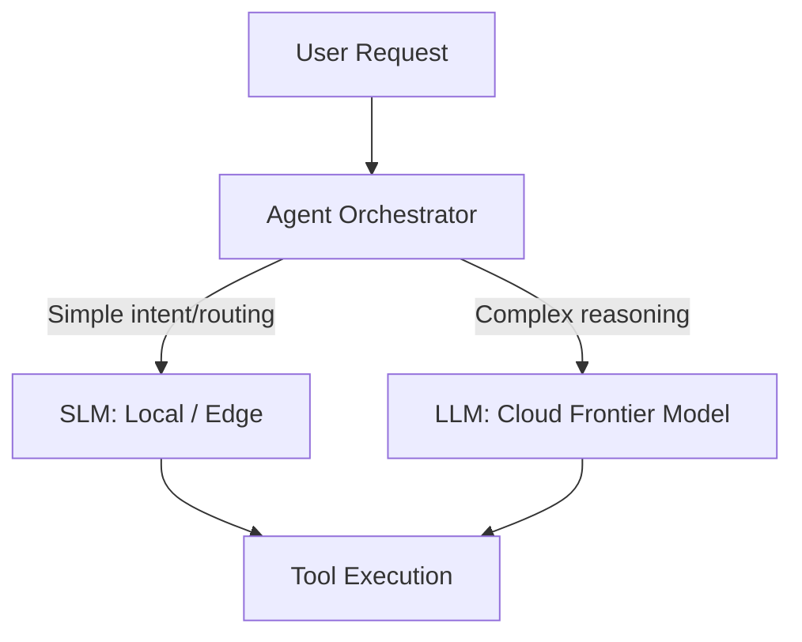

# Small Language Models (SLMs)

## What are SLMs?

Small Language Models (SLMs) are specialized AI models with significantly fewer parameters (typically 1B to 8B) compared to Frontier LLMs (100B+ parameters). Due to their size, they can run on consumer hardware, edge devices, and standard CPU instances without requiring massive GPU clusters.

## The Shift to Edge AI

While massive models dominate general reasoning tasks, SLMs have become the industry standard for specific, fine-tuned tasks (e.g., parsing JSON, routing requests, local summarization). They offer better privacy, reduced latency (no network round-trip), and dramatically lower inference costs.

## Why This Exists

This note captures the transition in AI architecture from monolithic cloud-based reasoning to multi-agent orchestration frameworks where SLMs and LLMs are hybridized to optimize for cost, latency, and privacy constraints.

## Reflection Prompts

1. In a RAG pipeline, which tasks would you confidently offload to an SLM, and which require a frontier LLM?
2. How does deploying SLMs at the edge change your approach to data privacy and compliance (e.g., GDPR)?
