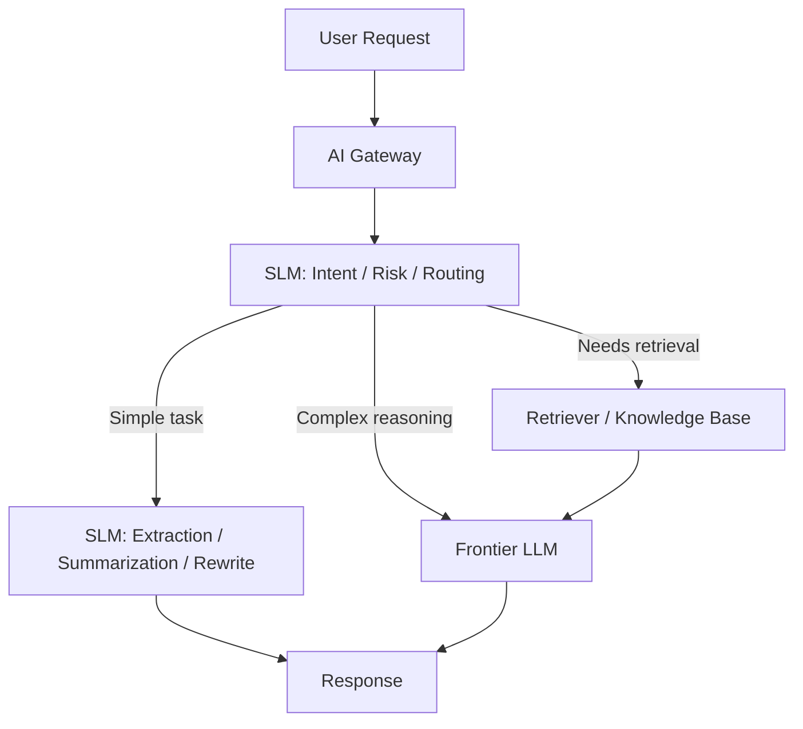

# Small Language Models (SLMs)

## Why This Exists

The industry story around AI is often told through frontier models: the largest context windows, the best reasoning benchmarks, the most impressive demos. But production systems are rarely won by the single smartest model. They are won by the cheapest model that is good enough for a narrow task, deployed in the right place, with the right fallback path when it is not good enough.

That is where Small Language Models (SLMs) matter. An SLM is not a "worse LLM." It is a model optimized for a different operating point: lower latency, lower cost, smaller memory footprint, and easier deployment on commodity CPUs, edge devices, or private infrastructure. This note exists because modern AI architectures increasingly use **model portfolios**, not one monolithic model, and SLMs are the workhorse in that portfolio.

## Mental Model

Think of an AI system like a hospital triage desk. You do not send every patient directly to the most senior specialist in the building. A triage nurse handles routing, form collection, and the obvious low-complexity cases. Only the ambiguous or high-risk cases get escalated to a specialist.

SLMs play the triage role in AI systems. They classify intent, normalize text, extract structure, summarize small contexts, route requests, redact sensitive data, and decide when to escalate. Frontier models are the specialists: expensive, powerful, and reserved for the cases where that extra reasoning depth actually changes the outcome.

The mistake teams make is treating the specialist as the default path. That drives up latency and cost, and it often weakens privacy because every request leaves the trusted boundary even when it did not need to.

## What Are SLMs?

Small Language Models (SLMs) are models with significantly fewer parameters than frontier-scale LLMs, often in the **1B to 8B** range, though the exact threshold matters less than the deployment properties they enable. They are small enough to run:

- on a CPU-only instance for low-throughput structured tasks
- on a single consumer or workstation GPU
- in constrained enterprise environments where data cannot leave a private network
- at the edge for routing, filtering, or personalization close to the user

Their sweet spot is not open-ended reasoning. Their sweet spot is **bounded work**:

- classify this request
- extract JSON from this text
- summarize this incident ticket
- route this query to the right retrieval source
- detect whether the answer needs escalation
- rewrite the question for better retrieval

## Architecture Pattern

The important point is that the SLM is often **before** the expensive model, not after it. It reduces load on the expensive path by filtering, rewriting, or routing requests first.

## Where SLMs Shine

### Structured extraction

If the task is "convert this support email into JSON with fields `{issue_type, urgency, account_id}`," raw reasoning depth matters less than instruction following and schema stability. An SLM is often enough, especially if paired with retries, validation, and guardrails.

### Routing and orchestration

In a multi-agent or RAG system, many requests do not need the strongest model. An SLM can decide:

- whether the query is billing, product, or technical support
- whether retrieval is needed at all
- which knowledge base to search
- whether the answer should be generated locally or escalated to a cloud model

This is a high-leverage use because a cheap routing decision sits in front of every expensive generation call.

### Privacy-preserving local inference

If the system handles internal documents, healthcare notes, source code, or regulated customer data, a locally hosted SLM can do first-pass summarization, classification, or redaction without shipping raw inputs to an external provider.

### Edge and mobile workloads

For typing assistance, on-device summarization, local voice commands, or network-intermittent scenarios, the latency and availability benefits of a smaller model often outweigh the quality gap versus a cloud LLM.

## Where SLMs Fail

### Long-chain reasoning

If the task requires multi-step deduction, exception handling across many rules, or reconciling multiple ambiguous sources, an SLM often fails silently. It may produce a plausible-looking answer with shallow reasoning instead of explicitly indicating uncertainty.

### Broad world knowledge

Smaller models compress less parametric knowledge. If the task relies on wide-ranging factual recall or nuanced domain knowledge that is not provided in context, SLM quality drops sharply.

### Tool-heavy planning

An SLM may call tools correctly in simple flows but struggle when the task involves:

- choosing among many tools
- determining call order dynamically
- recovering from intermediate failures
- planning over long horizons

These are usually escalation candidates.

## Design Trade-Offs

| Dimension | SLM | Frontier LLM |
|----------|-----|--------------|
| **Latency** | Lower, often 2x-10x faster | Higher |
| **Cost per call** | Much lower | Much higher |
| **Reasoning depth** | Lower | Higher |
| **Deployment flexibility** | Can run local / edge / private cloud | Usually centralized cloud |
| **Privacy posture** | Stronger when self-hosted | Depends on provider boundary |
| **Quality variance on hard tasks** | Higher | Lower |

The correct question is not "Which is better?" It is "Which task deserves which model?"

## Production Patterns

### Escalation architecture

A strong pattern is **SLM-first with explicit escalation**:

1. SLM handles the request or produces a confidence score.
2. If confidence is high and output passes validation, return immediately.
3. If confidence is low, context is too large, or validation fails, escalate to a stronger model.

This turns the expensive model into an exception path instead of the default path.

### Validator sandwich

Use an SLM to generate structured output, then validate it:

- JSON schema validation
- type checks
- required field checks
- business rule checks

If validation fails, retry locally or escalate. This is much safer than assuming the model is correct.

### Query rewriting before RAG

An SLM can rewrite sloppy user queries into retrieval-friendly forms:

- expand acronyms
- normalize product names
- turn vague questions into keyword + semantic-friendly search strings

This is often a better use of an SLM than direct answering.

## Failure Modes

### Silent under-performance

The most common failure is not a crash. It is a plausible low-quality answer that looks acceptable in spot checks. This is dangerous because it hides in production until users lose trust.

Mitigation: evaluate SLM tasks separately. Do not benchmark "the AI system" as one unit. Benchmark the routing model, the extraction model, and the escalation threshold independently.

### Over-escalation

A conservative SLM router may escalate too many requests, defeating the cost and latency benefits. The system technically works, but all traffic still hits the frontier model.

Mitigation: track escalation rate as a first-class metric. If 90% of traffic escalates, the SLM is not functioning as a real filter.

### Under-escalation

The opposite failure is worse: the SLM handles requests it should not, causing subtle quality loss in complex cases.

Mitigation: define explicit escalation triggers:

- context length above threshold
- low confidence score
- tool-planning required
- user asks for comparison, trade-off analysis, or synthesis across many sources
- validation failure on generated output

### Local deployment drift

A self-hosted SLM may lag behind the cloud production stack in prompt templates, safety filters, or evaluation coverage. Teams then attribute failures to "small models are bad" when the real problem is that the local path is under-maintained.

Mitigation: treat the SLM path as a first-class product surface with its own metrics, prompts, versioning, and rollback story.

## Architecture and Operations Considerations

### Capacity planning

SLMs improve unit economics, but they still need operational planning. A local model on a single node can become a bottleneck if placed on the hot path for every request.

Key design questions:

- Is the SLM synchronous or asynchronous?
- Is it CPU-bound or GPU-bound?
- Is batching possible without hurting latency?
- What is the fallback if the local model becomes unavailable?

### Cost crossover

A local SLM is not automatically cheaper. The economics depend on throughput.

- At **low request volume**, managed APIs may be cheaper than keeping dedicated inference infrastructure warm.
- At **high request volume**, self-hosted SLMs often win because the marginal cost per request collapses once infrastructure is amortized.

The crossover point depends on request rate, context length, hardware utilization, and operational burden.

## Back-of-the-Envelope Heuristics

- **Best SLM tasks**: classification, extraction, rewriting, routing, and short summarization. If the task has a strict schema or a narrow output space, start with an SLM.
- **Escalation trigger**: if the task needs multi-document synthesis, non-trivial planning, or nuanced trade-off reasoning, escalate.
- **Latency target**: an SLM in the routing path should usually stay under **50-150ms** p95, or it becomes too expensive as a "cheap first step."
- **Cost rule of thumb**: if a local SLM can deflect even **50-80%** of traffic away from a frontier model, it often pays for itself quickly.
- **Context discipline**: SLM quality degrades faster than large-model quality as irrelevant context grows. Keep prompts tight and task-specific.

## Real-World Case Studies

- **Enterprise support copilots**: many internal support systems use a small model for intent classification and retrieval routing, then escalate only the hard cases to a larger hosted model. The cost reduction comes from keeping the large model off the happy path.
- **On-device assistants**: mobile and desktop assistants increasingly use small local models for wake-word-adjacent tasks, text normalization, summarization of recent notifications, and local command routing. The benefit is privacy and immediate responsiveness, not perfect general reasoning.
- **RAG stacks with rewrite stages**: teams building documentation assistants often use a small model to rewrite the user query before retrieval. This improves recall and reduces pressure on the expensive answer-generation step.

## Connections

- [[04-Phase-4-Modern-AI__Module-20-RAG-Agents-Realtime__RAG_Architecture]] — SLMs are often used to rewrite queries, route retrieval, or decide whether retrieval is needed
- [[04-Phase-4-Modern-AI__Module-19-AI-Inference-LLMOps__Inference_Serving_Architecture]] — The serving economics and batching trade-offs determine when local SLMs outperform hosted APIs
- [[04-Phase-4-Modern-AI__Module-19-AI-Inference-LLMOps__AI_Gateway_and_LLM_Operations]] — Gateways are where model routing, fallback, and cost-aware selection usually live
- [[04-Phase-4-Modern-AI__Module-20-RAG-Agents-Realtime__Agentic_System_Architecture]] — Agents should not default to the strongest model for every sub-step
- [[04-Phase-4-Modern-AI__Module-21-Serverless-Edge-Platform__Serverless_and_Edge_Computing]] — Edge deployment changes the latency and privacy economics in favor of smaller models
- [[Data_Privacy_and_Compliance]] — Local inference is often a privacy control, not just a performance optimization

## Reflection Prompts

1. In a production RAG assistant, which stages would you assign to an SLM first: query rewriting, intent routing, answer generation, or re-ranking? Why?
2. How would you detect that your SLM router is over-escalating and destroying the cost advantage it was supposed to create?
3. What tasks in a regulated enterprise environment should remain local even if a frontier cloud model is more capable?

## Canonical Sources

- Microsoft, "Phi" model family papers and engineering posts — examples of high-quality small-model deployment trade-offs
- vLLM and SGLang documentation — inference economics and serving implications for local models
- Anthropic / OpenAI / gateway vendor documentation on routing and fallback — model portfolio design patterns
