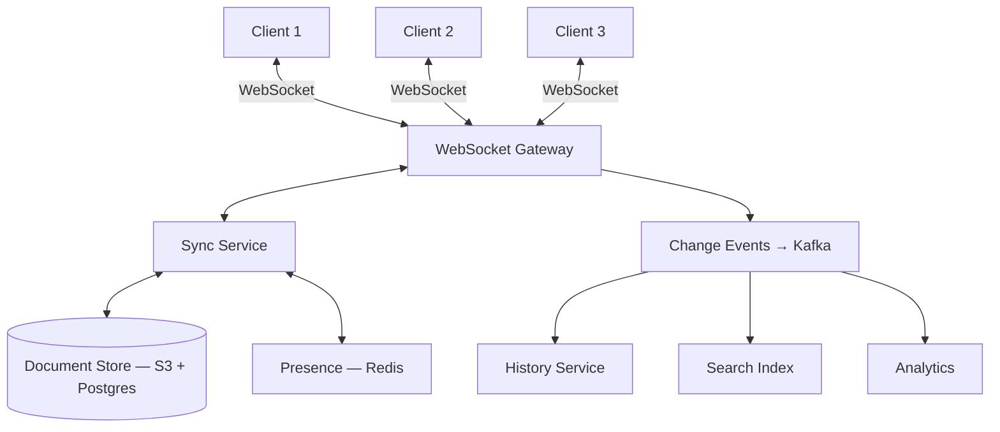

# Capstone — Collaborative Editor

*CRDTs/OT, WebSockets, presence, conflict resolution, and cell-based isolation.*

## 1. Requirements

### Functional
- **Real-time co-editing**: Multiple users edit the same document simultaneously. Edits appear within 50ms for co-located users, <200ms for cross-region.
- **Offline support**: Users can edit without connectivity; changes merge when they reconnect.
- **Presence**: Show who's online, cursor positions, selection highlights in real time.
- **Version history**: Full history of every edit, with the ability to revert to any prior state.
- **Rich content**: Text with formatting (bold, italic, headings, lists), embedded images, tables.

### Non-Functional
- **Latency**: Local edits appear instantly (<10ms). Remote edits visible within 50–200ms depending on network.
- **Consistency**: All users converge to the same document state, even after concurrent edits and offline reconciliation.
- **Scale**: 10M documents, 1M DAU, up to 100 concurrent editors per document, 50,000 concurrent active documents.
- **Durability**: No edit is ever lost. Hardware failure doesn't lose unsaved work.

## 2. Back-of-Envelope Estimation

```
Concurrent active documents: 50,000
Average editors per document: 3 (median), 100 (max for hot documents)
Total concurrent WebSocket connections: ~150,000 (50K docs × 3 editors)
  Peak: ~500,000

Operations per second:
  Average typing speed: 5 keystrokes/sec/user
  150,000 users × 5 ops/sec = 750,000 operations/sec (average)
  With batching (50ms batches): ~150,000 batched updates/sec

Storage per document:
  Average document: 50KB of CRDT state
  10M documents × 50KB = ~500GB total document storage
  Version history: ~10× document size (500KB per doc avg) = ~5TB
  (History is append-only — grows linearly with edits)

WebSocket bandwidth:
  Per operation: ~200 bytes (operation type, position, content, metadata)
  750,000 ops/sec × 200 bytes = ~150 MB/sec total bandwidth
  With batching + compression: ~30 MB/sec
```

This is substantial but manageable. The key bottleneck is per-document fan-out: broadcasting each edit to all other editors in the same document.

## 3. The Central Decision: CRDTs vs OT

This is covered in depth in [[Real-Time Collaboration]]. Summary of the trade-off:

| Dimension | OT (Google Docs) | CRDT (Figma, Yjs) |
|-----------|-------------------|-------------------|
| Server required? | Yes — central sequencer | No — relay only |
| Offline editing | Difficult | Natural |
| Edit latency | Server RTT | Instant (local-first) |
| Correctness guarantee | Transform functions must be correct for every operation pair | Mathematical convergence by construction |
| Library ecosystem (2026) | Limited open-source | Yjs, Automerge, Diamond Types — mature |

**Recommendation**: CRDTs via **Yjs** (the most production-proven CRDT library for text editing). Yjs handles text, rich formatting, embedded objects, and maps — covering all our rich content requirements. The local-first model gives instant edit feedback, and offline support is built into the data structure.

## 4. High-Level Design



### Write Path (User Types a Character)

1. User types "a" in their local editor.
2. The Yjs CRDT applies the operation locally — the character appears immediately.
3. The client serializes the CRDT update (a binary delta, ~50–200 bytes) and sends it via WebSocket to the gateway.
4. The gateway routes the update to the Sync Service for the document's room.
5. The Sync Service broadcasts the update to all other connected clients in the room.
6. Each receiving client applies the Yjs update to their local CRDT state — the character appears.
7. Periodically (every 5 seconds), the Sync Service persists the CRDT state to the Document Store.

### Read Path (User Opens a Document)

1. Client requests document `doc_123`.
2. Sync Service loads the latest CRDT state from the Document Store.
3. Client initializes its local Yjs document from the state.
4. Client joins the WebSocket room for `doc_123` and receives any updates that occurred between the stored state and now.
5. Presence Service registers the user and broadcasts their join to other editors.

## 5. Deep Dives

### Deep Dive 1: Cell-Based Document Isolation

Each document is independent — edits to Document A never interact with Document B. This makes [[Cell-Based Architecture]] natural: partition documents across cells.

**Cell routing**: `cell = hash(document_id) % num_cells`. Each cell has its own Sync Service instances, WebSocket gateway connections, and Redis presence store. A cell failure affects only its documents — other cells are completely unaffected.

**Hot document handling**: A viral shared document (1000 concurrent editors) can overwhelm a single cell. Detection: monitor per-document connection count. When a document exceeds a threshold (e.g., 200 editors), migrate it to a dedicated "heavy-hitter" cell with more resources. The WebSocket connections are re-established (brief interruption for editors of that document, invisible to everyone else).

### Deep Dive 2: Handling 100 Concurrent Editors

At 100 concurrent editors, each keystroke generates a CRDT update broadcast to 99 others. At 5 keystrokes/sec per editor: 500 ops/sec × 99 recipients = ~50,000 messages/sec within one document room.

**Client-side batching**: Instead of broadcasting each keystroke, batch CRDT updates every 50ms. At 5 keystrokes/sec, a 50ms batch contains 0–1 operations most of the time. But during rapid typing or paste operations, batching reduces message count significantly. Each batch is a single Yjs update (binary-encoded, typically <1KB).

**Server-side broadcast optimization**: The Sync Service doesn't decode updates — it treats them as opaque binary blobs and forwards them. No server-side CRDT computation. The server is a relay, not a processor. This keeps server CPU low even at high fan-out.

**Bandwidth management**: At 100 editors, each client receives ~500 updates/sec (from 99 others, batched). Each update is ~200 bytes. That's ~100KB/sec per client — well within WebSocket bandwidth on any modern connection. For 1000+ editors, consider aggregating updates server-side (merge multiple updates into one broadcast every 100ms) to reduce client-side processing.

### Deep Dive 3: Offline Support

A user closes their laptop, edits offline for 30 minutes, then reconnects.

**How it works with CRDTs**:
1. While offline, all edits are applied to the local Yjs document. The CRDT operations are queued.
2. On reconnect, the client sends all queued operations to the Sync Service as a single batch update.
3. The Sync Service broadcasts the batch to all connected clients.
4. Each client's Yjs instance merges the offline edits with any edits that happened during the offline period.
5. CRDT's convergence guarantee ensures all clients arrive at the same document state — regardless of the order in which they received the updates.

**Conflict example**: Alice (offline) edits paragraph 3. Bob (online) also edits paragraph 3. When Alice reconnects, both edits are present in the merged document. If they edited different parts of the paragraph, both changes appear. If they edited the same word, the CRDT resolves it (typically: both versions are interleaved character-by-character, or one user's edit appears after the other's — deterministic, same on all clients, but potentially messy for the human reader). This is where a post-merge review UI helps — highlight recently-merged sections so users can review.

### Deep Dive 4: Version History

Every persisted CRDT state is a version. But persisting every keystroke is expensive (750K ops/sec globally). Instead:

**Snapshot + incremental updates**: Take a full CRDT state snapshot every N seconds (e.g., every 30 seconds of active editing). Between snapshots, store the incremental Yjs updates (small binary deltas). To reconstruct any point in time: load the nearest snapshot, replay updates to the target time.

**Storage**: Snapshots go to S3 (durable, cheap). Metadata (snapshot timestamps, update ranges, document ID) goes to Postgres. Updates are batched and appended to S3 as well.

**Reverting**: To revert to a historical version, load the snapshot at that time, replace the current CRDT state, and broadcast to all connected clients. Their local state is replaced. This is a "hard revert" — all subsequent edits are effectively undone. For a "soft revert" (see the old version without losing current edits), show the historical snapshot in a read-only view alongside the current document.

**This is [[Event Sourcing and CQRS]] for documents**: The CRDT updates are events. The current document is a materialized view. Historical states are recoverable by replay.

## 6. Failure Analysis

**WebSocket gateway failure**: Clients lose their connection. They reconnect (with jitter) to another gateway instance. On reconnect, they rejoin the document room and sync from the last received update. Edits made during the brief disconnection (~1–5 seconds) are queued locally and sent on reconnect. No edits are lost.

**Sync Service failure**: The gateway can't forward updates to the Sync Service. Options: buffer updates at the gateway (bounded buffer, ~30 seconds) or degrade to client-side P2P relay (WebRTC data channels between clients). When the Sync Service recovers, buffered updates are flushed.

**Document Store failure**: The Sync Service can't persist. Edits are still relayed between connected clients — collaboration continues in memory. Persistence resumes when the store recovers. Risk: if the Sync Service also fails during the store outage, in-memory state is lost. Mitigation: the clients each have the full CRDT state locally. Any client can "seed" the recovered Sync Service with the current document state.

**Split-brain between cells**: If cell routing changes (hash ring rebalance), two Sync Service instances might briefly serve the same document. CRDT merging makes this safe — when the split resolves, the two states merge correctly. This is the fundamental advantage of CRDTs for collaboration: split-brain doesn't cause data corruption, just temporary divergence.

## 7. Cost Analysis

```
WebSocket infrastructure:
  500,000 concurrent connections
  10 gateway instances (50K connections each): ~$3,600/month

Sync Service:
  20 instances (handling 150K update broadcasts/sec): ~$2,400/month

Redis (presence + room state):
  50,000 rooms × ~2KB state = ~100MB (trivial)
  Redis cluster for pub/sub: ~$500/month

Document Storage:
  S3: 500GB active docs + 5TB history = ~$130/month
  Postgres (metadata): ~$400/month

Kafka (change events for history/search):
  3 brokers: ~$500/month

Total: ~$7,500/month

At 1M DAU, that's $0.0075/user/month.
The dominant cost is WebSocket infrastructure — scales linearly with
concurrent connections, not with total users.
```

## 8. Evolution at 10× and 100×

**10× (1M concurrent connections, 500K active documents)**: Scale WebSocket gateways horizontally (50 instances). Cell count increases proportionally. The architecture handles this with linear scaling — no fundamental redesign needed.

**100× (10M concurrent connections, 5M active documents)**: At this scale, the pub/sub layer (Redis) for cross-server broadcasting becomes a bottleneck. Consider: dedicated message bus per cell (each cell's servers share a local pub/sub), or switch to a custom binary protocol with multicast for high-fan-out documents. The CRDT library's memory usage per document may need optimization (periodic compaction to reduce tombstone accumulation).

## Key Takeaways

Collaborative editing is a microcosm of distributed systems: each client is a "node" with a local replica, the network is unreliable (offline, latency, disconnections), and the system must converge to a consistent state despite concurrent, conflicting operations. CRDTs make the convergence guarantee structural — it's impossible for clients to diverge permanently, regardless of message ordering or timing. This is the same principle as eventual consistency in databases, but with stronger guarantees: not just "eventually consistent" but "convergent after receiving the same set of operations."

The design also demonstrates cell-based isolation applied to a collaborative system: each document is an independent universe, making horizontal scaling natural and blast radius containment automatic.

## Architecture Diagram

```mermaid
graph TD
    subgraph "Clients"
        C1[Client A: Active]
        C2[Client B: Offline]
        C3[Client C: Active]
    end

    subgraph "WebSocket Tier (Anycast)"
        WS[WebSocket Gateway]
    end

    subgraph "Sync Cell (Document Domain)"
        WS <--> Sync[Yjs Sync Service]
        Sync <--> Presence[Redis: Presence]
        Sync --> Store[(Doc Store: S3/Postgres)]
    end

    C1 <-->|Op Delta| WS
    C3 <-->|Op Delta| WS
    C2 -.->|Queue Ops| C2
    C2 -- "Reconnect & Replay" --> WS

    style Sync fill:var(--surface),stroke:var(--accent),stroke-width:2px;
    style WS fill:var(--surface),stroke:var(--accent2),stroke-width:2px;
```

## Back-of-the-Envelope Heuristics

- **Fan-out Load**: Keystrokes per sec * (N-1) users. For 100 users typing 5 chars/sec, the server must handle **~500 incoming ops** and **~50,000 outgoing broadcasts** per second per document.
- **CRDT Overhead**: A typical text CRDT (like Yjs) adds **~1.5x - 2x** memory overhead compared to the raw text size to store tombstones and metadata.
- **Latency Threshold**: For "Google Docs-like" snappiness, remote edits must appear in **< 200ms**. Local edits must be **< 10ms** (instant feedback).
- **Snapshot Frequency**: Snapshot the document state every **30 - 60 seconds** of active editing to keep the "replay time" for new joiners low.

## Real-World Case Studies

- **Figma (Live Design)**: Figma uses a specialized CRDT system to handle thousands of layers and properties. They found that standard CRDTs were too slow for complex design files, so they built a system where the "Scene Graph" is the CRDT. They also use **WebAssembly (Wasm)** on the client to ensure the CRDT merge logic is identical and high-performance across all browsers.
- **Google Docs (OT Heritage)**: Google Docs popularized **Operational Transformation (OT)**. Unlike CRDTs, OT requires a central server to sequence every edit and "transform" concurrent operations against each other. While complex to implement, it allows Google to maintain a single, authoritative version of the document on their servers, making features like "Suggesting Mode" easier to build.
- **Miro (Canvas Collaboration)**: Miro uses a combination of WebSockets and an asynchronous message bus to handle millions of whiteboards. They use **Cell-Based Routing** to ensure that all editors of a specific board are connected to the same WebSocket server instance, eliminating the need for a complex distributed pub/sub layer for every keystroke.

## Connections

**Core concepts applied:**
- [[CRDTs]] — Conflict-free data types for concurrent editing
- [[Real-Time Collaboration]] — WebSocket infrastructure, presence systems
- [[Cell-Based Architecture]] — Document-level cell isolation
- [[Consistent Hashing]] — Document-to-server assignment
- [[Observability and Alerting]] — Real-time system health for collaboration
- [[Resilience Patterns]] — Graceful degradation when collaboration server fails

## Canonical Sources

- Martin Kluge et al., "Yjs: A CRDT Framework for Shared Editing" — https://yjs.dev
- Joseph Gentle, "xi-editor: CRDT for text editing" — Rope-based CRDT design
- Figma Engineering, "How Figma's Multiplayer Technology Works" (2019)
- Alex Xu, *System Design Interview* Vol 2 — Collaborative editing design
