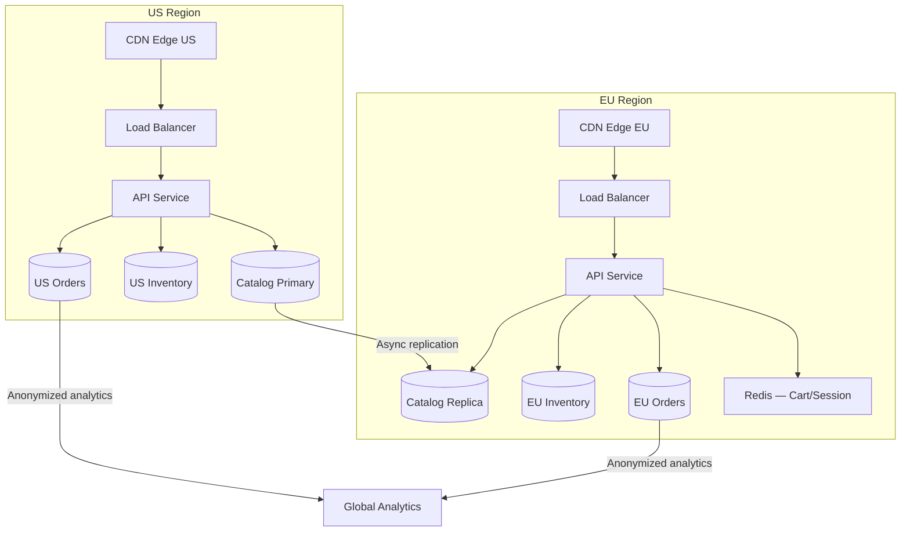

# Capstone — Multi-Region E-Commerce

*Geo-distribution, data sovereignty, multi-tenancy, CDN strategy, and cost engineering across regions.*

## 1. Requirements

- **Global**: Serve customers in North America, Europe, and Asia-Pacific with <100ms page load time
- **Data sovereignty**: EU customer data must reside in the EU (GDPR). APAC data stays in APAC where required.
- **Multi-tenant**: Platform serves multiple merchant brands, each with isolated data
- **Inventory**: Real-time inventory accuracy across regions (no overselling)
- **Scale**: 50M active users, 5M orders/day, $200M GMV/day across regions

## 2. The Central Tension

Low latency requires data close to users (replicas in every region). Data sovereignty requires data pinned to specific regions. Inventory accuracy requires strong consistency (can't sell the same item twice). These three requirements conflict:

- **Latency** wants replicas everywhere → data in all regions
- **Sovereignty** wants data restricted to one region → data NOT in all regions
- **Consistency** wants single source of truth → coordination across regions (slow)

There is no perfect solution — only trade-offs tuned per data type.

## 3. Data Classification and Strategy

The key insight: **not all data has the same requirements.** Classify data and apply different strategies per class:

| Data Type | Consistency Need | Sovereignty | Latency Need | Strategy |
|-----------|-----------------|-------------|-------------|----------|
| Product catalog | Eventual (stale price for seconds is OK) | None (public data) | Critical | CDN + regional read replicas |
| User profiles | Session-level (read-your-writes) | Yes (GDPR) | Medium | Geo-partitioned, local reads |
| Inventory counts | Strong (no overselling) | None | Medium | Single-region authority per SKU |
| Order records | Strong (financial) | Yes (GDPR) | Medium | Created in user's region, stays there |
| Shopping cart | Eventual (last-write-wins acceptable) | Weak | Critical | Regional Redis, LWW merge |
| Session data | Local only | Yes | Critical | Regional Redis, no replication |

### Product Catalog: Global CDN + Regional Replicas

Product data (names, descriptions, images, prices) changes infrequently and is read billions of times. Serve from CDN (edge-cached HTML/API responses) with a 60-second TTL. Behind the CDN, each region has a read replica of the catalog database. Catalog updates propagate from the primary region to all replicas within seconds.

**Price consistency concern**: A price update must be globally consistent before an order uses the new price. Use event-driven invalidation: catalog update → purge CDN cache for affected product → replicas converge within replication lag. The order service always reads the price from the authoritative regional replica (not CDN) at checkout time.

### Inventory: Per-Region Authority with Cross-Region Coordination

The hardest problem. Two users in different regions buying the same item must not oversell. Options:

**Option A — Global inventory (single region owns all inventory)**: All inventory writes go to one region (e.g., US-East). Other regions query US-East for availability. Simple, consistent, but APAC writes pay 200ms cross-region latency. Acceptable for most products.

**Option B — Partitioned inventory (each region owns its stock)**: Warehouse in EU has 100 units assigned to EU. Warehouse in APAC has 50 units assigned to APAC. Each region manages its own inventory independently — no cross-region coordination. If EU sells out, it can request stock transfer from APAC (an async business process, not a real-time inventory check).

**Option C — Reservation with regional preference**: Each region reserves a pool of inventory for its users. Purchases draw from the local pool. When a regional pool is low, it requests replenishment from the global pool (a background process). If the local pool is empty, the order routes to the global inventory (cross-region call, higher latency).

**Recommendation**: Option B for physical goods (inventory is physically in regional warehouses — the model matches reality). Option A for digital goods (no physical location, single inventory counter). Option C is a hybrid that works well when stock is centralized but demand is distributed.

### Orders: Created and Stored in User's Region

An EU user's order is created and stored in the EU region. The order never leaves the EU — GDPR compliance by construction. The order service in each region is independent; cross-region order queries (admin dashboards, global analytics) go through a separate analytics pipeline that aggregates anonymized data.

## 4. Architecture

## 5. Cell-Based Isolation for Multi-Tenancy

Each merchant (tenant) is assigned to a cell within a region. Cells provide blast radius isolation: a bad deploy or a traffic spike for Merchant A affects only their cell's users, not Merchant B's.

Cell assignment: `cell = hash(merchant_id) mod num_cells_in_region`. Each cell has its own compute, database partition, and cache partition. The routing layer (CDN, API gateway) routes based on merchant domain or API key.

## 6. Cost Engineering

Multi-region multiplies every cost:
- 3 regions × compute = 3× compute cost
- Cross-region replication bandwidth = significant egress
- 3× database instances (if not using a globally distributed DB)

**Optimization levers**:
- CDN aggressively (product pages, images, static assets) — reduces origin compute by 80%+
- Regional auto-scaling (APAC scales down during US peak hours and vice versa)
- Spot instances for non-critical workloads (analytics, batch processing) per region
- Storage tiering: cold product images (rarely accessed old catalog) → S3 IA

## Key Takeaways

Multi-region e-commerce is the ultimate synthesis: it requires classifying data by consistency/sovereignty/latency requirements and applying different strategies per class. The system isn't one architecture — it's a composed set of strategies, each tuned for its data type. The discipline of data classification — asking "what does this data need?" before choosing an architecture — is the transferable skill.

## Connections

**Core concepts applied:**
- [[Geo-Distribution and Data Sovereignty]] — Multi-region deployment, data residency
- [[Multi-Tenancy and Isolation]] — Regional tenant isolation
- [[Cell-Based Architecture]] — Regional cells with independent data
- [[Consistency Spectrum]] — Different consistency for different data types
- [[Cost Engineering and FinOps]] — Cross-region cost optimization
- [[Saga Pattern]] — Cross-region order fulfillment
- [[CDN Architecture]] — Global product catalog and media delivery

## Canonical Sources

- Werner Vogels, "Life is Not Fair: The Economics of Geo-Distribution" (re:Invent 2023)
- DoorDash Engineering, "Building a Multi-Region Architecture" (2022)
- Alex Xu, *System Design Interview* Vol 2 — Multi-region design patterns
