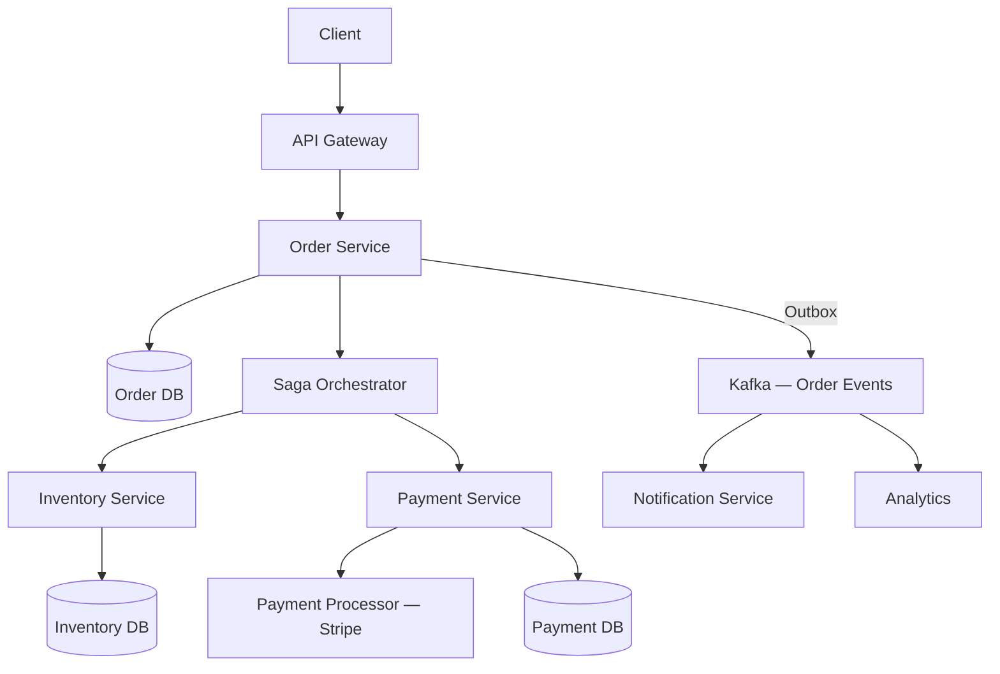

# Capstone — Payments and Orders

*The system where getting consistency wrong costs real money. Distributed transactions, idempotency, saga patterns, and double-entry accounting.*

## 1. Requirements

### Functional
- **Create order**: User submits cart → order is created with items, quantities, prices
- **Process payment**: Charge the user's payment method for the order total
- **Manage inventory**: Reserve inventory at order time, decrement on payment success, release on failure
- **Refunds**: Partial and full refunds with corresponding inventory restoration
- **Order status**: Track lifecycle (created → payment_pending → paid → shipped → delivered → completed / cancelled / refunded)

### Non-Functional
- **Financial correctness**: No double-charges, no lost payments, no phantom inventory. Money is never created or destroyed.
- **Idempotency**: Every operation is safe to retry (network timeouts are common with payment processors)
- **Auditability**: Complete, immutable record of every financial state change
- **Availability**: Order creation and payment processing must be highly available (each minute of checkout downtime is lost revenue)
- **Scale**: 10,000 orders/min peak, $50M/day GMV

## 2. Why This Is Hard

The core challenge: an order involves three services (Order, Payment, Inventory) each with their own database. The operation "create order + charge payment + decrement inventory" must either fully succeed or fully fail. But there's no single transaction boundary across three databases.

**Why 2PC doesn't work here**: You'd need the payment processor (Stripe, Adyen) to participate in your 2PC protocol. They won't — they're an external service with their own consistency model. Even among your own services, 2PC's blocking failure mode is unacceptable for a checkout flow (a coordinator crash blocks all in-flight payments).

**The answer is sagas + idempotency** — but implementing them for financial operations requires extraordinary care.

## 3. High-Level Design



## 4. Deep Dives

### Deep Dive 1: The Order Saga

An **orchestrated saga** ([[Saga Pattern]]) manages the checkout flow. The orchestrator (a Temporal/Cadence workflow, or a state machine in the Order Service) directs each step:

```
Step 1: Create order           (Order DB)    Compensate: Cancel order
Step 2: Reserve inventory      (Inventory DB) Compensate: Release inventory
Step 3: Charge payment         (Stripe API)   Compensate: Refund payment
Step 4: Confirm order          (Order DB)     — (pivot transaction, no compensation)
Step 5: Send confirmation      (Email/SMS)    — (non-compensatable, last)
```

**Step 3 is the pivot transaction**: If payment succeeds, we commit forward (confirm order, send notification). If payment fails, we compensate backward (release inventory, cancel order). We never need to compensate a successful payment in the normal flow — refunds are a separate, explicit business operation, not a saga compensation.

**Why orchestration, not choreography**: The payment flow has conditional logic (retry transient payment failures, handle specific error codes differently), timeout handling (payment processor didn't respond within 30 seconds), and a clear "pivot point." Orchestration makes this explicit in one place. Choreography would scatter this logic across services, making it nearly impossible to reason about failure scenarios.

### Deep Dive 2: Idempotency (The Critical Detail)

Payment APIs are the canonical example of why [[Idempotency]] matters. Scenario:

1. Our Payment Service sends `charge $50` to Stripe with idempotency key `order_123_payment_1`
2. Stripe processes the charge. The response is in flight.
3. Network timeout. We don't know if the charge succeeded.
4. We retry with the same idempotency key.
5. Stripe recognizes the key, returns the result of the original charge (success) without charging again.

**Without the idempotency key, step 4 would double-charge the customer.** This is not theoretical — payment timeouts happen in production regularly.

**Implementation in our Payment Service**:

```
function processPayment(orderId, amount):
    idempotencyKey = f"order_{orderId}_payment_{attemptNumber}"
    
    // Check our own idempotency record first
    existing = paymentDB.get(idempotencyKey)
    if existing:
        return existing.result  // Already processed
    
    // Record that we're attempting this payment (pessimistic)
    paymentDB.insert(idempotencyKey, status="PENDING")
    
    try:
        result = stripe.charge(amount, idempotency_key=idempotencyKey)
        paymentDB.update(idempotencyKey, status="SUCCESS", stripeId=result.id)
        return SUCCESS
    catch TimeoutError:
        // We don't know if Stripe charged. Query Stripe to find out.
        stripeResult = stripe.retrieve(idempotencyKey)
        if stripeResult.found:
            paymentDB.update(idempotencyKey, status="SUCCESS", stripeId=stripeResult.id)
            return SUCCESS
        else:
            paymentDB.update(idempotencyKey, status="FAILED")
            return FAILED
    catch PaymentDeclined:
        paymentDB.update(idempotencyKey, status="DECLINED")
        return DECLINED
```

The key insight: **we maintain our own idempotency record** in addition to relying on Stripe's. This protects against the case where our service crashes after Stripe charges but before we record the result. On restart, we check Stripe's records to reconcile.

### Deep Dive 3: Double-Entry Accounting

For financial correctness, every movement of money is recorded as **two entries**: a debit from one account and a credit to another. The sum of all debits must equal the sum of all credits — always. This invariant is checked continuously and any violation is an immediate alert.

```sql
-- Ledger table
CREATE TABLE ledger_entries (
    id BIGSERIAL PRIMARY KEY,
    transaction_id UUID NOT NULL,
    account_id VARCHAR NOT NULL,
    entry_type VARCHAR NOT NULL CHECK (entry_type IN ('DEBIT', 'CREDIT')),
    amount BIGINT NOT NULL,  -- cents, to avoid floating-point
    currency VARCHAR(3) NOT NULL,
    created_at TIMESTAMPTZ NOT NULL DEFAULT NOW()
);

-- Payment creates two entries atomically:
INSERT INTO ledger_entries (transaction_id, account_id, entry_type, amount, currency) VALUES
    ('tx_abc', 'customer_123', 'DEBIT', 5000, 'USD'),  -- Customer charged $50
    ('tx_abc', 'revenue',      'CREDIT', 5000, 'USD');  -- Revenue account receives $50
```

**Why `BIGINT` for amounts**: Floating-point arithmetic causes rounding errors. `0.1 + 0.2 ≠ 0.3` in IEEE 754. Financial systems store amounts as integers in the smallest currency unit (cents for USD, pence for GBP). $50.00 = 5000 cents.

**Refund is another pair of entries** (not a deletion of the original):
```sql
INSERT INTO ledger_entries VALUES
    ('tx_def', 'revenue',      'DEBIT',  5000, 'USD'),  -- Revenue debited
    ('tx_def', 'customer_123', 'CREDIT', 5000, 'USD');  -- Customer refunded
```

The original payment entries remain — the audit trail is immutable. This is [[Event Sourcing and CQRS]] applied to finance: the ledger entries are the events, and the current balance is a derived view.

### Deep Dive 4: Inventory Reservation

**The problem**: Between "user adds to cart" and "payment succeeds," another user might buy the same item. Naive approach: decrement inventory on payment → two users both see "1 in stock," both pay, but only one item exists.

**Reservation pattern**: When an order is created, **reserve** inventory (set aside but don't decrement). The reservation has a TTL (15 minutes). If payment succeeds within the TTL, convert the reservation to a decrement. If the TTL expires (user abandoned checkout), release the reservation.

```sql
-- Reserve: atomic conditional update
UPDATE inventory 
SET available = available - 1, reserved = reserved + 1
WHERE product_id = 'prod_123' AND available >= 1;
-- If 0 rows affected → out of stock
```

This is an [[MVCC Deep Dive|optimistic concurrency]] approach — the `WHERE available >= 1` check and the update are atomic within a single SQL statement. No distributed lock needed.

## 5. Failure Analysis

**Payment timeout + saga retry**: Payment Service times out calling Stripe. The saga orchestrator retries. The Payment Service checks its idempotency record → sees "PENDING." Queries Stripe → Stripe says the charge succeeded. Records success, returns to saga. No double charge.

**Saga orchestrator crash mid-saga**: Inventory is reserved, payment hasn't been attempted. If using Temporal/Cadence, the workflow state is durable — on restart, it resumes from the last completed step (inventory reserved) and proceeds to payment. If using a custom state machine, the saga state must be persisted in a database before each step.

**Partial failure — payment succeeds but order confirmation fails**: The saga proceeds: payment succeeded (past the pivot). The order confirmation write fails (DB unavailable). The saga retries the confirmation. If retries exhaust, alert for manual intervention. The payment has been collected — the business owes the customer the product, and the saga state makes this visible.

**Inventory leak**: Reservations aren't released (bug, crash, missed TTL). Over time, `reserved` count drifts up, reducing apparent availability. Mitigation: a periodic reconciliation job that releases reservations older than the TTL. This is a compensating background process.

## 6. Cost Analysis

At 10K orders/min (600K/hour): moderate scale. The infrastructure is dominated by the payment processor's per-transaction fees (2.9% + $0.30 for Stripe), not the infrastructure cost. At $50M/day GMV, Stripe fees are ~$1.5M/day. The infrastructure for the order/payment/inventory services is <$10K/month — rounding error compared to payment processing fees.

This is a key lesson: **for payment systems, the payment processor fee dwarfs infrastructure cost.** Optimizing Stripe fees (negotiating enterprise rates, using ACH for large payments, reducing failed transaction retries) saves more money than any infrastructure optimization.

## Key Takeaways

Payments are where distributed systems theory meets real-world consequences. The non-negotiable principles: idempotency on every external call (especially payment processors), double-entry accounting for financial correctness, saga orchestration for multi-service operations, and event sourcing for audit trails. The system is designed so that every possible failure mode — crash, timeout, retry, duplicate delivery — results in either correct completion or safe, detectable partial failure that can be resolved.

## Connections

**Core concepts applied:**
- [[Saga Pattern]] — Order-to-payment-to-fulfillment orchestration
- [[Idempotency]] — Idempotency keys on all payment mutations
- [[Idempotent Consumers]] — Exactly-once payment processing
- [[Outbox Pattern]] — Reliable event publishing from payment transactions
- [[Two-Phase Commit]] — Why 2PC is avoided; sagas preferred
- [[Event-Driven Architecture Patterns]] — Event-carried state transfer for order status
- [[SLOs, SLIs, and Error Budgets]] — Payment success rate as a critical SLI

## Canonical Sources

- Chris Richardson, *Microservices Patterns* — Chapters 4-5 (Sagas, CQRS)
- Stripe Engineering Blog — Idempotency, distributed transactions
- Alex Xu, *System Design Interview* Vol 2 — Payment system design
