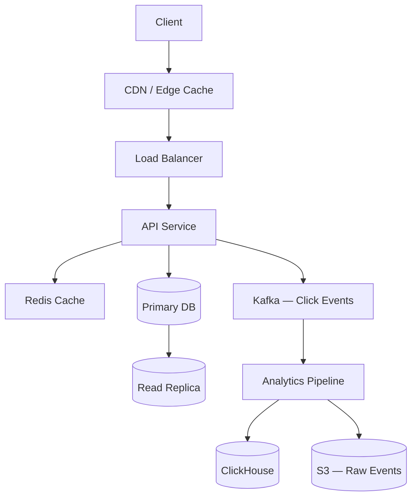

# Capstone — URL Shortener

*Deceptively simple. A single redirect operation reveals estimation, storage trade-offs, ID generation, caching, and analytics pipeline design.*

## 1. Requirements

### Functional
- **Shorten**: Given a long URL, return a short URL (e.g., `sho.rt/abc123`)
- **Redirect**: Given a short URL, 301/302 redirect to the original long URL
- **Custom aliases** (optional): User chooses their short code (`sho.rt/my-brand`)
- **Expiration** (optional): Short URLs expire after a configurable TTL
- **Analytics**: Track click counts, referrers, geographic distribution, time series

### Non-Functional
- **Read-heavy**: The redirect operation is 100:1 reads vs writes (most URLs are created once, clicked many times)
- **Low latency**: Redirects must be <50ms p99 (every millisecond of redirect latency is perceived by the user)
- **High availability**: Redirects must work even during partial failures (a dead link is worse than a slow one)
- **Scale target**: 100M new URLs/month, 10B redirects/month

## 2. Back-of-Envelope Estimation

### Traffic

```
Writes: 100M URLs/month
      = 100M / (30 × 24 × 3600) ≈ ~40 URLs/second (average)
      Peak (3× average): ~120 writes/second

Reads:  10B redirects/month
      = 10B / (30 × 24 × 3600) ≈ ~3,800 redirects/second (average)
      Peak (3× average): ~11,400 reads/second
```

This is modest. A single Postgres instance handles this comfortably. Sharding is not needed initially — the design should support it if scale grows 100×, but premature sharding is wasted complexity.

### Storage

```
Per URL record:
  short_code: 7 chars = 7 bytes
  long_url: average 200 chars = 200 bytes
  created_at: 8 bytes
  expires_at: 8 bytes (nullable)
  user_id: 8 bytes (nullable)
  click_count: 8 bytes
  Overhead (indexes, MVCC): ~100 bytes
  Total: ~340 bytes per record

100M URLs/month × 12 months × 5 years = 6B records
6B × 340 bytes = ~2 TB

With indexes (primary key + long_url for dedup):
  ~2.5–3 TB total
```

3 TB fits on a single large database instance (with read replicas for redirect traffic). A dedicated analytics store handles the click-event data.

### Analytics Events

```
10B clicks/month × 12 months = 120B events/year
Per event: ~100 bytes (short_code, timestamp, IP, user-agent, referrer)
120B × 100 bytes = ~12 TB/year of raw click data
```

This is big. Raw click data goes to an object store (S3) or a columnar analytics engine (ClickHouse), not the primary database.

## 3. High-Level Design



**Write path** (create short URL):
1. Client sends `POST /shorten { url: "https://..." }`
2. API validates URL, generates short code, writes to DB
3. Return `https://sho.rt/{code}`

**Read path** (redirect):
1. Client requests `GET /abc123`
2. CDN / edge cache serves if cached → 301 redirect (fastest path)
3. Cache miss → check Redis → cache hit → 301 redirect
4. Redis miss → query DB (read replica) → populate Redis → 301 redirect
5. Asynchronously: publish click event to Kafka for analytics

## 4. Deep Dives

### Deep Dive 1: Short Code Generation

This is the core [[ID Generation Strategies]] problem. The short code must be unique, compact, and hard to guess (predictable codes enable enumeration attacks).

**Option A — Counter-based (Base62 encoding)**:
Maintain a global counter. Each new URL gets `counter++`, encoded as Base62 (`[a-zA-Z0-9]`). A 7-character Base62 code supports 62^7 = ~3.5 trillion unique URLs.

| Aspect | Assessment |
|--------|-----------|
| Uniqueness | Guaranteed (monotonic counter) |
| Compactness | Excellent (7 chars for 3.5T codes) |
| Predictability | High — sequential codes are guessable. Attacker can enumerate `sho.rt/abc121`, `sho.rt/abc122`... |
| Coordination | Requires a central counter (DB sequence or a distributed ID service). At 40 writes/sec, a single Postgres sequence handles this trivially. |

**Mitigation for predictability**: Don't use raw sequential counter — apply a bijective mapping (a simple cipher like a Feistel network on the counter value) to shuffle the output space. The codes look random but are still uniquely derived from the counter.

**Option B — Random generation**:
Generate a random 7-character Base62 string. Check for collision in the DB. If collision, regenerate.

| Aspect | Assessment |
|--------|-----------|
| Uniqueness | Probabilistic — collision check required |
| Compactness | Same as counter (7 chars) |
| Predictability | Low (random) |
| Coordination | None (any instance generates independently) |
| Collision probability | With 6B existing codes in a 3.5T space, collision probability per generation is ~0.0002%. Negligible, but the check is still needed for correctness. |

**Option C — Hash-based**:
Hash the long URL (MD5 or SHA-256), take the first 7 Base62 characters. Deterministic — the same URL always gets the same code.

| Aspect | Assessment |
|--------|-----------|
| Uniqueness | Hash collisions possible (different URLs → same first 7 chars). Must check and handle. |
| Deduplication | Built-in — same URL → same code. No duplicates. |
| Custom aliases | Doesn't support them (the code is derived from the URL) |

**Recommendation**: Counter-based with a Feistel shuffle. It's simple, guaranteed unique (no collision checks), and the shuffle eliminates predictability. Falls back to random generation for custom aliases.

### Deep Dive 2: Caching Strategy

At 11K reads/sec peak, the database can handle this directly (Postgres on good hardware does 50K+ reads/sec with proper indexing). But caching reduces latency from ~5ms (DB) to <1ms (Redis) and protects the DB from traffic spikes.

**Cache pattern**: [[Cache Patterns and Strategies|Cache-aside]]. On redirect, check Redis first. On miss, query DB, populate Redis. On URL creation, don't pre-populate cache (most URLs are never clicked — avoid caching the long tail).

**Cache key**: The short code (`abc123`).
**Cache value**: The long URL.
**TTL**: 24 hours for general URLs. No expiry for high-traffic URLs (detected by click rate).

**Cache hit ratio estimate**: URL access follows a Zipfian distribution — a small number of URLs get the vast majority of clicks. The top 20% of URLs likely account for 80%+ of redirects. With a Redis cache sized for the top 20% of active URLs:

```
Active URLs (created in last 30 days): 100M
Top 20%: 20M entries
Per entry: ~250 bytes (key + value)
20M × 250 bytes = ~5 GB Redis
```

5 GB of Redis caches the hot set. Expected hit ratio: 80–90%. This drops DB load from 11K reads/sec to ~1K–2K reads/sec.

**CDN caching**: For the hottest URLs (viral links), the CDN can cache the redirect response. Set `Cache-Control: public, max-age=300` on redirect responses. The CDN serves the redirect from the edge — zero origin load, <5ms latency globally. Trade-off: if the URL is updated or deleted, the CDN serves the stale redirect for up to 5 minutes.

### Deep Dive 3: 301 vs 302 Redirect

A subtle but important decision:

**301 (Moved Permanently)**: The browser caches the redirect. Subsequent clicks skip the server entirely — the browser redirects locally. Better for the user (faster). Worse for analytics (the server never sees repeat clicks from the same browser).

**302 (Found / Temporary Redirect)**: The browser does NOT cache. Every click hits the server. Better for analytics (you see every click). Slightly slower for repeat clicks.

**Recommendation**: Use 302 by default (analytics are a core feature). Offer 301 as an option for users who prioritize performance over analytics. This is what Bitly does.

### Deep Dive 4: Analytics Pipeline

Click events are high-volume (10B/month) and write-heavy. They should NOT go to the primary URL database — they'd overwhelm it. Instead:

**Write path**: API publishes a click event to Kafka (async, non-blocking — the redirect response is sent before the event is published). The event includes: short_code, timestamp, IP address (for geo-lookup), user-agent, referrer, accept-language.

**Processing pipeline**: 
- Kafka → Flink/Spark Streaming → enrich events (IP → geo lookup, user-agent parsing) → write to ClickHouse (columnar analytics DB) + S3 (raw archive)
- ClickHouse serves the analytics dashboard queries: clicks per day, clicks by country, clicks by referrer, time-series charts.

**Why ClickHouse over Postgres for analytics**: 10B events/month × aggregation queries = columnar storage and compression shine. ClickHouse compresses this data 10–20× and serves aggregation queries in milliseconds. Postgres would need partitioning and careful indexing, and still be slower for OLAP patterns.

**Pre-aggregation**: For real-time counters (total clicks per URL), maintain a running count in Redis (INCR on each click). Persist to DB periodically. This avoids querying the analytics pipeline for simple counts.

## 5. Failure Analysis

**Primary DB failure**: Read replicas serve redirects (core functionality preserved). New URL creation fails until the primary recovers or a failover completes (~15–30s with Patroni). Acceptable — creation is not latency-critical.

**Redis failure**: Redirects fall back to the database. Latency increases from <1ms to ~5ms. DB load spikes temporarily. If the DB can't handle the spike, CDN caching and connection pooling provide a buffer. Recovery: Redis Sentinel or Cluster provides automatic failover.

**Kafka failure**: Click events are lost during the outage window. Redirects are unaffected (analytics is async). Mitigation: buffer events locally on the API server and replay when Kafka recovers. Accept that a short Kafka outage means a small gap in analytics — not a business-critical failure.

**CDN cache poisoning**: An attacker tricks the CDN into caching a redirect to a malicious URL. Mitigation: validate redirect targets, sign redirect responses, and don't cache responses from unauthenticated endpoints that allow URL creation.

**Hotspot (viral URL)**: One URL receives 100K clicks/second. Redis handles this if the key isn't on a single shard. CDN caching absorbs most of the load at the edge. If the key is a Redis hot key, replicate it to a local in-process cache on API servers (L1 cache with 10s TTL).

## 6. Production Hardening

**Rate limiting**: Per-IP and per-API-key rate limits on URL creation (prevent spam). No rate limiting on redirects (every redirect is a user click — you can't rate limit users).

**Abuse prevention**: Validate that long URLs are syntactically valid. Check against a URL blocklist (malware, phishing). Optionally: scan the destination with a safe browsing API (Google Safe Browsing). Flag and review URLs with suspicious patterns.

**Monitoring**: Redirect latency (p50, p95, p99). Cache hit ratio. DB query latency. Click event pipeline lag (Kafka consumer lag). Error rates by endpoint. Top-N URLs by click volume (detect viral URLs that might cause hot keys).

**Deployment**: Blue-green with a canary phase. The API service is stateless — any instance can serve any request. Rolling deployments are safe.

## 7. Cost Analysis (at target scale)

```
Compute:
  API servers: 3 instances × $0.10/hr = $216/month
  (handles 11K req/sec with headroom)

Database:
  Postgres Primary (r6g.2xlarge): ~$800/month
  Read Replica: ~$800/month
  Storage (3TB gp3): ~$250/month

Cache:
  Redis (r6g.large, 13GB): ~$200/month

Analytics:
  ClickHouse (self-hosted, 3 nodes): ~$600/month
  S3 (12TB/year, IA after 30 days): ~$80/month
  Kafka (3 brokers, MSK): ~$500/month

CDN:
  CloudFront (10B requests/month): ~$7,500/month
  (This dominates cost. Optimization: cache aggressively, use 301 for high-traffic URLs)

Total: ~$11,000/month
CDN is 68% of cost. The primary optimization lever is increasing CDN cache hit ratio.
```

## 8. Evolution at 10× and 100× Scale

**10× (1B URLs, 100B redirects/month)**:
- Shard the URL database by short_code hash (2–4 shards). Each shard handles 25B redirects/month — still manageable with caching.
- Scale Redis to a cluster (3 masters + replicas).
- CDN becomes even more critical — must achieve 95%+ cache hit ratio to keep origin load manageable.
- Analytics pipeline: partition ClickHouse by date, add more Kafka partitions.

**100× (10B URLs, 1T redirects/month)**:
- The URL database needs significant sharding (16–32 shards) or migration to a distributed DB (CockroachDB, DynamoDB).
- Redis Cluster with 50+ GB capacity.
- Consider a custom in-memory redirect service (the URL mapping fits in RAM at this scale: 10B × 250 bytes = ~2.5 TB — feasible with a distributed in-memory store across 20–30 nodes).
- Analytics pipeline: switch to a dedicated data lake (S3 + Iceberg) with Spark/Trino for batch queries. ClickHouse for real-time dashboards.
- Multi-region deployment for latency: edge compute at CDN PoPs can handle redirects without origin calls (replicate the hot URL set to edge KV stores like Cloudflare Workers KV).

## Key Takeaways

This design is intentionally simple — the best designs for simple problems stay simple. The temptation is to over-engineer: sharding a database that handles 40 writes/sec, building a distributed ID generator for a workload that a Postgres sequence handles, or deploying Kafka for 40 events/sec. Resist. Start simple, monitor, and evolve when measurement proves it's necessary.

The genuinely interesting decisions are: short code generation strategy (counter + shuffle vs random), 301 vs 302 redirect (analytics vs performance), and the analytics pipeline separation (keeping click events out of the primary database).

## Architecture Diagram

```mermaid
graph TD
    User[Client] -->|GET /abc123| Edge[CDN / Edge Worker]
    Edge -- "Cache Hit" --> User
    
    subgraph "Origin Cluster"
        Edge -- "Cache Miss" --> API[API Service]
        API -->|1. Lookup| Cache{Redis Cache}
        Cache -- "Hit" --> API
        Cache -- "Miss" --> DB[(Read Replica)]
        
        API -.->|2. Async Log| Kafka[Kafka: Click Events]
    end

    subgraph "Analytics Stack"
        Kafka --> Flink[Flink / Enrichment]
        Flink --> CH[(ClickHouse)]
        Flink --> S3[(S3 Archive)]
    end

    style Edge fill:var(--surface),stroke:var(--accent),stroke-width:2px;
    style Cache fill:var(--surface),stroke:var(--accent2),stroke-width:2px;
    style CH fill:var(--surface),stroke:var(--border),stroke-width:1px;
```

## Back-of-the-Envelope Heuristics

- **Write vs Read Ratio**: Typically **1:100** or higher. Design for massive read throughput.
- **Base62 Capacity**: A 7-character code provides **~3.5 Trillion** unique IDs (62^7).
- **Latency Target**: Redirects must be **< 50ms**. A "Fast" redirect is essential because the user hasn't even reached the destination site yet.
- **Cache Sizing**: Use the **80/20 Rule**. Caching the top 20% of URLs typically handles 80% of redirect traffic. For 100M active URLs, 20M entries @ 250 bytes = **~5GB Redis**.

## Real-World Case Studies

- **Bitly (Custom Sharding)**: Bitly handles over 25 billion clicks per month. They use a custom sharding strategy based on the short-code prefix. They also heavily utilize **Redis** not just for caching, but for real-time click counters, which are then asynchronously persisted to a permanent store.
- **Twitter (t.co)**: Twitter created `t.co` to protect users from malicious links and to save space. Unlike Bitly, Twitter uses **301 (Permanent) Redirects** for most links. This reduces their server load (browsers cache the result), but it makes their analytics less granular for repeat clicks from the same user.
- **TinyURL (The OG)**: TinyURL was the first major shortener. Their original design was simple sequential IDs. This led to "Security by Obscurity" issues where users could easily guess other people's private short links by just incrementing the ID (enumeration attack). Modern shorteners use non-sequential or hashed IDs to prevent this.

## Connections

**Core concepts applied:**
- [[ID Generation Strategies]] — Short code generation (Base62 encoding, collision handling)
- [[Cache Patterns and Strategies]] — Heavy read caching for URL lookups
- [[Database Replication]] — Read replicas for redirect lookups at scale
- [[Rate Limiting and Throttling]] — Abuse prevention on URL creation
- [[CDN Architecture]] — Serving redirects from edge locations
- [[Batch Processing and Data Pipelines]] — Analytics pipeline for click tracking
- [[Partitioning and Sharding]] — Database sharding by short code hash

## Canonical Sources

- Alex Xu, *System Design Interview* Vol 1 — Chapter 8: Design a URL Shortener
- Real-world reference: Bitly Engineering Blog
