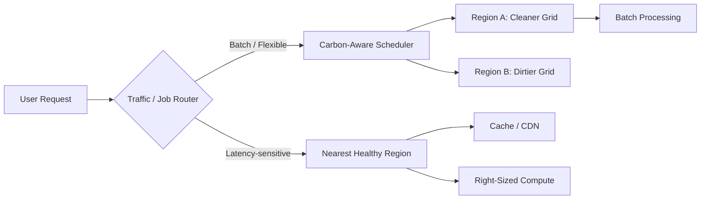

# Green Software Engineering

## Why This Exists

System design traditionally optimizes for latency, throughput, reliability, and cost. But compute is now large enough, and AI-heavy enough, that **energy usage** and **carbon intensity** are becoming meaningful architectural constraints too. A design that uses 5x more compute than necessary is not just expensive. It consumes more electricity, drives higher cooling requirements, and may lock an organization into wasteful infrastructure patterns for years.

Green software engineering exists to make sustainability a design variable rather than a PR statement. It asks: can we deliver the same user outcome with less energy, better hardware utilization, lower embodied carbon, and more carbon-aware scheduling?

## Mental Model

Think of green software engineering like traffic management in a city. A city cannot control the weather, but it can reduce wasted fuel by timing lights better, avoiding unnecessary trips, and shifting traffic away from congested routes. The goal is not to ban movement. The goal is to eliminate waste while preserving useful work.

Software has the same shape. You rarely eliminate demand entirely. Instead you:

- avoid unnecessary work
- move flexible work to cleaner or cheaper times and places
- improve utilization so fewer machines do the same job
- extend hardware life so you do not constantly replace servers just to chase incremental efficiency

## What Is Green Software Engineering?

Green software engineering is the practice of designing systems to minimize unnecessary environmental impact across four dimensions:

1. **Carbon efficiency**: emit less carbon for the same user outcome
2. **Energy efficiency**: use less electricity per transaction or workload
3. **Hardware efficiency**: use fewer machines, and keep them useful longer
4. **Carbon awareness**: shift flexible workloads toward times and regions where electricity is cleaner

It is not a separate specialty from systems design. It is a systems-design lens that changes optimization choices.

## Architecture Pattern

The key split is between **latency-sensitive work**, which is constrained by user experience, and **flexible work**, which can move in time or geography.

## Core Principles

### Eliminate waste before optimizing infrastructure

The greenest request is the one you never execute. Before discussing carbon-aware routing, first remove obvious waste:

- repeated recomputation
- oversized instances
- chatty synchronous hops
- redundant polling
- duplicate model inference
- low-value background jobs with no real consumer

This is why green engineering overlaps heavily with good performance engineering and good FinOps.

### Shift flexible work, not critical work

User-facing interactive requests usually cannot wait for a cleaner energy window. Batch work often can. Strong candidates for shifting:

- training pipelines
- backfills
- report generation
- indexing and re-embedding
- media transcoding
- non-urgent backups

### Optimize hardware lifecycle, not just utilization

Replacing servers aggressively has embodied carbon costs: manufacturing, shipping, disposal, and supply chain overhead. A design that squeezes slightly more performance from brand-new hardware may be environmentally worse than a design that keeps existing hardware useful longer.

## Practical Levers

### Carbon-aware scheduling

If a job must complete within 12 hours but does not need to start immediately, run it when grid carbon intensity is lowest. This works well for batch systems, retraining pipelines, ETL, and offline analytics.

The trade-off is operational complexity: the scheduler must understand both workload deadlines and carbon signals, and it must not miss SLAs while chasing cleaner windows.

### Right-sizing and utilization

Most underutilized infrastructure is both a cost problem and a sustainability problem. Idle headroom is sometimes necessary for resilience, but persistent 10-20% utilization across large fleets is usually architectural waste.

Green design asks:

- can the service autoscale more aggressively?
- can the cache hit ratio be improved so fewer origin calls occur?
- can inference be batched?
- can the same workload run on fewer, better-utilized nodes?

### Caching and locality

Serving hot content from a CDN or regional cache reduces origin computation, network traversal, and repeated work. The performance argument is familiar. The environmental argument is the same: less duplicated compute and less network movement.

### Efficient model selection

AI systems make this topic sharper. Running a frontier model for every request may be the highest-carbon path available. Smaller models, caching, and staged escalation reduce both cost and energy.

### Data lifecycle policies

Storage is not free environmentally. Cold data that is never accessed still consumes infrastructure capacity, replication bandwidth, and operational attention. Tiering and retention policies reduce wasted storage footprint.

## Trade-Off Analysis

| Strategy | Benefit | Risk | Best Fit |
|----------|---------|------|----------|
| **Carbon-aware scheduling** | Lower emissions for flexible jobs | SLA misses if windows are too restrictive | Batch processing, ETL, training |
| **Right-sizing** | Less waste, lower cost, fewer idle servers | Performance regression if over-corrected | Stable services with metrics history |
| **Caching / edge delivery** | Fewer origin requests, lower network and compute load | Staleness, invalidation complexity | Read-heavy systems |
| **Smaller models / staged inference** | Lower compute per request | Quality regressions on hard tasks | AI routing, extraction, light summarization |
| **Longer hardware lifecycle** | Lower embodied carbon | Older hardware may be less efficient per watt | Internal platforms, predictable workloads |

## Failure Modes

### Chasing carbon at the expense of user experience

A system routes too aggressively to a cleaner but distant region, increasing latency for interactive traffic. The design looks green on paper but degrades real users.

Mitigation: keep latency-sensitive traffic on the lowest-latency healthy path. Use carbon-aware routing mainly for flexible or background work.

### Carbon-aware scheduling that misses deadlines

Teams over-constrain job schedulers to wait for cleaner energy windows, but the clean window never arrives long enough, and the job breaches its completion SLA.

Mitigation: treat carbon awareness as an optimization objective inside a hard deadline, not above it. Deadline first, carbon second.

### Sustainability theater

The organization reports a carbon-aware dashboard while leaving obvious inefficiencies untouched: oversized fleets, duplicate pipelines, and low-value cron jobs. The high-visibility metric distracts from the larger inefficiency.

Mitigation: prioritize the biggest waste sources first. In practice, right-sizing and workload elimination often outperform sophisticated routing tricks.

### Over-consolidation harms resilience

Trying to maximize utilization can remove too much failover headroom. The fleet is efficient during normal operation but brittle during incidents or regional failover.

Mitigation: reserve explicit resilience capacity. Green engineering is not an excuse to violate reliability requirements.

## Design Patterns in Practice

### Separate hard-real-time from flexible workloads

Do not run every workload on the same optimization policy. Split the system into:

- **interactive path**: optimized for latency and availability
- **background path**: optimized for efficiency, batching, and carbon awareness

This simple separation is where most green gains come from.

### Build a "cost + carbon" feedback loop

Many sustainability wins overlap with FinOps. Track:

- utilization
- cost per request
- energy proxy metrics such as CPU-seconds or GPU-seconds per workload
- carbon intensity by region and time window

You do not need perfect direct power measurement to improve. Even coarse workload-level proxies produce better decisions than flying blind.

### Design for graceful deferral

If a workload is deferrable, make that explicit in the architecture:

- deadline
- max deferral window
- acceptable region set
- quality floor

A batch job without a deadline model cannot be scheduled intelligently.

## Back-of-the-Envelope Heuristics

- **First rule**: removing wasted work usually beats carbon-aware routing. Start with right-sizing, cache hit ratio, and dead-job cleanup.
- **Batch jobs are the best target**: if the work can move by **hours**, carbon awareness becomes practical. If it can only move by **milliseconds**, latency will dominate.
- **Idle fleets are hidden emissions**: a service consistently running below **30-40%** useful utilization is usually a better candidate for optimization than a well-utilized service on a slightly dirtier grid.
- **AI workloads dominate fast**: one unnecessary large-model inference path can outweigh many ordinary web requests in energy cost.
- **Do not sacrifice resilience**: keep enough failover headroom. A green architecture that collapses during traffic spikes is just a bad architecture.

## Real-World Case Studies

- **Batch analytics platforms**: many data platforms now shift non-urgent ETL and backfills into cheaper, cleaner windows, especially when daily SLA deadlines leave hours of flexibility.
- **CDN-heavy consumer systems**: aggressive caching is one of the most environmentally beneficial optimizations because it reduces both network distance and repeated origin computation.
- **AI inference stacks**: teams increasingly use smaller local models for routing and filtering while reserving large GPU-heavy inference for the minority of requests that truly need it.

## Connections

- [[Cloud_Cost_Optimization]] — Most sustainability wins start as waste-removal and utilization improvements
- [[Resource_Right-Sizing_and_Autoscaling]] — Right-sizing is both a cost and carbon optimization
- [[03-Phase-3-Architecture-Operations__Module-17-Observability-Deployment__Observability_and_Alerting]] — You cannot improve what you do not measure
- [[04-Phase-4-Modern-AI__Module-19-AI-Inference-LLMOps__Inference_Serving_Architecture]] — AI inference makes energy and hardware efficiency a first-class design concern
- [[04-Phase-4-Modern-AI__Module-20-RAG-Agents-Realtime__Small_Language_Models]] — Smaller models are often the greener default path for bounded tasks
- [[04-Phase-4-Modern-AI__Module-21-Serverless-Edge-Platform__Serverless_and_Edge_Computing]] — Edge and serverless can reduce idle capacity, but only if request patterns justify the trade-offs

## Reflection Prompts

1. Which workloads in your architecture are truly latency-sensitive, and which could be deferred by minutes or hours without harming users?
2. If you had to cut the carbon footprint of an AI-heavy service by 30%, would you start with model routing, batching, caching, or hardware changes? Why?
3. Where is your current system wasting compute even before you start thinking about carbon-aware routing?

## Canonical Sources

- Green Software Foundation materials on carbon-aware and energy-aware software design
- The Green Software Engineering body of knowledge and patterns from the Green Software Foundation
- Cloud provider sustainability and carbon-intensity scheduling guidance
