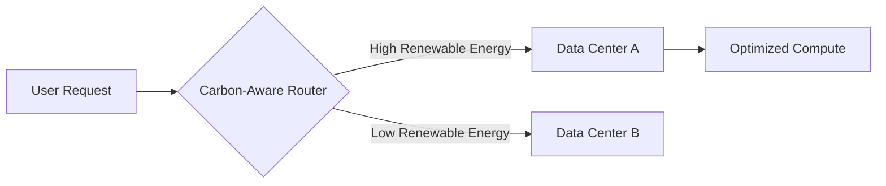

# Green Software Engineering

## What is Green Software Engineering?

Green Software Engineering is an emerging discipline that prioritizes building software that is energy-efficient and has a reduced carbon footprint. It involves carbon-aware routing, hardware efficiency, and reducing unnecessary computational waste.

## Core Principles

1. **Carbon Efficiency:** Emit the least amount of carbon possible.
2. **Energy Efficiency:** Use the least amount of energy possible.
3. **Hardware Efficiency:** Use the least amount of embodied carbon possible (extend hardware lifespans).
4. **Carbon Awareness:** Do more when electricity is clean and do less when it is dirty.

## Why This Exists

As compute demands (especially from AI workloads) surge, energy consumption has become a primary constraint in system design. This note exists to introduce sustainability as a non-functional requirement equal to latency, throughput, and availability.

## Reflection Prompts

1. How would you design a batch processing job to be carbon-aware without violating its completion SLA?
2. What trade-offs must you consider when shifting workloads to a region powered by renewables if that region is further away from your users?
