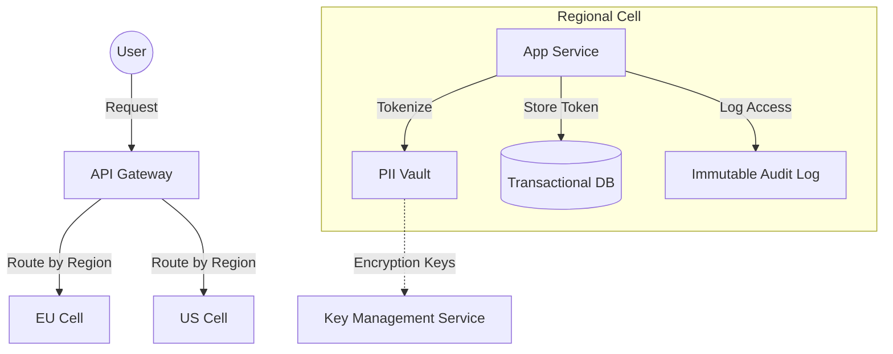

# Data Privacy and Compliance

## Why This Exists
In the early days of the web, data was the "new oil" — a resource to be extracted and hoarded. Today, data is more like nuclear waste: valuable if handled correctly, but a massive liability if it leaks or is mismanaged. Regulatory frameworks (GDPR, HIPAA, CCPA) have turned data privacy from a "nice-to-have" into a core architectural constraint. Systems that don't design for privacy from day one face massive fines (up to 4% of global turnover for GDPR), loss of customer trust, and the technical debt of retrofitting "Right to be Forgotten" into a distributed mess of databases.

## Mental Model / Analogy
Think of data privacy as **Bank Vault vs. Library**. A library is designed for discovery and access (traditional database). A bank vault is designed for custodial responsibility and auditability. In a privacy-first architecture, your primary data store isn't just a bucket for bits; it's a managed custodial service where every piece of PII (Personally Identifiable Information) is tagged, tracked, and potentially removable at the push of a button.

## How It Works

### 1. Data Classification and Tagging
You cannot protect what you cannot identify. Modern compliance starts with a **Data Catalog**.
- **PII (Personally Identifiable Information)**: Names, emails, phone numbers, SSNs.
- **Sensitive PII**: Health data (HIPAA), biometrics, political affiliations.
- **Metadata**: IP addresses, location data, device IDs.
Every column in your schema should have a privacy tag (e.g., `@pii`, `@internal-only`, `@public`).

### 2. PII Masking and Tokenization
Instead of storing raw PII everywhere, use a **PII Vault**.
- **Tokenization**: Replace sensitive data (like a credit card number) with a non-sensitive "token." The raw data lives in a highly secure, isolated vault. Downstream services only see the token.
- **Dynamic Masking**: Anonymize data at the query layer. A support agent sees `john.***@gmail.com`, but the billing service sees the full email.

### 3. Data Residency and Sovereignty
Laws like the GDPR and China's PIPL often require that data about a country's citizens stays within that country's borders.
- **Cell-Based Architecture**: Deploy independent "cells" of your stack in different regions (e.g., EU-West-1, US-East-1).
- **Request Routing**: The API Gateway inspects the user's origin or account metadata and routes the request to the correct regional cell.
- **Cross-Border Transfer**: If data *must* leave a region, it must be encrypted with keys held in the source region.

### 4. Designing for the "Right to be Forgotten" (RTBF)

Deleting a user's data in a distributed system is far harder than a single `DELETE FROM users WHERE id = 123`. Data propagates across many systems, each with its own retention behavior.

**The hidden RTBF surface area**: Primary database (the obvious one), read replicas, backup snapshots (S3 backups persist for years by default), caches (Redis, CDN — must be explicitly invalidated), event streams (Kafka topics retain events that contain PII), CDC logs (Debezium captures every row change, including PII, into the binlog), distributed traces (spans contain request parameters, user IDs, and sometimes response bodies), search indexes (Elasticsearch may have indexed PII fields), and analytics data warehouses (BigQuery/Snowflake snapshots don't auto-delete).

**Crypto-Shredding**: Instead of hunting every system for `user_id=123`, encrypt all of User 123's PII with a unique `UserKey` stored in KMS. To "delete" the user, destroy the `UserKey` in KMS. All their data across all systems becomes cryptographically unreadable instantly — no need to enumerate every table, topic, and cache. The data physically remains but is mathematically equivalent to deleted. This is the only tractable approach at scale.

**Event sourcing challenge**: Event logs are immutable by design. If a `UserRegistered` event contains a name and email, you cannot delete it without breaking the log's integrity. Solution: crypto-shredding at the aggregate level — all events for aggregate `user_123` are encrypted under `user_123`'s key. Destroying the key "erases" the user from the entire event history without modifying immutable log entries. A side note in the event schema documents that some aggregates may have had their keys destroyed.

**Backup rotation alignment**: GDPR requires deletion within 30 days. If your database backups are retained for 90 days, you're out of compliance unless you use crypto-shredding (so backup snapshots become meaningless for the deleted user). Align your backup retention policy to your RTBF SLA, or use key-based encryption for backups.

**Tombstones and Soft Deletes**: Use tombstones to mark data as deleted in LSM-trees or event streams. Background compaction eventually physically removes the data. This is appropriate for systems where crypto-shredding is not feasible, but you must ensure compaction runs before the RTBF SLA deadline.

### 5. Immutable Audit Logs
For compliance (SOX, HIPAA), you must prove *who* accessed *what* and *when*.
- **Audit Sidecars**: Every service has a sidecar that logs access to PII-tagged fields to an immutable, append-only ledger (like Amazon QLDB or a signed S3 bucket).
- **Non-Repudiation**: Logs should be cryptographically signed to prevent tampering.

### 6. Consent Management Architecture

Privacy regulations don't just require you to protect data — they require you to have a lawful basis for processing it. GDPR defines six lawful bases (consent, contract, legal obligation, vital interests, public task, legitimate interests). Systems that process PII without tracking the lawful basis for each piece are non-compliant even if the data is encrypted.

**Consent schema**: Store consent at the intersection of (user, purpose, data category):

```sql
data_processing_consents (
    user_id          UUID,
    purpose          VARCHAR,  -- e.g., "marketing_emails", "analytics", "third_party_sharing"
    legal_basis      VARCHAR,  -- "consent", "contract", "legitimate_interest"
    granted_at       TIMESTAMPTZ,
    withdrawn_at     TIMESTAMPTZ,  -- NULL if active
    ip_at_consent    INET,
    consent_version  VARCHAR   -- version of the consent text shown
)
```

**Consent propagation**: When a user withdraws consent for "analytics," every downstream analytics pipeline that processes their data must be notified and must stop. This requires a consent-change event published to a central bus (Kafka), consumed by all affected services. Services must have a local copy of the user's consent state to make processing decisions without round-tripping to a central consent service on every request.

**Lawful basis expiry**: Consent can be withdrawn. Legitimate interest must be rebalanced if challenged. Contract-based processing terminates when the contract ends. The system must re-evaluate lawful basis on a schedule — a user who consented 3 years ago to a purpose that has since been withdrawn needs their data purged from that processing pipeline.

### 7. Regulatory Comparison: GDPR vs HIPAA vs CCPA

The three major frameworks have different scopes and impose different technical requirements:

| Dimension | GDPR (EU) | HIPAA (US Health) | CCPA/CPRA (California) |
|-----------|-----------|-------------------|------------------------|
| Scope | All EU residents' data, any processor worldwide | PHI (Protected Health Information) in the US | California residents' data |
| Max fine | 4% of global annual turnover | Up to $1.9M/year per violation category | $7,500/intentional violation |
| Right to erasure | Yes — 30-day SLA (Article 17) | Limited — 6-year retention required for PHI | Yes — 45-day SLA |
| Key technical requirement | Privacy by design (Article 25), DPIA for high-risk processing | Encryption of PHI at rest and in transit, audit logs, BAAs with vendors | Right to opt out of sale/sharing, right to know, data portability |
| Consent requirement | Explicit, granular, withdrawable | Authorization required for most disclosures | Opt-out model (not opt-in for most uses) |

The practical implication: if you serve both EU and California users and handle any health data, you're subject to all three. Design for the strictest superset: GDPR's explicit consent model, HIPAA's audit log depth, and CCPA's data portability requirements.

### 8. Differential Privacy for Analytics

A less obvious privacy risk: exact aggregate counts leak information about individuals in small cohorts. If your analytics shows "3 users from Company X used Feature Y," a Company X employee can deduce which colleagues used it. This is the "small cohort exposure" problem.

**Differential privacy** adds calibrated random noise to aggregate query results, providing a mathematical privacy guarantee (ε-differential privacy) that no single individual's presence or absence in the dataset changes the query result by more than a bounded factor. Apple uses this for keyboard usage analytics; Google uses it in RAPPOR for Chrome statistics.

**Practical implementation**: For in-product analytics, set minimum cohort size thresholds (suppress results for groups < 5 users) and consider adding Laplace noise to count queries. For ML model training, use DP-SGD (differentially private stochastic gradient descent) to prevent the model from memorizing individual training examples. Libraries: Google's dp-accounting, Apple's swift-dp-synthetic-data, OpenDP.

**Trade-off**: Higher privacy (lower ε) requires more noise, reducing statistical accuracy. For large cohorts (millions of users), the noise is imperceptible. For small cohorts, DP results may be too noisy to be useful — at which point, the privacy-preserving decision is to not publish the result at all.

## Trade-Off Analysis

| Approach | Strengths | Weaknesses | Best For |
|----------|-----------|------------|----------|
| **Crypto-Shredding** | Instant "deletion" across backups/logs | Key management complexity; CPU overhead | High-scale systems with strict RTBF needs |
| **PII Vault / Tokenization** | Centralized security policy; reduced PCI/HIPAA scope | Single point of failure; latency on "de-tokenization" | Financial systems, handling SSNs/CCs |
| **Cell-Based Residency** | Strong compliance; low regional latency | Operational overhead (N regions); hard to aggregate global data | Global B2C apps (e.g., TikTok, Meta) |
| **On-the-fly Masking** | Transparent to developers; flexible | Can be bypassed if query layer is bypassed | Internal dashboards, BI tools |

## Failure Modes & Production Lessons
- **The "Backups are Forever" Trap**: You delete a user from the DB, but they persist in S3 backups for years. **Lesson**: Use crypto-shredding or short-lived backup retention policies.
- **Log Leakage**: A developer logs `user_object` for debugging, accidentally putting the user's password and SSN into Splunk/ELK. **Lesson**: Use automated PII scanners (like Amazon Macie or Google Cloud DLP) on your log streams.
- **Cache Poisoning**: PII is cached in Redis/CDN and stays there after a deletion request. **Lesson**: Deletion events must trigger a global cache invalidation.

## Architecture Diagram



## Back-of-the-Envelope Heuristics
- **GDPR Deletion SLA**: Typically 30 days. Your "garbage collection" processes must run at least weekly.
- **Tokenization Latency**: A call to a PII vault adds **10–50ms**. Batch de-tokenization is essential for reporting.
- **Audit Log Volume**: Audit logs can be **2x-5x larger** than your actual data if every read is tracked. Use sampling for non-sensitive data.

## Real-World Case Studies
- **Uber**: Developed **"Queryguard"**, an internal tool that intercepts SQL queries and automatically masks PII based on the user's role and the data's classification.
- **Netflix**: Uses a dedicated PII service and crypto-shredding to handle global privacy requests at scale across thousands of microservices.

## Connections

- [[03-Phase-3-Architecture-Operations__Module-15-Security__Authentication_and_Authorization]] — Access control is the enforcement layer for data classification: role-based access determines who can de-tokenize PII.
- [[03-Phase-3-Architecture-Operations__Module-15-Security__Encryption_at_Rest_and_in_Transit]] — The cryptographic foundation for crypto-shredding and PII vault security.
- [[03-Phase-3-Architecture-Operations__Module-12-Architectural-Patterns__Event_Sourcing_and_CQRS]] — Event sourcing creates an immutable log; RTBF requires crypto-shredding at the aggregate level rather than physical deletion.
- [[03-Phase-3-Architecture-Operations__Module-12-Architectural-Patterns__Cell-Based_Architecture]] — The primary architectural pattern for data residency compliance; each cell contains data for one jurisdiction.
- [[03-Phase-3-Architecture-Operations__Module-18-Multitenancy-Geo-Cost__Geo-Distribution_and_Data_Sovereignty]] — The companion note on routing, failover, and cross-border transfer restrictions.
- [[Audit_Logging_and_Compliance]] — The technical implementation of immutable audit trails (QLDB, signed S3, append-only ledgers).
- [[01-Phase-1-Foundations__Module-03-Storage-Engines__Write-Ahead_Log]] — WALs and CDC logs are a hidden RTBF surface area; binlogs persist PII even after database deletion.
- [[03-Phase-3-Architecture-Operations__Module-13-Messaging-Pipelines__Change_Data_Capture]] — CDC pipelines capture every row mutation, including PII fields, and propagate to downstream consumers that may retain data beyond the primary database's retention period.

## Reflection Prompts

1. If your database is encrypted at rest (e.g., using AWS RDS encryption), does that satisfy GDPR requirements for data protection? Why or why not? (Hint: encryption at rest protects against physical media theft, but not against authenticated access by your own services — which is what GDPR regulates.)

2. You have a data warehouse (BigQuery/Snowflake) for analytics. How do you handle a "Right to be Forgotten" request without rewriting terabytes of historical Parquet files?

3. Your system uses event sourcing. An event published two years ago contains the user's full name and email address in the payload. A user invokes GDPR RTBF. The event log is immutable and shared across services. Walk through your deletion strategy. What systems do you need to touch beyond the event store itself?

4. Your analytics team wants to publish a dashboard showing "feature adoption by company" for your B2B SaaS product. Some customers have only 2–3 users. How do you prevent individual-level inference from cohort-level statistics?

## Canonical Sources

- GDPR text: Article 17 ("Right to erasure"), Article 25 ("Data protection by design and by default") — the regulatory foundation for RTBF and Privacy by Design.
- HIPAA Security Rule (45 CFR Part 164) — the technical safeguard standards for Protected Health Information.
- *Privacy Engineering* by Michelle Finneran Dennedy, Jonathan Fox & Thomas Finneran — the most practical book on building privacy-compliant systems.
- NIST Privacy Framework (2020) — a risk-based approach to privacy engineering, complementing the NIST Cybersecurity Framework.
- NIST SP 800-122 — Guide to Protecting the Confidentiality of Personally Identifiable Information.
- Dwork & Roth, "The Algorithmic Foundations of Differential Privacy" (2014) — the theoretical basis for DP; Chapter 1 is accessible to engineers without a math background.
