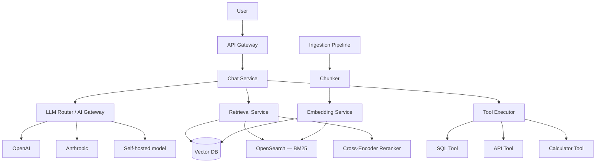

# Capstone — AI Search and Chat Platform

*RAG pipeline design, vector search, LLM gateway, semantic caching, and agentic tool use.*

## 1. Requirements

### Functional
- **Semantic search**: User queries a knowledge base in natural language; system returns relevant documents ranked by semantic relevance
- **Chat with retrieval**: Conversational interface that answers questions using the knowledge base as context (RAG)
- **Tool use**: The chat agent can call tools (database queries, API calls, calculations) to answer questions beyond the knowledge base
- **Multi-tenant**: Multiple organizations, each with their own knowledge base, isolated data

### Non-Functional
- **Retrieval latency**: <500ms for search results
- **Generation latency**: Time to first token <1s, streaming response
- **Knowledge freshness**: New documents searchable within 5 minutes of ingestion
- **Scale**: 100 organizations, 10M total documents, 1M queries/day

## 2. Architecture



## 3. Deep Dives

### Deep Dive 1: The Retrieval Pipeline

This is the system's quality bottleneck — the LLM can only be as good as the context it receives.

**Stage 1 — Hybrid retrieval**: Run the user's query through both BM25 (OpenSearch) and vector search (pgvector or Milvus) in parallel. BM25 catches exact keyword matches (product names, error codes, proper nouns). Vector search catches semantic matches (paraphrases, related concepts).

**Stage 2 — Fusion**: Merge results using [[03-Phase-3-Architecture-Operations__Module-14-Search-Systems__Vector_Search_and_Hybrid_Retrieval|Reciprocal Rank Fusion]]. This produces a unified ranked list that benefits from both retrieval methods.

**Stage 3 — Re-ranking**: Take the top 20 results and re-rank with a cross-encoder model (a model that jointly encodes the query + each document and produces a relevance score). This is slower (20 model inferences) but significantly more accurate than embedding similarity alone. The re-ranker is the quality lever — it catches subtle relevance signals that embedding similarity misses.

**Stage 4 — Context assembly**: Take the top 5–8 re-ranked chunks. Assemble them into the LLM prompt with the user's query. Include metadata (document title, source, date) so the LLM can cite sources.

### Deep Dive 2: LLM Gateway (Multi-Provider Routing)

The [[04-Phase-4-Modern-AI__Module-19-AI-Inference-LLMOps__AI_Gateway_and_LLM_Operations|AI Gateway]] routes LLM calls across providers based on:

- **Cost**: Route simple queries (classification, extraction) to smaller/cheaper models (GPT-4o-mini, Haiku). Route complex queries (analysis, reasoning) to powerful models (GPT-4o, Opus).
- **Latency**: If one provider is slow (service degradation), automatically route to another.
- **Availability**: If a provider is down, failover to a backup.
- **Compliance**: Some tenants require data not to leave a specific region — route to self-hosted models.

**The classification step**: A lightweight classifier (could be a small model or even a heuristic based on query length, keyword presence, conversation stage) determines query complexity and routes accordingly. This saves 60–80% on LLM costs for organizations where most queries are simple.

### Deep Dive 3: Semantic Caching

For a multi-tenant knowledge base, many users across an organization ask similar questions. "What's our vacation policy?" asked 100 times should hit the LLM once and serve from cache 99 times.

**Implementation**: Embed the query. Search a cache index (Redis + vector similarity, or a dedicated semantic cache). If a cached query's embedding is within a cosine similarity threshold (e.g., 0.95), return the cached response.

**Tenant isolation**: Cache keys are scoped per tenant. Organization A's cached answers are invisible to Organization B, even if the questions are semantically identical.

**Invalidation**: When a tenant's knowledge base is updated (new documents ingested), invalidate all cached responses for that tenant. The cache rebuilds organically as users ask questions against the updated knowledge.

**The threshold trade-off**: Similarity threshold 0.98 = very few false positives (almost always returns a genuinely matching cached answer), low hit ratio. Threshold 0.90 = higher hit ratio but risk of returning answers to subtly different questions. Start conservative (0.95), tune based on user feedback.

### Deep Dive 4: Agentic Tool Use

For questions beyond the knowledge base ("What's the average deal size this quarter?" → requires SQL query), the chat agent uses tools:

**Tool schema**: Each tool has a name, description, and parameter schema (JSON Schema). The LLM sees the schemas and decides when to call a tool, what parameters to pass, and how to interpret the result.

**Sandboxing**: The SQL tool runs queries in a read-only connection with a row limit and query timeout. The API tool is restricted to a whitelist of endpoints. The calculator tool runs in a sandboxed interpreter. No tool can modify data or access resources beyond its scope.

**Multi-step reasoning**: The agent may need to chain tool calls: "What percentage of revenue comes from enterprise customers?" → Step 1: SQL query to get total revenue. Step 2: SQL query to get enterprise revenue. Step 3: Calculate percentage. The [[04-Phase-4-Modern-AI__Module-20-RAG-Agents-Realtime__Agentic_System_Architecture|ReAct loop]] handles this iteratively.

**Cost control**: Cap tool calls per query (max 5). Cap tokens per query (max 10K). If the agent exceeds limits, return a partial answer with an explanation.

## 4. Failure Analysis

**Vector DB outage**: Fall back to BM25-only retrieval. Quality degrades (no semantic matching) but the system remains functional. Users see slightly less relevant results.

**LLM provider outage**: The AI gateway fails over to a backup provider. Response quality may vary (different model capabilities), but the service stays available.

**Embedding service failure**: New documents can't be ingested (embedding pipeline stalls). Existing search and chat continue working with the current index. Monitor embedding pipeline lag and alert if it exceeds 30 minutes.

**Semantic cache poisoning**: A bug in the retrieval pipeline returns an incorrect answer, which gets cached. Every subsequent similar query gets the wrong answer. Mitigation: include a user feedback mechanism (thumbs down) that invalidates the specific cache entry. Run periodic quality audits on cached responses.

## 5. Cost Analysis

```
LLM inference (1M queries/day):
  With semantic caching (60% hit rate): 400K LLM calls/day
  Average 2K tokens/call (input + output)
  GPT-4o-mini for 70%, GPT-4o for 30%:
  280K × 2K tokens × $0.15/M = $84/day (mini)
  120K × 2K tokens × $2.50/M = $600/day (4o)
  Total: ~$684/day = ~$20,500/month

Vector DB (pgvector on Postgres):
  10M documents × 1536 dims × 4 bytes = ~60 GB
  Plus metadata: ~100 GB total
  RDS r6g.2xlarge: ~$800/month

OpenSearch (BM25):
  3 nodes: ~$600/month

Embedding service:
  Text-embedding-3-small for ingestion: ~$200/month
  Reranker (cross-encoder) inference: ~$300/month

Infrastructure (API, chat service, gateway):
  ~$1,000/month

Total: ~$23,400/month
LLM inference is 88% of cost. The primary optimization levers:
1. Increase semantic cache hit ratio
2. Route more queries to cheaper models
3. Reduce context size (better chunking = fewer tokens)
```

## Key Takeaways

This capstone shows that an AI platform is built from the same distributed systems primitives as any other system — caching (semantic cache), load balancing (multi-provider routing), pipeline processing (embedding → indexing → retrieval → generation), and multi-tenancy (isolated knowledge bases). The AI-specific challenges (chunking quality, re-ranking, hallucination detection, cost management) layer on top of familiar infrastructure patterns.

## Architecture Diagram

```mermaid
graph TD
    subgraph "Query Layer"
        User[User Query] --> GW[AI Gateway]
        GW --> Cache{Semantic Cache}
        Cache -- "Hit" --> User
    end

    subgraph "Retrieval Pipeline (RAG)"
        Cache -- "Miss" --> Hybrid[Hybrid Search: Vector + BM25]
        Hybrid --> Rerank[Cross-Encoder Reranker]
        Rerank --> Context[Top 5 Chunks]
    end

    subgraph "Generation Layer"
        Context --> LLM[LLM Router]
        LLM --> Provider1[GPT-4o]
        LLM --> Provider2[Claude 3.5]
        Provider1 & Provider2 --> Stream[Streaming Response]
        Stream --> User
    end

    style GW fill:var(--surface),stroke:var(--accent),stroke-width:2px;
    style Hybrid fill:var(--surface),stroke:var(--accent2),stroke-width:2px;
    style LLM fill:var(--surface),stroke:var(--border),stroke-width:1px;
```

## Back-of-the-Envelope Heuristics

- **Semantic Cache Ratio**: Aim for **30% - 60%** hit rate in enterprise environments (internal users often ask the same questions).
- **Chunk Size Overhead**: 512-token chunks with 10% overlap is a standard starting point. A 10M document corpus @ 512 tokens/doc requires **~100GB - 200GB** of vector storage.
- **Retrieval Latency**: Hybrid search (Vector + BM25) takes **~100ms - 300ms**. Re-ranking adds **~100ms - 500ms**. Total RAG context assembly should be **< 1s**.
- **TTFT (Time to First Token)**: Target **< 800ms** for a responsive chat experience. Streaming allows the user to start reading while the rest of the response is generated.

## Real-World Case Studies

- **Perplexity AI (Hybrid Search)**: Perplexity uses a massive hybrid search engine that combines traditional web indexing with real-time vector retrieval. They famously use **Multi-Step Reasoning**: if the first search doesn't provide a clear answer, the agent generates new search queries to fill the gaps, mimicking a human researcher.
- **Notion (RAG at Scale)**: Notion AI uses RAG across billions of private blocks. They solve the **Multi-Tenancy** problem by including the user's workspace ID in the vector metadata. Every search query is hard-filtered by `workspace_id`, ensuring that an LLM can never accidentally "see" data from another company's private pages.
- **Klarna (AI Customer Service)**: Klarna replaced large portions of their customer support with an AI chat platform. In their first month, the AI handled **2/3 of all support chats** (equivalent to 700 full-time agents) while maintaining the same customer satisfaction scores, proving that a well-designed tool-use and RAG architecture can handle complex, real-world business logic.

## Connections

**Core concepts applied:**
- [[04-Phase-4-Modern-AI__Module-20-RAG-Agents-Realtime__RAG_Architecture]] — Full retrieval-augmented generation pipeline
- [[03-Phase-3-Architecture-Operations__Module-14-Search-Systems__Vector_Search_and_Hybrid_Retrieval]] — Hybrid keyword + vector search with re-ranking
- [[03-Phase-3-Architecture-Operations__Module-14-Search-Systems__Full-Text_Search_Architecture]] — BM25 keyword search component
- [[04-Phase-4-Modern-AI__Module-19-AI-Inference-LLMOps__Inference_Serving_Architecture]] — LLM inference for generation
- [[04-Phase-4-Modern-AI__Module-19-AI-Inference-LLMOps__AI_Gateway_and_LLM_Operations]] — Gateway routing, semantic caching, cost control
- [[03-Phase-3-Architecture-Operations__Module-13-Messaging-Pipelines__Stream_Processing]] — Indexing pipeline for document ingestion
- [[01-Phase-1-Foundations__Module-06-Caching-Storage-CDN__Cache_Patterns_and_Strategies]] — Semantic caching for repeated queries

## Canonical Sources

- Lewis et al., "Retrieval-Augmented Generation for Knowledge-Intensive NLP Tasks" (2020)
- Alex Xu, *Generative AI System Design Interview* (2024)
- Perplexity AI Engineering Blog — Architecture of AI search


## Why This Exists

This capstone tests your ability to design a modern, AI-integrated architecture. It forces you to combine traditional search paradigms with LLM inference, embedding generation, and vector retrieval while managing the high latency and cost associated with AI workloads.

## Reflection Prompts

1. How would your design change if the LLM provider's API latency spiked to 10 seconds? What fallback mechanisms would you employ?
2. In your proposed architecture, where is the semantic cache located, and what is its eviction policy?
