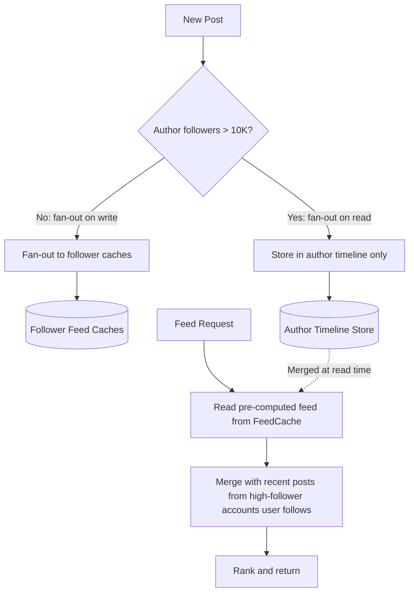

# Capstone — News Feed

*Fan-out strategies, ranking, caching at scale, and the read-heavy optimization problem.*

## 1. Requirements

### Functional
- **Publish**: A user creates a post visible to their followers
- **Feed**: A user views a chronological (or ranked) feed of posts from people they follow
- **Follow/Unfollow**: Manage the follower graph

### Non-Functional
- **Feed generation latency**: <200ms p99
- **Feed freshness**: New posts appear in followers' feeds within 5 seconds
- **Scale**: 500M users, 50M DAU, average 300 followers per user, 2 posts/day per active user

## 2. Back-of-Envelope Estimation

```
Posts created: 50M DAU × 2 posts/day = 100M posts/day ≈ 1,150 posts/sec
Feed reads:   50M DAU × 10 feed reads/day = 500M reads/day ≈ 5,800 reads/sec
              Peak: ~17,000 reads/sec

Fan-out per post: Average 300 followers
Total fan-out writes: 1,150 posts/sec × 300 = 345,000 fan-out writes/sec
```

345K fan-out writes/sec is significant. This is the central scaling challenge.

```
Storage:
  Post: ~1KB (text, metadata, media references)
  100M posts/day × 365 days × 1KB = ~36 TB/year of post data
  Feed cache per user: 500 post IDs × 8 bytes = 4KB
  50M active users × 4KB = ~200 GB of feed cache
```

## 3. The Central Trade-Off: Fan-Out on Write vs Fan-Out on Read

This is the defining design decision. It's not a binary choice — the optimal design uses both, and understanding *why* requires reasoning about the follower graph's structure.

### Fan-Out on Write (Push Model)

When a user publishes a post, immediately write the post ID to every follower's feed cache (a pre-materialized feed per user in Redis or a similar store).

**Feed read path**: Simply read the user's pre-computed feed from cache. O(1) — instant.

**Feed write path**: For each post, write to N follower feeds. For a user with 300 followers, that's 300 cache writes. Manageable. But for a celebrity with 50M followers, one post triggers 50M writes — that's the entire feed cache updated from a single post.

| Aspect | Assessment |
|--------|-----------|
| Feed read latency | Excellent (<10ms — read from cache) |
| Write amplification | High for high-follower users (50M writes per post) |
| Freshness | Excellent (feed is updated at post time) |
| Wasted work | Yes — most users don't check their feed frequently. Pre-computing feeds for inactive users wastes writes. |

### Fan-Out on Read (Pull Model)

No pre-computation. When a user opens their feed, query: "fetch recent posts from all users I follow, merge, and rank."

**Feed read path**: Query each followed user's post list (or a posts table with an index on author_id), merge, sort. For a user following 300 people, that's 300 lookups + merge.

**Feed write path**: None — just write the post to the author's post list.

| Aspect | Assessment |
|--------|-----------|
| Feed read latency | Slow for users following many people (300+ lookups + merge) |
| Write amplification | None |
| Freshness | Perfect (always reads the latest data) |
| Wasted work | None — only compute feeds when requested |

### The Hybrid Approach (What Production Systems Use)

The insight: most users have a modest follower count (median ~300). A few users (celebrities, brands) have millions. Apply different strategies based on follower count:

**For regular users (followers < 10K)**: Fan-out on write. The cost per post is bounded (≤10K cache writes). Feed reads are instant from cache.

**For high-follower users (followers > 10K)**: Fan-out on read. When a user opens their feed, the pre-computed feed from pushed posts is merged with a real-time query for posts from high-follower accounts they follow. This is a small merge (most users follow only a handful of celebrities).

This is precisely how Twitter/X designed their timeline system: pre-compute feeds for normal users, merge in celebrity tweets at read time. The threshold (10K, 50K, 100K) is tunable based on infrastructure capacity.



## 4. Deep Dives

### Feed Ranking

A purely chronological feed is simple but doesn't maximize engagement. Ranking models consider:

- **Recency**: Newer posts rank higher (time decay function)
- **Affinity**: Posts from users you interact with frequently rank higher
- **Engagement signals**: Posts with high like/comment velocity rank higher
- **Content type**: Videos might rank differently than text posts

**Implementation**: A lightweight scoring function runs at feed read time over the candidate posts (from the cache + celebrity merge). The function is a weighted combination of features. For more sophistication, a real-time ML model scores candidates — but this adds latency (10–50ms for model inference). The trade-off is relevance vs latency.

### Feed Cache Design

Each user's feed is a sorted set in Redis: `ZSET feed:{user_id}` with the post ID as the member and the timestamp (or ranking score) as the score. `ZREVRANGE feed:{user_id} 0 49` returns the top 50 posts.

**Cache size management**: Keep only the last 500–1000 post IDs per user. Older entries are evicted (users rarely scroll past 500 posts). This bounds cache size at 50M users × 8KB = ~400 GB — a large Redis Cluster but manageable.

**Cache miss**: If a user's feed isn't in cache (inactive user, cache eviction), generate it on-demand by pulling from the posts database. Populate the cache so subsequent reads are fast. This is the fan-out-on-read path as a fallback.

### Follower Graph Storage

The follow relationship (`user A follows user B`) is a graph. Storage options:

**Relational**: `follows(follower_id, followed_id)` table with indexes on both columns. Handles the core queries: "who does A follow?" (for feed generation) and "who follows B?" (for fan-out). At 500M users × 300 average follows = 150B relationships. This is a large table but partitionable by follower_id.

**Graph database**: Overkill for a simple follow graph (no multi-hop traversals needed for the feed use case). A relational table with proper indexing is more operationally simple.

**Cache the follow lists**: For fan-out on write, the system needs "who follows user B?" on every post. Cache this in Redis as a set: `SET followers:{user_id}`. Invalidate on follow/unfollow.

## 5. Failure Analysis

**Redis Cluster failure (feed cache)**: Feeds become unavailable from cache. Fall back to fan-out on read from the database. Latency spikes from <10ms to ~200ms. Acceptable as a temporary degradation — but the DB must be provisioned to handle this spike, or load shedding kicks in for lower-priority feeds.

**Fan-out worker lag**: During a traffic spike (major news event — millions of posts), the fan-out workers fall behind. Users' feeds are stale by 10–30 seconds instead of 5 seconds. The system is eventually consistent by design — this is a freshness degradation, not a correctness failure. Monitor fan-out lag as an SLI.

**Celebrity post thundering herd**: A celebrity with 50M followers posts. If using fan-out on read, 5M concurrent feed requests all query the celebrity's recent posts. The posts table for that celebrity becomes a hot key. Mitigation: the celebrity's posts are cached aggressively (Redis, CDN). The merge at read time hits the cache, not the database.

## 6. Cost Analysis

```
Feed Cache (Redis Cluster):
  400 GB across ~30 nodes (r6g.xlarge): ~$6,000/month

Posts Database:
  Postgres (partitioned by date), 2 shards + replicas: ~$4,000/month
  
Fan-out Workers:
  10 instances processing 345K writes/sec: ~$700/month

Kafka (fan-out events):
  3 brokers: ~$500/month

API Servers:
  10 instances: ~$720/month

Total: ~$12,000/month
Redis dominates cost. The optimization lever is reducing feed cache size
(shorter retention, more aggressive eviction of inactive user feeds).
```

## 7. Evolution at 100×

At 5B feed reads/day and 10B posts/day: the feed cache grows to ~4 TB (multiple Redis Clusters). Fan-out writes reach 3.5M/sec. At this point, consider: a custom in-memory feed service (not Redis — purpose-built), tiered feed generation (only pre-compute feeds for users who logged in within the last 7 days), and a more aggressive celebrity threshold (push only for users with <1K followers, pull for everyone else).

## Key Takeaways

The news feed is a classic read-heavy system where pre-computation (materialized views in the form of feed caches) shifts work from read time to write time. The hybrid fan-out approach is the critical insight: the architecture adapts its strategy based on the data's structure (follower count distribution), not a one-size-fits-all approach. This pattern — different strategies for different data segments — appears across many system designs.

## Architecture Diagram

```mermaid
graph TD
    subgraph "Write Path (Publish)"
        UserP[Publisher] -->|POST /post| API_W[Publish API]
        API_W -->|1. Persist| DB[(Post DB)]
        API_W -->|2. Queue| Kafka[Fan-out Queue]
        Kafka --> Worker[Fan-out Worker]
        Worker -->|3. Push| FeedCache{Redis Cluster}
    end

    subgraph "Read Path (Feed)"
        UserR[Follower] -->|GET /feed| API_R[Feed API]
        API_R -->|4. Pull| FeedCache
        API_R -->|5. Merge| PullCelebrity[Celebrity Post Cache]
        API_R -->|6. Rank| Ranker[Ranking ML Model]
        Ranker --> UserR
    end

    style FeedCache fill:var(--surface),stroke:var(--accent),stroke-width:2px;
    style Kafka fill:var(--surface),stroke:var(--accent2),stroke-width:2px;
```

## Back-of-the-Envelope Heuristics

- **Fan-out Amplification**: If average followers = 300, 1,000 posts/sec results in **300,000 writes/sec** to the feed cache.
- **The 10k Threshold**: Typically, use **Push** (Fan-out on Write) for users with < 10,000 followers, and **Pull** (Fan-out on Read) for "Mega-users" (> 10,000 followers).
- **Feed Depth**: Users rarely scroll past **500 - 1,000 posts**. Bound your feed cache size accordingly to save Redis memory.
- **Ranking Latency**: A simple weighted score (time decay + engagement) takes **< 5ms**. A deep learning model for ranking can take **20ms - 50ms**.

## Real-World Case Studies

- **Facebook (TAO)**: Facebook uses a specialized distributed graph store called **TAO** to handle its social graph and news feed. TAO is optimized for high-volume, low-latency reads of associations (like "who are my friends?") and is built on top of a massive layer of Memcached nodes to ensure that feed generation never hits the primary databases.
- **Twitter (The 2013 Migration)**: Twitter famously moved from a pull-based model to a **Hybrid Push/Pull** model. They found that purely pulling tweets for users with 1,000+ follows was too slow, but pushing for celebrities like Lady Gaga (millions of followers) was too expensive. Their hybrid approach is now the industry standard for feed architectures.
- **Instagram (Media-First Feed)**: Instagram's news feed challenge is different because of high media weight. They use **Pre-fetching** logic: as you scroll down your feed, the app predicts which photos/videos you'll see next and starts downloading them from the **CDN** before they enter your viewport, ensuring a seamless "infinite scroll" experience.

## Connections

**Core concepts applied:**
- [[01-Phase-1-Foundations__Module-06-Caching-Storage-CDN__Cache_Patterns_and_Strategies]] — Pre-materialized feed cache per user
- [[03-Phase-3-Architecture-Operations__Module-13-Messaging-Pipelines__Message_Queues_vs_Event_Streams]] — Fan-out on write via async message processing
- [[01-Phase-1-Foundations__Module-04-Databases__Database_Replication]] — Read replicas for feed serving
- [[01-Phase-1-Foundations__Module-04-Databases__Partitioning_and_Sharding]] — User-based sharding for feed storage
- [[01-Phase-1-Foundations__Module-06-Caching-Storage-CDN__CDN_Architecture]] — Media delivery for posts with images/video
- [[01-Phase-1-Foundations__Module-06-Caching-Storage-CDN__Consistent_Hashing]] — Cache distribution for feed data
- [[03-Phase-3-Architecture-Operations__Module-13-Messaging-Pipelines__Stream_Processing]] — Real-time ranking and feature computation

## Canonical Sources

- Alex Xu, *System Design Interview* Vol 1 — Chapter 11: Design a News Feed System
- Facebook Engineering, "Scaling the News Feed" (TAO, Memcache)
- Twitter Engineering Blog, "How We Index Tweets" and "Timelines at Scale"
